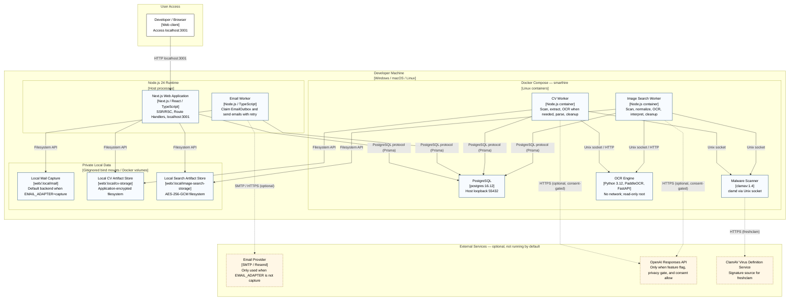

# C4 Deployment Diagram — SmartHire

**Author:** Nguyễn Minh Khôi 
**Student ID:** 24127066 
**Reviewer:** Nguyễn Gia Quốc Uy 
**Editor:** Nguyễn Minh Khôi

## Node Descriptions

| Node | Infrastructure / Runtime | Container running on it | Protocol to related nodes |
| --- | --- | --- | --- |
| Node.js 24 Runtime | Host process on developer machine | Next.js Web Application, Email Worker | Browser → Web: `HTTP localhost:3001`; Web/EmailWorker → PostgreSQL: `PostgreSQL protocol (Prisma)` |
| Docker Compose — smarthire | Linux container, private network via Docker Compose | PostgreSQL 16, Malware Scanner (ClamAV 1.4), CV Worker, Image Search Worker, OCR Engine | PostgreSQL exposes via host loopback 55432; CV/Image Worker → ClamAV: `Unix socket`; CV/Image Worker → OCR Engine: `Unix socket / HTTP`; OCR Engine has no external network access |
| Private Local Data | Gitignored bind mount / Docker volume on developer machine | Local Mail Capture, Local CV Artifact Store, Local Search Artifact Store | Web/EmailWorker/CVWorker/ImageWorker write via `Filesystem API` |
| Email Provider (optional) | External service (SMTP or Resend) | — | Email Worker → Email Provider: `SMTP / HTTPS`, only when `EMAIL_ADAPTER` is not `capture` |
| OpenAI Responses API (optional) | External service | — | CV Worker / Image Search Worker → OpenAI: `HTTPS`, only when feature flag, privacy gate, and consent are all enabled |
| ClamAV Virus Definition Service | External service | — | Malware Scanner → service: `HTTPS`, used by `freshclam` to update signatures |

## Deployment Description

The Next.js Web Application and Email Worker run as host processes using Node.js directly on the developer machine and serve at `localhost:3001`. The remaining Level 2 components — PostgreSQL, Malware Scanner, CV Worker, Image Search Worker, and OCR Engine — run in Docker Compose (`compose.yaml`), each container as a separate service; the OCR Engine has no network and communicates only via a shared Unix socket with the CV Worker and Image Search Worker.

The default artifact storage in this deployment is the **local filesystem** (`web/.local/mail`, `web/.local/cv-storage`, `web/.local/image-search-storage`), not S3. AWS S3/KMS/IAM adapters are implemented at the code level (see Level 1 and Level 2), but the repository **has not provisioned** any bucket, KMS key, or IAM role, so it is not drawn as a node in use in this actual deployment; it only appears indirectly via the "optional" notes in the corresponding Level 2 containers, not duplicated here as a parallel storage.

The external services — Email Provider, OpenAI Responses API, and ClamAV Definition Service — are all **optional** and do not run by default: locally, the default uses the capture adapter for email (writing to the filesystem) and the deterministic adapter for CV parsing, so the first two services are only called when adapter configuration and (for OpenAI) user consent allow. The ClamAV Definition Service is an exception because `freshclam` needs to run to update malware signatures for the Malware Scanner to function correctly.

Protocols between nodes are recorded as actual network/application-layer protocols rather than library names: PostgreSQL uses the `PostgreSQL protocol` (via Prisma as the client library, not as the protocol), local storage uses the `Filesystem API`, and communication with ClamAV/OCR Engine uses `Unix socket` (along with HTTP for the OCR Engine at the application layer above the socket).

Container names in this diagram match the names in Level 2 (`Next.js Web Application`, `Email Worker`, `CV Worker`, `Image Search Worker`, `OCR Engine`, `Malware Scanner`, `PostgreSQL`) so that readers can directly map Level 2 → Deployment without having to cross-reference different names.