# C4 Deployment Diagram — SmartHire

**Author:** Nguyễn Minh Khôi 
**Student ID:** 24127066 
**Reviewer:** Nguyễn Gia Quốc Uy 
**Editor:** Nguyễn Minh Khôi

**Architecture scope:** Runtime deployment of the implemented Features 001–005 baseline.

This deployment view maps every Level 2 container to a separate logical node, as required for a system that currently runs on one local developer machine. A logical node represents an independently running process, Docker Compose service, or private data store; it does not imply a separate physical computer.

```mermaid
%%{init: {"flowchart": {"curve": "linear", "nodeSpacing": 45, "rankSpacing": 70, "diagramPadding": 20}}}%%
flowchart TD
    classDef service fill:#f7fbff,stroke:#1f4e79,stroke-width:1.2px,color:#000000;
    classDef datastore fill:#f8fafc,stroke:#475569,stroke-width:1.2px,color:#0f172a;
    classDef external fill:#fff7e6,stroke:#8a5a00,stroke-width:1px,color:#000000,stroke-dasharray: 4 3;

    subgraph BrowserNode["Browser Device\n[Logical node — web client]"]
        Browser["Browser\nAccesses localhost:3001"]
    end

    subgraph Host["Developer Machine\n[Physical node — Windows / macOS / Linux]"]
        direction TB

        subgraph WebNode["Web Application Node\n[Logical node — Node.js 24 host process]"]
            Web["Next.js Web Application\nNext.js 16, React 19, TypeScript\nSSR/RSC and Route Handlers"]
        end

        subgraph EmailNode["Email Worker Node\n[Logical node — Node.js 24 host process]"]
            EmailWorker["Email Worker\nClaims EmailOutbox, sends with retry"]
        end

        subgraph DatabaseNode["PostgreSQL Node\n[Logical node — Docker Compose service: postgres]"]
            DB["PostgreSQL 16.12\nHost loopback port 55432"]
        end

        subgraph ScannerNode["Malware Scanner Node\n[Logical node — Docker Compose service: clamav]"]
            ClamAV["ClamAV 1.4\nClamD over private Unix socket"]
        end

        subgraph CVWorkerNode["CV Worker Node\n[Logical node — Docker Compose service: cv-worker]"]
            CVWorker["CV Worker\nScan, extract, OCR, parse, cleanup"]
        end

        subgraph ImageWorkerNode["Image Search Worker Node\n[Logical node — Docker Compose service: image-search-worker]"]
            ImageWorker["Image Search Worker\nScan, normalize, OCR, interpret, cleanup"]
        end

        subgraph OCRNode["OCR Engine Node\n[Logical node — Docker Compose service: ocr-engine]"]
            OCR["OCR Engine\nPython 3.12, FastAPI, PaddleOCR, ONNX Runtime\nNo network interface; read-only root"]
        end

        subgraph MailStoreNode["Mail Capture Node\n[Logical data-store node — gitignored host directory]"]
            MailCapture["Local Mail Capture\nweb/.local/mail"]
        end

        subgraph CVStoreNode["CV Artifact Storage Node\n[Logical data-store node — gitignored host directory]"]
            CVStorage["Local CV Artifact Store\nweb/.local/cv-storage\nApplication-encrypted filesystem"]
        end

        subgraph SearchStoreNode["Search Artifact Storage Node\n[Logical data-store node — gitignored host directory]"]
            SearchStorage["Local Search Artifact Store\nweb/.local/image-search-storage\nAES-256-GCM filesystem"]
        end
    end

    subgraph ExternalServices["External service nodes"]
        MailProvider["Email Provider\nSMTP or Resend — optional"]
        AIProvider["OpenAI Responses API\nOptional and consent-gated"]
        ClamAVUpdates["ClamAV Definition Service\nSignature source for freshclam"]
    end

    Browser -->|"HTTP on localhost:3001"| Web

    Web -->|"PostgreSQL wire protocol\nusing Prisma client"| DB
    Web -->|"Filesystem API"| CVStorage
    Web -->|"Filesystem API"| SearchStorage

    EmailWorker -->|"PostgreSQL wire protocol\nusing Prisma client"| DB
    EmailWorker -->|"Filesystem API"| MailCapture
    EmailWorker -.->|"SMTP or HTTPS\nwhen non-capture adapter is configured"| MailProvider

    CVWorker -->|"PostgreSQL wire protocol\nusing Prisma client"| DB
    CVWorker -->|"Filesystem API"| CVStorage
    CVWorker -->|"ClamD protocol over Unix socket"| ClamAV
    CVWorker -->|"HTTP over private Unix socket"| OCR
    CVWorker -.->|"HTTPS when configuration,\nprivacy gate, and consent allow"| AIProvider

    ImageWorker -->|"PostgreSQL wire protocol\nusing Prisma client"| DB
    ImageWorker -->|"Filesystem API"| SearchStorage
    ImageWorker -->|"ClamD protocol over Unix socket"| ClamAV
    ImageWorker -->|"HTTP over private Unix socket"| OCR
    ImageWorker -.->|"HTTPS when configuration,\nprivacy gate, and consent allow"| AIProvider

    ClamAV -->|"HTTPS via freshclam"| ClamAVUpdates

    class Web,EmailWorker,CVWorker,ImageWorker,OCR,ClamAV service;
    class DB,MailCapture,CVStorage,SearchStorage datastore;
    class MailProvider,AIProvider,ClamAVUpdates external;
```

## Logical Node Descriptions

| Logical node                   | Infrastructure / runtime                                                               | Deployed container or component | Communication with other nodes                                                                                                                 |
| ------------------------------ | -------------------------------------------------------------------------------------- | ------------------------------- | ---------------------------------------------------------------------------------------------------------------------------------------------- |
| Browser Device                 | Browser on the developer machine or another local client                               | SmartHire web client            | Calls Web Application Node using HTTP on `localhost:3001` in the current local deployment.                                                     |
| Web Application Node           | Node.js 24 host process                                                                | Next.js Web Application         | HTTP from browser; PostgreSQL wire protocol through Prisma; Filesystem API to private artifact stores.                                         |
| Email Worker Node              | Node.js 24 host process                                                                | Email Worker                    | PostgreSQL wire protocol through Prisma; Filesystem API to Local Mail Capture; optional SMTP/HTTPS to an Email Provider.                       |
| PostgreSQL Node                | Docker Compose Linux container                                                         | PostgreSQL 16.12                | PostgreSQL wire protocol; port `55432` is exposed only on host loopback for local processes.                                                   |
| Malware Scanner Node           | Docker Compose Linux container                                                         | ClamAV 1.4 daemon               | ClamD protocol over a private Unix socket from CV/Image workers; HTTPS via `freshclam` for signature updates.                                  |
| CV Worker Node                 | Docker Compose Linux container                                                         | CV Worker                       | PostgreSQL wire protocol, Filesystem API, ClamD protocol over Unix socket, HTTP over private Unix socket to OCR, and optional HTTPS to OpenAI. |
| Image Search Worker Node       | Docker Compose Linux container                                                         | Image Search Worker             | PostgreSQL wire protocol, Filesystem API, ClamD protocol over Unix socket, HTTP over private Unix socket to OCR, and optional HTTPS to OpenAI. |
| OCR Engine Node                | Docker Compose Linux container with no network interface and read-only root filesystem | OCR Engine                      | Receives HTTP over a shared private Unix socket from CV/Image workers; makes no external network calls.                                        |
| Mail Capture Node              | Gitignored host directory                                                              | Local Mail Capture              | Filesystem API from Email Worker when `EMAIL_ADAPTER=capture`.                                                                                 |
| CV Artifact Storage Node       | Gitignored host directory / bind mount                                                 | Local CV Artifact Store         | Filesystem API from Web Application and CV Worker.                                                                                             |
| Search Artifact Storage Node   | Gitignored host directory / bind mount                                                 | Local Search Artifact Store     | Filesystem API from Web Application and Image Search Worker.                                                                                   |
| Email Provider Node            | External SMTP or Resend service                                                        | External email delivery service | SMTP or HTTPS from Email Worker only when a non-capture adapter is configured.                                                                 |
| OpenAI Node                    | External OpenAI Responses API                                                          | Optional AI provider            | HTTPS from CV/Image workers only when feature configuration, privacy gate, and user consent allow.                                             |
| ClamAV Definition Service Node | External signature distribution service                                                | Virus definition source         | HTTPS from Malware Scanner through `freshclam`.                                                                                                |

## Deployment Description

All logical nodes currently run on, or are accessed from, one developer machine. The Next.js Web Application and Email Worker run as separate Node.js host processes. PostgreSQL, ClamAV, CV Worker, Image Search Worker, and OCR Engine run as separate Docker Compose services. This diagram deliberately represents each Level 2 container as its own logical deployment node even though the nodes share one physical host.

The default artifact deployment uses private local filesystem stores: `web/.local/mail`, `web/.local/cv-storage`, and `web/.local/image-search-storage`. AWS S3/KMS/IAM adapters are implemented but no bucket, KMS key, IAM role, or infrastructure-as-code deployment is provisioned in this repository, so AWS is not shown as an active deployment node.

External email delivery and OpenAI are optional. The local default captures email to the filesystem and uses deterministic CV parsing. ClamAV definition updates are required for an operational malware scanner and use HTTPS through `freshclam`.

Container names match the Level 2 diagram so each container can be traced directly from Container Diagram to Deployment Diagram.
