# C4 Deployment Diagram — SmartHire

*Performed by: Nguyễn Minh Khôi | Reviewed by: Lưu Chí Hải | Edited by: Nguyễn Minh Khôi*  
**Version:** V1.4 (2026-08-26) — PA5 Final Document Synchronization Baseline

### Revision History

| Version | Date | Author/Editor | Summary | Status |
|---|---|---|---|---|
| 1.3 | 2026-08-06 | Nguyễn Minh Khôi | Deployment topology for PA4 baseline. | Baseline |
| 1.4 | 2026-08-26 | Nguyễn Minh Khôi | Reconciled deployment topology: clarified logical nodes vs Docker containers/host processes, resolved Docker Compose claim (individual Dockerfiles available, root compose unverified), added Analytics Export and Google Drive Backup flows, and updated attribution for PA5. | Approved |

**Architecture scope:** Runtime deployment topology of the implemented SmartHire 26-feature baseline.

**Deployment Qualification & Container Reality:** Tracked root `compose.yaml` defines six local services: PostgreSQL, ClamAV, CV Worker, OCR Engine, Image Search Worker, and Admin Worker. The repository also provides a web application and executable email/export/backup processes, but it does not prove their final demo launch topology; those are logical host processes rather than Compose services.

```mermaid
%%{init: {"flowchart": {"curve": "linear", "nodeSpacing": 45, "rankSpacing": 70, "diagramPadding": 20}}}%%
flowchart TD
    classDef service fill:#f7fbff,stroke:#1f4e79,stroke-width:1.2px,color:#000000;
    classDef datastore fill:#f8fafc,stroke:#475569,stroke-width:1.2px,color:#0f172a;
    classDef external fill:#fff7e6,stroke:#8a5a00,stroke-width:1px,color:#000000,stroke-dasharray: 4 3;

    subgraph BrowserNode["Browser Device\n[Logical web client node]"]
        Browser["User Web Browser\nAccesses http://localhost:3001"]
    end

    subgraph Host["Developer Machine / Demo Host\n[Physical node — Windows / Linux / macOS]"]
        direction TB

        subgraph WebNode["Web Application Node\n[Host Process / Container — Node.js 24]"]
            Web["Next.js Web Application\nNext.js 16.3, React 19, TypeScript\nSSR/RSC, API Routes & Socket.IO (/chat)"]
        end

        subgraph EmailNode["Email Worker Node\n[Host Process — Node.js 24]"]
            EmailWorker["Email Worker\nClaims EmailOutbox, sends with retry"]
        end

        subgraph DatabaseNode["PostgreSQL Node\n[Container / Process — PostgreSQL 16]"]
            DB["PostgreSQL 16\nHost loopback port 5432 / 55432"]
        end

        subgraph ScannerNode["Malware Scanner Node\n[Container — ClamAV 1.4]"]
            ClamAV["ClamAV 1.4 Daemon\nClamD over private Unix domain socket"]
        end

        subgraph CVWorkerNode["CV Worker Node\n[Container — Dockerfile.cv-worker]"]
            CVWorker["CV Worker Process\nScan, extract, OCR, parse, cleanup"]
        end

        subgraph ImageWorkerNode["Image Search Worker Node\n[Container — Dockerfile.image-search-worker]"]
            ImageWorker["Image Search Worker Process\nScan, normalize, OCR, interpret, cleanup"]
        end

        subgraph AdminWorkerNode["Admin Worker Node\n[Container — Dockerfile.admin-worker]"]
            AdminWorker["Admin Worker Process\nSnapshots, verification safety, notifications,\nretention, support, connection expiry"]
        end

        subgraph ExportWorkerNode["Export Worker Node\n[Host Process / Worker — Node.js 24]"]
            ExportWorker["Analytics Export Worker\nClaims ExportRequest, generates Excel/CSV"]
        end

        subgraph BackupRunnerNode["Admin Backup Node\n[Host Process / CLI — pg_dump]"]
            BackupRunner["Admin Backup Runner\nAES-256-GCM encrypted dumps, Drive sync"]
        end

        subgraph OCRNode["OCR Engine Node\n[Container — Dockerfile.ocr-engine]"]
            OCR["OCR Engine\nPython 3.12, FastAPI, PaddleOCR\nPrivate Unix socket; read-only root"]
        end

        subgraph StorageNodes["Local Logical Storage Stores\n[Local Filesystem Paths]"]
            direction LR
            MailCapture["Local Mail Capture\nweb/.local/mail"]
            CVStorage["Local CV Artifact Store\nweb/.local/cv-storage\nAES-256 encrypted"]
            SearchStorage["Local Search Artifact Store\nweb/.local/image-search-storage\nAES-256-GCM ephemeral"]
            AdminEvidence["Local Admin Evidence Store\nweb/.private-admin-evidence\nAES-256-GCM encrypted"]
            ExportStore["Local Export Store\nweb/.local/exports\nExcel/CSV files"]
            BackupStore["Local Backup Store\nweb/.local/backups\nAES-256-GCM encrypted dumps"]
        end
    end

    subgraph ExternalServices["External Service Nodes (Optional / Qualified)"]
        MailProvider["Email Provider\nSMTP / Resend (Optional)"]
        AIProvider["OpenAI Responses API\n(Optional, consent-gated)"]
        ClamAVUpdates["ClamAV Definition Service\n(Signature source via freshclam)"]
        BusinessRegistry["VietQR Business Registry\n(Optional business lookup)"]
        GoogleDrive["Google Drive Storage\n(Optional OAuth2 backup)"]
    end

    Browser -->|"HTTP & ws/wss on localhost:3001"| Web

    Web -->|"PostgreSQL wire protocol via Prisma"| DB
    Web -->|"Filesystem API"| CVStorage
    Web -->|"Filesystem API"| SearchStorage
    Web -->|"Filesystem API"| AdminEvidence
    Web -->|"Filesystem API (stream download)"| ExportStore

    EmailWorker -->|"PostgreSQL wire protocol"| DB
    EmailWorker -->|"Filesystem API"| MailCapture
    EmailWorker -.->|"SMTP / HTTPS when configured"| MailProvider

    CVWorker -->|"PostgreSQL wire protocol"| DB
    CVWorker -->|"Filesystem API"| CVStorage
    CVWorker -->|"ClamD over Unix socket"| ClamAV
    CVWorker -->|"HTTP over private Unix socket"| OCR
    CVWorker -.->|"HTTPS when consented"| AIProvider

    ImageWorker -->|"PostgreSQL wire protocol"| DB
    ImageWorker -->|"Filesystem API"| SearchStorage
    ImageWorker -->|"ClamD over Unix socket"| ClamAV
    ImageWorker -->|"HTTP over private Unix socket"| OCR
    ImageWorker -.->|"HTTPS when consented"| AIProvider

    AdminWorker -->|"PostgreSQL wire protocol"| DB
    AdminWorker -->|"ClamD over Unix socket"| ClamAV
    AdminWorker -->|"Filesystem API"| AdminEvidence

    ExportWorker -->|"PostgreSQL wire protocol"| DB
    ExportWorker -->|"Filesystem API"| ExportStore

    BackupRunner -->|"PostgreSQL wire protocol / pg_dump"| DB
    BackupRunner -->|"Filesystem API"| BackupStore
    BackupRunner -.->|"HTTPS / OAuth2 upload"| GoogleDrive

    ClamAV -->|"HTTPS via freshclam"| ClamAVUpdates
    Web -.->|"HTTPS lookup"| BusinessRegistry

    class Web,EmailWorker,CVWorker,ImageWorker,AdminWorker,ExportWorker,BackupRunner,OCR,ClamAV service;
    class DB,MailCapture,CVStorage,SearchStorage,AdminEvidence,ExportStore,BackupStore datastore;
    class MailProvider,AIProvider,ClamAVUpdates,BusinessRegistry,GoogleDrive external;
```

## Logical Node Descriptions

*Performed by: Nguyễn Minh Khôi | Reviewed by: Lưu Chí Hải | Edited by: Nguyễn Minh Khôi*

| Logical node | Infrastructure / runtime | Deployed container or component | Communication with other nodes |
|---|---|---|---|
| Browser Device | Web browser on client / developer machine | SmartHire Web Client | Calls Web Application Node using HTTP and WebSocket (`ws/wss`) on `localhost:3001`. |
| Web Application Node | Node.js 24 host process / container | Next.js Web Application | Inbound HTTP/WebSocket from browser; PostgreSQL wire protocol via Prisma to PostgreSQL Node; Filesystem API to local artifact stores. |
| Email Worker Node | Node.js 24 host process (`run-email-worker.mjs`) | Email Worker | Claims outbox rows via PostgreSQL wire protocol; writes to Local Mail Capture (when `EMAIL_ADAPTER=capture`) or calls external Email Provider via SMTP/HTTPS. |
| PostgreSQL Node | Linux container / local process | PostgreSQL 16 | Receives PostgreSQL wire protocol connections from Web Application and all workers on loopback port 5432/55432. |
| Malware Scanner Node | Linux container / local daemon | ClamAV 1.4 daemon | Listens for ClamD protocol over a private Unix domain socket; fetches virus definitions over HTTPS via `freshclam`. |
| CV Worker Node | Linux container (`Dockerfile.cv-worker`) / process | CV Worker | PostgreSQL wire protocol, Filesystem API to CV store, ClamD over Unix socket to Malware Scanner, HTTP over Unix socket to OCR Engine, optional HTTPS to OpenAI. |
| Image Search Worker Node | Linux container (`Dockerfile.image-search-worker`) / process | Image Search Worker | PostgreSQL wire protocol, Filesystem API to search store, ClamD over Unix socket, HTTP over Unix socket to OCR Engine, optional HTTPS to OpenAI. |
| Admin Worker Node | Linux container (`Dockerfile.admin-worker`) / process | Admin Worker | PostgreSQL wire protocol, Filesystem API to admin evidence store, ClamD over Unix socket for evidence safety scanning. |
| Export Worker Node | Node.js 24 host process (`run-recruitment-export-worker.mjs`) | Analytics Export Worker | Claims `ExportRequest` jobs from PostgreSQL; generates Excel/CSV files and writes to Local Export Store. |
| Admin Backup Node | Node.js 24 runner / PostgreSQL CLI | Admin Backup Runner | Executes `pg_dump`, encrypts output with AES-256-GCM, writes to Local Backup Store, and optionally uploads to Google Drive via OAuth2; **no in-app restore UI**. |
| OCR Engine Node | Linux container (`Dockerfile.ocr-engine`) with read-only root | OCR Engine (FastAPI + PaddleOCR) | Receives HTTP over a private Unix domain socket from CV/Image workers; makes no external network calls. |
| Local Storage Nodes | Local filesystem paths on host machine | Local Artifact Stores | Filesystem API for secure storage of emails (`.local/mail`), encrypted CVs (`.local/cv-storage`), ephemeral search images (`.local/image-search-storage`), verification evidence (`.private-admin-evidence`), exports (`.local/exports`), and encrypted backup dumps (`.local/backups`). |
| External Service Nodes | External cloud / SaaS APIs | External Providers (Optional) | SMTP/Resend for email, OpenAI Responses API for advisory parsing, VietQR for tax lookup, Google Drive for encrypted backup storage. |

## Deployment Description

*Performed by: Nguyễn Minh Khôi | Reviewed by: Lưu Chí Hải | Edited by: Nguyễn Minh Khôi*

All logical deployment nodes currently run on, or are accessed from, a single developer machine in the local development and demonstration environment.

1. **Process & Container Reality:** Root `compose.yaml` provides PostgreSQL, ClamAV, CV Worker, OCR Engine, Image Search Worker, and Admin Worker. The Next.js web application, Email Worker, Analytics Export Worker, and Admin Backup Runner remain separately executable host/logical processes in repository evidence; their final demo process topology is not asserted.
2. **Artifact & Data Isolation:** Artifact persistence defaults to local private filesystem directories protected by application-level AES-256-GCM encryption where sensitive (CVs, business licenses, backup dumps). Search images and export files are ephemeral with automated expiration and deletion deadlines.
3. **Optional External Integrations:** External email delivery (SMTP/Resend), OpenAI semantic interpretation, VietQR business verification, and Google Drive backup upload are implemented via provider adapters but remain optional. Cloud AWS S3/KMS adapters exist in source but are unprovisioned in the default local demonstration environment.
4. **Disaster Recovery Notice:** In-app database restore is strictly out of scope; database restoration is executed via command-line DBA procedures to maintain data safety.
