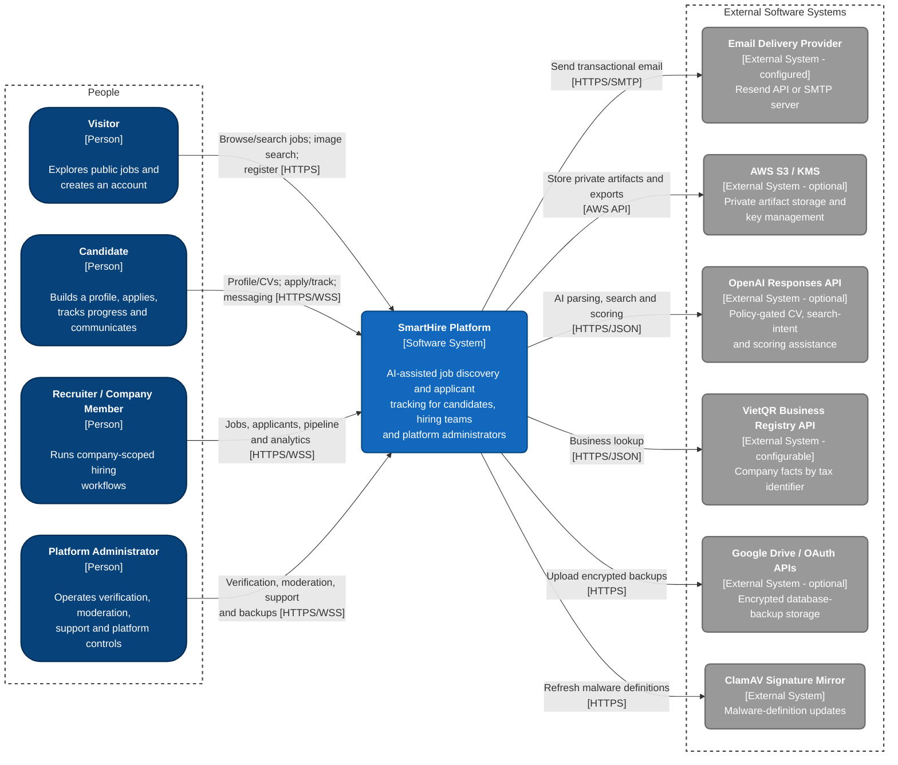

# C4 Level 1 System Context Diagram — SmartHire

_Performed by: Lưu Chí Hải | Reviewed by: Nguyễn Gia Quốc Uy, Nguyễn Quốc Thành | Edited by: Lưu Chí Hải_

**Version:** 1.2 (2026-08-26) — PA5 implementation synchronization; review pending Nguyễn Minh Khôi

**Architecture scope:** Final implemented SmartHire product. At C4 Level 1, SmartHire is modeled as one software system; internal web, worker, database, storage, OCR, and malware-scanning containers are intentionally hidden.

**Release boundary:** Feature 027 is **Late Feature / Release Decision Pending** and is not represented as a final-release capability. This context view describes repository-proven Features 001–026. It does not assert a final demo hosting topology.

### 2. System Context Description

_Performed by: Lưu Chí Hải | Reviewed by: Nguyễn Gia Quốc Uy, Nguyễn Quốc Thành | Edited by: Lưu Chí Hải_

**A. What does each actor use SmartHire for?**

- **Visitor:** Opens the landing page, browses approved job postings, searches and filters the public catalogue, views job details, and can use the rate-limited image-assisted search flow. A Visitor can register and verify an account to become an authenticated user.
- **Candidate:** Manages account identity, sessions, password and two-factor security, preferences, professional profile, avatar, and a reusable CV library. The Candidate can upload PDF/DOCX CVs, review extracted/OCR-assisted data, save or report jobs, submit and track applications, withdraw or respond to offers, run private CV-to-job match checks, use professional connections and messaging, follow recruitment threads, receive notifications, and open support cases.
- **Recruiter / Company Member:** Uses the same base account after receiving an active company membership. The implementation supports `OWNER`, `HR_MANAGER`, `RECRUITER`, and `HIRING_MANAGER` membership roles and checks company scope on protected recruiter resources. Company members manage company and job-posting data, submit postings for administrator review, inspect applications and protected documents, use deterministic and optional AI-assisted scoring, rank and prioritize candidates, move cards through the recruitment Kanban pipeline, communicate in recruitment threads, and view company-scoped analytics and CSV/Excel exports. Company Owners can also invite, remove, and change company team members.
- **Platform Administrator:** Uses the separate administration console under an active administrator grant and designated two-factor-authenticated session. Administrators view platform metrics; manage accounts, companies, and memberships; approve or reject employer verification requests and review protected business evidence; review or enforce job postings; handle general moderation and messaging reports; create and review professional-connection proposals; work support cases; read administrator notifications; and configure, run, and inspect encrypted database backups. Sensitive operations require a recent two-factor step-up where configured. Privileged management/moderation actions and denied administrator access are audited; backup runs retain their own operational history.

A person can be both a Candidate and a Recruiter / Company Member; company membership adds tenant-scoped hiring permissions without replacing candidate capabilities. No separate interactive Operator or System Administrator actor is implemented, so none is shown.

**B. What does each external system provide?**

- **Email Delivery Provider:** SmartHire selects a `resend`, `smtp`, or non-network `capture` delivery adapter. Resend and SMTP send the recipient, subject, rendered transactional content, and an idempotency identifier for account verification/recovery, security alerts, company verification and invitations, application-stage changes, and other configured notifications. Capture writes mail locally and does not contact an external provider. Production environment validation requires configured Resend delivery; SMTP remains a supported configured adapter.
- **AWS S3 / KMS:** Implemented adapters can store private CV artifacts, image-search uploads, administrator business evidence, and analytics exports in S3. CV, image-search, and administrator-evidence configurations support customer-managed KMS protection; analytics exports use an application encryption envelope before upload. Local development uses encrypted/private filesystem adapters for these artifact classes unless S3 is selected. The repository contains adapters and readiness checks but does not provision the AWS bucket, key, or IAM resources.
- **OpenAI Responses API:** When the relevant adapter, API key, privacy approvals, and consent/purpose gates allow it, SmartHire uses the API for structured CV parsing, evidence-bound image-search intent interpretation, CV classification, candidate-job semantic assessment, explanations, and interview-question suggestions. Requests can include extracted CV text/evidence and job title, requirements, skills, or JD text; image search sends OCR-derived text rather than the uploaded image. Scoring code removes email addresses and phone numbers before the provider request, requests non-stored responses, and retains deterministic matching/fallback behavior when the provider is unavailable.
- **VietQR Business Registry API:** When `BUSINESS_REGISTRY_PROVIDER=vietqr`, the employer-verification preparation flow sends a normalized tax identifier and receives bounded company facts such as legal name and registered address. Responses are validated, size-limited, cached for a bounded period, and treated as unavailable rather than granting company access if the provider fails. The adapter can be disabled.
- **Google Drive / OAuth APIs:** SmartHire's administrator backup process exchanges an OAuth refresh token for an access token, creates a timestamped folder, and uploads an AES-256-GCM-encrypted PostgreSQL dump. Automatic scheduling is disabled until an administrator enables it, while manual runs can be requested independently; credential files are read only on the server and excluded from version control. SmartHire records only backup metadata such as Drive identifiers, byte count, checksum, status, and failure code; no restore user interface is implemented.
- **ClamAV Signature Mirror:** SmartHire's malware-scanning capability uses FreshClam and `database.clamav.net` to refresh malware definitions. SmartHire requires malware checks before uploaded CVs, search images, or company-verification evidence become available to downstream processing or authorized review.

**C. Important sensitive-data and security implications**

- Candidate identity, profile, CV, application, match, cover-letter, message, and search-image data is private and account/company scoped. Uploads are encrypted at rest by local adapters or protected through configured cloud storage; raw artifacts are never modeled as public URLs.
- Business-registration facts and company evidence are restricted to the applicant and authorized administrators. Evidence must pass malware, type, structure, and safe-preview checks before review.
- Better Auth-backed sessions use HttpOnly cookies. Browser mutations carry CSRF proof, recruiter endpoints re-check active company membership and resource ownership, and administrator endpoints enforce exact-origin, active grant, designated-session, two-factor, and recent step-up policies.
- External AI, registry, email, storage, and backup integrations are server-side only. API keys, OAuth credentials, encryption keys, and storage credentials are not sent to the browser.

### 3. Repository Evidence

_Performed by: Lưu Chí Hải | Reviewed by: Nguyễn Gia Quốc Uy, Nguyễn Quốc Thành | Edited by: Lưu Chí Hải_

| Context element | Repository evidence | Qualification |
|---|---|---|
| SmartHire users and authorization | `web/src/app/`, workspace/admin layouts, recruiter/admin authorization services, `web/prisma/schema.prisma` | Candidate identity, company membership, and platform-administrator grant are separate scopes. |
| Email provider | email adapters/configuration and notification/outbox workers under `web/src/backend/` | Resend/SMTP are configured external adapters; capture is local and is not shown as an external system. |
| S3/KMS | private artifact/export S3 adapters and environment validation | Adapter exists; repository does not provision an AWS account, bucket, KMS key, or final demo deployment. |
| OpenAI | image-search, CV parsing, and scoring provider adapters | Optional/policy gated; deterministic behavior remains documented where implemented. |
| VietQR registry | employer-verification registry provider and preparation service | Configurable/disableable adapter. |
| Google Drive | `web/src/backend/backup/google-drive-backup.ts` and backup service/worker | Encrypted backup upload adapter exists; no restore UI is implemented. |
| ClamAV definitions | upload safety scanner configuration, worker pipelines, and root `compose.yaml` | Scanner capability and a local Compose service exist; C4 Level 1 intentionally hides that internal deployment detail. |

### 4. Revision History

| Version | Date | Editor | Exact change | Review |
|---|---|---|---|---|
| 1.1 | 2026-08-06 | Lưu Chí Hải | Prior final system-context consolidation. | Nguyễn Gia Quốc Uy, Nguyễn Quốc Thành |
| 1.2 | 2026-08-26 | Lưu Chí Hải | Reverified final actors and optional external adapters, excluded Feature 027, added deployment qualifications and repository evidence, and retained internal components outside Level 1. | Pending Nguyễn Minh Khôi |
