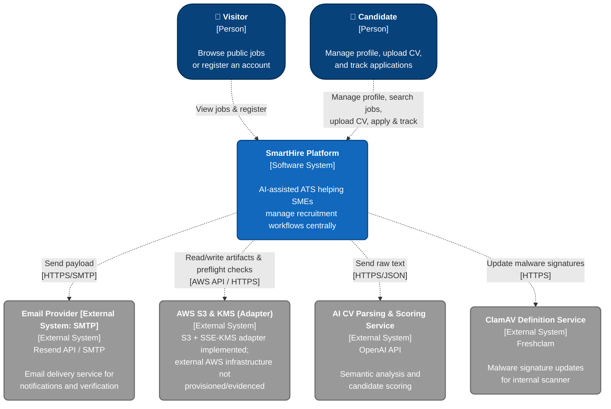

### 1. C4 Level 1 - System Context Diagram

*Performed by: Lưu Chí Hải | Reviewed by: Nguyễn Gia Quốc Uy, Nguyễn Quốc Thành | Edited by: Lưu Chí Hải*

### 2. System Context Description

*Performed by: Lưu Chí Hải | Reviewed by: Nguyễn Gia Quốc Uy, Nguyễn Quốc Thành | Edited by: Lưu Chí Hải*

**A. What does each actor use SmartHire for?**

* **Visitor:** Uses the platform to view public job postings and go through the registration flow to become a Candidate.
* **Candidate:** Creates and reuses a professional profile, uploads CVs, searches for suitable jobs, submits applications, and tracks their application status on the system.

> **Note:** The roles **Company Member / Recruiter**, **Platform Administrator**, and **Operator** (along with their corresponding features such as job posting, pipeline management, system monitoring, and company verification) are excluded from this diagram as they reflect the current system implementation (PA1 → PA4). These actors and features are planned for development in **PA5**.

**B. What data does SmartHire send to or receive from External Systems?**

* **Email Provider (Resend API / SMTP):** SmartHire sends payloads containing recipient information and content via SMTP (e.g., using a personal email account) to deliver notifications.
* **AWS S3 & KMS (Adapter):** SmartHire's backend code is programmed to push CV files (PDF/DOCX format) and search artifacts to this storage system using Server-Side Encryption (SSE-KMS).
> **Note:** As per current codebase evidence, the S3 + SSE-KMS adapter is implemented and verified during preflight; however, the external AWS infrastructure is not provisioned/evidenced. The `.env.example` defaults to `filesystem`, and no Terraform/CloudFormation scripts exist to create the KMS keys or S3 buckets. The system currently relies on the local filesystem for operations.)*

* **AI CV Parsing & Scoring Service (OpenAI API - configured language model):** SmartHire sends raw text extracted from the CV and the Job Description (JD) text. The API returns structured data including: personal information extracted from the CV, the matching score, and an explanation (strengths/watch-outs).
* **ClamAV Definition Service (Freshclam):** SmartHire periodically requests and downloads the latest malware signatures from this service to ensure the internal ClamAV engine is up-to-date before and during the scanning of uploaded documents and images.

**C. What sensitive data requires strict protection?**

* **Candidate Personal Information & CVs:** Includes names, emails, phone numbers, and detailed content within PDF CVs. These CV files must be stored securely (currently via encrypted local filesystem, with SSE-KMS logic programmed for future AWS S3 integration) and must not be publicly accessible via URL.
* **Login Session Data & Passwords:** Passwords must be hashed (using algorithms like bcrypt/argon2) before storage. Session tokens (Opaque sessions via Better Auth) must be securely stored as HttpOnly cookies, with the Secure flag and strict prefixes (`__Host-`/`__Secure-`) enforced in the production environment to protect session tokens against client-side script access and network interception.

> **Note:** Sensitive data regarding Company Documents (e.g., Business licenses) is deferred to PA5).*