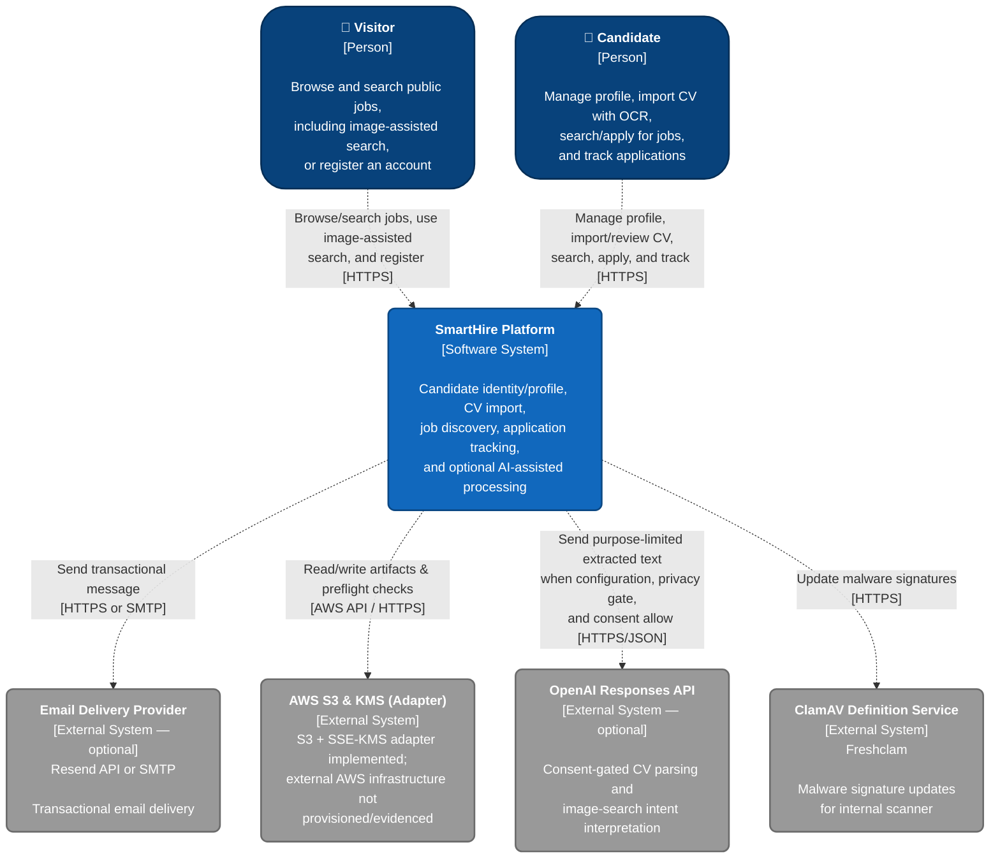

# C4 Level 1 System Context Diagram — SmartHire

_Performed by: Lưu Chí Hải | Reviewed by: Nguyễn Gia Quốc Uy, Nguyễn Quốc Thành | Edited by: Lưu Chí Hải_

**Architecture scope:** Implemented baseline Features 001–005, including identity and account security, candidate profile/account management, job discovery and application tracking, CV import/review, and purpose-specific OCR with image-assisted job search.

### 2. System Context Description

_Performed by: Lưu Chí Hải | Reviewed by: Nguyễn Gia Quốc Uy, Nguyễn Quốc Thành | Edited by: Lưu Chí Hải_

**A. What does each actor use SmartHire for?**

- **Visitor:** Uses the platform to browse, filter, and view public job postings; may use image-assisted search to propose filters; and can register to become a Candidate.
- **Candidate:** Creates and reuses a professional profile, imports PDF/DOCX CVs through native-first extraction and purpose-specific OCR, reviews proposed profile data, searches for suitable jobs, submits applications, and tracks application status.

> **Scope note:** Full **Company Member / Recruiter**, **Platform Administrator**, and **Operator** experiences are excluded because complete actor-facing workflows for job-post management, recruitment pipeline administration, platform monitoring, moderation, and company verification are not part of the implemented Features 001–005 baseline documented here, and may be included in PA5.

**B. What data does SmartHire send to or receive from External Systems?**

- **Email Delivery Provider (Resend API / SMTP):** When a non-capture adapter is configured, the Email Worker sends the minimum recipient and transactional message data required for delivery through the Resend HTTPS API or SMTP. The local default does not call this external system and writes messages to Local Mail Capture instead.
- **AWS S3 & KMS (Adapter):** SmartHire's backend code is programmed to push CV files (PDF/DOCX format) and search artifacts to this storage system using Server-Side Encryption (SSE-KMS).

> **Deployment note:** The S3 + SSE-KMS adapter and preflight checks are implemented, but external AWS infrastructure is not provisioned in this repository. `.env.example` defaults to `filesystem`, and no Terraform or CloudFormation files create the required bucket, KMS key, or IAM role.

- **OpenAI Responses API:** SmartHire optionally sends purpose-limited extracted text only after configuration, privacy, and consent checks. For CV import, the provider can convert extracted CV text into a structured review draft with provenance. For image-assisted job search, it can convert OCR text into evidence-bound filter suggestions. SmartHire does not send a Job Description for a candidate-job scoring operation in these implemented flows, and deterministic job search remains authoritative.
- **ClamAV Definition Service (Freshclam):** SmartHire periodically requests and downloads the latest malware signatures from this service to ensure the internal ClamAV engine is up-to-date before and during the scanning of uploaded documents and images.

**C. What sensitive data requires strict protection?**

- **Candidate Personal Information, CVs, and Search Images:** Includes names, emails, phone numbers, detailed PDF/DOCX CV content, uploaded search images, OCR text, and proposed search intent. Artifacts are stored in private application-encrypted local storage by default, are not exposed through public URLs, and are subject to purpose-specific retention and deletion controls. The implemented S3 adapter can use SSE-KMS if separately provisioned.
- **Login Session Data & Passwords:** Password processing is delegated to Better Auth's server-side password implementation. Opaque session tokens are stored in HttpOnly cookies; production configuration enforces secure cookie behavior and strict cookie prefixes to reduce client-side script access and network interception risk.

> **Scope note:** Company verification documents are outside the implemented Features 001–005 baseline and are therefore not represented as an active data flow.
