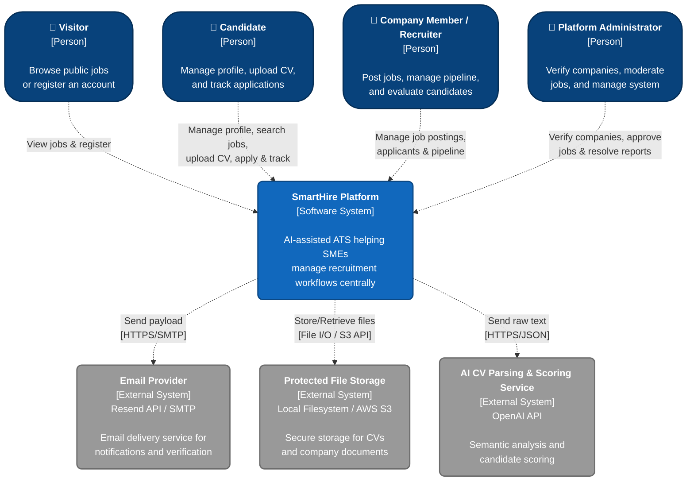

### 1. C4 Level 1 - System Context Diagram

*Performed by: Lưu Chí Hải | Reviewed by: Nguyễn Gia Quốc Uy | Edited by: Lưu Chí Hải*

### 2. System Context Description

*Performed by: Lưu Chí Hải | Reviewed by: Nguyễn Gia Quốc Uy | Edited by: Lưu Chí Hải*

**A. What does each actor use SmartHire for?**

* **Visitor:** Uses the platform to view public job postings and go through the registration flow to become a Candidate.
* **Candidate:** Creates and reuses a professional profile, uploads CVs, searches for suitable jobs, submits applications, and tracks their application status on the system.
* **Company Member / Recruiter:** Creates and manages the job posting lifecycle, views the applicant list, references AI-suggested scores, updates candidate statuses via the Kanban board, and manages company memberships.
* **Platform Administrator:** Ensures platform safety by verifying company business licenses, approving job postings, resolving violation reports, and managing user accounts.

**B. What data does SmartHire send to or receive from External Systems?**

* **Email Provider (Resend API / SMTP):** SmartHire sends payloads containing recipient information, email subjects, and content. This service returns the delivery status (success/failure) for system logging.
* **Protected File Storage (Local Filesystem / AWS S3):** SmartHire pushes CV files (PDF/DOCX format) and company verification documents to the storage system (using local filesystem for development and S3 for production). When needed for display or to send to the AI, SmartHire retrieves the file data from here.
* **AI CV Parsing & Scoring Service (OpenAI API - configured language model):** SmartHire sends raw text extracted from the CV and the Job Description (JD) text. The API returns structured data including: personal information extracted from the CV, the matching score, and an explanation (strengths/watch-outs).

**C. What sensitive data requires strict protection?**

* **Candidate Personal Information & CVs:** Includes names, emails, phone numbers, and detailed content within PDF CVs. These CV files must be stored in the *Protected File Storage* and must not be publicly accessible via URL.
* **Company Documents:** Business licenses provided by Recruiters to verify the company. Only Platform Administrators have the permission to view these documents.
* **Login Session Data & Passwords:** Passwords must be hashed (using algorithms like bcrypt/argon2) before storage. Session tokens (Opaque sessions via Better Auth) must be securely stored as HttpOnly cookies, with the Secure flag and strict prefixes (`__Host-`/`__Secure-`) enforced in the production environment to protect session tokens against client-side script access and network interception.

