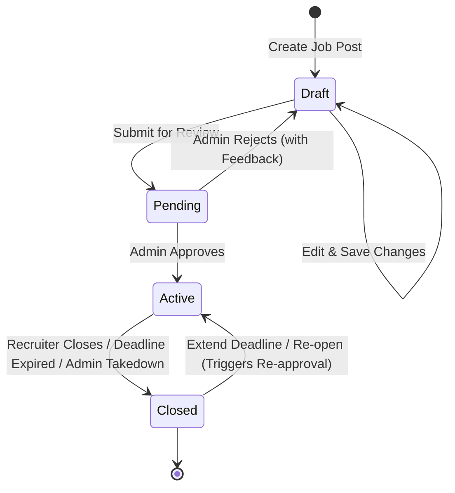
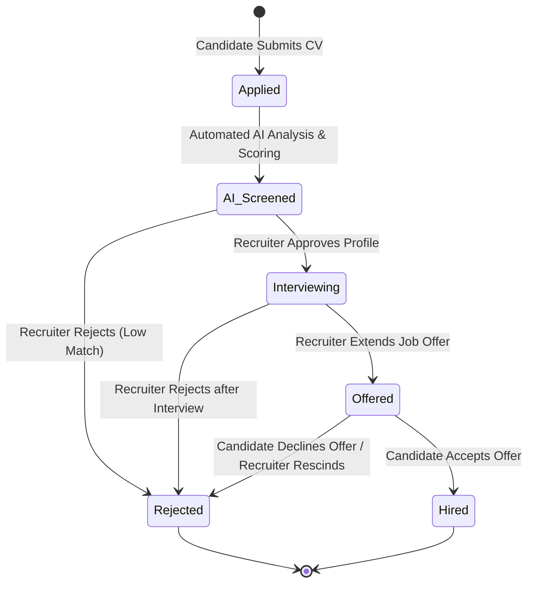

## **Project Proposal: SmartHire Recruitment Platform**

- **Author:** Nguyễn Gia Quốc Uy
- **Reviewer:** Nguyễn Quốc Thành, Ngô Quốc Tuấn
- **Version History:**
  - V1.0: Initial version. (01/06/2026)
  - V1.1: Added AI features for CV, JD auto generation and enhancement. (03/06/2026).
  - V1.2: Added technical stack & architecture details and core system state lifecycles. (03/06/2026).
  - V1.3: Final check for PA1 Submission. (07/06/2026).

## 1. Introduction

In Vietnam's rapidly growing business landscape, small and medium enterprises (SMEs) face significant challenges in recruitment management. Most SMEs still rely on manual, fragmented workflows such as managing applications via personal emails and tracking candidates using basic Excel spreadsheets. This leads to slow response times, lost applicant data, and inefficient candidate screening.

**SmartHire** is an AI-assisted Recruitment Management Platform designed to streamline the hiring workflow from end to end. By centralizing job posting, candidate application tracking, and leveraging either the Open AI API or a custom-trained lightweight model for semantic CV screening, SmartHire helps recruiters drastically reduce sifting time while providing candidates with a transparent, feedback-rich application experience.

---

## 2. Target Users & Operating Environments

- **Target Users:**
  - **Job Candidates:** Individuals seeking career opportunities who want to browse jobs, submit applications easily, and receive immediate feedback on how their profiles align with job requirements.
  - **Recruiters (HR Managers/SME Business Owners):** Professionals who need an organized pipeline to post jobs, screen resumes, and manage applicant progression without administrative chaos.
  - **System Administrators:** IT staff or platform owners responsible for moderating content, maintaining system health, and monitoring platform usage metrics.
- **Operating Environments:**
  - The platform runs as a **Responsive Web Application** accessible via any modern web browser (Google Chrome, Microsoft Edge, Safari, Firefox).
  - **Desktop View (Optimal for Recruiters and Admins):** Tailored for data-dense screens, featuring drag-and-drop Kanban pipelines, side-by-side CV reviews, and complex analytics charts.
  - **Mobile/Tablet View (Optimal for Candidates):** Tailored for on-the-go browsing, allowing candidates to search for jobs, fill out profiles, and upload resumes (.pdf, .docx) from mobile devices.

## 3. System Actors

The system supports three distinct roles with customized access controls:

1. **Candidate:** Accesses the Job Board, submits applications, manages their personal profile, and views AI-generated CV score reports.
2. **Recruiter:** Manages job postings, tracks candidates using a Kanban pipeline, and reviews AI screening assessments.
3. **System Admin:** Approves/rejects job postings, moderates user accounts, and views platform-wide metrics.

## 4. Key Features & Functional Groups

### 4.1. AUTHENTICATION, AUTHORIZATION & ACCESS CONTROL (AUTH)

This functional group handles user security and role-based access control. Users can register, log in, log out, and reset their passwords securely. The system uses stateless JSON Web Tokens (JWT) to distinguish permissions among Candidates, Recruiters, and Administrators, ensuring data isolation.

- **Candidate Registration:** Allows job seekers to create an account using their Email, Full Name, and Password.
- **Recruiter Registration:** Allows HR personnel to register by providing business email, company name, and tax identification number/business license (queued for Admin verification).
- **User Login:** Authenticates users using their email and password, issuing a stateless JSON Web Token (JWT) stored in the browser (localStorage/sessionStorage) to maintain the active session.
- **User Logout:** Invalidates the local session by deleting the JWT token from the client browser.
- **Password Recovery (Forgot Password):** Permits users to request a password reset link or verification code sent directly to their registered email address.
- **Password Change:** Allows authenticated users to update their password from their profile settings page.
- **Role-Based Access Control (RBAC):** Enforces path-level and API-level authorization to restrict users (Candidates, Recruiters, Admins) to their designated features only.

### 4.2. CANDIDATE PROFILE MANAGEMENT & AI RESUME BUILDER

Candidates can build their digital profiles and resumes by filling out personal details, education, and work history. This module integrates AI to help candidates polish their profiles and manage their uploaded resume documents.

- **Personal Information Update:** Allows candidates to edit their full name, contact number, location, profile picture, and professional social links (e.g., LinkedIn, GitHub).
- **Education History Management:** Allows candidates to add, edit, or delete educational records, including institution name, major, degree, graduation year, and GPA.
- **Work Experience Tracking:** Allows candidates to document their employment history, specifying company names, job titles, start/end dates, and a detailed description of duties.
- **Skills Tagging:** Allows candidates to select and display technical or soft skills as tags from a standardized system-defined directory.
- **AI CV Builder & Resume Generator:** Refines raw candidate inputs (education, raw project experience, and skills) into professional, impact-oriented descriptions (using industry standards like the STAR framework) and automatically populates the candidate's profile.
- **CV Document Management (Upload/Delete):** Enables candidates to upload and store their resume file (supporting .pdf and .docx formats, up to 5MB) for quick applications.

### 4.3. JOB BOARD & ADVANCED SEARCH

This module provides public access for candidates to explore active job postings. It features advanced search filters (e.g., sorting by salary range, location, required skills, and job type) and paginated results. Candidates can view detailed job descriptions (JDs) and bookmark postings for later.

- **Public Job Feed:** Displays all active (approved and non-expired) job openings in a paginated list view.
- **Keyword Search:** Allows users to search for job openings instantly using keywords from job titles, company names, or descriptions.
- **Advanced Job Filters:** Filters job listings based on salary range, work location, required years of experience, and job type (e.g., Full-time, Part-time, Remote).
- **Detailed Job View (JD View):** Displays comprehensive details of a job posting, including the job description, candidate requirements, compensation packages, and company info.
- **Job Bookmarking:** Allows signed-in candidates to save job posts to a "Favorites" list for later review and application.

### 4.4. JOB POSTING MANAGEMENT & AI JD GENERATOR

Recruiters can draft, preview, publish, edit, and close job postings. This module includes AI generation tools to assist recruiters in writing professional and standardized job descriptions.

- **Job Posting Creation:** Provides a structured form for recruiters to enter the job title, department, salary, job description, required skill tags, experience level, and application deadline.
- **AI-Powered Job Description Generator:** Converts raw, bulleted inputs from recruiters (such as job title, key technical requirements, benefits, and company tone) into a structured, professional job description draft containing key responsibilities, requirements, and benefits.
- **Draft Saving:** Allows recruiters to save incomplete job postings as drafts, allowing them to review and edit before submitting for approval.
- **Job Post Editing:** Permits recruiters to modify active job post details to refine requirements or update descriptions.
- **Status Life-cycle Controls:** Allows recruiters to manually close a job posting early once a position is filled, or extend the deadline of an active post.

### 4.5. APPLICANT SIFTING & HYBRID SCORING ENGINE

This is the core dashboard for recruiters, displaying applicants grouped by job campaigns. Recruiters can view all submitted profiles, read candidate cover letters, and see calculated match scores. It eliminates the need for recruiters to manage applications through disorganized email inboxes.

- **Applicant Campaign View:** Displays a list of all candidates who have applied to a specific job post, showing their profile highlights and raw resume files.
- **Automated Skills & Experience Matching:** The system programmatically calculates a compatibility score by comparing the candidate's skills tags and years of experience with the JD metadata.
- **AI Semantic CV Scoring & Feedback:** Evaluates the candidate's parsed CV text against the JD requirements using either the Open AI API or a custom-trained lightweight local model, generating a semantic match score and providing feedback on matching skills and potential gap analysis.
- **Applicant Sorting & Filtering:** Orders the candidate queue automatically from the highest to the lowest hybrid score, allowing recruiters to filter out low-scoring profiles.

### 4.6. KANBAN RECRUITMENT PIPELINE

A visual workflow board that represents candidate stages (Applied -> Screened -> Interviewing -> Offered -> Hired). Recruiters transition candidates between stages by physically dragging card objects across columns. This visual interface keeps the recruitment team aligned on candidate progression.

- **Interactive Kanban Board:** Organizes applicants into columns representing stages (Applied → Screened → Interviewing → Offered → Hired).
- **Drag-and-Drop Stage Transition:** Enables recruiters to move candidate cards from one stage column to another, modifying their application state in the database.
- **Candidate Evaluation Notes:** Provides a details pane where recruiters can write feedback, log interview notes, and assign a 1-to-5 star rating to candidates at any pipeline stage.
- **Application Rejection:** Allows recruiters to reject candidates, moving their profiles to an archived list to keep the active pipeline clean.

### 4.7. AUTOMATED NOTIFICATION & IN-APP ALERTS

This system automatically triggers customized email updates to candidates when their application changes status. For example, moving a candidate to the "Interviewing" column drafts an automated invite email, while moving them to "Rejected" sends a polite notification. This maintains candidate engagement with minimal recruiter effort.

- **Email Template Management:** Allows recruiters to pre-configure email templates for different pipeline events (e.g., Interview Invitation, Offer Letter, Rejection Letter).
- **Pipeline Event Triggers:** Automatically sends the corresponding email template to a candidate when their Kanban card is moved to a new stage (e.g., moving to "Interviewing" triggers the interview invite email).
- **Real-Time In-App Notifications:** Delivers instant push alerts (notification bell) to candidates on their portal when a recruiter schedules an interview, sends an offer, or updates their status.

### 4.8. JOB POST MODERATION & QUALITY ASSURANCE (ADMIN)

To prevent fraud and spam, new job postings from recruiters are queued as "Pending Approval." Administrators review the content against community guidelines before activating the post. Admins also have the authority to suspend accounts violating safety terms.

- **Pending Job Approval Queue:** Centralizes all newly created job posts from recruiters in a moderation queue for admin review.
- **Approve/Reject Decision Actions:** Admins can approve a job post to publish it on the Job Board, or reject it with a reason (triggering an automated email explanation to the recruiter).
- **Spam/Abuse Report Management:** Collects and displays reports submitted by candidates regarding suspicious or misleading job listings.
- **Forced Deactivation/Take-down:** Empowers admins to immediately unpublish or remove job postings that violate platform policies.

### 4.9. USER MANAGEMENT & RECRUITER VERIFICATION (ADMIN)

Enables administrators to moderate platform accounts and verify business identities. The dashboard helps administrators check active user registrations and verify corporate credentials.

- **User Account Directory:** Displays a searchable and filterable database of all registered candidates and recruiters on the platform.
- **Recruiter Verification Approval:** Admin inspects business registration documents uploaded by new recruiters to verify corporate legitimacy before granting job-posting privileges.
- **Account Suspension & Reactivation:** Allows admins to lock (suspend) accounts violating terms of service (e.g., spamming, harassment) and reactivate them upon resolution.

### 4.10. RECRUITMENT ANALYTICS & DATA PORTABILITY (EXPORT)

Enables administrators and recruiters to download structured reports in CSV or Excel formats. Recruiters can export applicant lists for specific jobs, while admins can export system audit logs. This ensures business compliance and offline data archiving capabilities.

- **System-wide Admin Dashboard:** Renders charts visualizing monthly new sign-ups, active jobs, and successful hire rates to monitor platform performance.
- **Recruiter Campaign Analytics:** Displays metrics on individual job posts, such as total views, application count, and funnel conversion rates.
- **Candidate List Export:** Allows recruiters to export a structured list of applicants (names, contact details, status, hybrid scores) for a specific job post into a CSV/Excel file.
- **Admin Audit Log Export:** Allows administrators to download logs of system activities and corporate user data for external auditing.

---

## 5. AI-Powered Features
### 5.1. Semantic CV Scoring & Gap Analysis
SmartHire integrates the Open AI API to perform automated resume screening. When a candidate submits a CV (parsed from PDF/Word to raw text), the scoring engine compares it semantically against the requirements specified in the Job Description (JD).
* **Hybrid Match Score:** Generates an objective matching percentage based on core technical skills, domain experience, and education, moving beyond simple keyword matching.
* **Gap Analysis:** Identifies missing qualifications or technologies required by the employer (e.g., if a job requires React but the candidate only has Vue).
* **Personalized Recommendations:** Provides actionable suggestions to the candidate on how to improve their profile or what skills to acquire to become a stronger match.
### 5.2. AI-Powered Job Description Generator
Recruiters can generate professional and standardized job descriptions within seconds. By inputting raw parameters such as job title, target technical skills, budget, and company working style, the AI creates a structured job post draft. Recruiter can edit and refine the draft before publishing.
### 5.3. AI CV Builder & Resume Generator
Helps candidates improve their career profiles. Based on basic inputs regarding educational history and project involvements, the AI translates raw text into action-oriented descriptions using professional terminology (e.g., applying the STAR framework) to increase their hireability.

---

## 6. Technical Stack & Architecture

SmartHire utilizes a modern, decoupled architecture designed for high scalability, security, and developer productivity. 

### 6.1. System & Security Architecture
- **Operating Architecture:** The platform operates under a decoupled **Client-Server model**. The frontend application acts as a standalone client communicating exclusively with the backend service via secure **RESTful APIs**. This guarantees a clean separation of concerns and allows independent scaling of both layers.
- **Security & Session Management:** Access control gand session state are managed using a stateless **JSON Web Token (JWT)** mechanism. Upon successful authentication, the server issues a cryptographically signed JWT. This token is securely stored on the client side (using `localStorage` or `sessionStorage` for path routing and session persistence, or secure HttpOnly cookies for API authorization) and included in the authorization header of every HTTP request, ensuring data isolation and secure access without maintaining session states on the server.

### 6.2. Frontend Stack
- **Framework:** **Next.js** (React-based meta-framework) is utilized to build a responsive, single-page application (SPA) shell, leveraging features like static site generation (SSG) for public job boards and client-side rendering (CSR) for interactive dashboards.
- **Language:** **TypeScript** is used to enforce strict typing across components, state models, and API responses, reducing runtime errors and improving codebase scaling.
- **State Management:** **Zustand** acts as the client-side state store. It provides a lightweight, reactive, and boilerplate-free alternative to Redux for managing complex UI states (e.g., application pipelines, filter criteria, and active user credentials).
- **Styling:** **Tailwind CSS** provides a utility-first design system enabling fast UI iteration and pixel-perfect responsiveness.
- **UI Components:** **Shadcn UI** (built on Radix UI primitives) is chosen for accessible, accessible-first pre-designed components like dialogs, inputs, tables, and dropdowns.
- **Drag-and-Drop Interactive Flow:** **hello-pangea/dnd** is integrated to power the interactive Kanban Board, facilitating smooth, accessible, and high-performance card movement across recruitment stages.

### 6.3. Backend & Database Stack
- **Architecture:** The backend layer leverages the **Next.js API Routes** structure using a **Layered Architecture**. This cleanly segregates incoming requests (Controllers/Routes), business logic processing (Services), and database operations (Repositories/Data Access).
- **Database Engine:** Relational Database Management System (**PostgreSQL** or **MySQL**) is used to maintain transactional integrity (ACID compliance) and store relational data models (e.g., Candidates, Recruiters, Job Posts, Applications, and Moderation logs).

### 6.4. AI Integration
- **Integration Approach:** The project is designed to utilize either the **Open AI API** or a **custom-trained lightweight local model** built specifically to serve this project's requirements. This component handles semantic CV sifting, compatibility scoring, personalized feedback generation, and auto-drafting professional job descriptions.

### 6.5. Development & Collaboration Tools
- **Version Control & Repository Hosting:** **GitHub** is used for source code hosting, collaborative pull request code reviews, and automated workflows.
- **Project Documentation & Task Tracking:** **Notion** serves as the central hub for storing SRS documents, sprint backlogs, task assignments, and system design specs.
- **Media & Assets Sharing:** **Google Drive** is utilized to store mockups, design diagrams, meeting recordings, and non-code business assets.

---

## 7. Core System States

To ensure reliability, the system tracks and manages the state transitions of its two core domain entities: Job Postings and Job Applications.

### 7.1. Job Post Lifecycle
A job post transitions through distinct phases from inception to closure to maintain moderation standards and control candidate application entry.

- **Draft:** The initial state where the recruiter is writing or editing the job posting. It is saved in the database but is invisible to candidates.
- **Pending (Approval Queue):** The recruiter submits the posting. It enters the Admin queue for moderation to filter out spam or non-compliant posts.
- **Active (Approved):** The post is approved by the admin. It is published on the Job Feed, accepting applications, and is fully searchable.
- **Closed:** The post ceases to accept new candidates. This occurs when the recruiter manually closes it early, the deadline passes, or an admin takes it down for safety violations.

### 7.2. Application Lifecycle
An application tracks a candidate's journey from submission to the final recruitment outcome.

- **Applied:** The initial state when a candidate uploads their CV and hits submit.
- **AI_Screened:** The system parses the CV and triggers either the Open AI API or the custom-trained local model to evaluate the text against the JD, calculating the semantic score and producing gap feedback.
- **Interviewing:** The recruiter moves the candidate to the interview loop. The candidate receives an automated invite notification.
- **Offered:** The recruiter issues a formal job offer.
- **Hired:** The candidate accepts the offer, completing their recruitment journey.
- **Rejected:** The recruiter rejects the applicant. This can happen from any state (Applied, AI_Screened, Interviewing, or Offered), moving the application to an archived, inactive status and emailing the candidate.

---

## 8. Legal & Ethical Compliance

SmartHire is committed to data privacy and legal regulations. The application is designed and operated to respect the following standards:
- **Personal Data Protection**: The system complies with Vietnamese Decree 13/2023/ND-CP on Personal Data Protection. Candidate information, contact details, and uploaded CV files are encrypted at rest and can be permanently deleted upon user request.
- **Content Moderation**: The platform enforces strict quality guidelines for job postings. Admin moderation queues actively prevent spam, fake job advertisements, multi-level marketing (MLM) schemes, and illegal activities from being published.
- **Ethical AI Practices**: AI scoring is used purely as a decision-support tool. Recruiters maintain full control and final decision-making power over candidate hiring, ensuring no algorithmic bias or automated rejection without human review.