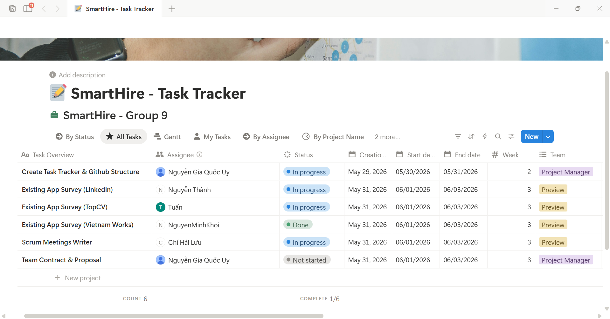

# =============31/05, Sprint 1=============

## 1. Attendance

*Performed by: Lưu Chí Hải | Reviewed by: Nguyễn Gia Quốc Uy | Edited by: Lưu Chí Hải*

**Team members present:**
* Nguyễn Gia Quốc Uy
* Nguyễn Quốc Thành
* Nguyễn Quốc Tuấn
* Lưu Chí Hải
* Nguyễn Minh Khôi

**Team members absent:**
* None

---

## 2. Status Reports

*Performed by: Lưu Chí Hải | Reviewed by: Nguyễn Gia Quốc Uy | Edited by: Lưu Chí Hải*

### Nguyễn Gia Quốc Uy
* **Completed tasks:** Created GitHub repository.
* **To-do Tasks:** Create task tracker & GitHub structure; write team's contract and proposal.
* **Issues/Obstacles:** None

### Nguyễn Quốc Thành
* **Completed tasks:** None
* **To-do Tasks:** Conduct existing app survey (LinkedIn).
* **Issues/Obstacles:** None

### Nguyễn Quốc Tuấn
* **Completed tasks:** None
* **To-do Tasks:** Conduct existing app survey (TopCV).
* **Issues/Obstacles:** None

### Lưu Chí Hải
* **Completed tasks:** None
* **To-do Tasks:** Document Scrum meeting minutes.
* **Issues/Obstacles:** None

### Nguyễn Minh Khôi
* **Completed tasks:** None
* **To-do Tasks:** Conduct existing app survey (VietnamWorks).
* **Issues/Obstacles:** None

---

## 3. Actions & Summary

*Performed by: Lưu Chí Hải | Reviewed by: Nguyễn Gia Quốc Uy | Edited by: Lưu Chí Hải*

**Actions:**
* Create a messenger group for text chat and a discord group for voice meetings.
* Selected Notion as the primary task tracking tool.

**Summary of the meeting:**
* Project first meeting. The team assigned tasks for setting up the initial workspace environment and began researching and surveying similar existing systems in the market.

---

## 4. Task Screenshots

*Performed by: Lưu Chí Hải | Reviewed by: Nguyễn Gia Quốc Uy | Edited by: Lưu Chí Hải*

