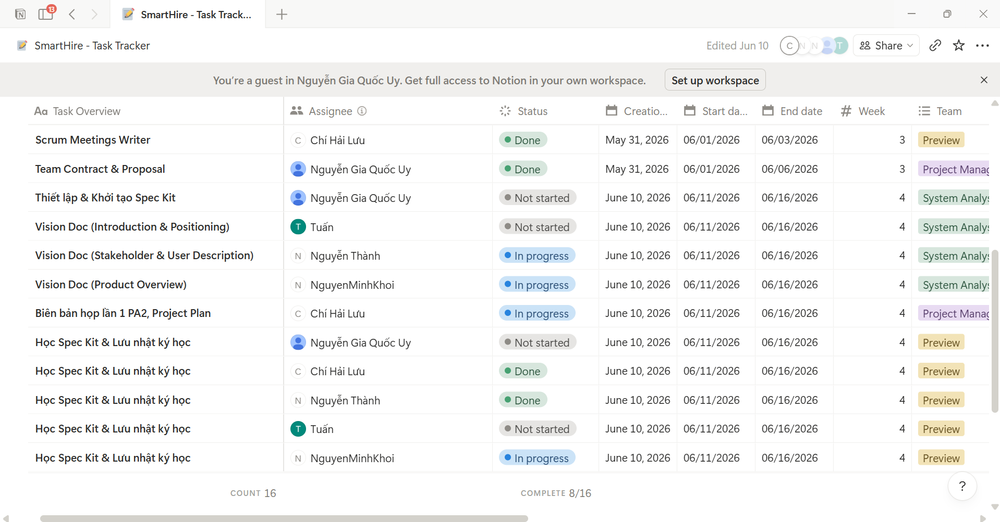
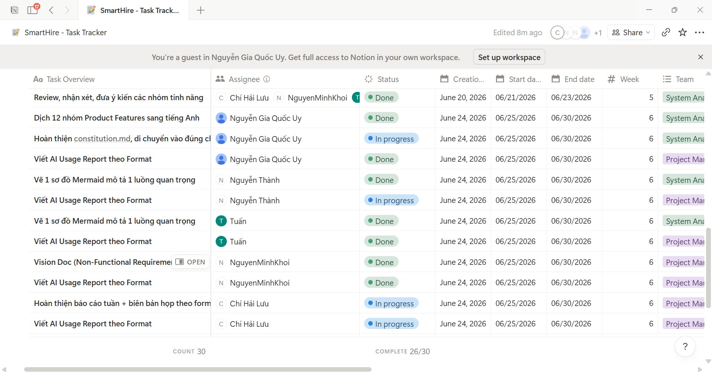

# =============31/05, Sprint 1=============

## 1. Attendance

*Performed by: Lưu Chí Hải | Reviewed by: Nguyễn Gia Quốc Uy | Edited by: Lưu Chí Hải*

**Team members present:**
* Nguyễn Gia Quốc Uy
* Nguyễn Quốc Thành
* Nguyễn Quốc Tuấn
* Lưu Chí Hải
* Nguyễn Minh Khôi

**Team members absent:**
* None

---

## 2. Status Reports

*Performed by: Lưu Chí Hải | Reviewed by: Nguyễn Gia Quốc Uy | Edited by: Lưu Chí Hải*

### Nguyễn Gia Quốc Uy
* **Completed tasks:** 
    - Created GitHub repository.
* **To-do Tasks:** 
    - Create task tracker & GitHub structure
    - Write team's contract and proposal.
* **Issues/Obstacles:**
    - None

### Nguyễn Quốc Thành
* **Completed tasks:** 
    - None
* **To-do Tasks:** 
    - Conduct existing app survey (LinkedIn).
* **Issues/Obstacles:** 
    - None

### Nguyễn Quốc Tuấn
* **Completed tasks:** 
    - None
* **To-do Tasks:** 
    - Conduct existing app survey (TopCV).
* **Issues/Obstacles:** 
    - None

### Lưu Chí Hải
* **Completed tasks:** 
    - None
* **To-do Tasks:** 
    - Document Scrum meeting minutes.
* **Issues/Obstacles:** 
    - None

### Nguyễn Minh Khôi
* **Completed tasks:** 
    - None
* **To-do Tasks:** 
    - Conduct existing app survey (VietnamWorks).
* **Issues/Obstacles:** 
    - None

---

## 3. Actions & Summary

*Performed by: Lưu Chí Hải | Reviewed by: Nguyễn Gia Quốc Uy | Edited by: Lưu Chí Hải*

**Actions:**
* Create a messenger group for text chat and a discord group for voice meetings.
* Selected Notion as the primary task tracking tool.

**Summary of the meeting:**
* Project first meeting. The team assigned tasks for setting up the initial workspace environment and began researching and surveying similar existing systems in the market.

---

## 4. Task Screenshots

*Performed by: Lưu Chí Hải | Reviewed by: Nguyễn Gia Quốc Uy | Edited by: Lưu Chí Hải*

# =============11/06, Sprint 2=============

## 1. Attendance

*Performed by: Lưu Chí Hải | Reviewed by: Nguyễn Gia Quốc Uy | Edited by: Lưu Chí Hải*

**Team members present:**
* Nguyễn Gia Quốc Uy
* Nguyễn Quốc Thành
* Nguyễn Quốc Tuấn
* Lưu Chí Hải
* Nguyễn Minh Khôi

**Team members absent:**
* None

---

## 2. Status Reports

*Performed by: Lưu Chí Hải | Reviewed by: Nguyễn Gia Quốc Uy | Edited by: Lưu Chí Hải*

### Nguyễn Gia Quốc Uy
* **Completed tasks:**
    - Create Task Tracker & Github Structure; 
    - Write Team Contract & Proposal
* **To-do Tasks:** 
    - Set up & Initialize Spec Kit
    - Learn Spec Kit & Save study log.
* **Issues/Obstacles:** 
    - None

### Nguyễn Quốc Thành
* **Completed tasks:** 
    - Conduct existing app survey (LinkedIn).
* **To-do Tasks:**
    - Vision Doc (Stakeholder & User Description)
    - Learn Spec Kit & Save study log. 
* **Issues/Obstacles:** 
    - None

### Nguyễn Quốc Tuấn
* **Completed tasks:** 
    - Conduct existing app survey (TopCV).
* **To-do Tasks:**
    - Vision Doc (Introduction & Positioning)
    - Learn Spec Kit & Save study log.
* **Issues/Obstacles:** 
    - None

### Lưu Chí Hải
* **Completed tasks:** 
    - PA1 meeting minutes
* **To-do Tasks:**
    - PA2 1st meeting minutes, Project plan
    - Learn Spec Kit & Save study log.
* **Issues/Obstacles:** 
    - None

### Nguyễn Minh Khôi
* **Completed tasks:** 
    - Conduct existing app survey (VietnamWorks).
* **To-do Tasks:** 
    - Vision Doc (Product Overview)
    - Learn Spec Kit & Save study log.
* **Issues/Obstacles:** 
    - None

---

## 3. Actions & Summary

*Performed by: Lưu Chí Hải | Reviewed by: Nguyễn Gia Quốc Uy | Edited by: Lưu Chí Hải*

**Actions:**
* Set up the GitHub repository with Spec Kit and generate the constitution.md file
* Require all team members to complete the Spec Kit training via https://learn.microsoft.com/en-us/training/modules/spec-driven-development-github-spec-kit-greenfield-intro/ and record their study logs

**Summary of the meeting:**
* The team reviewed the completed tasks from Sprint 1, which included the initial GitHub repository setup, team contract, project proposal, and existing app surveys.
* The meeting focused on outlining the requirements and planning tasks for Project Assignment 2.
* Work for PA2 was successfully distributed: Uy is responsible for Spec Kit initialization, Hải is handling the Project Plan and meeting minutes, while Tuấn, Thành, and Khôi are dividing the respective sections of the Vision Document.
* The team agreed that every member must individually complete the Spec Kit training and maintain a study log as part of their assigned tasks.

---

## 4. Task Screenshots

*Performed by: Lưu Chí Hải | Reviewed by: Nguyễn Gia Quốc Uy | Edited by: Lưu Chí Hải*

# =============25/06, Sprint 2=============

## 1. Attendance

*Performed by: Lưu Chí Hải | Reviewed by: Nguyễn Gia Quốc Uy | Edited by: Lưu Chí Hải*

**Team members present:**
* Nguyễn Gia Quốc Uy
* Nguyễn Quốc Thành
* Nguyễn Quốc Tuấn
* Lưu Chí Hải
* Nguyễn Minh Khôi

**Team members absent:**
* None

---

## 2. Status Reports

*Performed by: Lưu Chí Hải | Reviewed by: Nguyễn Gia Quốc Uy | Edited by: Lưu Chí Hải*

### Nguyễn Gia Quốc Uy
* **Completed tasks:** 
    - Set up & Initialize Spec Kit
    - Learn Spec Kit & Save study log.
* **To-do Tasks:** 
    - Write the AI Usage Report following the given format.
    - Re-brief the feature groups in detail.
    - Translate the 12 product feature groups into English.
    - Complete constitution.md.
* **Issues/Obstacles:**
    - None

### Nguyễn Quốc Thành
* **Completed tasks:** 
    - Vision Doc (Stakeholder & User Description)
    - Learn Spec Kit & Save study log. 
* **To-do Tasks:** 
    - Review, comment, and provide feedback on the features that the group has chosen.
    - Write the AI Usage Report following the given format.
    - Draw a Mermaid diagram describing an important flow.
* **Issues/Obstacles:** 
    - None

### Nguyễn Quốc Tuấn
* **Completed tasks:** 
    - Vision Doc (Introduction & Positioning)
    - Learn Spec Kit & Save study log.
* **To-do Tasks:** 
    - Review, comment, and provide feedback on the features that the group has chosen.
    - Write the AI Usage Report following the given format.
    - Draw a Mermaid diagram describing an important flow.
* **Issues/Obstacles:** 
    - None

### Lưu Chí Hải
* **Completed tasks:** 
    - PA2 1st meeting minutes, Project plan
    - Learn Spec Kit & Save study log.
* **To-do Tasks:** 
    - Review, comment, and provide feedback on the features that the group has chosen.
    - Write the AI Usage Report following the given format.
    - PA2 2nd meeting minutes.
* **Issues/Obstacles:** 
    - None

### Nguyễn Minh Khôi
* **Completed tasks:** 
    - Vision Doc (Product Overview)
    - Learn Spec Kit & Save study log.
* **To-do Tasks:** 
    - Review, comment, and provide feedback on the features that the group has chosen.
    - Write the AI Usage Report following the given format.
    - Write Vision Doc (Non-Functional Requirements).
* **Issues/Obstacles:** 
    - None

---

## 3. Actions & Summary

*Performed by: Lưu Chí Hải | Reviewed by: Nguyễn Gia Quốc Uy | Edited by: Lưu Chí Hải*

**Actions:**
* Each member writes their own AI Usage Report.
* Each member (except for Project Manager) gives feedback on the features.

**Summary of the meeting:**
* The team confirmed the completion of Spec Kit training, study logs, and initial PA2 tasks (Vision Doc, Project Plan, Spec Kit initialization).
* All members are required to write their individual AI Usage Reports and provide feedback on the proposed product features.
* Tasks: Uy will detail and translate feature groups, Thành and Tuấn will draw Mermaid diagrams, Khôi will write Non-Functional Requirements, and Hải will write the meeting minutes. 

---

## 4. Task Screenshots

*Performed by: Lưu Chí Hải | Reviewed by: Nguyễn Gia Quốc Uy | Edited by: Lưu Chí Hải*

