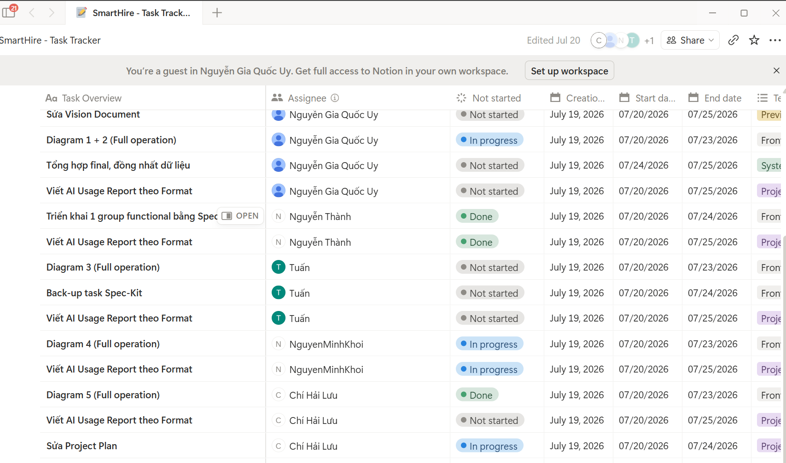

# =============19/07, Sprint 3=============

## 1. Attendance

*Performed by: Lưu Chí Hải | Reviewed by: Nguyễn Gia Quốc Uy | Edited by: Lưu Chí Hải*

**Team members present:**
* Nguyễn Gia Quốc Uy
* Nguyễn Quốc Thành
* Nguyễn Quốc Tuấn
* Lưu Chí Hải
* Nguyễn Minh Khôi

**Team members absent:**
* None

---

## 2. Status Reports

*Performed by: Lưu Chí Hải | Reviewed by: Nguyễn Gia Quốc Uy | Edited by: Lưu Chí Hải*

### Nguyễn Gia Quốc Uy
* **Completed tasks:** 
    - Write the AI Usage Report following the given format.
    - Re-brief the feature groups in detail.
    - Translate the 12 product feature groups into English.
    - Complete constitution.md.
* **To-do Tasks:** 
    - Update the Vision Document.
    - Complete Diagram 1 & 2 for full operation.
    - Consolidate final outputs and ensure data consistency.
    - Write the AI Usage Report following the required format.
* **Issues/Obstacles:**
    - None

### Nguyễn Quốc Thành
* **Completed tasks:** 
    - Review, comment, and provide feedback on the features that the group has chosen.
    - Write the AI Usage Report following the given format.
    - Draw a Mermaid diagram describing an important flow.
* **To-do Tasks:** 
    - Deploy a functional group with Spec-Kit.
    - Write the AI Usage Report following the required format.
* **Issues/Obstacles:** 
    - None

### Nguyễn Quốc Tuấn
* **Completed tasks:** 
    - Review, comment, and provide feedback on the features that the group has chosen.
    - Write the AI Usage Report following the given format.
    - Draw a Mermaid diagram describing an important flow.
* **To-do Tasks:**
    - Execute back-up task via Spec-Kit.
    - Complete Diagram 3 for full operation.
    - Write the AI Usage Report following the required format.
* **Issues/Obstacles:** 
    - None

### Lưu Chí Hải
* **Completed tasks:** 
    - Review, comment, and provide feedback on the features that the group has chosen.
    - Write the AI Usage Report following the given format.
    - PA2 2nd meeting minutes.
* **To-do Tasks:** 
    - Complete Diagram 5 for full operation.
    - Update the Project Plan
    - Write PA3 meeting minutes.
    - Write the AI Usage Report following the required format.
* **Issues/Obstacles:** 
    - None

### Nguyễn Minh Khôi
* **Completed tasks:** 
    - Review, comment, and provide feedback on the features that the group has chosen.
    - Write the AI Usage Report following the given format.
    - Write Vision Doc (Non-Functional Requirements).
* **To-do Tasks:** 
    - Complete Diagram 4 for full operation.
    - Write the AI Usage Report following the required format.
* **Issues/Obstacles:** 
    - None

---

## 3. Actions & Summary

*Performed by: Lưu Chí Hải | Reviewed by: Nguyễn Gia Quốc Uy | Edited by: Lưu Chí Hải*

**Actions:**
* **Uy:** Update the Vision Document based on lecturer's reviews in PA2 and consolidate all final outputs from team members to ensure data consistency.
* **Thành & Tuấn:** Execute the full-stack implementation of the chosen functional group using Spec-Kit, with Thành leading the deployment and Tuấn serving as the backup.
* **Uy, Tuấn, Khôi, Hải:** Complete the assigned Use Case Diagrams (1, 2, 3, 4, and 5) for full operation, including their respective specifications and prototypes.
* **Hải:** Update the Project Plan with the latest sprint details and lecturer's reviews in PA2 and finalize the PA3 meeting minutes.
* **All Members:** Continuously log AI tool interactions and complete the AI Usage Report following the required format.

**Summary of the meeting:**
* The team successfully reviewed the completion of initial PA3 preparation tasks, including feature reviews and the establishment of the project constitution. 
* There are currently no reported issues or obstacles, indicating that the sprint is progressing smoothly on schedule. 
* The primary focus for the remainder of the sprint has been clearly divided into three main streams: 
    1. System modeling (Diagrams 1-5 distributed among Uy, Tuấn, Khôi, and Hải).
    2. End-to-end coding implementation via Spec-Kit (assigned to Thành and Tuấn).
    3. Project documentation updates (Vision Document by Uy, Project Plan by Hải).

---

## 4. Task Screenshots

*Performed by: Lưu Chí Hải | Reviewed by: Nguyễn Gia Quốc Uy | Edited by: Lưu Chí Hải*

