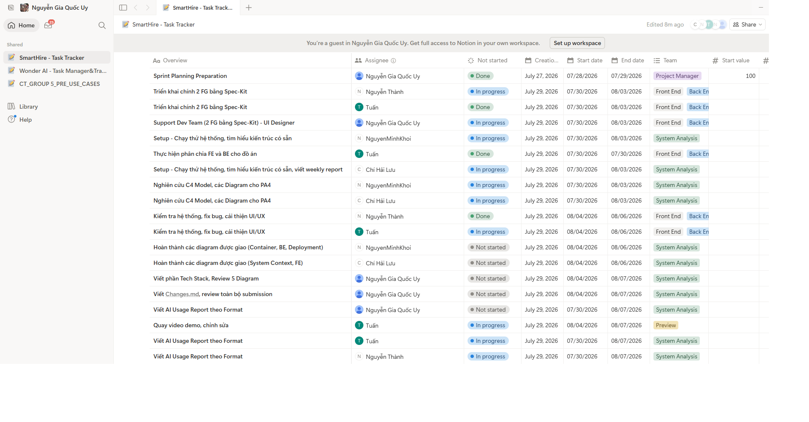

# =============29/07, Sprint 4=============

## 1. Attendance

*Performed by: Lưu Chí Hải | Reviewed by: Nguyễn Gia Quốc Uy | Edited by: Lưu Chí Hải*

**Team members present:**
* Nguyễn Gia Quốc Uy
* Nguyễn Quốc Thành
* Ngô Quốc Tuấn
* Lưu Chí Hải
* Nguyễn Minh Khôi

**Team members absent:**
* None
---

## 2. Status Reports

*Performed by: Lưu Chí Hải | Reviewed by: Nguyễn Gia Quốc Uy | Edited by: Lưu Chí Hải*

### Nguyễn Gia Quốc Uy
* **Completed tasks:** 
    - Complete Diagram 1 & 2 for full operation.
    - Consolidate final outputs and ensure data consistency.
    - Write the AI Usage Report following the required format.
    - Sprint Planning Preparation
* **To-do Tasks:** 
    - Support the Dev Team (2 Feature Groups using Spec-Kit) as a UI Designer.
    - Write the Tech Stack section, Review 5 Diagrams.
    - Write Changes.md, review the entire submission.
    - Write the AI Usage Report following the required format.
* **Issues/Obstacles:**
    - None

### Nguyễn Quốc Thành
* **Completed tasks:** 
    - Deploy a functional group with Spec-Kit.
    - Write the AI Usage Report following the required format.
* **To-do Tasks:** 
    - Deploy 1 main Feature Group using Spec-Kit.
    - Test the system, fix bugs, improve UI/UX.
    - Write the AI Usage Report following the required format.
* **Issues/Obstacles:** 
    - None

### Ngô Quốc Tuấn
* **Completed tasks:** 
    - Execute back-up task via Spec-Kit.
    - Complete Diagram 3 for full operation.
    - Write the AI Usage Report following the required format.
* **To-do Tasks:**
    - Deploy 1 main Feature Group using Spec-Kit.
    - Execute frontend and backend division for the project.
    - Test the system, fix bugs, improve UI/UX.
    - Record and edit the demo video.
    - Write the AI Usage Report following the required format.
* **Issues/Obstacles:** 
    - None

### Lưu Chí Hải
* **Completed tasks:** 
    - Complete Diagram 5 for full operation.
    - Update the Project Plan.
    - Write PA3 meeting minutes.
    - Write the AI Usage Report following the required format.
* **To-do Tasks:** 
    - Setup - Test run the system, research existing architecture, and write the weekly report.
    - Research the C4 Model and Diagrams for PA4.
    - Complete the assigned diagrams (System Context, FE).
    - Write the AI Usage Report following the required format.
    - Update Project Plan.
* **Issues/Obstacles:** 
    - None

### Nguyễn Minh Khôi
* **Completed tasks:** 
    - Complete Diagram 4 for full operation.
    - Write the AI Usage Report following the required format.
* **To-do Tasks:** 
    - Setup - Test run the system, research existing architecture.
    - Research the C4 Model and Diagrams for PA4.
    - Complete the assigned diagrams (Container, BE, Deployment).
    - Write the AI Usage Report following the required format.
* **Issues/Obstacles:** 
    - None

---

## 3. Actions & Summary

*Performed by: Lưu Chí Hải | Reviewed by: Nguyễn Gia Quốc Uy | Edited by: Lưu Chí Hải*

**Actions:**
* Thành & Tuấn: Lead the core deployment of the 2 main Feature Groups using Spec-Kit. Both are responsible for testing the system, fixing bugs, and improving UI/UX. Tuấn will additionally handle the FE/BE division and record/edit the demo video.
* Uy: Act as UI Designer to support the Dev Team. Take charge of the final documentation by writing the Tech Stack section, reviewing all 5 diagrams, writing Changes.md, and conducting a final review of the entire submission.
* Khôi & Hải: Handle system setup, test runs, and existing architecture research. Both will research the C4 Model and Diagrams for PA4. Khôi will complete the Container, BE, and Deployment diagrams, while Hải will complete the System Context and FE diagrams alongside writing the weekly report.
* All Members: Maintain the habit of logging AI tool interactions and ensure the AI Usage Report is written following the required format.

**Summary of the meeting:**
* The team successfully mapped out the expanded task list for Sprint 4, shifting the focus towards system deployment, UI/UX refinement, and comprehensive architectural documentation for PA4.
* Technical responsibilities are clearly divided, with Thành and Tuấn driving the implementation and testing phases, supported by Uy's UI design and overall submission quality control.
* Analytical and structural tasks are designated to Khôi and Hải, ensuring all required diagrams (System Context, FE, Container, BE, Deployment) and C4 Models are thoroughly researched and completed for the upcoming evaluation. All members are aligned on their deliverables with no reported obstacles.

---

## 4. Task Screenshots

*Performed by: Lưu Chí Hải | Reviewed by: Nguyễn Gia Quốc Uy | Edited by: Lưu Chí Hải*

