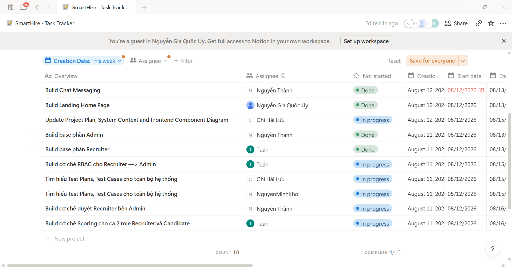
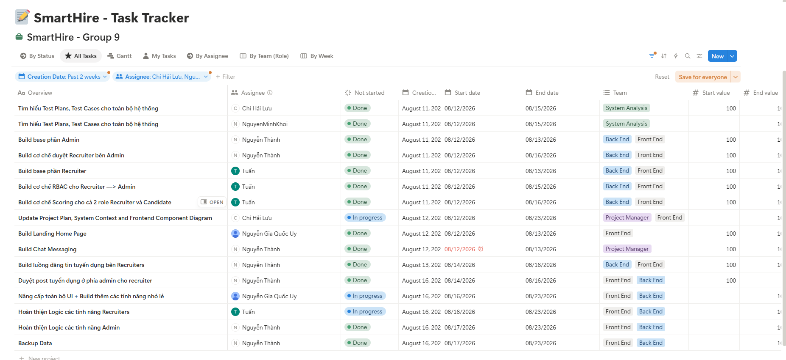
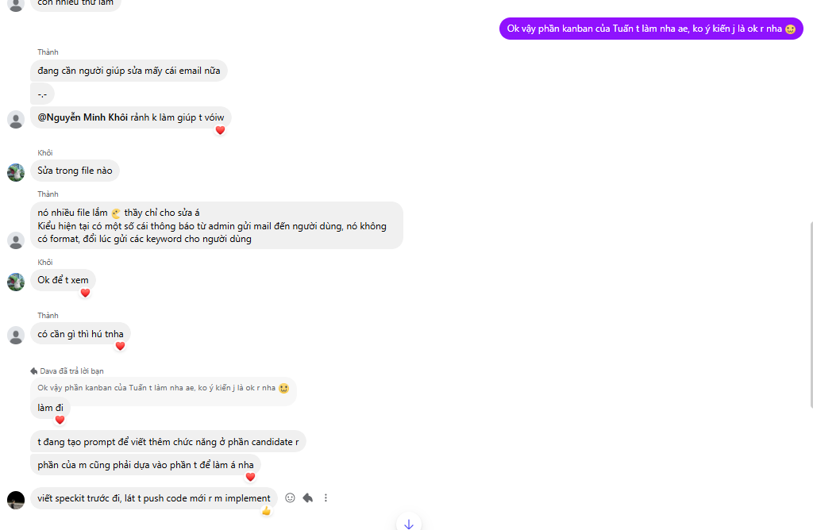

# =============09/08, Sprint 5=============

## 1. Attendance

*Performed by: Lưu Chí Hải | Reviewed by: Nguyễn Gia Quốc Uy | Edited by: Lưu Chí Hải*
**Team members present:**

* Nguyễn Gia Quốc Uy
* Nguyễn Quốc Thành
* Ngô Quốc Tuấn
* Lưu Chí Hải
* Nguyễn Minh Khôi

**Team members absent:**

* None

---

## 2. Status Reports

*Performed by: Lưu Chí Hải | Reviewed by: Nguyễn Gia Quốc Uy | Edited by: Lưu Chí Hải*

### Nguyễn Gia Quốc Uy

* **Completed tasks:**

  * Support the Dev Team (2 Feature Groups using Spec-Kit) as a UI Designer.
  * Write the Tech Stack section, Review 5 Diagrams.
  * Write Changes.md, review the entire submission.
  * Write the AI Usage Report following the required format.

* **To-do Tasks:**

  * Build Landing Home Page.
  * Sprint Planning Preparation.
  * UI Utilizing.
  * Generate Specs for the additional feature group related to Notifications and In-App Alerts (Feature Group 9).

* **Issues/Obstacles:**

  * None

### Nguyễn Quốc Thành

* **Completed tasks:**

  * Deploy 1 main Feature Group using Spec-Kit.
  * Test the system, fix bugs, improve UI/UX.
  * Write the AI Usage Report following the required format.

* **To-do Tasks:**

  * Build Chat Messaging.
  * Create the base Admin role (Feature Group 11).
  * Build the Recruiter approval mechanism in Admin.
  * Generate Specs for the feature groups related to Admin functionality (Feature Groups 10 and 11).

* **Issues/Obstacles:**

  * None

### Ngô Quốc Tuấn

* **Completed tasks:**

  * Deploy 1 main Feature Group using Spec-Kit.
  * Execute frontend and backend division for the project.
  * Test the system, fix bugs, improve UI/UX.
  * Record and edit the demo video.
  * Write the AI Usage Report following the required format.

* **To-do Tasks:**

  * Create the base Recruiter role.
  * Generate Specs for the feature groups related to Recruiter functionality (Feature Groups 5, 7, 8, and 12).
  * Build the RBAC mechanism from Recruiter to Admin.
  * Build the Scoring mechanism for both Recruiter and Candidate roles.

* **Issues/Obstacles:**

  * None

### Lưu Chí Hải

* **Completed tasks:**

  * Setup - Test run the system, research existing architecture, and write the weekly report.
  * Research the C4 Model and Diagrams for PA4.
  * Complete the assigned diagrams (System Context, FE).
  * Write the AI Usage Report following the required format.
  * Update Project Plan.

* **To-do Tasks:**

  * Write the PA5 Weekly Report.
  * Research the Test Plans and Test Cases for the entire system.
  * Update Project Plan, System Context and Frontend Component Diagram.

* **Issues/Obstacles:**

  * None

### Nguyễn Minh Khôi

* **Completed tasks:**

  * Setup - Test run the system, research existing architecture.
  * Research the C4 Model and Diagrams for PA4.
  * Complete the assigned diagrams (Container, BE, Deployment).
  * Write the AI Usage Report following the required format.

* **To-do Tasks:**

  * Research the Test Plans and Test Cases for the entire system.
  * Review and understand the testing requirements for the completed features.
  * Update Container, BE and Deployment Diagrams.

* **Issues/Obstacles:**

  * None

---

## 3. Actions & Summary

*Performed by: Lưu Chí Hải | Reviewed by: Nguyễn Gia Quốc Uy | Edited by: Lưu Chí Hải*

**Actions:**

* Thành: Build Chat Messaging, create the base Admin role, build the Recruiter approval mechanism in Admin, and generate Specs for the Admin-related Feature Groups 10 and 11.
* Tuấn: Create the base Recruiter role, build the RBAC mechanism from Recruiter to Admin, build the Scoring mechanism for both Recruiter and Candidate roles, and generate Specs for the Recruiter-related Feature Groups 5, 7, 8, and 12.
* Uy: Build the Landing Home Page, handle Sprint Planning and UI utilization, and generate Specs for the additional Notifications and In-App Alerts Feature Group 9.
* Khôi & Hải: Research the Test Plans and Test Cases for the entire system and prepare for the testing activities required in PA5.
* Hải: Write the Weekly Report and update the Project Plan, System Context, and Frontend Component Diagram.
* Khôi: Update the Container, BE and Deployment diagrams.
* All Members: Continue working on the currently assigned PA5 tasks before proceeding to the final project stage. Detailed task assignments after 15/08 have not yet been finalized.

**Summary of the meeting:**

* The team completed the remaining tasks from the previous project stage and moved into the initial PA5 development phase.
* The current PA5 work plan focuses on role foundations, Spec Kit specification generation, UI preparation, and preparation for the testing phase.
* Thành is responsible for Admin-related development, including Chat Messaging, the Admin base functionality, the Recruiter approval mechanism in Admin, and Admin-related Feature Groups 10 and 11.
* Tuấn is responsible for Recruiter-related development, including the Recruiter base functionality, the RBAC mechanism from Recruiter to Admin, the Scoring mechanism for both Recruiter and Candidate roles, and Recruiter-related Feature Groups 5, 7, 8 and 12.
* Uy is responsible for Sprint Planning, UI utilization, the Landing Home Page, and the additional Notifications and In-App Alerts Feature Group 9.
* Khôi and Hải are responsible for researching the Test Plans and Test Cases for the entire system. Hải is also responsible for preparing the scrum meeting document and updating the Project Plan, System Context, and Frontend Component Diagram, while Khôi is responsible for updating the Container, BE, and Deployment Diagrams.

---

## 4. Task Screenshots

*Performed by: Lưu Chí Hải | Reviewed by: Nguyễn Gia Quốc Uy | Edited by: Lưu Chí Hải*

# =============12/08, Sprint 5=============

## 1. Attendance

*Performed by: Lưu Chí Hải | Reviewed by: Nguyễn Gia Quốc Uy | Edited by: Lưu Chí Hải*
**Team members present:**

* Nguyễn Gia Quốc Uy
* Nguyễn Quốc Thành
* Ngô Quốc Tuấn
* Lưu Chí Hải
* Nguyễn Minh Khôi

**Team members absent:**

* None

---

## 2. Status Reports

*Performed by: Lưu Chí Hải | Reviewed by: Nguyễn Gia Quốc Uy | Edited by: Lưu Chí Hải*

### Nguyễn Gia Quốc Uy

* **Completed tasks:**

  * Build Landing Home Page.
  * Sprint Planning Preparation.
  * UI Utilizing.
  * Generate Specs for the additional feature group related to Notifications and In-App Alerts (Feature Group 9).

* **To-do Tasks:**

  * Upgrade the overall UI and build additional minor features.

* **Issues/Obstacles:**

  * None

### Nguyễn Quốc Thành

* **Completed tasks:**

  * Build Chat Messaging.
  * Create the base Admin role (Feature Group 11).
  * Build the Recruiter approval mechanism in Admin.
  * Generate Specs for the feature groups related to Admin functionality (Feature Groups 10 and 11).

* **To-do Tasks:**

  * Build the job-posting flow for Recruiters.
  * Build the Admin-side approval flow for Recruiter job posts.
  * Complete the logic for Admin features.
  * Backup data.

* **Issues/Obstacles:**

  * None

### Ngô Quốc Tuấn

* **Completed tasks:**

  * Create the base Recruiter role.
  * Generate Specs for the feature groups related to Recruiter functionality (Feature Groups 5, 7, and 12).
  * Build the RBAC mechanism from Recruiter to Admin.
  * Build the Scoring mechanism for both Recruiter and Candidate roles.

* **To-do Tasks:**

  * Complete the logic for Recruiter features.

* **Issues/Obstacles:**

  * None

### Lưu Chí Hải

* **Completed tasks:**

  * Write the PA5 Weekly Report.
  * Research the Test Plans and Test Cases for the entire system.

* **To-do Tasks:**

  * Update Project Plan, System Context and Frontend Component Diagram.
  * Generate Specs for Feature Group 8 – Kanban.

* **Issues/Obstacles:**

  * None

### Nguyễn Minh Khôi

* **Completed tasks:**

  * Research the Test Plans and Test Cases for the entire system.
  * Review and understand the testing requirements for the completed features.

* **To-do Tasks:**

  * Update Container, BE and Deployment Diagrams.
  * Assist in reviewing and fixing Admin notification emails that have missing formatting or expose raw keywords to users.

* **Issues/Obstacles:**

  * None

---

## 3. Actions & Summary

*Performed by: Lưu Chí Hải | Reviewed by: Nguyễn Gia Quốc Uy | Edited by: Lưu Chí Hải*

**Actions:**

* Uy: Upgrade the overall UI and build additional minor features.
* Thành: Build the Recruiter job-posting flow and its Admin-side approval flow, complete the Admin feature logic, and back up data.
* Tuấn: Complete the Recruiter feature logic, following his completed Recruiter Spec-Kit work for Feature Groups 5, 7, and 12.
* Hải: Complete the PA5 report-related work, continue updating the Project Plan, System Context, and Frontend Component Diagram, and generate Specs for Feature Group 8 – Kanban.
* Khôi: Continue testing-related work, update the Container, BE and Deployment Diagrams, and assist Thành in reviewing and fixing Admin notification email formatting and content issues.
* All Members: Continue with the new Recruiter, Admin, UI, Spec-Kit, documentation, and testing assignments for PA5.

**Summary of the meeting:**

* The team completed the previous set of initial PA5 tasks, except for Hải's Project Plan, System Context, and Frontend Component Diagram update, which remains unfinished because it depends on further implementation progress.
* Development is moving toward additional Recruiter and Admin functionality and completion of the overall UI, with the new Recruiter, Admin, and UI tasks now forming the next work set.
* Thành will build the Recruiter job-posting flow and its Admin-side approval flow, complete the Admin feature logic, and back up data, while Uy will upgrade the overall UI and build additional minor features.
* Tuấn completed the Recruiter Spec-Kit work for Feature Groups 5, 7, and 12 and will complete the Recruiter feature logic. His responsibility for Feature Group 8 – Kanban was transferred to Hải.
* Hải completed the PA5 Weekly Report and test-plan research, will generate Specs for Feature Group 8 – Kanban, and will continue the unfinished Project Plan, System Context, and Frontend Component Diagram update when implementation has progressed sufficiently.
* Khôi completed the assigned test-plan research and testing-requirement review, and will continue updating the Container, BE, and Deployment Diagrams while also assisting Thành in reviewing and fixing formatting and content issues in Admin notification emails.

---

## 4. Task Screenshots

*Performed by: Lưu Chí Hải | Reviewed by: Nguyễn Gia Quốc Uy | Edited by: Lưu Chí Hải*

