# LinkedIn Platform Research Report

**Author:** Nguyễn Quốc Thành
**Student ID:** 24127542
**Objective:** To comprehensively analyze LinkedIn: interface, features, strengths/weaknesses, serving the development of a next-generation professional social networking platform.

## Table of Contents

1. [Platform Overview](#1-platform-overview)
2. [Design System & Visual Language](#2-design-system--visual-language)
3. [User Interface (UI) Analysis](#3-user-interface-ui-analysis)
4. [Accessibility & Responsive](#4-accessibility--responsive)
5. [Performance UX](#5-performance-ux)
6. [Core Features](#6-core-features)
7. [AI & Premium](#7-ai--premium)
8. [SEO & Discoverability](#8-seo--discoverability)
9. [Strengths & Weaknesses](#9-strengths--weaknesses)
10. [Competitive Analysis](#10-competitive-analysis)
11. [Improvement Opportunities](#11-improvement-opportunities)
12. [Conclusion](#12-conclusion)

## 1. Platform Overview

### 1.1 Brief Introduction

LinkedIn is the world’s largest professional social networking platform, focusing on building professional identity, professional connections, job searching, recruitment, skill learning, and personal/corporate brand development. Unlike general social networks such as Facebook, Instagram, or X/Twitter, LinkedIn positions itself as an ecosystem serving users’ professional lives, where personal profiles act as online CVs, while connection networks reflect real-world professional relationships.

The platform was founded in 2003 and is currently owned by Microsoft after its acquisition in 2016. LinkedIn not only serves job seekers but is also an important tool for recruiters, businesses, sales professionals, marketers, professional creators, and training organizations. Thanks to its large amount of data on personal profiles, skills, companies, job positions, and professional behavior, LinkedIn has become one of the most important platforms in the field of professional networking and the talent marketplace.

From a product perspective, LinkedIn can be seen as a combination of multiple types of platforms:

- **Professional Social Network:** connecting and interacting with people in the industry.
- **Online Resume / Career Profile:** building an online professional profile.
- **Job Marketplace:** searching, posting, and applying for jobs.
- **Recruitment Platform:** supporting recruiters in searching for and evaluating candidates.
- **Learning Platform:** providing courses through LinkedIn Learning.
- **Content & Creator Platform:** allowing the sharing of posts, newsletters, videos, events, and professional content.
- **B2B Business Platform:** supporting advertising, sales, recruitment, and corporate brand building.

### 1.2 LinkedIn’s Role in the Professional Ecosystem

LinkedIn plays the role of a “professional operating system” for the digital labor market. Users can create professional profiles, build connection networks, follow companies, search for jobs, learn new skills, and share expertise. Businesses can use LinkedIn for recruitment, employer branding, B2B advertising, and reaching potential customers.

LinkedIn’s major differentiating point lies in its highly interconnected professional data system among users, skills, companies, industries, schools, content, and job opportunities. As a result, LinkedIn is not only a place to display professional information but also a platform that recommends opportunities, connections, and content based on user behavior and profile data.

### 1.3 Main User Groups

| User Group                   | Main Objective                                    | Commonly Used Features                     |
| ---------------------------- | ------------------------------------------------- | ------------------------------------------ |
| Students / Interns           | Build profiles, find internships, learn skills    | Profile, Jobs, Learning, Network           |
| Job Seekers                  | Find jobs, apply, optimize profiles               | Jobs, Easy Apply, Resume tools, Job alerts |
| Working Professionals        | Networking, industry updates, personal branding   | Feed, Posts, Articles, Messaging, Profile  |
| Recruiters                   | Search, screen, and contact candidates            | LinkedIn Recruiter, Job Posting, InMail    |
| Businesses                   | Recruitment, brand promotion, B2B marketing       | Company Page, Ads, Talent Solutions        |
| Creators / Thought Leaders   | Share knowledge, build professional communities   | Posts, Articles, Newsletter, Events        |
| Sales / Business Development | Find potential customers, build B2B relationships | Sales Navigator, Search, Messaging         |

### 1.4 Key Metrics

| Metric                       | Reference Value                                                                                      |
| ---------------------------- | ---------------------------------------------------------------------------------------------------- |
| Platform type                | Professional social network / Professional networking platform                                       |
| Year founded                 | 2003                                                                                                 |
| Parent company               | Microsoft                                                                                            |
| User scale                   | More than 1 billion members globally                                                                 |
| Operating scope              | More than 200 countries and territories                                                              |
| LinkedIn revenue             | Grew 12% year-over-year in Q3 FY26                                                                   |
| Main product areas           | Networking, Jobs, Recruiting, Learning, Marketing, Sales                                             |
| Enterprise customer segments | Recruiters, B2B companies, training organizations, sales/marketing teams                             |
| Notable features             | Profile, Feed, Jobs, Easy Apply, InMail, Company Page, LinkedIn Learning, Recruiter, Sales Navigator |
| Recent development trend     | Integrating AI into search, recruitment, profile optimization, messaging, and job recommendations    |

### 1.5 Core Value Model

LinkedIn’s core value comes from connecting three main elements: **people, skills, and career opportunities**.

```text
Users
   ↓
Professional profile
   ↓
Skills & experience
   ↓
Connection network
   ↓
Professional content
   ↓
Job / recruitment / learning opportunities
```

This loop helps LinkedIn maintain a strong network effect. The more users update their profiles and build connections, the richer the professional data becomes. The richer the data is, the more accurate the recommendations for jobs, candidates, content, and courses become. This continues to attract more individual users, recruiters, and businesses to the platform.

### 1.6 Summary of Findings

LinkedIn is currently not merely a job-search website or a simple professional social network, but a comprehensive ecosystem for digital professional activities. The platform combines personal profiles, relationship networks, professional content, recruitment, learning, and business tools. This combination creates a major competitive advantage for LinkedIn compared with general social networking platforms or traditional job boards.

## 2. Design System & Visual Language

### 2.1 Overview of Design Style

LinkedIn uses a minimalist, professional, and function-oriented design style. The platform’s interface prioritizes readability, quick information scanning, and familiarity in interaction rather than visual decoration. This aligns with LinkedIn’s positioning as a professional social networking platform, where users mainly perform tasks such as updating profiles, searching for jobs, reading professional content, messaging, and connecting with others.

LinkedIn’s visual language has several notable characteristics:

- It uses a lot of white and light gray backgrounds to create a clean and neutral feeling.
- Blue serves as the brand identity color and as a guide for primary actions.
- Card-based layouts are used consistently across the feed, profile, jobs, network, and notifications.
- Typography is clear, has few variations, and prioritizes readability for long-form content.
- Icons combined with labels help users recognize functions more quickly.
- The interface has a high information density, especially on desktop.

Overall, LinkedIn’s design system aims for trustworthiness, professionalism, and efficiency, but it can sometimes feel dry, dense, and lacking in personalization.

### 2.2 Typography

LinkedIn uses a typography system based on system fonts such as `system-ui`, `-apple-system`, `BlinkMacSystemFont`, `Segoe UI`, `Roboto`, or equivalent fonts depending on the device. Using system fonts helps the interface load faster, display consistently across multiple operating systems, and feel familiar to users.

| Text level     | Reference size | Weight | Application                                        |
| -------------- | -------------: | -----: | -------------------------------------------------- |
| Display        |           32px |    700 | Large titles, landing pages, introduction pages    |
| Heading 1      |           24px |    700 | User name on profile, page title                   |
| Heading 2      |           20px |    600 | Section titles such as Experience, Education, Jobs |
| Heading 3      |           16px |    600 | Card title, job title, company name                |
| Body           |           14px |    400 | Main content, descriptions, posts                  |
| Caption / Meta |           12px |    400 | Posting time, secondary description, sub-labels    |
| Micro text     |        10–11px |    400 | Small badges, tooltips, secondary metadata         |

#### Evaluation

LinkedIn’s typography has the advantage of being clear, readable, and consistent across most screens. The 14px body text size is suitable for content-heavy interfaces such as feeds, job cards, and profiles. However, some caption or metadata text uses small size and light gray color, which can reduce readability, especially for users with low vision or when using screens with low brightness.

#### Issues Identified

- Some 12px captions on light gray backgrounds do not have truly strong contrast.
- Line-height across feed posts, job cards, and article views is not completely consistent.
- The text-heavy interface can easily overwhelm users on screens such as Feed, Jobs, and Notifications.

### 2.3 Color System

LinkedIn’s color palette is quite limited and focuses on neutral tones. Blue is the main brand color and is used for links, primary CTAs, active icons, and important interaction states.

| Token              | Color code | Usage role                                        |
| ------------------ | ---------- | ------------------------------------------------- |
| Primary Blue       | `#0A66C2`  | Primary CTA, link, active icon                    |
| Primary Blue Hover | `#004182`  | Hover state for buttons/links                     |
| Background White   | `#FFFFFF`  | Main page background                              |
| Background Subtle  | `#F3F2EE`  | Secondary background, sidebar, area outside cards |
| Text Primary       | `#000000`  | Titles, main content                              |
| Text Secondary     | `#666666`  | Captions, metadata, secondary descriptions        |
| Text Disabled      | `#999999`  | Placeholder, disabled state                       |
| Border             | `#E0DFDC`  | Divider, card border, separation line             |
| Success Green      | `#057642`  | Positive status badges such as “Hiring”           |
| Warning Amber      | `#B24020`  | Warning, error, required reminders                |
| Premium Gold       | `#915907`  | Premium badge, paid plan icon                     |

#### Evaluation

LinkedIn’s color system creates a professional, stable, and easily recognizable brand feeling. The blue color `#0A66C2` has strong recognizability and is used consistently for primary actions. White, gray, and black tones help the interface remain neutral, which is suitable for a professional context.

However, because the interface uses many white and light gray backgrounds, it can sometimes lack visual depth. Some secondary elements such as placeholders, metadata, and sidebar text have insufficient contrast, affecting accessibility.

#### Issues Identified

- LinkedIn web does not have dark mode, which is inconvenient for users working for long periods at night.
- Some secondary text colors such as `#999999` have low contrast on white backgrounds.
- Premium Gold meets the minimum contrast level but does not have much margin.
- The interface relies heavily on blue to indicate active states or CTAs.

### 2.4 Spacing & Grid System

LinkedIn tends to use a spacing system based on an 8px grid. Common spacing values include 4px, 8px, 12px, 16px, 24px, 32px, and 48px. This structure gives the interface a clear visual rhythm and makes it easier to scale across multiple screens.

| Value | Common role                                           |
| ----: | ----------------------------------------------------- |
|   4px | Small gap between icon and label                      |
|   8px | Small gap between metadata, badge, or inline elements |
|  12px | Padding inside small cards or chips                   |
|  16px | Standard card padding, spacing between lines          |
|  24px | Spacing between sections                              |
|  32px | Large margin, header area padding                     |
| 48px+ | Large whitespace in profile header or landing section |

#### Evaluation

Using grid-based spacing helps LinkedIn maintain consistency across most components. Cards in the feed, jobs, and profile sections have relatively stable spacing, helping users easily distinguish each content block.

However, because LinkedIn has many types of cards and sidebars, spacing is sometimes not fully consistent across screens. Some areas such as the right sidebar, job recommendations, and feed posts have high information density, reducing the sense of openness and forcing users to process too much information at once.

#### Issues Identified

- Some widgets in the right sidebar are not fully aligned consistently across breakpoints.
- Feed posts have different padding between text-only posts and posts with media.
- The Jobs page has many consecutive cards, easily creating a dense feeling.
- Some areas lack enough whitespace to create clearer content hierarchy.

### 2.5 Component System

LinkedIn uses many card, button, chip, modal, dropdown, tab, and carousel components. These components appear repeatedly across many screens, helping users quickly understand how to interact with the platform.

#### Button System

| Button type | Characteristics                        | Application                              |
| ----------- | -------------------------------------- | ---------------------------------------- |
| Primary     | Blue background, white text            | Main CTAs such as Connect, Apply, Post   |
| Secondary   | Blue border, blue text                 | Follow, Save, Add section                |
| Ghost       | No border, blue or gray text/icon      | More, Share, Comment, supporting actions |
| Danger      | Red text or red border                 | Remove, Unfollow, Report                 |
| Disabled    | Light gray background, non-interactive | Button not eligible for action           |

#### Card System

LinkedIn uses cards in most important areas:

- Feed post card
- Profile section card
- Job card
- Company card
- People suggestion card
- Notification card
- Message preview card
- Learning course card

#### Evaluation

Card-based layouts help LinkedIn organize large amounts of information into separate blocks. Users can quickly scan titles, metadata, and primary actions within each card. This is a suitable choice for a platform with many content types like LinkedIn.

However, the card system is not completely uniform. Some cards have different border-radius, spacing, CTAs, and metadata depending on the context. This does not create a serious usability issue, but it reduces the consistency of the design system.

#### Issues Identified

- Secondary and Ghost buttons are sometimes used inconsistently across screens.
- Badges such as Premium, Open to Work, and Hiring have different sizes and positions depending on the context.
- Job cards, post cards, and profile cards have significantly different structures, increasing cognitive load.
- Some icon-only buttons do not have clear labels, affecting accessibility.

### 2.6 Icon System

LinkedIn uses its own icon system, with a simple line-art style, thin strokes, and easy recognizability. Icons are often combined with labels in the main navigation bar, reducing reliance on users’ ability to memorize symbols.

| Icon size | Application                    |
| --------: | ------------------------------ |
|   24×24px | Navigation bar, main actions   |
|   20×20px | Secondary buttons, toolbar     |
|   16×16px | Inline icons, metadata, badges |

#### Evaluation

LinkedIn’s icon system is quite consistent in the navigation bar. Active icons usually use a filled style, while inactive icons use an outline style. This approach helps users easily recognize the current state.

However, in areas such as the feed action bar, messaging, and card menus, some icons do not have clear meanings when standing alone. In particular, the “More options” icon appears in many positions but opens different actions, which can cause confusion in the mental model.

#### Issues Identified

- Icons on mobile and desktop sometimes have inconsistent sizes.
- Some icon-only actions lack clear labels or tooltips.
- The three-dot icon appears too frequently with different action contexts.
- New users may not immediately understand some icons without accompanying text.

### 2.7 Motion & Micro-interactions

LinkedIn uses animation at a moderate level, mainly to respond to user actions. Common effects include hover, fade, slight scale, reaction picker, skeleton loading, and modal transition.

| Interaction        | Current behavior                        | Evaluation |
| ------------------ | --------------------------------------- | ---------- |
| Like button        | Icon changes state with light feedback  | Good       |
| Reaction picker    | Appears on hover with slight motion     | Good       |
| Modal open/close   | Fade in/out                             | Average    |
| Dropdown menu      | Appears quickly with little animation   | Acceptable |
| Skeleton loading   | Shimmer effect while content is loading | Good       |
| Page transition    | Almost no animation                     | Weak       |
| Notification badge | Updates instantly                       | Simple     |

#### Evaluation

LinkedIn’s motion is not particularly prominent but is sufficient to support basic interaction feedback. The restrained use of animation suits the professional nature of the platform. Skeleton loading is a strong point because it helps users visualize the content structure while waiting for loading.

However, some page transitions still feel quite rigid and lack a seamless experience. Modal and dropdown animations are simple and do not feel as smooth as those on more modern social platforms.

#### Issues Identified

- Page transitions are almost absent, creating a rigid loading feeling.
- Modals only use simple fade effects and do not create a natural sense of motion.
- Clear support for `prefers-reduced-motion` is not evident.
- Some feedback states, such as upload errors or expired sessions, are not prominent enough.

### 2.8 Visual Hierarchy

LinkedIn uses visual hierarchy based on font size, font weight, color, position, and card density. Important information such as user names, job titles, companies, CTAs, and new notifications is usually placed in easily noticeable positions.

#### Strengths

- Titles and primary CTAs are usually prominent.
- Card layout helps separate each content block.
- Main navigation is clear, with both icons and labels.
- The profile header has good hierarchy among name, headline, location, and CTAs.

#### Limitations

- The feed contains too many mixed content types, reducing users’ ability to focus.
- The right sidebar contains many widgets, competing for attention with the main content.
- Premium prompts, connection suggestions, and advertisements sometimes disrupt the hierarchy system.
- Some screens such as Jobs and Notifications have high text density.

### 2.9 Overall Comments

LinkedIn’s design system is generally stable, professional, and suitable for the product’s goals. The use of simple typography, neutral colors, card-based layouts, and a familiar icon system helps users quickly understand how to use the platform.

However, the major weakness of its visual language lies in high information density, lack of dark mode, some contrast issues, and inconsistency among component variants. When building a next-generation professional social networking platform, one can learn from LinkedIn’s clarity and professionalism, but should improve interface personalization, reduce visual noise, increase accessibility, and create a more consistent component system.

## 3. User Interface (UI) Analysis

### 3.1 Overall Layout

LinkedIn uses a **4-column** layout on desktop, creating a clear content hierarchy:

- **Left column:** Personal profile information and quick links
- **Middle-left column:** Main content feed
- **Middle-right column:** Connection suggestions, industry news, advertisements
- **Right column:** Messaging popup that can be expanded or minimized

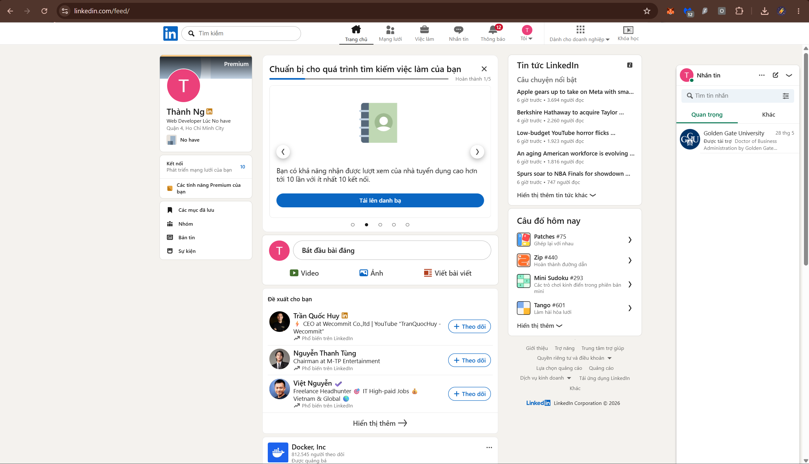

### 3.2 Navigation Bar

Main navigation on desktop:

- **Home:** Post feed
- **My Network:** Manage connections
- **Jobs:** Search and apply for jobs
- **Messaging:** Direct inbox
- **Notifications:** Interaction activities
- **Me:** Profile and settings
- **For Business:** B2B tools
- **Learning:** LinkedIn Learning

### 3.3 Post Creation Interface

LinkedIn supports two types of content posting:

**Regular post** short-form:

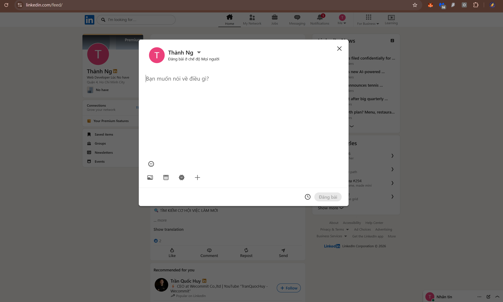

#### Current UI:

- The modal window is centered on the screen, with a dimmed background, focusing attention on the editor.
- It displays the avatar, name, and posting visibility “Anyone” in the header; the close button is clear.
- The editor is minimal, with the placeholder “What do you want to talk about?”.
- The bottom action bar contains icons for emoji, adding photo/video, and adding other content.

#### Existing Functions:

- Select post visibility “Anyone”.
- Enter main text content.
- Add supporting content through the toolbar, such as emoji, media, and other items.
- The “Post” button is disabled when there is no content.

#### UI Development Suggestions:

- Increase the visibility of the “Post” CTA when content is available; add clearer hover/active states.
- Add a draft-saving indicator or auto-save status.
- Display a character/length counter directly in the editor.
- Suggest quick chips for hashtags, tagging people, or popular topics.

#### Suggested Additional Features:

- Preview the post before publishing.
- Schedule posts.
- Quick post templates based on goals: recruitment, project sharing, personal update.
- Quick predicted engagement analysis, for example: “This post may increase engagement if you add an image.”

**Article** long-form article for recruiters or candidates:

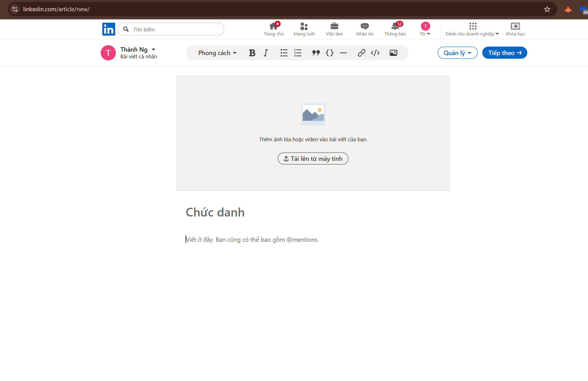

#### Current UI:

- Full-screen editor focused on long-form content, with little visual noise.
- Formatting toolbar at the top, including style, bold, italic, list, quote, code, link, and image.
- Large cover image area placed before the title/article section.
- The “Next” and “Manage” CTAs are located in the top-right corner and are easy to notice.

#### Existing Functions:

- Add a cover image or video for the article.
- Compose long-form article content with basic formatting.
- Insert links, images, code, quotes, and lists.
- Navigate to the next step for publishing.

#### UI Development Suggestions:

- Display an outline or sidebar outline to navigate long-form content.
- Add an auto-save indicator and save status.
- Strengthen the visual hierarchy between the title, opening paragraph, and article body.
- Add short guidance on good article structure, such as title, hook, and CTA.

#### Suggested Additional Features:

- Preview the article in mobile/desktop mode.
- Content quality checker, including title length, hashtag density, and readability.
- Article templates such as case study, tutorial, and project sharing.
- Schedule publishing and suggest the best posting time.

### 3.4 Profile Interface

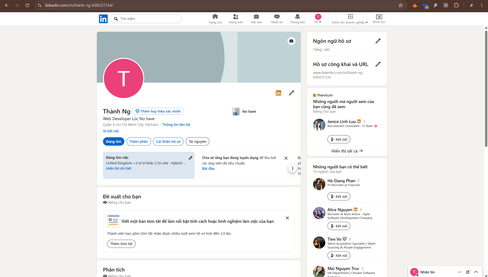

**Layout Overview**
**Current UI:**

- Large header with cover image, avatar, name, headline, location, and contact information.
- Two-column layout: the left column contains main content; the right column contains supporting utilities such as language, public URL, and connection suggestions.
- Main CTAs appear near the header: “Add profile section” and “Enhance profile”.
- There are profile completion suggestion cards such as About and connection suggestions.

**Existing Functions:**

- Update profile content by section using “Add profile section”.
- Enable the “Open to work” status.
- Manage profile language and public URL.
- Display suggestions for profile completion and connections.

**UI Development Suggestions:**

- Move the “About”/summary section to a more visible position above the fold.
- Clarify the CTA hierarchy between primary and secondary actions to reduce visual noise.
- Make the profile completion level more intuitive with a clearer progress indicator.
- Reduce the density of suggestion cards in the right column and prioritize main content.

**Suggested Additional Features:**

- Preview the profile from a recruiter’s perspective.
- Suggest “Featured” content based on high-performing posts or projects.
- Export the profile to a standardized CV/PDF template.
- Customize the display order of profile sections.

### 3.5 Jobs Interface

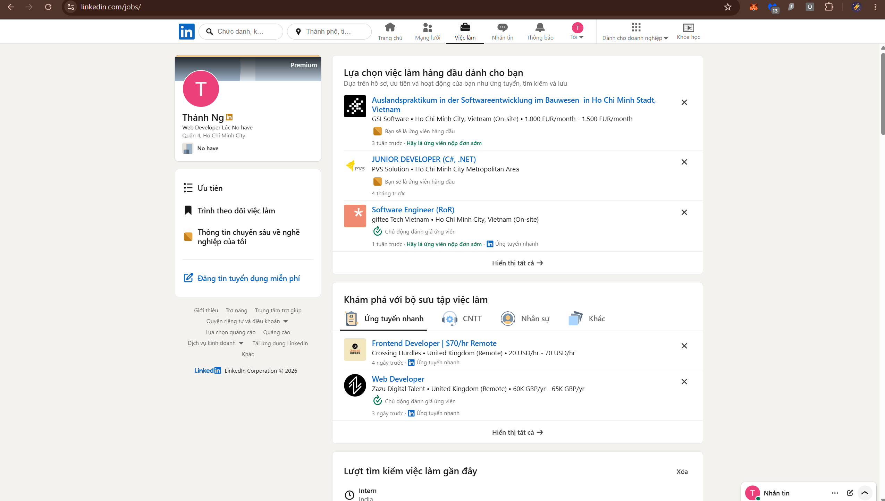

**Current UI:**

- Two-column layout: the left side contains a shortened profile and Jobs menu; the right side contains suggestion blocks and job lists.
- The “Top job picks for you” block displays job cards including title, company, location, work type, salary if available, and posting time.
- The “Job collections” block uses tabs such as Easy Apply, IT, Human Resources, and Others for quick filtering.
- The “Recent job searches” block displays search history as a list.
- The “Explore companies hiring for your skills” block uses a carousel with navigation buttons.
- Recommendation groups include “More likely to get a response” and “More jobs for you.”

**Existing Functions:**

- Personalized job recommendations based on profile and behavior.
- Easy Apply and the ability to hide unsuitable jobs.
- Group jobs by category for quick browsing.
- Save and display recent search history.
- Browse hiring companies in a carousel format.

**UI Development Suggestions:**

- Add floating filter chips at the top of the list to reduce noise while scrolling.
- Clarify important badges such as Remote, Salary, and Easy Apply with consistent labels/colors.
- Display the “reason for recommendation” directly on the card, such as match score or matching skills.
- Allow each recommendation block to be collapsed/expanded to reduce overload.
- Strengthen the visual hierarchy of the main CTA and reduce text density on cards.

**Suggested Additional Features:**

- Job alerts by keyword/location/salary range.
- Compare 2–3 jobs by skills, salary, and location.
- Suggest profile optimization for each job, such as skill gaps.
- Dashboard to track application status across multiple channels.
- Schedule applications or follow-up reminders.

### 3.6 Messaging Interface

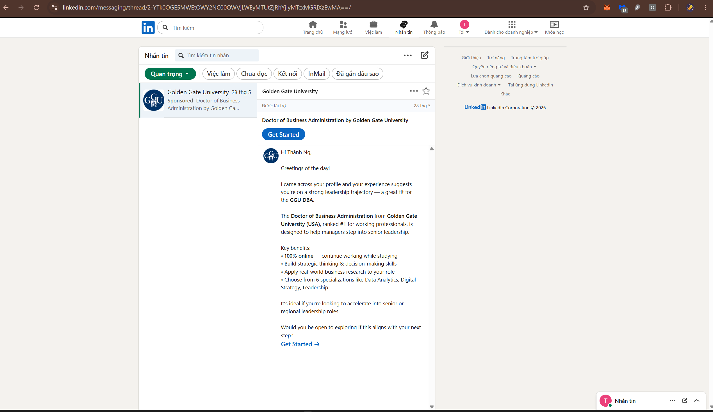

#### Current UI:

- **Two-column layout:** the left side is the conversation list + filters; the right side is the detailed chat content.
- Tab/chip-style filters include Important, Jobs, Unread, Connections, InMail, and Starred.
- The chat panel displays the conversation title, star/options, and card-style content such as ads/messages.
  The message composer is located at the bottom of the panel but is not visible in the image due to scrolling.

#### Existing Functions:

- Search messages by keyword.
- Filter conversations by status/group.
- Star priority conversations and manage conversations.
- Display sponsored/advertising content within the messaging stream.

#### UI Development Suggestions:

- Clearly separate “Ads” from regular conversations using a label or separate area.
- Highlight unread conversations with stronger color contrast.
- Display clearer previews, including a short summary and time, in the left list.
- Add sender information such as role and company directly in the header.

#### Suggested Additional Features:

- Pin important conversations to the top of the list.
- Filters by company/industry/location in messaging.
- “Focus” mode to hide ads and low-priority conversations.
- Automatic follow-up reminders based on time.

### 3.7 Network Interface

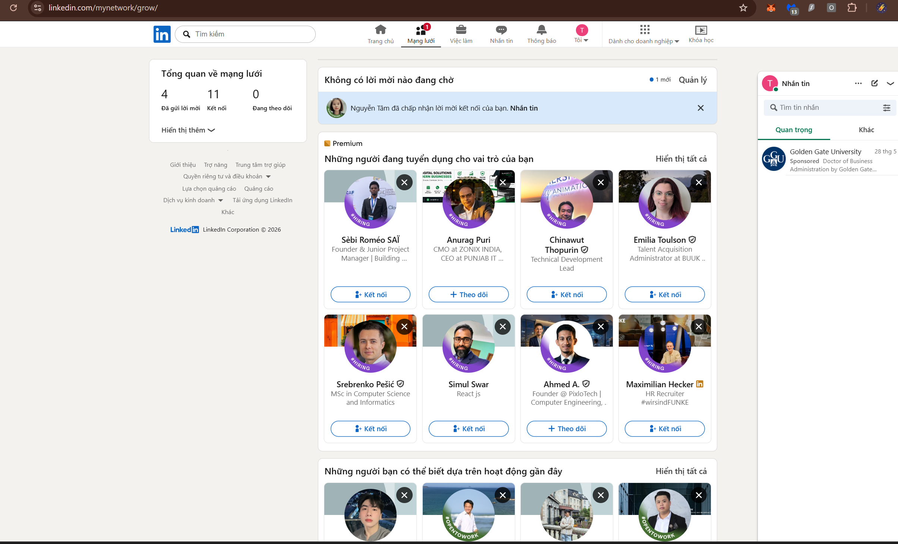

#### Current UI:

- **Two-column layout:** the left side shows the network overview, including number of invitations, connections, and follows; the right side contains connection suggestion blocks.
- The main block “People hiring for your role” uses a grid of cards with avatar, job title, and “Connect/Follow” CTA.
- There are “People you may know” blocks based on recent activities.
- Floating messaging panel in the bottom-right corner for quick access.

#### Existing Functions:

- Display network overview metrics and management shortcuts.
- Suggest connections based on role/industry and recent activities.
- Quick actions: Connect, Follow, Hide suggestion.
- View more suggestion lists using “Show all”.

#### UI Development Suggestions:

- Add floating filter chips by industry, region, and seniority to reduce noise.
- Strengthen visual hierarchy for important suggestion groups, such as recruiters or same-company connections.
- Display short recommendation reasons directly on cards, for example: same industry or same school.
- Reduce card density with more breathing space/line spacing for easier scanning.

#### Suggested Additional Features:

- “Find people by goal” mode, such as mentor, recruiter, or co-founder.
- Priority connection list with follow-up reminders.
- Warm intro suggestions through second-degree connections.
- Mark as “contacted” and track response status.

### 3.8 Notifications Interface


#### Current UI:

- Two-column layout: the left side contains a shortened profile and notification settings; the right side is a feed-style notification list.
- Chip-style filters include All, Jobs, My Posts, and Mentions.
- Notification cards include an icon/image, short description, time, and options menu.
- There is an app-installation suggestion banner at the top of the list.

#### Existing Functions:

- Filter notifications by group.
- Quick access to notification settings.
- Display notifications chronologically, with CTAs such as “View jobs”.
- Options for individual notifications through the menu.

#### UI Development Suggestions:

- Clearly separate system/recommendation/advertising notifications from personal notifications.
- Highlight unread notifications with a background color or clearer label.
- Shorten card length to improve quick scanning.
- Prioritize important notification groups at the top using weights.

#### Suggested Additional Features:

Allow grouping by source, such as Jobs, Network, and System.
“Mute” by notification type or keyword.
Daily/weekly notification summaries.
Focus mode that only shows important notifications.

### 3.9 Business Interface and Features

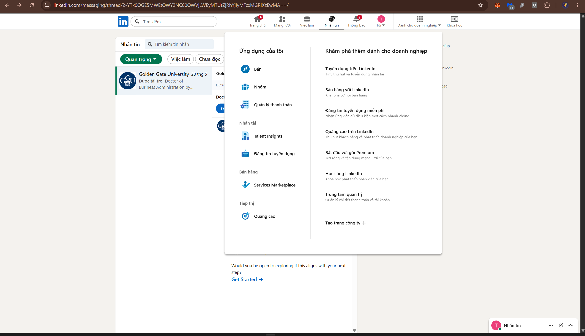

#### Current UI:

- Two-column mega-menu dropdown, divided into “My Apps” and “Explore more for business”.
- Uses icons + labels, grouped by function such as sales, talent, marketing, and administration.
- List-style layout that is easy to scan quickly with little visual noise.

#### Existing Functions:

- Quick access to main modules such as Recruiting, Sales, Ads, and Talent Insights.
- Links to business services and administration pages.
- Create new items such as creating a company page from the menu.

#### UI Development Suggestions:

- Add consistent short descriptions under each item, one line each, to reduce ambiguity.
- Clarify group hierarchy using bold headings or larger spacing.
- Display “role-based suggestions” such as Recruiter/Sales/Marketing to shorten selection time.

#### Suggested Additional Features:

- Quick search inside the business menu.
- Pin frequently used items to the top.
- Suggest suitable tools based on recent behavior/needs.

### 3.10 Recruiter Post Editing and Publishing Interface

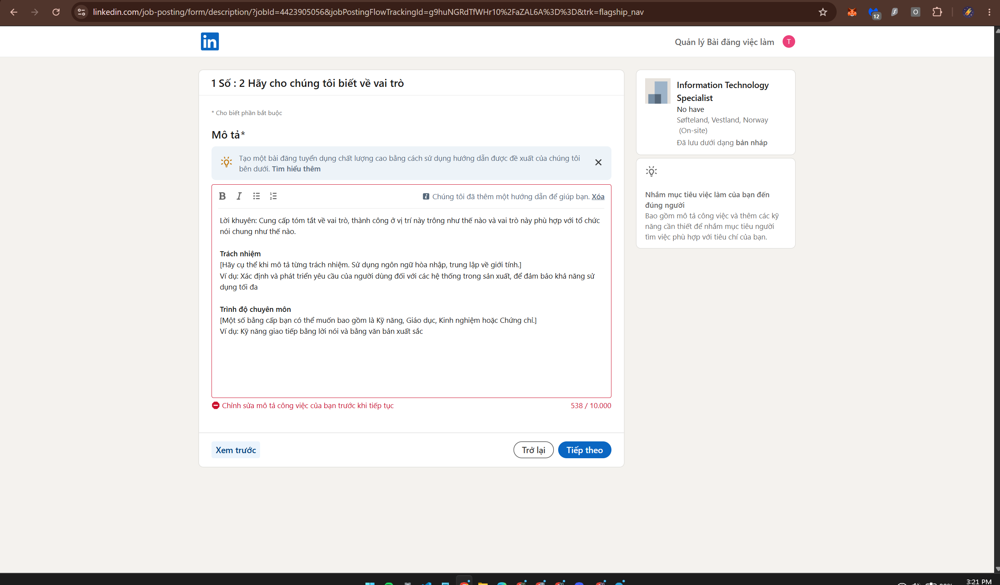

#### Current UI:

- **Two-column layout:** the left side is the content input form; the right side is a summary and suggestion panel.
- Multi-step form with a clear stepper, focusing on the “Description” field.
- The editor has a basic toolbar for text formatting and lists.
- CTAs are placed at the bottom of the form: “Preview”, “Back”, and “Next”.

#### Existing Functions:

- Enter job descriptions based on suggested structures such as responsibilities, requirements, and skills.
- Display warnings/required conditions before continuing.
- Preview the content before posting.
- Suggest optimized content in the right-side panel.

#### UI Development Suggestions:

- Increase the visibility of the current step and overall progress.
- Display a content quality checklist next to the input field.
- Make the suggestion section collapsible to reduce scroll height.
- Clarify error/missing-content states with consistent colors and icons.

#### Suggested Additional Features:

- Description templates by industry/role.
- AI suggestions for wording based on recruitment goals.
- JD attractiveness analysis, such as length and neutral language.
- Save draft versions and compare changes.

### 3.11 Candidate Filtering by Quiz Interface

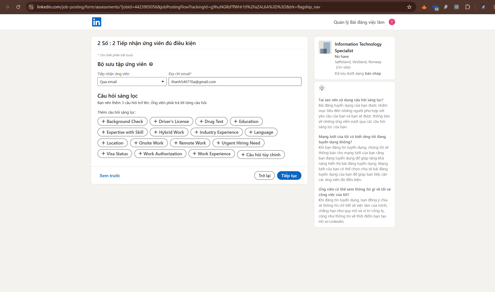

#### Current UI:

- Two-column layout: the left side is the filtering configuration form; the right side is a summary and guidance panel.
- Resume-receiving field + receiving email are placed at the top as required fields.
- Screening questions are displayed as quick-select chips, with “Custom questions”.
- Clear CTAs at the bottom: “Preview”, “Back”, and “Continue”.

#### Existing Functions:

- Select resume-receiving channel and email address.
- Add screening questions by group, such as skills, experience, location, authorization, etc.
- Require candidates to answer selected questions.
- Preview before moving to the next step.

#### UI Development Suggestions:

- Add a search bar for the question set when the list is long.
- Display the number of selected questions and the screening “difficulty”.
- Group chips by purpose, such as required/preferred, for easier classification.
- Clarify the “missing required information” warning near the CTA.

#### Suggested Additional Features:

- Conditional screening logic, such as IF/ELSE.
- Automatic scoring based on answers.
- Save question sets as templates for reuse.
- Suggest questions by role/level, such as Junior/Senior/Manager.

### 3.12 Search Interface

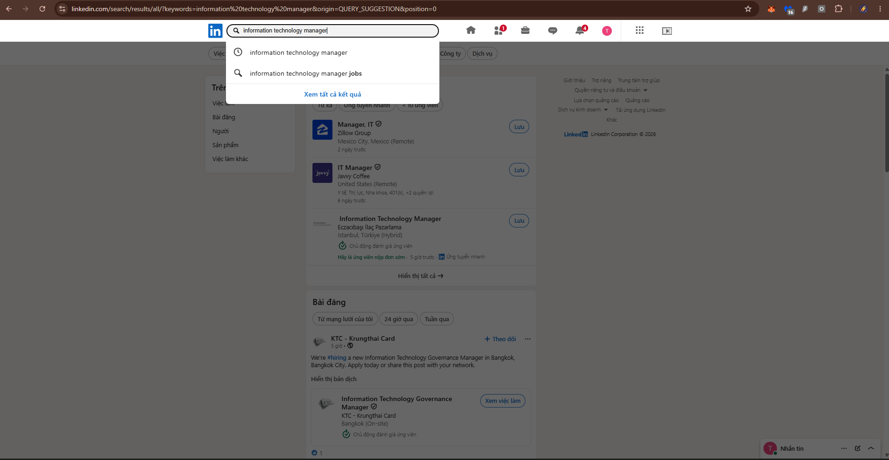

#### Current UI:

- The search bar is fixed on the navigation bar and is always visible on every page.
- When focusing on the search bar, a dropdown appears with **Recent searches** and **Suggested searches** based on context.
- Search results are divided into tabs: **All / People / Jobs / Posts / Companies / Schools / Groups / Events**.
- Advanced filters such as Connections, Location, Industry, etc. are located below the tab bar as dropdowns.
- **Conversational Search** (AI, 2025): allows users to search using natural language, such as _"Frontend engineer in Hanoi with React experience"_.

#### Existing Functions:

- Autocomplete by person name, company, and job title.
- Recent search history.
- Filters combining multiple criteria.
- Conversational Search using natural language (AI).
- Save searches as Job Alerts.

#### UX Issues:

- “All” results mix many different types, making them difficult to scan quickly.
- Advanced filters are hidden too deeply, so new users may not know they exist.
- There are no clear **sort options** such as newest / most relevant in some tabs.
- Conversational Search works well mainly in English, while Vietnamese support is still limited.

#### Improvement Suggestions:

- Make important filters such as Location and Connection degree visible by default.
- Add clear sorting options: Relevance / Most Recent / Most Engaged.
- Improve NLP for local languages in Conversational Search.

## 4. Accessibility & Responsive

### 4.1 Overview

Accessibility and responsive design are two important factors for a large-scale platform like LinkedIn. With a diverse user base in terms of age, device, visual ability, motor ability, and usage context, LinkedIn needs to ensure that its interface remains accessible under many different conditions.

Overall, LinkedIn meets the basic requirements fairly well, such as clear navigation, understandable card structures, responsive support across multiple screen sizes, and some suitable loading states. However, the platform still has several issues related to contrast, touch target size, keyboard navigation, screen readers, and visibility when the interface is zoomed in.

## 4.2 Accessibility Analysis

### 4.2.1 Color Contrast

LinkedIn uses white and light gray backgrounds as its main background colors, combined with black, gray, and blue text. This color combination creates a professional and clean feeling, but some secondary elements do not have optimal contrast.

| Component                 | Foreground             | Background         | Evaluation                                                     |
| ------------------------- | ---------------------- | ------------------ | -------------------------------------------------------------- |
| Main body text            | `#000000`              | `#FFFFFF`          | Good, easy to read                                             |
| Secondary / metadata text | `#666666`              | `#FFFFFF`          | Meets the basic level but is not truly prominent               |
| Input placeholder         | `#999999`              | `#FFFFFF`          | Low contrast, difficult to read for users with low vision      |
| Sidebar text              | `#666666`              | `#F3F2EE`          | Not optimally contrasted                                       |
| Blue link / CTA           | `#0A66C2`              | `#FFFFFF`          | Good recognizability but should still be checked in all states |
| Status badges             | White / green / yellow | Colored background | Some badges have just enough contrast, with little margin      |

#### Issues Identified

- Placeholder and metadata colors are too light.
- Some secondary content in the sidebar is difficult to read on a light gray background.
- Active states sometimes rely only on color, without additional icon or text support.
- LinkedIn web does not have dark mode, reducing usability in low-light environments.

#### Improvement Suggestions

- Increase the darkness of secondary text from `#666666` to a darker tone in important areas.
- Limit the use of `#999999` for placeholders or meaningful text.
- Add indicators beyond color for active, unread, online, or selected states.
- Add an official dark mode for the web version.

### 4.2.2 Keyboard Navigation

LinkedIn can be operated with a keyboard in many areas such as the navigation bar, dropdowns, input forms, and modals. However, the keyboard navigation experience is not fully optimized.

#### Strengths

- Users can use the `Tab` key to move through many interactive elements.
- Dropdown menus can be closed with the `Escape` key.
- Forms such as creating posts, posting jobs, and filtering candidates can be filled out using the keyboard.
- Primary CTAs are usually placed in a reasonable tab order.

#### Issues Identified

- Focus indicators in some positions are still faint and difficult to recognize.
- Modals do not always trap focus well; users may be able to tab outside the modal area.
- Some icon-only buttons are difficult to understand when focused by keyboard.
- Infinite scroll in the feed does not have clear landmarks for users to skip long sections.
- Carousels or suggestion lists are not optimized for keyboard interaction.

#### Improvement Suggestions

- Increase the visibility of focus outlines.
- Ensure modals trap focus until users close them.
- Add a clear and easily visible `Skip to main content`.
- Provide keyboard shortcuts for common tasks such as opening search, creating a post, and opening messaging.
- Improve keyboard navigation for carousels, reaction pickers, and secondary menus.

### 4.2.3 Screen Reader Compatibility

LinkedIn has a fairly clear interface structure with many familiar elements such as nav, button, input, list, and card. However, because the platform has many icons, badges, menus, and dynamic content, screen readers may still encounter difficulties in some areas.

#### Strengths

- The main navigation has a relatively clear structure.
- Some images in posts may have alt text.
- Basic forms such as search, post creation, and profile input have relatively understandable labels.
- The profile structure by section helps screen readers read content in grouped blocks.

#### Issues Identified

- Some icon-only buttons lack consistent `aria-label`.
- Notification badges do not always clearly describe the number of unread notifications.
- States such as “active now” or “unread” may only be shown through color or boldness.
- People/company suggestion carousels do not have clear roles and accessible names.
- The reaction picker may be difficult to read if each reaction does not have a complete description.

#### Improvement Suggestions

- Add `aria-label` to all icon-only buttons.
- Use `aria-live` for dynamic notifications such as new messages, new notifications, or upload errors.
- Add alternative text for states such as online, unread, and selected.
- Clearly name carousel areas using `role="region"` and `aria-label`.
- Standardize alt text for media in posts, articles, and company pages.

### 4.2.4 Touch Target Size

On mobile web, some LinkedIn interactive elements are large enough, but many small buttons remain difficult to use, especially for users with large fingers or users with motor difficulties.

| Component                     | Evaluation                                     |
| ----------------------------- | ---------------------------------------------- |
| Bottom navigation icon        | Relatively good, easy to tap                   |
| Feed action buttons           | Slightly small, touch area should be increased |
| Modal close button            | Small, easy to mistap                          |
| Filter chips                  | Slightly low height                            |
| Three-dot / More options icon | Touch area is not always clear                 |
| Reaction picker               | Needs better spacing between reactions         |

#### Improvement Suggestions

- Ensure a minimum touch target size of around 44×44px for main elements.
- Increase padding for icon-only buttons.
- Separate spacing between chips or actions in the toolbar.
- Clarify hover / pressed / selected states on mobile.

### 4.2.5 Form Accessibility

LinkedIn has many important forms such as post creation, profile editing, job posting, screening questions, and job search. These forms are generally clear but still have areas for improvement.

#### Issues Identified

- Some form errors are displayed only through color or short toast messages.
- Placeholder text is sometimes used instead of labels.
- Error messages may disappear too quickly.
- Required fields are not always clearly explained.
- Long forms such as job posting need a clearer checklist or progress indicator.

#### Improvement Suggestions

- Do not use placeholders as the main label.
- Display errors near the related field.
- Keep error messages visible long enough for users to read.
- Add supporting descriptions for complex fields.
- Use a clearer progress indicator for multi-step forms.

## 4.3 Responsive & Cross-device Analysis

### 4.3.1 Breakpoint Behavior

LinkedIn is able to adapt across many screen sizes, from large desktop screens to mobile. However, because the desktop interface contains many columns and widgets, some breakpoints still have issues with information density and layout reflow.

| Screen size | Observed layout                                                                    |
| ----------- | ---------------------------------------------------------------------------------- |
| > 1280px    | Full desktop, multiple columns: profile/sidebar, feed, suggestions/news, messaging |
| 1024–1280px | Reduced number of columns, some secondary widgets are hidden or collapsed          |
| 768–1024px  | Two-column layout, sidebar plays a reduced role                                    |
| < 768px     | One-column layout, prioritizing the feed and main content                          |
| < 480px     | Mobile layout, many elements switch to vertical lists                              |

#### Issues Identified

- At some intermediate breakpoints, the sidebar and feed may become too close or slightly misaligned.
- Some labels in navigation are hidden abruptly instead of transitioning smoothly.
- The Jobs page has many filters, which become harder to find on tablet/mobile.
- Some long cards create excessive scrolling on mobile.

#### Improvement Suggestions

- Re-optimize intermediate breakpoints, especially around 768–1024px.
- Use collapsible panels for sidebars and filters.
- Allow a sticky filter bar on the Jobs page.
- Reduce secondary metadata on mobile to improve quick scanning.

### 4.3.2 Navigation Pattern

LinkedIn changes its navigation pattern depending on the device. Desktop uses a top navigation bar, while mobile prioritizes bottom navigation to better support thumb interaction.

| Device         | Navigation pattern        | Evaluation                        |
| -------------- | ------------------------- | --------------------------------- |
| Desktop web    | Top navigation bar        | Clear and familiar                |
| Tablet         | Condensed top navigation  | May rely heavily on icons         |
| Mobile web/app | Bottom tab bar            | Convenient for one-handed use     |
| Mobile search  | Search usually at the top | Difficult to reach with the thumb |

#### Strengths

- Desktop navigation includes icons and labels, making it easy to understand.
- Bottom navigation on mobile is located in an easy-to-reach area.
- Main items such as Home, Network, Jobs, Messaging, and Notifications are prioritized.

#### Limitations

- Some desktop items such as Learning or Business do not always appear fully on mobile.
- The search bar is located at the top, which is not convenient for one-handed use.
- When collapsed, some icons do not have labels, relying on users’ ability to recognize symbols.

### 4.3.3 Mobile Usability

On mobile, LinkedIn switches to a one-column layout, making the main content easier to read. Feed, Jobs, Messages, and Notifications are all optimized for vertical scrolling.

#### Strengths

- Bottom navigation is convenient.
- The one-column feed is easy to follow.
- Content cards adapt fairly well.
- Main actions such as Like, Comment, and Share are located near the interaction area.

#### Issues Identified

- The “Connect” button or CTA on profiles is often placed high up, making it difficult to reach.
- The search bar and filter chips are located near the top of the screen.
- Some modals or dropdowns take up too much height.
- Job cards on mobile contain a lot of text, causing fatigue when reading continuously.
- Messaging on mobile needs better prioritization between the chat list and chat content.

#### Improvement Suggestions

- Move important actions closer to the easy-to-reach thumb area.
- Use bottom sheets for filters, sorting, and secondary actions.
- Shorten job cards on mobile using progressive disclosure.
- Increase touch target size for icons and chips.
- Allow users to customize priority tabs on mobile.

### 4.3.4 Zoom & Text Resize

The ability to zoom content is an important accessibility requirement. LinkedIn supports basic zooming, but the layout may break at some high zoom levels.

#### Issues Identified

- When zoomed to 150%, some sidebars are pushed down or take up too much space.
- When zoomed to 200%, the navigation bar risks breaking its layout on medium-sized desktop screens.
- Some small text such as captions, metadata, or badges remains difficult to read.
- Information-heavy components such as job cards and notification cards may become excessively elongated.

#### Improvement Suggestions

- Design responsiveness based on content rather than only viewport size.
- Allow better text wrapping in navigation and cards.
- Limit fixed heights in components that contain a lot of content.
- Test layouts at 150% and 200% zoom according to accessibility standards.

### 4.3.5 Cross-device Consistency

LinkedIn maintains its brand identity and content structure fairly well between desktop and mobile. However, because each device has different usage patterns, some features and behaviors are not completely consistent.

| Component      | Desktop                            | Mobile                               |
| -------------- | ---------------------------------- | ------------------------------------ |
| Navigation     | Top bar                            | Bottom tab                           |
| Feed           | Has sidebar and supporting widgets | One column                           |
| Messaging      | Popup / panel                      | Separate screen                      |
| Jobs           | Multiple columns, many filters     | Vertical list, filters hidden deeply |
| Profile        | Large header, many sections        | Long vertical scrolling              |
| Business tools | Displayed through menu             | More difficult to access             |

#### Improvement Suggestions

- Ensure important features are available on both desktop and mobile.
- Re-optimize Jobs filters for mobile.
- Shorten the mobile profile using collapsible sections.
- Allow users to save layouts or customize priority areas.
- Sync draft status, messages, and applications across devices.

## 4.4 Overall Comments

LinkedIn has built a relatively complete responsive interface that can serve many user groups across multiple devices. However, because the platform contains too many types of content and features, accessibility is still not truly consistent across all screens.

The most notable issues include low contrast in secondary text, weak focus indicators, icon-only buttons lacking descriptions, small touch targets on mobile, filters being difficult to use on small screens, and layouts that may break at high zoom levels. These are all areas that need improvement if LinkedIn wants to enhance the experience for users with special accessibility needs or those using small devices.

From the perspective of building a new product, one lesson is that a modern professional social networking platform should be designed with an accessibility-first and mobile-first approach. This includes dark mode, sufficiently large touch targets, good keyboard navigation, complete screen reader support, mobile-friendly filters, and layouts that adapt well when users zoom in on content.

## 5. Performance UX

### 5.1 Overview

Performance UX refers to how users perceive the speed, smoothness, and stability of a product during use. For a content-heavy platform like LinkedIn, performance is not only about page loading speed but also includes the feeling of responsiveness when scrolling the feed, opening modals, loading images, sending messages, searching for jobs, switching pages, and handling errors.

LinkedIn has many areas that need to load dynamic data, such as Feed, Jobs, Notifications, Messaging, Profile, and Search. Therefore, the platform uses many UX techniques such as skeleton loading, lazy loading, progressive image loading, infinite scroll, and content caching to reduce users’ sense of waiting.

Overall, LinkedIn’s Performance UX is fairly stable for a data-heavy platform. However, because the interface contains many cards, ads, suggestions, supporting widgets, and recommended content, the experience can sometimes feel heavy, slow, or overloaded, especially in the feed and Jobs pages.

### 5.2 Loading States

LinkedIn uses different types of loading depending on the screen type. Content-heavy screens such as Feed, Profile, and Jobs often use skeleton loading, while some smaller areas such as Messaging or modals may use spinners.

| Screen / Component  | Loading pattern                   | UX Evaluation                                                      |
| ------------------- | --------------------------------- | ------------------------------------------------------------------ |
| Feed                | Card-style skeleton shimmer       | Good, helps users predict the content structure                    |
| Profile             | Section skeleton                  | Good, suitable for profile structure                               |
| Jobs                | Job card skeleton                 | Good, reduces waiting feeling when loading job lists               |
| Search Results      | Skeleton combined with spinner    | Average, still feels like waiting when results change              |
| Messaging           | Spinner or simple loading state   | Not optimal, does not clearly show what content is about to appear |
| Images in posts     | Progressive image / placeholder   | Good, reduces layout shift                                         |
| Post creation modal | Loads quickly, few loading states | Acceptable                                                         |
| Notification Feed   | Skeleton or gradually loaded list | Acceptable                                                         |

#### Strengths

- Skeleton loading helps users feel that the system is responding.
- Skeleton shapes are usually close to the real content, reducing uncertainty.
- Images in the feed are often loaded progressively, allowing text content to appear first.
- Long lists such as Feed, Jobs, and Notifications do not load everything at once.

#### Issues Identified

- Messaging uses a simple spinner, so users find it difficult to know what content is being loaded.
- When switching filters in Jobs or Search, the loading state is not always clear.
- Some skeletons appear too quickly or too briefly, creating a flickering feeling.
- If the network is slow, users may see many loading blocks at the same time, creating a heavy feeling.

#### Improvement Suggestions

- Use more specific skeletons for Messaging instead of a simple spinner.
- Add a “Updating results…” state when changing filters.
- Avoid skeleton flicker by setting a reasonable minimum display time.
- Prioritize loading main content before ads and supporting widgets.

### 5.3 Infinite Scroll & Content Loading

LinkedIn’s Feed and Notifications use infinite scroll so users can continue exploring content without pagination. This is a familiar pattern for social networks, but it also creates some issues related to control and orientation.

| Area           | Content loading method                                        | Evaluation                                                    |
| -------------- | ------------------------------------------------------------- | ------------------------------------------------------------- |
| Feed           | Infinite scroll                                               | Suitable for social feeds but can easily cause disorientation |
| Notifications  | Infinite scroll                                               | Reasonable because content is time-based                      |
| Jobs           | Combination of long lists, load more, or filter-based updates | Relatively good                                               |
| Search Results | Tends to use pagination or grouped result loading             | Suitable for goal-oriented search behavior                    |
| Messaging      | Loads conversations as a list and scrolls chat history        | Suitable                                                      |

#### Strengths

- Infinite scroll helps users continue reading content without interruption.
- Lazy loading reduces the amount of data loaded initially.
- New content is appended to the list, creating a seamless experience.
- It suits feed browsing and notification viewing behavior.

#### Issues Identified

- Feed infinite scroll can easily create a “lost in scroll” feeling.
- Users find it difficult to bookmark or return to the exact previous position.
- When opening a post and then returning to the feed, the scroll position may not be restored well.
- Infinite scroll can cause fatigue because there is no natural stopping point.
- Ads and suggestions inserted between content increase the feeling of overload.

#### Improvement Suggestions

- Save the scroll position when users open a post and return to the feed.
- Add timestamps or section dividers in the feed.
- Provide a “Back to where you left off” button.
- Allow users to choose a paginated feed mode or “daily digest”.
- Reduce the amount of recommended content inserted into the main feed.

### 5.4 Perceived Performance

Perceived performance is the user’s feeling of speed, not only the actual technical speed. LinkedIn improves perceived performance by displaying content in parts, using skeletons, caching data, and prioritizing main content first.

#### Factors that help LinkedIn feel fast

- The main navigation remains consistently visible.
- Skeleton cards help users see the page structure even before data is fully loaded.
- Text content often appears before media.
- Some components such as the messaging popup keep their state when switching pages.
- Search results and job recommendations may be cached during the session.

#### Factors that reduce the feeling of speed

- The feed contains many dynamic content types: posts, images, videos, ads, and connection suggestions.
- The right sidebar contains many widgets that need to load separately.
- Some pages have many scripts for tracking, ads, recommendations, and analytics.
- Popups, modals, and menus sometimes respond slowly when the network or device is weak.
- Videos or media in the feed can affect scrolling smoothness.

#### Improvement Suggestions

- Prioritize loading main content first and delay ads and supporting widgets.
- Use progressive rendering for Feed and Jobs.
- Reduce unnecessary scripts during the initial load.
- Optimize media with lazy loading, compression, and adaptive quality.
- Improve scrolling smoothness by limiting heavy content within the viewport.

### 5.5 Error States

Error states are an important part of Performance UX because users need to know what error the system is experiencing and what they can do next. LinkedIn has some basic error states, but the way they are displayed is sometimes not clear enough or disappears too quickly.

| Error situation         | Current handling                    | UX Evaluation                          |
| ----------------------- | ----------------------------------- | -------------------------------------- |
| Network connection lost | Small banner indicating no Internet | Acceptable but easy to miss            |
| Feed load failure       | Simple retry display                | Does not clearly explain the error     |
| Image upload failure    | Short error toast                   | Easy to miss                           |
| Session expired         | May redirect to login               | Interruptive, with risk of losing data |
| Message send failure    | Error / retry state                 | Needs to be clearer                    |
| Search cannot load      | Retry or error message              | Acceptable                             |

#### Issues Identified

- Error toasts disappear quickly, so users may not have enough time to read them.
- Some errors do not clearly explain the cause or how to fix them.
- When a session expires, the content being drafted may be lost.
- Retry buttons are sometimes too generic and do not explain the next action.
- Upload errors or message-sending failures should have more persistent states.

#### Improvement Suggestions

- Keep error messages visible long enough or allow users to close them manually.
- Write more specific error messages: network error, file error, permission error, or server error.
- Automatically save drafts when creating posts, articles, or job postings.
- Add inline retry at the exact error location instead of only using toasts.
- Display offline status more clearly when the network is lost.

### 5.6 Empty States

Empty states help users understand why there is no data and what they should do next. LinkedIn has some good empty states in Search or Notifications, but some other areas still lack guidance.

| Screen                 | Current empty state                                        | Evaluation      |
| ---------------------- | ---------------------------------------------------------- | --------------- |
| New Notifications      | Has suggested content or illustration                      | Good            |
| New Messages           | Simple text, few CTAs                                      | Average         |
| No Search Results      | Has alternative search suggestions                         | Good            |
| No Job Applications    | Often shows job suggestions instead of a clear empty state | Average         |
| No Network Invitations | Has connection suggestions                                 | Acceptable      |
| Empty Saved Jobs       | Needs CTA to save jobs or explore jobs                     | Can be improved |

#### Strengths

- Search empty states provide relatively clear action guidance.
- Network and Jobs usually provide next-step suggestions to avoid a blank screen.
- New Notifications can use illustrations and explanatory text.

#### Issues Identified

- Some empty states are “covered” by recommendations, making users unsure of the real state.
- Messages empty states lack a clear CTA such as “Find someone to message”.
- Saved Jobs or Applications should explain the value of saving/tracking jobs.
- Empty states are not consistent across screens.

#### Improvement Suggestions

- Standardize the empty state structure: title, description, CTA, and illustration.
- For Jobs, clearly distinguish between “no applications yet” and “job suggestions”.
- For Messages, add a CTA to find connections or start a conversation.
- For Saved Jobs, suggest saving the first job and explain the benefit.
- Personalize empty states based on user behavior.

### 5.7 Interaction Responsiveness

Interaction responsiveness is the response speed after users perform actions such as pressing buttons, opening menus, liking posts, sending messages, or saving jobs.

#### Strengths

- Likes, reactions, and saves usually respond quickly.
- Dropdowns and menus open relatively quickly.
- The post creation modal appears clearly.
- Some actions use optimistic UI, allowing users to see results immediately.
- Messaging has sent, delivered, and read states.

#### Issues Identified

- Some secondary actions in the sidebar or job cards may respond slowly.
- When pressing Apply or Save job, feedback is sometimes not prominent enough.
- The reaction picker depends on hover, so touch devices need a different pattern.
- If an action fails, rollback status is not always clear.
- Disabled CTAs sometimes do not explain why they are disabled.

#### Improvement Suggestions

- Display immediate feedback for every main action.
- Add microcopy for disabled states.
- Use optimistic updates but provide clear rollback when an error occurs.
- Add pressed/loading states to buttons while processing.
- Prevent users from pressing repeatedly because they do not know the system is processing.

### 5.8 Performance by Screen

| Screen         | Performance UX Evaluation | Main issue                                                     |
| -------------- | ------------------------- | -------------------------------------------------------------- |
| Home Feed      | Fairly good               | Heavy content, ads, infinite scroll                            |
| Profile        | Good                      | Many sections but stable structure                             |
| Jobs           | Fairly good               | Filters, recommendations, and dense cards                      |
| Messaging      | Average                   | Loading is unclear, popup can be heavy                         |
| Notifications  | Good                      | Infinite scroll is reasonable but many secondary notifications |
| Search         | Good                      | Result changes by filter need better feedback                  |
| Article Editor | Good                      | Low noise, focused on writing                                  |
| Job Posting    | Fairly good               | Long form, multiple steps, needs autosave and better feedback  |

### 5.9 Core Web Vitals — Evaluation Perspective

When evaluating the technical performance of a website like LinkedIn, Core Web Vitals can be used as reference criteria. Although this report focuses more on UX than direct technical measurement, the following metrics are still useful for evaluating user experience.

| Metric                          | UX meaning                          | Impact on LinkedIn                                        |
| ------------------------------- | ----------------------------------- | --------------------------------------------------------- |
| LCP — Largest Contentful Paint  | Speed of displaying main content    | Important for Feed, Profile, and Jobs                     |
| INP — Interaction to Next Paint | Responsiveness after interaction    | Important for Like, Save, Apply, Search, and Messaging    |
| CLS — Cumulative Layout Shift   | Layout stability                    | Important for feeds with images, ads, and recommendations |
| TTFB — Time to First Byte       | Server response speed               | Affects the initial page load                             |
| FCP — First Contentful Paint    | Time when the first content appears | Affects the feeling of fast loading                       |

#### Suggested Evaluation Criteria

- The feed should not suffer layout shifts when images or ads load.
- Job cards should display skeletons before real data appears.
- Apply, Save, and Connect buttons need almost instant feedback.
- Search filters need clear loading states while waiting for results.
- Main content should be prioritized before supporting content.

### 5.10 Overall Comments

LinkedIn’s Performance UX is generally good, especially thanks to the use of skeleton loading, lazy loading, and progressive rendering on data-heavy screens. These techniques help users feel that the system is still working even when content has not fully loaded.

However, because LinkedIn is a platform with high information density, many widgets, advertisements, recommendations, and dynamic content, the experience can still become heavy on some screens. Notable issues include feed infinite scroll causing disorientation, the sidebar loading too much supporting content, unclear error states, overly simple messaging loading, and session timeout potentially causing loss of drafted content.

For a next-generation professional social networking platform, Performance UX should be designed around: fast loading of main content, reduced noise from supporting widgets, better preservation of user state, autosave for long forms, clear error states, and strong mobile optimization. This not only improves technical speed but also enhances the product’s sense of reliability and professionalism.

## 6. Core Features

### 6.1 Overview

LinkedIn is a multifunctional professional platform that not only serves social connection needs but also supports job searching, recruitment, learning, personal branding, and B2B business development. LinkedIn’s features can be divided into several main groups, corresponding to different user goals.

Essentially, LinkedIn combines three important product layers:

```text id="hx9zur"
Professional Identity
        ↓
Professional Network
        ↓
Career & Business Opportunities
```

In which:

- **Professional Identity:** personal profile, experience, skills, certificates, featured posts.
- **Professional Network:** connections, following, messaging, content interactions.
- **Career & Business Opportunities:** jobs, recruitment, learning, advertising, sales, and company branding.

By combining these three layers, LinkedIn creates a closed ecosystem where users can build profiles, connect with others, share expertise, search for career opportunities, and develop their careers over time.

### 6.2 Personal Profile — Profile

Profile is the center of the LinkedIn experience. This is where users express their professional identity, experience, skills, and personal achievements. Unlike profiles on regular social networks, a LinkedIn profile functions as an online CV that can be discovered by recruiters, partners, and search engines.

#### Main Components

| Component                 | Role                                                           |
| ------------------------- | -------------------------------------------------------------- |
| Profile photo             | Builds trust and personal recognition                          |
| Cover image               | Expresses personal brand or professional field                 |
| Headline                  | Short description of role, skills, or professional positioning |
| About                     | Summarizes career story and personal goals                     |
| Experience                | Lists work experience                                          |
| Education                 | Education information                                          |
| Skills                    | List of professional skills                                    |
| Endorsements              | Skill confirmations from others                                |
| Recommendations           | Reviews from colleagues, managers, or partners                 |
| Featured                  | Pins featured posts, projects, links, or media                 |
| Licenses & Certifications | Professional certifications                                    |
| Contact Info              | Contact information and external links                         |

#### UX Value

Profile helps users build trust and increase discoverability within the professional ecosystem. A complete profile can support job searching, networking, personal branding, and recruitment. For recruiters, profiles provide data to preliminarily assess candidates’ abilities and experience.

#### Improvement Suggestions

- Allow users to preview their profile from a recruiter, visitor, or connection perspective.
- Add a clearer profile optimization checklist.
- Suggest About, Headline, and Featured content based on career goals.
- Allow profile export to CV/PDF with multiple templates.
- Increase the ability to customize section order according to personal goals.

### 6.3 Feed & Content

Feed is where users update activities from their connection network, followers, companies, groups, and content recommended by LinkedIn. This feature helps LinkedIn operate as a professional social network, where users share perspectives, experiences, industry knowledge, and career opportunities.

#### Supported Content Types

| Content type       | Description                                  |
| ------------------ | -------------------------------------------- |
| Text post          | Short post sharing thoughts or updates       |
| Image / Video post | Post with visual media                       |
| Document post      | Sharing PDFs, slides, or documents           |
| Article            | Long-form article with title and cover image |
| Newsletter         | Periodic content for subscribed followers    |
| Poll               | Quick survey                                 |
| Event post         | Event promotion                              |
| Job-related post   | Recruitment posts or job opportunity sharing |

#### Main Interactions

- Like / React
- Comment
- Repost
- Send
- Follow author
- Save post
- Report / Hide post

#### UX Value

Feed helps LinkedIn maintain daily engagement and increase network value. Users can learn from people in their industry, follow trends, share experience, and build their personal brand.

#### Current Issues

- The feed contains many mixed content types: real posts, ads, connection suggestions, and recommended content.
- Users find it difficult to control how often irrelevant content appears.
- Some posts are “engagement bait,” reducing the quality of the experience.
- Ads and Premium upsells can interrupt the reading flow.

#### Improvement Suggestions

- Allow users to filter the feed by content type: long-form articles, videos, polls, jobs, newsletters.
- Clearly separate posts from connections and recommended posts.
- Provide a “Focused Feed” mode that only displays high-value professional content.
- Allow users to create feeds by topic or industry.
- Reduce the frequency of ads and irrelevant suggestions.

### 6.4 Job Search — Jobs

Jobs is one of LinkedIn’s most core features. Users can search for jobs by keyword, location, company, work type, experience, salary, and many other filters. LinkedIn also personalizes job recommendations based on profile, skills, search history, and application behavior.

#### Main Features

| Feature              | Description                                                            |
| -------------------- | ---------------------------------------------------------------------- |
| Job Search           | Search for jobs by keyword and location                                |
| Job Filter           | Filter by work type, experience, company, salary, remote/hybrid/onsite |
| Easy Apply           | Quickly apply using a LinkedIn profile                                 |
| Save Job             | Save jobs to view later                                                |
| Job Alert            | Receive notifications when suitable jobs appear                        |
| Job Match            | Suggest the level of fit with the profile                              |
| Company Insights     | View information about companies that are hiring                       |
| Application Tracking | Track application status                                               |
| Recommended Jobs     | Personalized job recommendations                                       |

#### Basic User Flow

```text id="k376l7"
Search Job
   ↓
Apply Filters
   ↓
View Job Detail
   ↓
Check Company & Requirements
   ↓
Save or Easy Apply
   ↓
Track Application
```

#### UX Value

Jobs helps LinkedIn differentiate itself from ordinary social networks. Users not only connect with others but can also turn connections and profiles into specific career opportunities.

#### Current Issues

- Job cards have high information density.
- Advanced filters are sometimes hidden too deeply on mobile.
- Some jobs do not display salary, reducing transparency.
- Job recommendations are not always aligned with users’ actual skills.
- Application status outside LinkedIn is not fully tracked.

#### Improvement Suggestions

- Display clearer reasons for job recommendations.
- Add skill gap analysis for each job.
- Allow comparison of 2–3 jobs by salary, skills, location, and benefits.
- Increase transparency around salary range and hiring process.
- Build a dashboard to manage the entire application process.

### 6.5 Network & Connections — Network

The Network feature helps users expand professional relationships through direct connections, following, people suggestions, and connection invitation management. This is the foundational layer that creates LinkedIn’s network effect.

#### Main Features

| Feature             | Description                                                  |
| ------------------- | ------------------------------------------------------------ |
| Connect             | Send a connection invitation                                 |
| Follow              | Follow others without needing to connect                     |
| Invitations         | Manage connection invitations                                |
| People You May Know | Suggest people users may know                                |
| Connection Degree   | Display 1st-degree, 2nd-degree, and 3rd-degree relationships |
| Mutual Connections  | Display shared connections                                   |
| Search People       | Search people by name, company, or role                      |
| Suggested Creators  | Suggest people to follow                                     |

#### UX Value

Network helps users build a professional social graph. A strong network increases access to opportunities, content, recruiters, and valuable relationships.

#### Current Issues

- Connection suggestions sometimes lack enough context.
- Users find it difficult to classify connections by goals such as recruiter, mentor, coworker, or client.
- Some connection invitations lack personalization, easily creating a spam-like feeling.
- There is no relationship management tool after a connection has been made.

#### Improvement Suggestions

- Add clearer recommendation reasons on each card.
- Allow users to categorize connections into groups.
- Suggest personalized messages when sending invitations.
- Add follow-up reminders after connecting.
- Support finding mentors, recruiters, or collaborators based on specific goals.

### 6.6 Messaging

Messaging allows users to communicate directly with connections, recruiters, candidates, or potential customers. This is an important feature for converting connections into real opportunities.

#### Main Features

| Feature           | Description                                                       |
| ----------------- | ----------------------------------------------------------------- |
| Direct Message    | One-on-one messaging                                              |
| Group Message     | Group messaging                                                   |
| InMail            | Message people who are not connected, usually part of a paid plan |
| Message Filters   | Filter messages by unread, InMail, jobs, and starred              |
| Attachments       | Send files, images, or documents                                  |
| Read Receipts     | Show read status                                                  |
| Message Requests  | Manage messages from people who are not connected                 |
| Sponsored Message | Advertising or sponsored messages                                 |

#### UX Value

Messaging is the bridge between networking, recruiting, and sales. For job seekers, it is a channel for contacting recruiters. For recruiters, it is a channel for reaching candidates. For sales teams, it is a channel for building B2B relationships.

#### Current Issues

- Advertising messages may be mixed with real conversations.
- Users find it difficult to prioritize important conversations.
- Current filters are not strong enough by company, industry, goal, or follow-up status.
- There is no clear follow-up reminder system.

#### Improvement Suggestions

- Separate sponsored messages from the main inbox.
- Allow users to pin important conversations.
- Add follow-up reminders.
- Suggest replies based on context.
- Create a “Focused Inbox” mode for important conversations.

### 6.7 Notifications

Notifications help users track activities related to their profile, posts, jobs, connections, mentions, and content from their network. This feature maintains engagement and brings users back to the platform.

#### Common Notification Groups

| Group              | Example                                             |
| ------------------ | --------------------------------------------------- |
| Network            | Connection invitations, new followers               |
| Content            | Likes, comments, reposts, mentions                  |
| Jobs               | Job alerts, recruiter views, job recommendations    |
| Profile            | Who viewed your profile, profile update suggestions |
| Learning           | Course suggestions, learning progress               |
| System / Promotion | Premium upsells, advertisements, system reminders   |

#### UX Value

Notifications help users avoid missing important activities. However, if notifications are too frequent or irrelevant, users may become overloaded.

#### Current Issues

- Personal, system, and advertising notifications are not always clearly separated.
- Some low-value notifications still occupy space in the notification feed.
- Users do not yet have deep control over the types of notifications they want to receive.
- Premium reminders or profile update prompts may repeat.

#### Improvement Suggestions

- Group notifications by source: Jobs, Network, Content, System.
- Allow muting by notification type or keyword.
- Create daily/weekly digests.
- Prioritize high-value notifications.
- Separate promotions from personal notifications.

### 6.8 Search

Search is a central feature that helps users find people, jobs, companies, posts, schools, groups, events, and professional content. LinkedIn search is not only text search but also a tool for exploring the professional graph.

#### Search Result Types

| Result type | Description                                     |
| ----------- | ----------------------------------------------- |
| People      | Search people by name, role, company, or school |
| Jobs        | Search for jobs                                 |
| Companies   | Search for companies                            |
| Posts       | Search posts                                    |
| Articles    | Search long-form articles                       |
| Schools     | Search schools                                  |
| Groups      | Search communities                              |
| Events      | Search events                                   |
| Services    | Search professional services                    |

#### Supporting Features

- Autocomplete
- Recent searches
- Suggested searches
- Filters by location, connection degree, company, industry
- Result classification tabs
- Conversational Search using natural language
- Save searches or create job alerts

#### UX Value

Search helps users quickly access LinkedIn’s massive professional data repository. This feature is especially important for recruiters, sales teams, job seekers, and professional networking.

#### Current Issues

- “All” results mix many content types, making them difficult to scan.
- Advanced filters are sometimes hidden too deeply.
- Sort options are not always clear.
- Conversational Search may work better in English than in Vietnamese.
- New users may not know how to combine multiple filters.

#### Improvement Suggestions

- Display important filters from the beginning.
- Add clear sorting: Relevance, Most Recent, Most Engaged.
- Improve search in Vietnamese and local languages.
- Suggest smarter queries based on search goals.
- Allow users to save complex search filter sets.

### 6.9 Company Page

Company Page is where businesses build their presence on LinkedIn, post content, recruit, promote their brand, and connect with candidates or potential customers.

#### Main Features

| Feature           | Description                               |
| ----------------- | ----------------------------------------- |
| Company Profile   | Company introduction page                 |
| Posts             | Publish brand content                     |
| Jobs              | Post and promote jobs                     |
| Followers         | Build a follower community                |
| Analytics         | Track views, engagement, and growth       |
| Employee Insights | Display employees and profile connections |
| Ads Integration   | Connect with LinkedIn advertising         |
| Events            | Host or promote events                    |

#### UX Value

Company Page helps businesses build employer branding and B2B presence. For job seekers, this is where they learn about a company before applying. For marketers, this is a professional content distribution channel.

#### Improvement Suggestions

- Make company culture, salary, and benefits clearer.
- Allow company comparison based on career-related criteria.
- Add more transparent reviews or insights.
- Suggest recruitment content suitable for each candidate group.

### 6.10 LinkedIn Learning

LinkedIn Learning is an online learning system integrated into LinkedIn, providing courses on professional skills, soft skills, technology, business, design, and many other fields.

#### Main Features

| Feature                    | Description                         |
| -------------------------- | ----------------------------------- |
| Course Library             | Multi-field course library          |
| Skill-based Recommendation | Recommend courses based on skills   |
| Certificates               | Issue certificates after completion |
| Profile Integration        | Display certificates on profile     |
| Learning Path              | Learning path based on goals        |
| Enterprise Learning        | Training solutions for businesses   |

#### UX Value

LinkedIn Learning creates a bridge between current skills and career opportunities. When combined with Jobs and Profile, LinkedIn can suggest users learn missing skills to better match their desired positions.

#### Improvement Suggestions

- Link job requirements more clearly with suggested courses.
- Display skill gaps visually.
- Allow users to create personalized learning paths based on career goals.
- Integrate skill assessments after courses.

### 6.11 Business Tools

LinkedIn has many tools for businesses, recruiters, marketers, and sales teams. This feature group is an important revenue source for the platform.

#### Main Tool Groups

| Tool                  | Target user            | Purpose                                      |
| --------------------- | ---------------------- | -------------------------------------------- |
| LinkedIn Recruiter    | Recruiters             | Search and contact candidates                |
| Talent Solutions      | HR / businesses        | Manage recruitment and employer branding     |
| Campaign Manager      | Marketers              | Run B2B advertising                          |
| Sales Navigator       | Sales teams            | Find leads and manage customer relationships |
| Talent Insights       | Businesses             | Analyze workforce data                       |
| Learning for Business | Training organizations | Train employees                              |

#### UX Value

Business Tools turn LinkedIn from a professional social network into a complete B2B platform. Businesses can recruit, advertise, sell, and train within the same ecosystem.

#### Improvement Suggestions

- Reduce the complexity of the business tools menu.
- Suggest suitable tools based on the user’s role.
- Allow users to pin frequently used tools.
- Integrate an overall dashboard for businesses.

### 6.12 Community Features

LinkedIn also has community features such as Groups, Events, Polls, Newsletters, and recently Games. These features help increase engagement and retain users beyond job searching or recruitment tasks.

#### Community Features

| Feature     | Role                                           |
| ----------- | ---------------------------------------------- |
| Groups      | Discussions by industry or topic               |
| Events      | Host seminars, webinars, and networking events |
| Polls       | Quick surveys within the community             |
| Newsletters | Follow periodic content from creators          |
| Top Content | Discover trending content by topic             |
| Games       | Increase daily engagement and user retention   |

#### Evaluation

Community features help LinkedIn expand from a profile and recruitment platform into a professional content space. However, some features such as Games may be controversial because they are not fully aligned with LinkedIn’s professional positioning.

#### Improvement Suggestions

- Improve Groups quality through better moderation mechanisms.
- Clearly separate professional content and entertainment content.
- Suggest Events based on industry and career goals.
- Improve analytics tools for Newsletter creators.
- Develop specialized communities by field.

### 6.13 Feature Summary by Persona

| Persona      | Most important features                         |
| ------------ | ----------------------------------------------- |
| Student      | Profile, Learning, Jobs, Network                |
| Job seeker   | Jobs, Easy Apply, Job Alert, Profile Optimizer  |
| Professional | Feed, Articles, Messaging, Network              |
| Recruiter    | LinkedIn Recruiter, Job Posting, InMail, Search |
| Company      | Company Page, Jobs, Ads, Analytics              |
| Creator      | Posts, Articles, Newsletter, Events             |
| Sales        | Sales Navigator, Search, Messaging              |
| Enterprise   | Talent Insights, Learning, Campaign Manager     |

### 6.14 Overall Comments

LinkedIn’s core features form a relatively complete professional ecosystem. LinkedIn’s strength does not lie in a single feature, but in its ability to connect multiple needs within one platform: creating profiles, building networks, sharing content, finding jobs, recruiting, learning, and developing business.

However, this diversity of features also makes LinkedIn complex. New users may feel overwhelmed because there are too many areas, menus, suggestions, notifications, and paid features. To improve, LinkedIn needs to organize features more clearly around user goals, reduce noise in the feed, increase personalization, and help users quickly understand the value of each feature.

For a next-generation professional social networking platform, the important lesson is not simply to copy LinkedIn’s number of features, but to redesign the experience in a simpler, more transparent, and more focused way for each user journey.

## 7. AI & Premium

### 7.1 Overview

AI and Premium are two important development directions for LinkedIn in recent years. LinkedIn is shifting from a traditional professional social networking platform into an AI-supported professional ecosystem, where AI is used to optimize profiles, recommend jobs, support recruitment, improve search, write content, and personalize the user experience.

In addition, LinkedIn Premium acts as a paid feature layer for individual users, job seekers, recruiters, sales professionals, and businesses. Many powerful AI features are placed inside Premium plans or enterprise products such as LinkedIn Recruiter, Sales Navigator, and Talent Solutions.

LinkedIn’s AI & Premium can be viewed through three main layers:

```text id="23jrxg"
Free Experience
      ↓
Premium Individual Experience
      ↓
Enterprise / Recruiter / Sales Experience
```

In this model, free users can access basic features such as search, job recommendations, feed recommendations, and some limited AI support. Premium users gain access to advanced insights, profile optimization, job-fit analysis, and messaging support. Businesses, recruiters, and sales teams have deeper AI tools for finding candidates, creating shortlists, writing InMail, analyzing labor market data, and finding potential customers.

### 7.2 The Role of AI in LinkedIn

AI on LinkedIn is not just a standalone feature but is integrated into many areas of the platform. The main goal of AI is to help users reduce search effort, improve decision-making, and personalize their professional experience.

#### Main Roles of AI

| Role                    | Description                                                      |
| ----------------------- | ---------------------------------------------------------------- |
| Content personalization | Suggests suitable posts, people to follow, companies, and topics |
| Job recommendations     | Recommends jobs based on profile, skills, and search behavior    |
| Profile optimization    | Suggests edits to headline, about, skills, and experience        |
| Application support     | Suggests resumes, cover letters, job match, and interview prep   |
| Recruitment support     | Finds candidates, ranks fit level, writes InMail messages        |
| Search support          | Enables search using natural language                            |
| Content support         | Suggests post writing, content editing, and article summaries    |
| Sales support           | Finds leads, suggests outreach, analyzes potential accounts      |

#### UX Value

AI helps reduce cognitive load for users. Instead of having to search, filter, compare, and write content from scratch, users can receive suggestions that are more aligned with their career goals. This is especially useful in complex tasks such as job searching, recruiting, writing a profile, writing connection messages, or analyzing missing skills.

### 7.3 AI for Free Users

Free users still receive some benefits from AI, although advanced features are usually limited or placed behind a paywall. AI at the free layer mainly works as a recommendation system and basic support layer.

| AI Feature             | Description                                                | Value for Users                         |
| ---------------------- | ---------------------------------------------------------- | --------------------------------------- |
| Feed Recommendation    | Suggests posts, people to follow, and related content      | Helps discover professional content     |
| Job Recommendation     | Suggests jobs based on profile and behavior                | Supports finding suitable opportunities |
| People You May Know    | Suggests connections based on network, company, and school | Expands network                         |
| Suggested Skills       | Suggests skills to add to the profile                      | Increases discoverability               |
| Search Suggestions     | Suggests keywords, people, companies, and jobs             | Reduces search effort                   |
| Content Ranking        | Ranks content in the feed                                  | Personalizes the experience             |
| Basic Safety Detection | Detects spam, suspicious content, and abnormal accounts    | Increases platform trustworthiness      |

#### Evaluation

LinkedIn’s free AI mainly operates in the background and is rarely presented as a clear “AI assistant.” Users benefit from recommendations and ranking but do not always understand why a piece of content, job, or connection is suggested.

#### Current Issues

- Users do not always know why a piece of content or job is recommended.
- Some suggestions lack relevance, making the feed feel cluttered.
- Direct AI support such as profile writing, message writing, or CV optimization is usually limited.
- There is a lack of clear ability to adjust AI preferences.

#### Improvement Suggestions

- Display “Why am I seeing this?” more clearly.
- Allow users to adjust AI goals: job searching, learning, networking, recruitment.
- Provide a basic free AI version for job seekers and students.
- Allow users to rate suggestion quality to improve recommendations.

### 7.4 AI for Premium Career

Premium Career targets job seekers and people who want to develop their careers. AI features in this group usually focus on helping users increase employability, understand job fit, and improve their profiles.

| Feature                 | Description                                          | UX Value                                  |
| ----------------------- | ---------------------------------------------------- | ----------------------------------------- |
| Job Match Insight       | Analyzes the fit between profile and job             | Helps users choose better jobs            |
| Resume Optimization     | Suggests CV edits based on job descriptions          | Increases the chance of passing screening |
| Profile Optimization    | Suggests improvements to headline, about, and skills | Increases search visibility               |
| Interview Prep          | Suggests interview questions by role                 | Helps users prepare better                |
| Applicant Insights      | Shows competitiveness compared with other applicants | Helps users decide whether to apply       |
| Who Viewed Your Profile | Shows who viewed the profile                         | Creates networking opportunities          |
| InMail Credits          | Contacts people outside the user’s network           | Expands access to recruiters              |

#### UX Value

For job seekers, AI Premium helps shift the experience from “manual searching” to “guided support.” Users can know which skills their profile is missing, which jobs are more suitable, how their CV should be adjusted, and what they should prepare for interviews.

#### Current Issues

- Some important insights are locked behind a paywall.
- Free users may feel limited during the job-search process.
- If job match scores are not clearly explained, they can feel insufficiently transparent.
- Resume optimizers need to ensure they do not make profiles too generic or lacking in personality.

#### Improvement Suggestions

- Provide some basic insights for free to students and new job seekers.
- Clearly explain why a profile matches or does not match a job.
- Suggest skill gaps together with courses or practical projects.
- Allow users to control how much AI edits their profile/CV.

### 7.5 AI for Recruiters & Hiring

For recruiters, AI is a very important part of LinkedIn Recruiter and Talent Solutions. The main goal is to reduce candidate search time, improve shortlist quality, and increase the effectiveness of candidate outreach.

#### AI-supported Recruitment Workflow

```text id="v93qng"
Create Job
   ↓
AI Job Description Suggestion
   ↓
Candidate Matching
   ↓
Shortlist Ranking
   ↓
AI-assisted InMail
   ↓
Follow-up
   ↓
Interview / Hire
```

| Feature                   | Description                                            | Value for Recruiters                                       |
| ------------------------- | ------------------------------------------------------ | ---------------------------------------------------------- |
| Candidate Matching        | Suggests candidates suitable for the JD                | Reduces search time                                        |
| Inferred Skills           | Infers skills from experience and profile content      | Finds candidates even when they do not clearly list skills |
| AI-assisted Search        | Searches for candidates using natural-language queries | Reduces the complexity of Boolean search                   |
| AI InMail Drafting        | Suggests outreach messages to candidates               | Speeds up outreach                                         |
| Candidate Ranking         | Sorts candidates by fit level                          | Supports shortlisting                                      |
| Automated Follow-up       | Suggests or schedules follow-ups                       | Reduces missed candidates                                  |
| Job Description Generator | Supports writing job descriptions                      | Improves JD quality                                        |

#### UX Value

AI helps recruiters process larger amounts of candidate data, reduce manual operations, and increase the chance of finding the right people. In particular, AI-assisted search helps users who are not good at Boolean queries still find candidates using near-natural language.

#### UX and Ethical Risks

- Candidate ranking may lack transparency.
- AI may amplify bias if the training data is imbalanced.
- Candidates may be undervalued if their profiles are incomplete.
- Overly automated AI messages can reduce the sense of personalization.
- Recruiters may rely too much on AI and overlook contextual evaluation.

#### Improvement Suggestions

- Explain why candidates are recommended.
- Allow recruiters to adjust the weights of skills, experience, location, and seniority.
- Warn when filtering criteria may create bias.
- Encourage personalized InMail instead of mass sending.
- Allow candidates to understand and improve their discoverability.

### 7.6 AI for Sales & Business

With Sales Navigator and B2B tools, AI helps sales teams find potential customers, identify suitable accounts, personalize messages, and track buying signals.

| Feature               | Description                                             | Value                                        |
| --------------------- | ------------------------------------------------------- | -------------------------------------------- |
| Lead Recommendation   | Suggests potential customers                            | Reduces prospecting time                     |
| Account Insights      | Analyzes target companies                               | Supports account prioritization              |
| Relationship Mapping  | Suggests shared connections or introducers              | Increases access opportunities               |
| AI Message Assistance | Suggests outreach content                               | Speeds up communication                      |
| Buying Signals        | Detects signals such as role changes, hiring, or growth | Helps sales choose the right outreach timing |
| CRM Integration       | Syncs data with sales systems                           | Reduces manual data entry                    |

#### Evaluation

AI in Sales Navigator helps LinkedIn expand its role from a professional platform into a B2B business platform. This feature group has high value for businesses, but it also needs to balance sales effectiveness with user privacy.

### 7.7 Premium Subscription

LinkedIn Premium is a paid subscription model for different user groups. Premium plans usually unlock additional insights, access capabilities, analytics, and advanced AI tools.

#### Common Premium Plan Groups

| Plan / Product Group       | Target Users                   | Main Value                                                  |
| -------------------------- | ------------------------------ | ----------------------------------------------------------- |
| Premium Career             | Job seekers                    | Job insights, profile views, InMail, AI application support |
| Premium Business           | Professionals / business users | Expanded insights, profile viewing, advanced networking     |
| Sales Navigator            | Sales teams                    | Lead search, account insights, outreach                     |
| Recruiter Lite / Recruiter | Recruiters                     | Candidate search, InMail, candidate management              |
| LinkedIn Learning          | Learners / businesses          | Courses, certificates, learning paths                       |

#### Value of Premium

- Increases the ability to reach people outside the network.
- Provides advanced insights about profiles, jobs, and candidates.
- Helps job seekers optimize their profiles.
- Helps recruiters and sales teams save search time.
- Creates sustainable revenue for LinkedIn alongside advertising and recruitment.

#### UX Issues

- Premium upsells appear quite often and can become annoying.
- Some important features are locked, limiting the free experience.
- The boundary between free and paid features is not always clear.
- Users may find it difficult to evaluate whether Premium is worth the cost.
- Paywalled AI features may create a sense of inequality for job seekers.

#### Improvement Suggestions

- Be more transparent about the benefits of each Premium plan.
- Reduce upsell frequency in main flows such as Feed and Jobs.
- Allow users to try AI features with a small quota.
- Provide a student plan or lower-cost job seeker plan.
- Display specific ROI: increased profile views, improved job match, higher response rate.

### 7.8 Premium Upsell UX

Premium upsell is an important part of LinkedIn’s business model, but if it appears too frequently, it can negatively affect user experience.

#### Common Upsell Locations

| Location      | Example                                          |
| ------------- | ------------------------------------------------ |
| Profile       | Suggests viewing who has viewed the profile      |
| Jobs          | Suggests viewing applicant insights or job match |
| Messaging     | Suggests using InMail                            |
| Search        | Limits number of results or advanced insights    |
| Feed          | Promotes Premium or AI tools                     |
| Notifications | Reminds users to upgrade to Premium              |

#### UX Issues

- Upsells inserted into main task flows can cause interruption.
- Free users may feel pressured to upgrade.
- Some Premium CTAs use wording that creates FOMO.
- Premium cards compete for attention with main content.
- If benefits are unclear, upsells reduce trust.

#### Improvement Suggestions

- Upsell only at moments directly related to user needs.
- Clearly explain the value before asking users to upgrade.
- Allow users to hide Premium reminders for a period of time.
- Avoid placing upsells too close to important tasks such as job applications.
- Use a supportive tone instead of creating pressure.

### 7.9 AI & Premium Evaluation by Persona

| Persona      | Most valuable AI/Premium features                          | Possible issues                       |
| ------------ | ---------------------------------------------------------- | ------------------------------------- |
| Student      | Profile optimizer, job recommendation, learning suggestion | High Premium cost                     |
| Job seeker   | Job match, resume optimizer, interview prep                | Important insights behind paywall     |
| Professional | Profile view, content suggestion, networking AI            | Premium may not be necessary          |
| Recruiter    | Candidate matching, InMail AI, shortlist ranking           | Risk of bias and lack of transparency |
| Company      | Talent insights, job description AI, analytics             | High cost, complex workflow           |
| Sales        | Lead recommendation, account insights, outreach AI         | May create a spam-like feeling        |
| Creator      | AI post editor, content analytics                          | AI content can lack personality       |

### 7.10 Risks and Ethical Issues

Integrating AI into a professional platform like LinkedIn needs to be evaluated carefully because AI decisions can affect users’ job opportunities, recruitment, and professional reputation.

#### Main Risks

| Risk                    | Description                                                                  |
| ----------------------- | ---------------------------------------------------------------------------- |
| Algorithmic Bias        | AI may prioritize or exclude user groups based on biased data                |
| Lack of Transparency    | Users do not know why jobs, candidates, or content are recommended           |
| Over-automation         | Messages, posts, and profiles can become less personalized                   |
| Privacy Concern         | AI uses a large amount of personal and professional behavior data            |
| Paywall Inequality      | Paying users have a clear advantage in job searching or recruitment          |
| Misleading Optimization | Users optimize profiles for the algorithm instead of reflecting real ability |
| Spam Amplification      | AI can help send mass messages or low-quality outreach                       |

#### Improvement Suggestions

- Provide clear explanations for important AI decisions.
- Allow users to control the data used for personalization.
- Design AI as a support tool, not a complete replacement for human decisions.
- Have mechanisms to detect and limit AI-generated spam.
- Provide basic AI for free to disadvantaged groups such as students or early-career workers.
- Be transparent when content or messages are generated by AI.

### 7.11 Improvement Opportunities

| Opportunity                                            | Impact      | Priority |
| ------------------------------------------------------ | ----------- | -------- |
| Basic free AI Career Coach                             | High        | High     |
| Clearly explain job/profile match reasons              | High        | High     |
| Allow users to adjust AI preferences                   | High        | High     |
| Skill gap dashboard                                    | High        | High     |
| AI-assisted CV writing while preserving personal voice | Medium-high | Medium   |
| Bias warning in recruitment                            | High        | High     |
| Reduce disruptive Premium upsells                      | Medium      | Medium   |
| Low-cost Premium plan for students                     | Medium-high | Medium   |
| AI feed summaries by industry                          | Medium      | Medium   |
| AI-based InMail/spam management                        | High        | High     |

### 7.12 Overall Comments

AI and Premium help LinkedIn expand its value from a professional networking platform into a career decision-support ecosystem. AI can help users find jobs more effectively, optimize profiles better, help recruiters find candidates faster, and help businesses use workforce data more accurately.

However, placing many important AI features behind a paywall also creates several UX and ethical issues. Free users, especially students or job seekers, may be limited, even though they are the groups that need support the most. In addition, AI systems in recruitment need more transparency to avoid bias, spam, and the feeling of being evaluated by an unclear algorithm.

For a next-generation professional social networking platform, AI should be designed to be supportive, fair, transparent, and controllable. Instead of being only a paid feature, AI should become a basic career assistant layer for all users, while advanced enterprise features can continue to be a main revenue source.

## 8. SEO & Discoverability

### 8.1 Overview

SEO and discoverability are two important factors that help content on LinkedIn be found both inside the platform and externally through search engines such as Google. For LinkedIn, discoverability is not only the ability to appear on search engines, but also includes the ability to be found through LinkedIn Search, feed recommendations, hashtags, the connection graph, company pages, job recommendations, and reshared content.

LinkedIn has a major SEO advantage because many types of pages on the platform have clear structures, content related to professional identity, and are frequently updated by users. Pages such as personal profiles, company pages, job postings, articles, and newsletters can appear well on search engines. In contrast, regular posts in the feed usually have lower indexability because their content is limited by login requirements, privacy settings, or dynamic content structures.

LinkedIn’s discoverability can be divided into two main groups:

```text id="d3flk6"
External Discoverability
Google / Bing / Search Engines
        ↓
Profile, Company Page, Jobs, Articles, Newsletters

Internal Discoverability
LinkedIn Search / Feed / Hashtag / Network Graph
        ↓
People, Posts, Jobs, Companies, Skills, Events
```

### 8.2 External SEO — Visibility on Google

LinkedIn has many public page types that are indexed by Google. This helps personal profiles, company pages, job postings, and long-form articles appear when users search for names, company names, job titles, skills, or job opportunities.

| Content Type     | Google Indexability           | Evaluation                                               |
| ---------------- | ----------------------------- | -------------------------------------------------------- |
| Personal profile | High if the profile is public | Very important for personal branding                     |
| Company Page     | High                          | Good for employer branding and brand SEO                 |
| Job Posting      | High                          | Can appear in job search results                         |
| Article          | High                          | Good for thought leadership and long-form content        |
| Newsletter       | High                          | Has a separate archive and is easy to share              |
| Regular post     | Low / unstable                | Often limited by login requirements or dynamic rendering |
| Comment          | Low                           | Mainly has internal value                                |
| Groups           | Low / medium                  | Depends on access permissions and indexability           |

#### Comments

LinkedIn is strong in SEO for stable structured content types such as profiles, company pages, job postings, and articles. These pages have separate URLs, clear metadata, and content suitable for professional search queries.

However, LinkedIn does not strongly optimize SEO for regular posts. This may be an intentional decision to keep engagement inside the platform and encourage users to log in to view full content.

### 8.3 Profile SEO

LinkedIn profile is one of the page types with the highest SEO value. When others search for an individual’s name on Google, a LinkedIn profile often has a high chance of appearing near the top, especially if that person does not have a stronger personal website.

#### Factors Affecting Profile SEO

| Factor            | Impact Level | Note                                              |
| ----------------- | ------------ | ------------------------------------------------- |
| Full name         | Very high    | The main keyword when searching for a person      |
| Headline          | Very high    | Often appears in the title or snippet             |
| Custom URL        | High         | Easier to remember and more professional          |
| About             | Medium-high  | Provides professional context                     |
| Experience        | Medium-high  | Increases keywords related to roles and companies |
| Skills            | Medium       | Supports professional keywords                    |
| Education         | Medium       | Useful for searches by school or field            |
| Featured          | Medium       | Increases profile credibility and depth           |
| Public visibility | Required     | The profile must be public to be indexed well     |

#### Common SEO Structure

```text id="8k5ajl"
URL: linkedin.com/in/username

Title:
User name | Headline | LinkedIn

Snippet:
Excerpt from headline, about, or experience
```

#### UX Value

Profile SEO helps users build a professional presence outside LinkedIn. For students, job seekers, or freelancers, an optimized LinkedIn profile can serve as a personal career landing page.

#### Current Issues

- New users often do not understand that the headline affects discoverability.
- The About section is often left blank or written too generically.
- Custom URL is not emphasized enough by LinkedIn during onboarding.
- Profiles may lack important industry-specific keywords.
- Some users do not know that public profile visibility affects Google Search.

#### Improvement Suggestions

- Add an SEO checklist for profiles.
- Suggest headlines based on role, skills, and career goals.
- Warn users when the profile is not public or the URL is not optimized.
- Allow users to preview the Google snippet of their profile.
- Suggest keywords to add to About, Experience, and Skills.

### 8.4 Company Page SEO

Company Page is an important tool for businesses to build employer branding and presence on Google. When users search for a company name, a LinkedIn Company Page often appears alongside the official website, Crunchbase, Glassdoor, or other review sites.

#### Components Affecting Company Page SEO

| Component        | Role                                         |
| ---------------- | -------------------------------------------- |
| Company name     | Main keyword                                 |
| Tagline          | Summarizes brand positioning                 |
| About section    | Company description content                  |
| Industry         | Categorizes business field                   |
| Company size     | Increases credibility                        |
| Headquarters     | Supports location-based search               |
| Specialties      | Increases industry keywords                  |
| Jobs             | Increases visibility for recruitment queries |
| Posts / Articles | Increases activity signals                   |

#### Value

Company Page helps businesses appear in search results, provide basic information, and create touchpoints with candidates, customers, or partners. For job seekers, the company page is a reference source before applying.

#### Improvement Suggestions

- Allow businesses to view a basic SEO score for their Company Page.
- Suggest adding industry, specialties, location, and tagline.
- Create a preview when sharing a Company Page externally.
- Increase the visibility of content such as culture, benefits, salary range, and employee stories.

### 8.5 Job Posting SEO

Job postings are one of the content types with the highest discoverability because users often search for jobs directly on Google. LinkedIn job postings can appear in search results or job modules if structured well.

#### Factors Affecting Job SEO

| Factor                   | Role                                                       |
| ------------------------ | ---------------------------------------------------------- |
| Job title                | Main keyword                                               |
| Company name             | Increases credibility                                      |
| Location                 | Supports location-based search                             |
| Remote / Hybrid / Onsite | Matches modern search queries                              |
| Salary range             | Increases transparency and CTR                             |
| Employment type          | Full-time, part-time, contract, internship                 |
| Skills                   | Supports skill-based matching                              |
| Job description          | Main content for Google and LinkedIn to understand the job |
| Application deadline     | Supports freshness                                         |
| Structured data          | Helps appear in rich results                               |

#### UX Value

Job SEO helps candidates find job postings even when they do not start from LinkedIn. For businesses, this increases the number of potential applicants. For job seekers, good SEO helps them access suitable jobs faster.

#### Current Issues

- Not every job displays a salary range.
- Some job descriptions are too long or too generic.
- Job titles sometimes use internal company wording that does not match how candidates search.
- Expired or inactive job postings may still appear in external search results.
- Some jobs redirect to external websites, interrupting the application experience.

#### Improvement Suggestions

- Encourage or require salary ranges.
- Suggest SEO-standard job titles for recruiters.
- Warn when a job description is too short, too long, or lacks skill keywords.
- Automatically mark expired jobs clearly.
- Provide a Google Job snippet preview for recruiters.

### 8.6 Article & Newsletter SEO

Article and Newsletter are two content types with better SEO value than regular posts because they have separate URLs, clear structure, specific titles, and long-form content. These are important tools for thought leadership on LinkedIn.

#### Article SEO

| Component      | Role                                      |
| -------------- | ----------------------------------------- |
| Title          | Main keyword, strongly affects CTR        |
| Cover image    | Increases shareability                    |
| Headings       | Helps structure content more clearly      |
| Body content   | Creates topical depth                     |
| Author profile | Increases credibility                     |
| Links          | Connects to sources or related content    |
| Engagement     | Increases internal distribution potential |

#### Newsletter SEO

| Component        | Role                                       |
| ---------------- | ------------------------------------------ |
| Newsletter name  | Brand / topic keyword                      |
| Description      | Explains the main content                  |
| Issue title      | Affects discoverability of each issue      |
| Archive page     | Helps users revisit old content            |
| Subscriber count | Increases social proof                     |
| Share preview    | Supports distribution outside the platform |

#### Value

Articles and Newsletters allow users to build long-term expertise. Unlike short posts in the feed, long-form content can continue to be discovered after many days, months, or through Google Search.

#### Current Issues

- Users often prioritize short posts because they get engagement more quickly.
- The editor does not always suggest SEO titles or heading structures.
- There are not many keyword analysis tools for authors.
- Meta description optimization is still limited.
- Long-form content may have reduced visibility if it does not receive initial engagement.

#### Improvement Suggestions

- Add an SEO assistant for Articles and Newsletters.
- Suggest titles, subtitles, headings, and meta descriptions.
- Allow Google snippet and social preview.
- Display basic SEO analytics: impressions from search, external traffic sources, and suggested keywords.
- Suggest internal links between articles on the same topic.

### 8.7 Internal Discoverability — LinkedIn Search

LinkedIn Search is the most important internal discoverability tool. Users can search for people, jobs, companies, articles, schools, groups, events, services, and many other content types.

#### Main Search Types

| Search type    | Purpose                                        |
| -------------- | ---------------------------------------------- |
| People Search  | Find people by name, title, company, or school |
| Job Search     | Find jobs                                      |
| Company Search | Find businesses                                |
| Content Search | Find posts, articles, and newsletters          |
| School Search  | Find schools                                   |
| Group Search   | Find communities                               |
| Event Search   | Find events                                    |
| Service Search | Find professional services                     |

#### Common Filters

- Connection degree
- Location
- Current company
- Past company
- Industry
- School
- Job type
- Date posted
- Experience level
- Remote / Hybrid / Onsite

#### Current Issues

- “All” results mix many content types, making them difficult to scan.
- Some advanced filters are hidden too deeply.
- New users do not know how to use filters effectively.
- Sort options are not always clear.
- Vietnamese search or natural-language queries may not be as strong as English.

#### Improvement Suggestions

- Display important filters directly above results.
- Add a “Search by goal” mode: find recruiters, find mentors, find internships, find companies.
- Allow users to save complex search filter sets.
- Improve NLP for Vietnamese and local languages.
- Explain why certain results are ranked highly.

### 8.8 Hashtag & Topic Discoverability

Hashtags on LinkedIn do not have strong external Google SEO value like titles or articles, but they play a role in internal discoverability. Users can follow hashtags or interact with content under a specific topic.

#### Roles of Hashtags

| Role                        | Description                                      |
| --------------------------- | ------------------------------------------------ |
| Content classification      | Connects posts with specific topics              |
| Reach expansion             | Helps content reach people interested in a topic |
| Topic following             | Users can follow hashtags                        |
| Algorithm support           | Helps LinkedIn understand post content           |
| Internal search enhancement | Posts can appear when searching hashtags         |

#### Current Issues

- Users may overuse too many hashtags.
- Vietnamese hashtags may have fewer followers than English hashtags.
- Not all users understand which hashtags are effective.
- LinkedIn does not always suggest contextual hashtags well enough.
- Hashtags do not guarantee increased reach if the content has no engagement.

#### Improvement Suggestions

- Suggest hashtags based on post content.
- Display hashtag popularity.
- Warn users when they use too many hashtags.
- Suggest hashtags by industry and region.
- Allow topic clusters instead of only single hashtags.

### 8.9 Feed Ranking & Content Discoverability

The visibility of a post on LinkedIn depends heavily on the feed algorithm. Unlike traditional SEO, content discoverability in the feed is based on relationships, engagement level, professional relevance, and content quality signals.

#### Possible Signals Affecting Content Distribution

| Signal                   | Role                                                                    |
| ------------------------ | ----------------------------------------------------------------------- |
| Relationship with author | Content from connections or followers may be prioritized                |
| Early engagement         | Likes, comments, and reposts in the early stage                         |
| Comment quality          | Long, meaningful comments are often more valuable than simple reactions |
| Dwell time               | Time users spend stopping to read the post                              |
| Content topic            | Relevance to industry, skills, or interests                             |
| Content format           | Text, image, video, document, poll                                      |
| Posting frequency        | Affects the ability to maintain reach                                   |
| Spam signals             | Clickbait or engagement bait may receive reduced distribution           |

#### Current Issues

- Users find it difficult to know why a post has high or low reach.
- The feed may prioritize controversial content over deep professional content.
- Content from real connections is sometimes overwhelmed by suggested posts.
- Small creators find it difficult to understand how to improve discoverability.
- The algorithm lacks transparency for regular users.

#### Improvement Suggestions

- Provide easier-to-understand post performance insights.
- Display why a post is recommended.
- Allow users to choose priorities: connection-first, industry-first, creator-first.
- Increase visibility for high-quality professional content.
- Reduce distribution of engagement bait content.

### 8.10 Open Graph & Social Sharing

When sharing LinkedIn links externally such as on Facebook, Slack, Messenger, iMessage, or email, Open Graph metadata determines how the preview appears. A good preview helps increase click-through rate and content distribution.

| Link type    | Common preview content                      | Evaluation                 |
| ------------ | ------------------------------------------- | -------------------------- |
| Profile      | Profile photo, name, headline               | Good for personal branding |
| Company Page | Logo, company name, description             | Good for brand sharing     |
| Article      | Cover image, title, author                  | Good                       |
| Newsletter   | Newsletter name, issue title, description   | Good                       |
| Job Posting  | Position title, company, location           | Good                       |
| Regular post | Short text, sometimes missing media preview | Average                    |

#### Improvement Suggestions

- Allow preview before publishing Articles, Newsletters, or Jobs.
- Ensure preview images have the correct ratio across multiple platforms.
- Allow users to choose the representative image when sharing an article.
- Optimize previews for regular posts with media.
- Add clearer descriptions for job links.

### 8.11 Structured Data & Schema Markup

Structured data helps search engines better understand page content. For LinkedIn, the most important schema types are JobPosting, Person, and Organization.

| Schema       | Application        | Value                                              |
| ------------ | ------------------ | -------------------------------------------------- |
| JobPosting   | Job postings       | Can appear in rich results or Google Jobs          |
| Person       | Personal profiles  | Helps understand personal/professional information |
| Organization | Company Pages      | Supports brand/entity recognition                  |
| Article      | Long-form articles | Supports understanding editorial content           |
| Event        | Events             | Can support event discoverability                  |
| Course       | LinkedIn Learning  | Supports learning content                          |

#### Evaluation

LinkedIn has a major advantage because the data on the platform is already structured: names, job titles, companies, skills, schools, jobs, locations, and industries. If exposed well to search engines, this is a highly valuable source of structured data.

#### Issues

- Some content is restricted by login, so search engines cannot fully read it.
- Regular posts may not expose full structured data.
- Professional data changes quickly, so schemas need to stay updated.
- Some dynamic content can be harder to crawl than static pages.

### 8.12 Discoverability by Persona

| Persona      | Discoverability Need                           | Important Components                   |
| ------------ | ---------------------------------------------- | -------------------------------------- |
| Student      | Be found by recruiters, find internships       | Profile SEO, Skills, Education, Jobs   |
| Job seeker   | Appear in recruiter search, find suitable jobs | Profile, Headline, Skills, Job Alert   |
| Professional | Build personal brand                           | Posts, Articles, Newsletter, Profile   |
| Recruiter    | Find candidates quickly and accurately         | People Search, Filters, Skills, InMail |
| Company      | Be found by candidates and customers           | Company Page, Jobs, Posts, SEO         |
| Creator      | Increase reach for professional content        | Feed ranking, Hashtag, Newsletter      |
| Sales        | Find leads and decision-makers                 | Search, Company Page, Sales Navigator  |

### 8.13 Main SEO & Discoverability Issues

| Issue                                               | Impact                                                            |
| --------------------------------------------------- | ----------------------------------------------------------------- |
| Regular posts are difficult to index outside Google | Short content has a short lifecycle                               |
| Feed ranking lacks transparency                     | Users struggle to understand why content is or is not distributed |
| Hashtags are not strong enough for local languages  | Vietnamese content may be harder to spread                        |
| Search filters are hidden too deeply                | New users struggle to find the right results                      |
| Profile SEO is not clearly guided                   | Users miss opportunities to appear on Google                      |
| Job postings lack salary or standard keywords       | Reduces job search quality                                        |
| Suggested posts overwhelm connection content        | Reduces the sense of feed control                                 |
| Premium insights affect discoverability             | Paid users gain more advantages                                   |

### 8.14 Improvement Opportunities

| Opportunity                                | Impact                         | Priority |
| ------------------------------------------ | ------------------------------ | -------- |
| Profile SEO checklist                      | High                           | High     |
| Google snippet preview for profile/article | Medium-high                    | Medium   |
| More visible search filters                | High                           | High     |
| Improve Vietnamese search                  | High for the Vietnamese market | High     |
| Explain feed ranking                       | High                           | High     |
| Hashtag suggestions based on content       | Medium                         | Medium   |
| SEO assistant for Article/Newsletter       | Medium-high                    | Medium   |
| Job posting SEO checker                    | High                           | High     |
| Topic-based feed                           | High                           | High     |
| External traffic analytics from LinkedIn   | Medium                         | Medium   |

### 8.15 Overall Comments

SEO and discoverability are among LinkedIn’s major advantages. The platform owns a large amount of structured professional data, including personal profiles, companies, jobs, skills, schools, articles, and professional content. This helps LinkedIn perform well on search engines while also creating a strong internal content discovery system.

However, LinkedIn still has some discoverability limitations. Regular users are not clearly guided on how to optimize profiles for search, regular posts have a short lifecycle and are difficult to index outside Google, feed ranking lacks transparency, and search/filter can be complex for new users. In addition, the discoverability of Vietnamese content and local languages remains a notable improvement opportunity.

For a next-generation professional social networking platform, SEO and discoverability should be designed from the beginning as a core part of the product. Users need support to optimize profiles, content, job postings, and company pages in a transparent, understandable way that fits each local market.

## 9. Strengths & Weaknesses

### 9.1 Overview

LinkedIn is a professional social networking platform with a very strong position thanks to its large user scale, rich professional data, complete recruitment ecosystem, and ability to connect individuals, businesses, recruiters, and professional content. Unlike general social networks, LinkedIn has a special advantage in **professional identity** and **career opportunity**.

However, the continuous expansion of features also makes LinkedIn complex. The interface has high information density, the feed mixes many content types, Premium upsells appear frequently, and the user experience is sometimes interrupted by ads, suggestions, or notifications that are not truly relevant.

LinkedIn can be summarized as follows:

```text id="gq3m94"
LinkedIn is very strong in professional data, recruitment, and network effects,
but still has limitations in focus, feed control, accessibility, and the free-user experience.
```

## 9.2 Strengths

### 9.2.1 Large User Network with High Professional Value

LinkedIn has a global user network centered on careers. Unlike general social platforms, most information on LinkedIn is related to professional identity, such as job titles, skills, companies, education, experience, and career goals.

#### Value Created

- Users can easily find colleagues, recruiters, experts, and companies.
- Recruiters have a large candidate data source.
- Businesses can reach the right professional audiences.
- Content on the platform has a clearer professional orientation than general social networks.

#### Impact

This is LinkedIn’s biggest competitive advantage. The larger the network, the more valuable the platform becomes, because every new user adds more data, connections, and career opportunities to the ecosystem.

### 9.2.2 Complete Recruitment Ecosystem

LinkedIn is not only a place to post jobs but also supports the full recruitment process, from searching for candidates, posting jobs, screening profiles, sending InMail, managing candidates, to building employer branding.

#### Main Components

| Component           | Role                                   |
| ------------------- | -------------------------------------- |
| Jobs                | Search and apply for jobs              |
| Easy Apply          | Quickly apply using a LinkedIn profile |
| LinkedIn Recruiter  | Search and manage candidates           |
| InMail              | Contact candidates outside the network |
| Screening Questions | Initial candidate screening            |
| Company Page        | Build employer branding                |
| Talent Insights     | Analyze the labor market               |

#### Impact

Compared with traditional job boards, LinkedIn is stronger because it combines profile data, connection networks, professional behavior, and recruitment tools within the same platform.

### 9.2.3 Rich Professional Data

LinkedIn has a very diverse data source: personal profiles, skills, experience, companies, schools, job postings, professional content, connections, and interaction behavior. This is an important foundation for recommendation, search, recruitment, and AI features.

#### Data Value

- Suggests more suitable jobs.
- Suggests connections with more context.
- Recruiters can find candidates by skills, role, and location.
- Businesses can analyze the labor market.
- AI has data to optimize profiles, job match, and candidate match.

#### Impact

Professional data is LinkedIn’s major moat. A new competitor would find it very difficult to quickly build an equivalent amount of data on profiles, skills, and professional relationships.

### 9.2.4 Clear Brand Positioning and High Trust

LinkedIn is recognized as a professional platform suitable for work, recruitment, and personal branding. This makes users more likely to post serious content compared with entertainment-oriented social networks.

#### Strengths

- Users use real identities and real professional information.
- Content usually revolves around work, skills, experience, and the labor market.
- Businesses and recruiters view LinkedIn as an official channel.
- LinkedIn profiles can function as online CVs.

#### Impact

Brand trust helps LinkedIn become the default choice when users want to find jobs, check candidate profiles, find experts, or build a professional presence.

### 9.2.5 Integration of Multiple Needs in One Platform

LinkedIn combines many professional needs in one ecosystem: personal profiles, networking, content feeds, job searching, recruitment, learning, messaging, advertising, and B2B sales.

#### Value

```text id="zld1ie"
Profile → Network → Content → Jobs → Learning → Recruiting → Business
```

Users do not need to switch across many different platforms to perform career-related tasks. This is a major strength in terms of retention and cross-selling.

### 9.2.6 Strong SEO and Discoverability

Many LinkedIn pages such as profiles, company pages, job postings, articles, and newsletters can appear well on search engines. This helps users and businesses expand their presence outside the platform.

#### Value

- Personal profiles can easily appear when searching a person’s name.
- Company Pages support brand SEO.
- Job Postings can appear in job search results.
- Articles and Newsletters support thought leadership.
- LinkedIn Search helps discover people, companies, jobs, and content inside the platform.

### 9.2.7 Strong Business Tools

LinkedIn not only serves individual users but also offers many B2B products such as Recruiter, Sales Navigator, Campaign Manager, Talent Insights, and Learning for Business.

#### Impact

Business tools help LinkedIn maintain a strong and sustainable revenue model. This is also why the platform can continue investing in data, AI, and advanced recruitment features.

### 9.2.8 Increasingly Deep AI Integration

LinkedIn is integrating AI into many areas such as search, job recommendations, profile optimization, message writing, recruitment, Sales Navigator, and workforce analytics.

#### Value

- Reduces time spent searching for information.
- Supports job seekers in optimizing profiles.
- Helps recruiters find candidates faster.
- Helps sales teams find more suitable leads.
- Personalizes the user experience.

## 9.3 Weaknesses

### 9.3.1 Cluttered Feed and Lack of Control

The feed is one of the most complained-about areas on LinkedIn. Users often see many types of content mixed together: posts from connections, suggested posts, ads, follow suggestions, profile update reminders, viral content, and posts from people they do not know.

#### Issues

- It is difficult to distinguish content from connections and recommended content.
- Users have limited control over the proportion of content they want to see.
- Ads and suggested posts interrupt the reading flow.
- Low-quality content or engagement bait can still appear.
- The feed lacks a focused mode by industry or goal.

#### UX Impact

Users may feel that they are wasting time, lose trust in the algorithm, and become less willing to return to the feed to read professional content.

### 9.3.2 Premium Upsells Appear Too Often

LinkedIn frequently suggests upgrading to Premium in many places such as profiles, jobs, search, messaging, notifications, and feed. Although Premium is an important revenue source, frequent upsells can make the free-user experience less comfortable.

#### Issues

- Premium cards compete for attention with main content.
- Some important insights are locked behind a paywall.
- Job seekers may feel limited.
- Upgrade CTAs sometimes create a sense of FOMO.
- The boundary between free and paid features is not always clear.

#### UX Impact

Free users may feel pushed to upgrade instead of supported. This affects the sense of fairness, especially for students or people who are looking for jobs.

### 9.3.3 High Information Density Interface

LinkedIn displays a lot of information on one screen: feed, sidebar, connection suggestions, ads, news, profile cards, messaging popup, and notifications. This creates an information-rich interface but can also easily cause overload.

#### Issues

- The right sidebar contains many widgets and advertisements.
- Job cards contain a lot of metadata.
- The notification feed mixes many types of notifications.
- The business menu has many items, which can be confusing for new users.
- Profiles have many sections, making the mobile view very long.

#### UX Impact

Users have to process too much information at the same time, increasing cognitive load and reducing their ability to focus on the main task.

### 9.3.4 Accessibility Is Not Consistent

LinkedIn meets some basic accessibility requirements but still has many areas to improve in terms of contrast, keyboard navigation, screen readers, touch targets, and zoom layout.

#### Issues

- Some secondary text has low contrast.
- Placeholder text and metadata are difficult to read.
- Focus indicators are not prominent enough.
- Some icon-only buttons lack clear labels.
- Touch targets on mobile do not always have a good size.
- The layout may encounter issues when zoomed to 150–200%.

#### UX Impact

These issues directly affect users with low vision, keyboard users, screen reader users, and users on small devices.

### 9.3.5 Limited Algorithm Transparency

LinkedIn uses algorithms to recommend feed content, jobs, connections, candidates, and content. However, users do not always understand why a piece of content, person, or opportunity is recommended.

#### Issues

- “Why am I seeing this?” is not clear enough or does not appear everywhere.
- Job match and candidate match need better explanations.
- Feed ranking lacks transparency.
- Users find it difficult to adjust algorithm preferences.
- Creators find it difficult to understand why posts have low or high reach.

#### UX Impact

Lack of transparency reduces the sense of control and can make users question the quality of recommendations.

### 9.3.6 Job Search Experience Is Not Transparent Enough

LinkedIn has a strong Jobs system, but there are still issues with recruitment transparency, especially salary, application status, and recruiter feedback.

#### Issues

- Many jobs do not display salary ranges.
- Some jobs redirect to external websites, interrupting the experience.
- Application status is not always updated.
- Users receive little feedback after being rejected.
- Old, inactive, or low-quality jobs may appear.

#### UX Impact

Job seekers may spend a lot of time applying without knowing the real progress, leading to a feeling of low control and lack of transparency.

### 9.3.7 Messaging Can Mix Real Conversations with Advertising Content

Messaging is an important channel for networking, recruiting, and sales. However, sponsored messages, mass InMail, or irrelevant messages can reduce inbox quality.

#### Issues

- Advertising messages may appear together with real conversations.
- Non-personalized InMail creates a spam-like feeling.
- A strong focused inbox mode is missing.
- Filters are not deep enough by company, goal, industry, or follow-up status.
- Users find it difficult to manage many recruitment conversations at the same time.

#### UX Impact

Messaging can lose its personal and professional feeling if it is overloaded with ads or low-quality outreach.

### 9.3.8 Some Expanded Features Do Not Fully Fit the Professional Positioning

LinkedIn has recently added features such as Games, Top Content, and many content discovery modules. Although these features can increase engagement, they are also controversial because they do not fully fit the professional context.

#### Issues

- Games may dilute the professional network positioning.
- Entertainment content can compete with professional content.
- Users may feel that LinkedIn is becoming more like a general social network.
- New features make navigation more complex.

#### UX Impact

If LinkedIn expands too far beyond professional goals, it risks reducing product focus and identity.

### 9.3.9 Localisation Is Not Fully Optimized for Non-English Markets

LinkedIn supports many languages, including Vietnamese, but advanced features such as conversational search, recommendations, AI writing, or content discovery may work better in English.

#### Issues

- Vietnamese search is not always accurate.
- Vietnamese hashtags may have lower reach.
- Local industry content suggestions are not deep enough.
- AI may not fully understand the Vietnamese labor market context.
- Some professional content and terminology still lean toward English.

#### UX Impact

Vietnamese users may use LinkedIn mainly as an online CV or international job-search tool, rather than as a daily professional social network.

## 9.4 Strengths & Weaknesses Summary Table

| Group         | Strengths                                             | Weaknesses                                          |
| ------------- | ----------------------------------------------------- | --------------------------------------------------- |
| Network       | Large professional network, lots of real data         | Connection suggestions sometimes lack context       |
| Profile       | Strong online CV, good SEO support                    | New users find it difficult to optimize profiles    |
| Jobs          | Strong job and recruitment ecosystem                  | Lack of salary transparency and application status  |
| Feed          | Has professional content and networking opportunities | Cluttered, many ads and suggested posts             |
| Messaging     | Supports recruiters, sales, and networking            | Easily affected by spam and sponsored messages      |
| Search        | Can find people, jobs, companies, and content         | Filters can be complex, Vietnamese is not optimized |
| AI            | Supports job match, profiles, recruiters, and sales   | Many powerful features are behind a paywall         |
| Premium       | Provides advanced insights and tools                  | Too many upsells, value is not always clear         |
| Accessibility | Has a responsive foundation and clear structure       | Contrast, focus, and touch targets remain limited   |
| Business      | Strong B2B tools, clear revenue model                 | Business menus and workflows are complex            |

## 9.5 Impact Matrix

| Issue                                | UX Impact Level | Improvement Priority |
| ------------------------------------ | --------------- | -------------------- |
| Cluttered feed                       | High            | High                 |
| Too many Premium upsells             | High            | High                 |
| Lack of job/application transparency | High            | High                 |
| Uneven accessibility                 | High            | High                 |
| Vietnamese search not optimized      | Medium-high     | Medium               |
| Messaging affected by spam/ads       | Medium-high     | Medium               |
| Overloaded sidebar                   | Medium          | Medium               |
| Games weakening positioning          | Medium          | Low/Medium           |
| Inconsistent components              | Medium          | Medium               |
| No dark mode                         | Medium          | Medium               |

## 9.6 Opportunities Derived from Weaknesses

From the weaknesses above, several important opportunities can be identified for improving LinkedIn or building a next-generation professional social networking platform:

| Opportunity                 | Description                                                                                         |
| --------------------------- | --------------------------------------------------------------------------------------------------- |
| Cleaner feed                | Clearly separate connection content, ads, and suggested posts                                       |
| Basic free AI               | Help job seekers optimize profiles and find jobs without paying                                     |
| Transparent recruitment     | Show salary, application status, and feedback more clearly                                          |
| Accessibility-first         | Design from the start with good contrast, keyboard navigation, screen reader support, and dark mode |
| Focused Messaging           | Separate ads, InMail, and real conversations                                                        |
| Local-first Experience      | Optimize Vietnamese, local jobs, and local industry communities                                     |
| Deep professional community | Create industry-specific discussion spaces instead of a general feed                                |
| User-controlled Algorithm   | Allow users to adjust content and recommendations                                                   |

### 9.7 Overall Comments

LinkedIn has major advantages in user scale, professional data, recruitment ecosystem, business tools, and brand trust. These are difficult to copy and create LinkedIn’s almost default position in the professional networking field.

However, LinkedIn also faces typical problems of a large platform: complex interface, limited feed control, many ads and Premium upsells, uneven accessibility, lack of algorithm transparency, and a job-search experience that is not transparent enough. These weaknesses create space for new products focused on better user experience.

The important lesson is that LinkedIn is strong because it owns a complete professional ecosystem, but a new platform does not necessarily need to compete directly through scale. Instead, it can focus on areas where LinkedIn is still weak, such as a cleaner feed, deeper communities, fairer AI, more transparent recruitment, and better localized experiences.

## 10. Competitive Analysis

### 10.1 Overview

LinkedIn sits at the intersection of a professional social network, job-search platform, recruitment tool, learning platform, and B2B ecosystem. Therefore, LinkedIn’s competitors are not only social networks such as Facebook, X/Twitter, or Reddit, but also job boards such as Indeed, Glassdoor, Wellfound, portfolio platforms such as GitHub, Behance, Dribbble, and professional communities such as Discord, Slack communities, or Reddit communities.

LinkedIn’s competitors can be divided into three main groups:

```text id="uvk83s"
Direct Competitors
Job boards, recruiter platforms, professional networks

Indirect Competitors
Social networks, communities, portfolio platforms

Substitute Platforms
Company career pages, personal websites, niche communities
```

LinkedIn has a major advantage because it combines many needs in a single platform: creating professional profiles, connecting, sharing content, finding jobs, recruiting, learning, and B2B advertising. However, specialized competitors often provide deeper experiences in specific areas such as job search, company reviews, portfolios, or industry communities.

### 10.2 Direct Competitor Groups

#### 10.2.1 Indeed

Indeed is one of the world’s largest job boards, mainly focusing on job search, resume posting, applications, and helping employers post jobs. Compared with LinkedIn, Indeed provides a more direct job-search experience and has fewer social networking elements.

| Criteria          | LinkedIn                                 | Indeed                                        |
| ----------------- | ---------------------------------------- | --------------------------------------------- |
| Main goal         | Networking + jobs + recruiting + content | Job searching and job posting                 |
| Personal profile  | Strong, like a public online CV          | Has resumes but fewer social elements         |
| Networking        | Very strong                              | Limited                                       |
| Content feed      | Yes                                      | Not a focus                                   |
| Job search        | Strong                                   | Very strong                                   |
| Quick apply       | Has Easy Apply                           | Has Apply / Resume tools                      |
| Employer branding | Has Company Page                         | Has company profile/review but less social    |
| Recruiter tools   | Very strong                              | Strong in job posting and candidate search    |
| Main strength     | Professional graph and network effect    | Large job database, direct job search         |
| Main weakness     | Cluttered feed, many Premium upsells     | Limited networking, limited personal branding |

#### Comments

Indeed competes directly with LinkedIn in Jobs. However, Indeed leans more toward being a “job search engine,” while LinkedIn is a “professional network + job marketplace.” Users usually go to Indeed with a clear goal of finding jobs, while LinkedIn users may search for jobs, network, and build personal brands at the same time.

#### 10.2.2 Glassdoor

Glassdoor focuses on company information, employee reviews, salaries, interviews, and job search. It is an important competitor to LinkedIn during the stage when users research companies before applying.

| Criteria                 | LinkedIn                                          | Glassdoor                           |
| ------------------------ | ------------------------------------------------- | ----------------------------------- |
| Main goal                | Professional connections and career opportunities | Company reviews, salary, job search |
| Company reviews          | Limited                                           | Very strong                         |
| Salary insights          | Available but not the main focus                  | Very strong                         |
| Interview experience     | Limited                                           | Strong                              |
| Networking               | Very strong                                       | Weak                                |
| Personal profile         | Very strong                                       | Not a focus                         |
| Company Page             | Strong in branding                                | Strong in reviews and insights      |
| Recruitment transparency | Average                                           | Better due to reviews/salary        |
| Main strength            | Network, recruiters, job ecosystem                | Company and salary transparency     |
| Main weakness            | Lacks deep anonymous reviews                      | Review data can be biased           |

#### Comments

Glassdoor complements what LinkedIn lacks: anonymous employee perspectives, workplace reviews, salaries, and interview experiences. LinkedIn is stronger in networking and recruitment, but Glassdoor has an advantage in transparency before applying.

#### 10.2.3 Wellfound

Wellfound, formerly AngelList Talent, focuses on startup jobs and technology companies. It is a niche competitor to LinkedIn for candidates looking for startup jobs, remote roles, or fast-growth environments.

| Criteria           | LinkedIn                      | Wellfound                                       |
| ------------------ | ----------------------------- | ----------------------------------------------- |
| Main goal          | General professional network  | Startup jobs                                    |
| Main audience      | Entire labor market           | Startups, tech, founders, early-stage companies |
| Startup job search | Available but not specialized | Very strong                                     |
| Equity information | Not always clear              | Often clearer for startups                      |
| Networking         | Very strong                   | Average                                         |
| Employer branding  | Strong                        | Good for startups                               |
| Recruiter tools    | Very strong                   | Suitable for startup hiring                     |
| Main strength      | Scale and large data          | Focused startup ecosystem                       |
| Main weakness      | Too broad, noisy              | More niche market                               |

#### Comments

Wellfound does not compete with LinkedIn in scale, but it competes strongly in the startup jobs niche. For tech candidates or people who want to work at startups, Wellfound can feel more focused than LinkedIn.

### 10.3 Social Network and Community Competitors

#### 10.3.1 X/Twitter

X/Twitter is not a traditional recruitment platform, but it competes with LinkedIn in personal branding, thought leadership, short-form content, and open networking.

| Criteria           | LinkedIn                               | X/Twitter                                   |
| ------------------ | -------------------------------------- | ------------------------------------------- |
| Positioning        | Professional and career-oriented       | Fast news and personal opinions             |
| Content            | Career, business, professional content | Real-time, opinion, news, creator content   |
| Networking         | Based on the professional graph        | Based on the interest graph                 |
| Personal branding  | Strong for careers                     | Strong for thought leadership               |
| Job search         | Has Jobs system                        | Not a focus                                 |
| Recruiter workflow | Strong                                 | Limited                                     |
| Viral content      | Present but slower                     | Very strong                                 |
| Main strength      | Professional trust                     | Speed of distribution and real-time content |
| Main weakness      | Feed can feel boring/formal            | Noisy, less professional structure          |

#### Comments

X/Twitter competes with LinkedIn in the ability to build a personal voice and reach professional communities. However, LinkedIn has a much stronger advantage when users need professional profiles, recruitment, or specific job opportunities.

#### 10.3.2 Facebook

Facebook indirectly competes with LinkedIn through Groups, Marketplace, Pages, and local career communities. In many markets, especially Vietnam, Facebook Groups are still popular places to find jobs, post openings, and ask for career experience.

| Criteria              | LinkedIn                       | Facebook                 |
| --------------------- | ------------------------------ | ------------------------ |
| Positioning           | Professional                   | General social           |
| Community             | Has Groups but not very strong | Groups are very strong   |
| Local job search      | Average                        | Strong in some markets   |
| Professional identity | Clear                          | Not specialized          |
| Professional content  | Available                      | Scattered                |
| Recruiter tools       | Strong                         | Basic                    |
| Main strength         | Professional identity          | Large local communities  |
| Main weakness         | Limited deep community feeling | Noisy, less professional |

#### Comments

Facebook does not replace LinkedIn in professional identity, but it has an advantage in local communities and industry groups. In the Vietnamese market, many internships, part-time roles, or entry-level job postings still appear strongly in Facebook Groups.

#### 10.3.3 Reddit

Reddit competes with LinkedIn in deep communities and topic-based discussions. Users can join subreddits about careers, technology, design, finance, learning, or interviews.

| Criteria           | LinkedIn                                       | Reddit                                             |
| ------------------ | ---------------------------------------------- | -------------------------------------------------- |
| Positioning        | Professional network                           | Community discussion                               |
| Identity           | Usually real names                             | Usually anonymous                                  |
| Discussion quality | Depends on the network                         | Strong in niche communities                        |
| Job search         | Has Jobs system                                | Not a focus                                        |
| Career Q&A         | Available but not as deep as niche communities | Very strong                                        |
| Networking         | Formal, professional identity                  | Anonymous, less formal                             |
| Main strength      | Career identity and recruitment                | Deep communities, honest discussions               |
| Main weakness      | Content can feel less natural                  | Difficult to turn into direct career opportunities |

#### Comments

Reddit is strong in community and the frankness of discussions. LinkedIn is strong in real identity and career opportunities. A new platform could learn from Reddit’s industry-based community structure while still maintaining professional identity like LinkedIn.

### 10.4 Portfolio and Professional Competitors

#### 10.4.1 GitHub

GitHub is not a general professional social network, but it is a very important capability profile for developers. Technical recruiters can evaluate candidates through repositories, contributions, projects, and activity.

| Criteria          | LinkedIn                               | GitHub                            |
| ----------------- | -------------------------------------- | --------------------------------- |
| Audience          | Many industries                        | Developers, software engineers    |
| Personal profile  | Describes experience                   | Proves ability through code       |
| Portfolio         | Has Featured but not deep              | Very strong for projects/code     |
| Networking        | Professional network                   | Developer network                 |
| Job search        | Has Jobs                               | Indirect through profile/project  |
| Skill credibility | Based on descriptions and endorsements | Based on real products/code       |
| Main strength     | General, multi-industry                | Technical ability proof           |
| Main weakness     | Hard to verify real skills             | Only suitable for technical users |

#### Comments

GitHub is a very strong indirect competitor in the technology industry. For developers, GitHub can reflect real ability better than a LinkedIn profile. However, GitHub lacks LinkedIn’s general recruitment and networking ecosystem.

#### 10.4.2 Behance / Dribbble

Behance and Dribbble compete with LinkedIn for designers, illustrators, UI/UX designers, and creative professionals. These are visual portfolio platforms where ability is expressed through design products.

| Criteria         | LinkedIn                   | Behance / Dribbble                    |
| ---------------- | -------------------------- | ------------------------------------- |
| Audience         | Multi-industry             | Designers, creative professionals     |
| Profile          | Career profile             | Visual portfolio                      |
| Skill expression | Text, experience, featured | Images, case studies, projects        |
| Community        | Broad but not deep         | Deep in the creative field            |
| Job search       | Strong                     | Available but niche                   |
| Main strength    | Network and job ecosystem  | Visual portfolio                      |
| Main weakness    | Portfolio is not deep      | Less suitable outside creative fields |

#### Comments

For design fields, a LinkedIn profile is not enough to demonstrate ability. Users often need Behance, Dribbble, or a personal portfolio to prove skills. LinkedIn can serve as the distribution and connection layer, while portfolio platforms serve as the proof-of-ability layer.

### 10.5 Substitute Platforms

Beyond direct competitors, LinkedIn can also be partially substituted by many other channels in the career journey.

| Substitute Platform         | Role                                          |
| --------------------------- | --------------------------------------------- |
| Company Career Page         | Apply directly on the company website         |
| Personal Website            | Build an independent personal brand           |
| Portfolio Website           | Showcase projects, case studies, and products |
| Discord / Slack Communities | Networking through small communities          |
| University Career Portal    | Find internships and entry-level jobs         |
| Recruitment Agencies        | Connect candidates and businesses             |
| Telegram / Facebook Groups  | Fast job postings in local markets            |
| Email Newsletter            | Follow experts or career opportunities        |

#### Comments

Substitute platforms usually do not compete comprehensively with LinkedIn, but they may be better in a specific context. For example, company career pages are often more reliable for official applications; Discord communities can feel more personal for networking; portfolio websites demonstrate ability better for designers or developers.

### 10.6 Overall Comparison Table

| Criteria             | LinkedIn    | Indeed      | Glassdoor   | Wellfound           | X/Twitter   | Facebook Groups | Reddit      | GitHub/Behance  |
| -------------------- | ----------- | ----------- | ----------- | ------------------- | ----------- | --------------- | ----------- | --------------- |
| Professional profile | Very strong | Average     | Weak        | Average             | Weak        | Weak            | Weak        | Strong by field |
| Job search           | Strong      | Very strong | Strong      | Strong for startups | Weak        | Average         | Weak        | Indirect        |
| Recruiting tools     | Very strong | Strong      | Average     | Average             | Weak        | Weak            | Weak        | Weak            |
| Networking           | Very strong | Weak        | Weak        | Average             | Strong      | Average         | Average     | Average         |
| Content feed         | Strong      | None        | Weak        | Weak                | Very strong | Strong          | Strong      | Average         |
| Community depth      | Average     | Weak        | Average     | Average             | Average     | Strong          | Very strong | Strong by field |
| Company insight      | Average     | Average     | Very strong | Average             | Weak        | Weak            | Average     | Weak            |
| Salary transparency  | Average     | Average     | Very strong | Average             | Weak        | Weak            | Average     | Weak            |
| Portfolio proof      | Average     | Weak        | Weak        | Average             | Average     | Weak            | Average     | Very strong     |
| Local community      | Average     | Average     | Average     | Weak                | Average     | Very strong     | Average     | Weak            |
| B2B tools            | Very strong | Average     | Weak        | Weak                | Average     | Weak            | Weak        | Weak            |

### 10.7 LinkedIn’s Competitive Position

LinkedIn is strongest in the following areas:

1. **Professional identity:** LinkedIn profiles have almost become the global standard for online CVs.
2. **Professional graph:** A large professional connection network with context.
3. **Recruiting ecosystem:** From job posting, candidate search, InMail, to recruiter tools.
4. **B2B monetization:** Talent Solutions, Marketing Solutions, Sales Navigator, and Learning.
5. **SEO visibility:** Profiles, company pages, job postings, and articles are easy to find.
6. **Cross-use-case:** One platform serves many professional goals at the same time.

However, LinkedIn is weaker than competitors in several areas:

| Area                         | Stronger competitor | Reason                                    |
| ---------------------------- | ------------------- | ----------------------------------------- |
| Pure job search              | Indeed              | Fully focused on job search               |
| Salary/review transparency   | Glassdoor           | Has anonymous reviews and salary database |
| Startup jobs                 | Wellfound           | Focused on the startup ecosystem          |
| Deep communities             | Reddit / Discord    | More natural and deeper discussions       |
| Local hiring                 | Facebook Groups     | Strong in local markets                   |
| Developer proof              | GitHub              | Proves ability through code               |
| Design portfolio             | Behance / Dribbble  | More visual for creative work             |
| Real-time thought leadership | X/Twitter           | Faster distribution                       |

### 10.8 Competitive SWOT Analysis

| Group         | Content                                                                                                        |
| ------------- | -------------------------------------------------------------------------------------------------------------- |
| Strengths     | Large scale, strong brand, rich professional data, strong recruitment, good B2B tools                          |
| Weaknesses    | Cluttered feed, many Premium upsells, lack of salary transparency, limited deep communities                    |
| Opportunities | AI career coach, industry communities, recruitment transparency, local-first experience, portfolio integration |
| Threats       | Specialized job boards, niche communities, portfolio platforms, AI recruiting startups, local hiring groups    |

### 10.9 Opportunities for a New Platform from Competitive Gaps

Based on the competitive analysis, a new professional social networking platform should not try to copy all of LinkedIn from the beginning. Instead, it can focus on gaps that LinkedIn and its competitors have not solved well.

| Gap                                                            | Product Opportunity                                        |
| -------------------------------------------------------------- | ---------------------------------------------------------- |
| LinkedIn feed is too cluttered                                 | Build a clean professional feed without disruptive ads     |
| Glassdoor is transparent but lacks networking                  | Combine reviews/salary with professional identity          |
| Indeed is strong in job search but lacks networking            | Combine job search with recruiter/mentor connections       |
| Reddit has deep communities but lacks professional identity    | Create industry communities with verified profiles         |
| GitHub/Behance have strong portfolios but lack career journeys | Integrate portfolios into a general professional profile   |
| Facebook Groups are strong locally but lack structure          | Create local jobs/communities with filters and trust layer |
| LinkedIn Premium is expensive for job seekers                  | Provide a free or low-cost AI career assistant             |
| LinkedIn is not optimized for Vietnamese                       | Build a local-first experience for the Vietnamese market   |

### 10.10 Competitive Strategy Suggestions for a New Product

When building a platform to compete with or partially replace LinkedIn, it should not compete directly through user scale. Instead, it should choose a clear segment and solve a specific problem better.

#### Strategy 1: Industry-based Career Communities

Focus on deep communities such as Tech, Design, Marketing, Finance, Data, and HR. Each community has its own feed, professional discussions, relevant jobs, mentors, and industry events.

#### Strategy 2: Transparent Job Platform

Focus on transparent job searching: mandatory salary, clear application status, post-application feedback, company reviews, and interview processes.

#### Strategy 3: Portfolio-first Professional Network

Focus on proving ability through projects, case studies, products, code, designs, or articles instead of only listing experience.

#### Strategy 4: AI Career Assistant for Everyone

Provide AI support for CV writing, profile optimization, skill gap analysis, interview preparation, and learning path suggestions for free or at low cost.

#### Strategy 5: Local-first LinkedIn Alternative

Focus on Vietnam or Southeast Asia, with strong Vietnamese support, local professional communities, internships, entry-level jobs, mentors, and salary transparency.

### 10.11 Overall Comments

LinkedIn currently has a very strong competitive advantage thanks to user scale, professional data, recruitment ecosystem, professional brand, and B2B tools. No competitor fully replaces LinkedIn in every aspect. However, many competitors perform better than LinkedIn in specific areas: Indeed is strong in job search, Glassdoor is strong in reviews and salaries, Wellfound is strong in startup jobs, Reddit is strong in deep communities, GitHub/Behance are strong in portfolios, and Facebook Groups are strong in local recruitment.

This shows that the competitive opportunity does not lie in building a LinkedIn copy, but in choosing a specific gap to solve better. A new platform can succeed if it focuses on a cleaner feed, deeper industry communities, more transparent recruitment, more practical portfolios, fairer AI support, or better localized experiences for each market.

## 11. Improvement Opportunities

### 11.1 Overview

Based on the analysis of interface, features, accessibility, performance, AI, SEO, and competition, LinkedIn still has many improvement opportunities despite holding the leading position in professional social networking. These opportunities are not only related to adding new features, but also focus on reducing noise, increasing transparency, improving accessibility, personalizing the experience, and helping users make better decisions.

The improvement opportunities can be grouped into five major directions:

```text id="e0zv3y"
Cleaner Experience
        ↓
More Transparent Career Journey
        ↓
Fairer AI Support
        ↓
Better Accessibility & Mobile UX
        ↓
Deeper Professional Communities
```

These directions are especially important when building a next-generation professional social networking platform that competes with LinkedIn through better user experience instead of simply copying the number of features.

### 11.2 Improving the Feed: Cleaner and More Controllable

The feed is currently one of the noisiest areas on LinkedIn. Users often have to process posts from connections, suggested content, ads, follow suggestions, profile update reminders, and unrelated viral posts at the same time.

#### Current Issues

- The feed mixes too many content types.
- Suggested posts appear frequently and sometimes overwhelm posts from real connections.
- Users find it difficult to control the proportion of content they want to see.
- Ads and Premium upsells interrupt the reading experience.
- Deep professional content can be overwhelmed by content that easily generates engagement.

#### Improvement Opportunities

| Improvement             | Description                                                     | Impact                       |
| ----------------------- | --------------------------------------------------------------- | ---------------------------- |
| Feed filter by source   | Filter by Connections, Following, Company, Suggested, Ads       | Helps users control the feed |
| Topic-based feed        | Allow separate feeds for Tech, Design, Marketing, Finance, etc. | Increases relevance          |
| Focused Feed            | Only show content with high professional value                  | Reduces noise                |
| Ads separation          | Separate ads more clearly from regular content                  | Increases transparency       |
| Content quality control | Reduce distribution of engagement bait                          | Improves content quality     |
| Daily digest            | Summarize important content daily/weekly                        | Reduces feed browsing time   |

#### Priority Suggestion

The feed should be improved in a direction where **users have more control**. Instead of relying only on recommendation algorithms, LinkedIn can allow users to choose viewing modes based on goals: job searching, industry updates, networking, learning, or following companies.

### 11.3 Improving Job Search and Application Experience

LinkedIn has a very strong Jobs system, but the job-search experience still lacks transparency in several areas such as salary, application status, recruiter feedback, and job-posting quality.

#### Current Issues

- Many jobs do not have salary ranges.
- Some jobs redirect to external websites, interrupting the application process.
- Users find it difficult to track application status across multiple channels.
- There is little feedback after rejection.
- Job recommendations do not always clearly explain why they are suitable.
- Job cards contain a lot of metadata but lack information that is important to candidates.

#### Improvement Opportunities

| Improvement           | Description                                               | Impact                             |
| --------------------- | --------------------------------------------------------- | ---------------------------------- |
| Salary transparency   | Display or encourage public salary ranges                 | Increases trust                    |
| Application tracker   | Track the full application status                         | Reduces anxiety for job seekers    |
| Job match explanation | Explain why a job matches / does not match                | Increases transparency             |
| Skill gap analysis    | Compare current skills with job requirements              | Supports career development        |
| Company fit insight   | Suggest fit level with culture, size, and industry        | Helps users make better decisions  |
| Follow-up reminder    | Remind users to follow up after applying                  | Increases job-search effectiveness |
| Job quality signal    | Mark trusted jobs, new jobs, and jobs with fast responses | Reduces job spam                   |

#### Priority Suggestion

The highest-priority features should be **Application Tracker** combined with **Job Match Explanation**. These two improvements have a major impact on job seekers’ sense of control.

### 11.4 Improving AI Toward Fairness and Transparency

AI is becoming an important part of LinkedIn, but many powerful features are limited to Premium. This creates a gap between paid and free users, especially students or job seekers.

#### Current Issues

- AI support for applications is locked behind a paywall.
- Job match or candidate match is not always clearly explained.
- Users do not fully control AI data and preferences.
- AI can create overly generic profile or message content.
- In recruitment, AI ranking risks creating bias if transparency is lacking.

#### Improvement Opportunities

| Improvement                 | Description                                              | Impact                         |
| --------------------------- | -------------------------------------------------------- | ------------------------------ |
| Basic free AI Career Coach  | Basic support for profiles, CVs, and job matching        | Increases fairness             |
| Explainable AI              | Explain job, candidate, and content recommendations      | Increases trust                |
| AI preference control       | Allow users to adjust AI goals                           | Increases personalization      |
| Bias warning for recruiters | Warn when filtering criteria may create bias             | Improves ethical recruitment   |
| Human tone preservation     | Preserve personal voice when AI writes profiles/messages | Avoids robotic content         |
| AI skill roadmap            | Suggest learning paths based on skill gaps               | Supports long-term development |

#### Priority Suggestion

AI should be designed as a **basic career assistant for everyone**, not only as a Premium feature. Advanced enterprise features can remain paid, but job seekers should have access to basic insights to improve their career opportunities.

### 11.5 Improving Premium UX

Premium is an important revenue source, but the current upsell style can sometimes feel pushy. Users may feel that some essential features are locked, especially in the job-search context.

#### Current Issues

- Premium upsells appear on many screens.
- Some CTAs use FOMO psychology.
- Users do not always understand the real value of Premium.
- Premium cards compete for attention with main content.
- Free users may feel too restricted.

#### Improvement Opportunities

| Improvement                   | Description                                                 | Impact            |
| ----------------------------- | ----------------------------------------------------------- | ----------------- |
| Contextual upsell             | Suggest Premium only when truly relevant                    | Reduces annoyance |
| Value preview                 | Allow users to try part of an insight before upgrading      | Increases trust   |
| Premium ROI dashboard         | Show real benefits: profile views, response rate, job match | Clarifies value   |
| Student / Job seeker plan     | Lower-cost plans for students and job seekers               | Increases access  |
| Hide upsell option            | Allow users to hide Premium reminders for a period of time  | Increases control |
| Clear free vs paid comparison | Transparently compare benefits of each plan                 | Reduces ambiguity |

#### Priority Suggestion

LinkedIn should shift from pressure-based upselling to **value-based upselling**, meaning it should prove value before asking users to pay.

### 11.6 Improving Messaging and Networking

Messaging is an important bridge between connections and career opportunities. However, the inbox is currently easily affected by ads, mass InMail, or non-personalized messages.

#### Current Issues

- Sponsored messages are mixed with real conversations.
- InMail from recruiters or sales can feel like spam.
- A strong focused inbox is missing.
- Users find it difficult to manage follow-ups.
- Connection suggestions do not always have clear context.

#### Improvement Opportunities

| Improvement             | Description                                                          | Impact                         |
| ----------------------- | -------------------------------------------------------------------- | ------------------------------ |
| Focused Inbox           | Separate important conversations from ads and less relevant messages | Reduces noise                  |
| Pin conversation        | Pin important conversations                                          | Increases control              |
| Follow-up reminder      | Remind users to reply or reconnect                                   | Improves networking efficiency |
| Contextual contact card | Show role, company, and reason for connection directly in chat       | Increases context              |
| Anti-spam InMail score  | Evaluate the personalization level of InMail                         | Reduces spam                   |
| Relationship labels     | Categorize recruiters, mentors, colleagues, and clients              | Improves network management    |

#### Priority Suggestion

**Focused Inbox** and **Follow-up Reminder** should be prioritized because these two features help users turn networking into specific actions.

### 11.7 Improving Accessibility & Inclusive Design

LinkedIn has a good responsive foundation but still has several accessibility issues such as contrast, focus states, screen readers, touch targets, and dark mode.

#### Current Issues

- Some secondary text has low contrast.
- Focus indicators are not prominent enough.
- Icon-only buttons lack clear labels.
- Touch targets on mobile are not always large enough.
- There is no official dark mode on web.
- Layout can have issues at high zoom levels.

#### Improvement Opportunities

| Improvement              | Description                              | Impact                          |
| ------------------------ | ---------------------------------------- | ------------------------------- |
| Dark mode                | Support a dark interface                 | Increases comfort               |
| Stronger focus indicator | Clarify keyboard focus states            | Good for accessibility          |
| Larger touch target      | Ensure minimum touch areas on mobile     | Reduces mistaps                 |
| ARIA consistency         | Standardize labels for icon-only buttons | Good for screen readers         |
| Zoom-safe layout         | Optimize layout at 150–200% zoom         | Good for users with low vision  |
| Reduced motion support   | Respect `prefers-reduced-motion`         | Good for motion-sensitive users |

#### Priority Suggestion

Improvements should begin with broadly impactful issues: **dark mode, focus indicators, touch targets, and screen reader labels**. These changes can improve the experience for many user groups at the same time.

### 11.8 Improving Responsive and Mobile UX

Mobile is an important usage environment, but many LinkedIn features still feel like they are scaled down from desktop instead of being designed mobile-first.

#### Current Issues

- Search bar and filters are located in hard-to-reach areas.
- Job filters on mobile are hidden deeply.
- Mobile profiles are very long.
- Some modals take up too much height.
- Important CTAs are sometimes outside the thumb zone.
- Business tools are difficult to access on mobile.

#### Improvement Opportunities

| Improvement                  | Description                                    | Impact                         |
| ---------------------------- | ---------------------------------------------- | ------------------------------ |
| Bottom sheet filters         | Place filters in easy-to-use bottom sheets     | Good for mobile                |
| Sticky job filter bar        | Keep important filters visible while scrolling | Improves job search            |
| Collapsible profile sections | Collapse long sections                         | Reduces scrolling              |
| Mobile-first job card        | Shorten information and expand when needed     | Improves scanning              |
| Thumb-zone CTA               | Move important CTAs into easy-to-reach areas   | Reduces difficult interactions |
| Customizable bottom nav      | Allow users to choose priority tabs            | Personalizes mobile            |

#### Priority Suggestion

Jobs and Profile pages should be prioritized for mobile optimization because these are two areas with a lot of content, many interactions, and direct impact on users’ career goals.

### 11.9 Improving Deep Industry Communities

LinkedIn has Groups and Events, but deep communities are not as strong as Reddit, Discord, or Facebook Groups. This is a major opportunity to increase professional value and user retention.

#### Current Issues

- Groups are not prominent enough in the main experience.
- Deep discussions are mixed into the general feed.
- There is no strong dedicated space for each industry.
- Community content quality is difficult to control.
- Users find it difficult to find mentors or peers based on specific goals.

#### Improvement Opportunities

| Improvement               | Description                                                      | Impact                       |
| ------------------------- | ---------------------------------------------------------------- | ---------------------------- |
| Industry communities      | Dedicated communities for Tech, Design, Marketing, Finance, etc. | Increases professional depth |
| AMA / Expert sessions     | Q&A with industry experts                                        | Increases learning value     |
| Mentor matching           | Match mentors by industry, level, and goal                       | Supports career development  |
| Community moderation      | Better content moderation mechanisms                             | Improves quality             |
| Topic-based discussions   | Discussion threads by topic                                      | Easier to follow than feed   |
| Local professional groups | Communities by country/city                                      | Good for local markets       |

#### Priority Suggestion

LinkedIn can learn from Reddit’s topic-based community structure while combining it with real professional identity to create a discussion environment that is both deep and trustworthy.

### 11.10 Improving Localisation for the Vietnamese Market

For the Vietnamese market, LinkedIn still has major potential but has not truly become a daily professional platform for most users. Many Vietnamese users mainly use LinkedIn as an online CV, an international job-search tool, or a networking platform in the technology industry.

#### Current Issues

- Vietnamese search is not truly strong.
- AI and conversational search may not understand local context well.
- Vietnamese content is harder to spread than English content.
- Local jobs are not as transparent as users need.
- Students and early-career users are not supported well enough.
- Vietnamese industry communities are not deep.

#### Improvement Opportunities

| Improvement                    | Description                                         | Impact                    |
| ------------------------------ | --------------------------------------------------- | ------------------------- |
| Vietnamese search optimization | Optimize Vietnamese search                          | Increases local usability |
| Local salary insight           | Display salary levels for the Vietnamese market     | Increases transparency    |
| Internship hub                 | Dedicated area for internships and entry-level jobs | Supports students         |
| Vietnamese AI assistant        | AI understands Vietnamese career context            | Increases value           |
| Local communities              | Industry communities by city/country                | Increases engagement      |
| University integration         | Connect with universities and career centers        | Increases adoption        |

#### Priority Suggestion

When building a new product in Vietnam, it should focus on **internships, entry-level jobs, industry communities, salary transparency, and Vietnamese AI**. These are gaps that LinkedIn has not solved well enough.

### 11.11 Improving Trust, Safety & Privacy

LinkedIn relies heavily on real identity and professional information, so trust, safety, and privacy are very important. Users need to feel safe when sharing profiles, looking for jobs, receiving connection invitations, or replying to recruiters.

#### Current Issues

- Fake recruiters or job scams may appear.
- Connection requests without context can feel like spam.
- Users do not always understand who can see their Open to Work status.
- Mass InMail reduces trust.
- Professional data is used for recommendations and ads, but this is not always easy for users to understand.

#### Improvement Opportunities

| Improvement                      | Description                                          | Impact                                    |
| -------------------------------- | ---------------------------------------------------- | ----------------------------------------- |
| Verified recruiter badge         | Verify recruiters and hiring companies               | Increases trust                           |
| Job scam warning                 | Warn users about suspicious jobs                     | Protects job seekers                      |
| Privacy preview                  | Preview who can see which information on the profile | Increases control                         |
| Connection request quality score | Warn when invitations lack context                   | Reduces spam                              |
| Data usage dashboard             | Explain what data is used for recommendations/ads    | Increases transparency                    |
| Safer Open to Work setting       | Clarify public/private mode                          | Protects users who are currently employed |

#### Priority Suggestion

Features related to **verified recruiters, job scam warnings, and privacy previews** have high impact because they are directly related to professional trust and safety.

### 11.12 Improvement Priority Matrix

| Improvement Opportunity        |                      UX Impact | Implementation Difficulty |    Priority |
| ------------------------------ | -----------------------------: | ------------------------: | ----------: |
| Feed filter by source/topic    |                           High |                    Medium |        High |
| Application tracker            |                           High |                    Medium |        High |
| Salary transparency            |                           High |               Medium/High |        High |
| Explainable job match          |                           High |                    Medium |        High |
| Basic free AI Career Coach     |                           High |                      High |        High |
| Focused Inbox                  |                    Medium-high |                    Medium | Medium/High |
| Dark mode web                  |                    Medium-high |                Low/Medium |        High |
| Better Vietnamese search       | High for the Vietnamese market |                      High |        High |
| Industry communities           |                           High |                      High | Medium/High |
| Verified recruiter badge       |                           High |                    Medium |        High |
| Profile SEO checklist          |                    Medium-high |                Low/Medium |      Medium |
| Mobile job filter bottom sheet |                           High |                    Medium |        High |
| Premium ROI dashboard          |                         Medium |                    Medium |      Medium |
| Mentor matching                |                    Medium-high |                      High |      Medium |
| AI bias warning for recruiters |                           High |                      High | Medium/High |

### 11.13 Suggested Roadmap

#### Phase 1 — Quick Wins

Improvements with low or medium difficulty but high impact:

- Dark mode for web.
- Clearer focus indicators.
- Profile SEO checklist.
- More visible important filters in Jobs.
- Allow users to hide Premium upsells for a period of time.
- Sticky job filters on mobile.
- Better empty/error states for Jobs and Messaging.
- Save scroll position in the Feed.

#### Phase 2 — Core UX Improvements

Improvements that directly affect the main user journeys:

- Complete application tracker.
- Job match explanation.
- Focused Inbox.
- Feed filter by source and topic.
- Skill gap analysis for each job.
- Verified recruiter badge.
- Salary transparency.
- Collapsible profile sections on mobile.

#### Phase 3 — Strategic Differentiation

Improvements that create long-term differentiation:

- Basic free AI Career Coach.
- Industry-based communities.
- Mentor matching.
- Vietnamese AI assistant.
- Local salary insight.
- Data usage dashboard.
- AI bias warning for recruiters.
- Professional portfolio deeply integrated into profiles.

### 11.14 Opportunities for a New Platform

If the goal is not to improve LinkedIn directly but to build a new professional social networking platform, the most important opportunities lie in the areas LinkedIn has not handled well:

| LinkedIn Issue                    | Opportunity for a New Product                  |
| --------------------------------- | ---------------------------------------------- |
| Cluttered feed                    | Clean feed controlled by users                 |
| Premium AI behind paywall         | Basic free AI career assistant                 |
| Jobs lack transparency            | Clear salary, application status, and feedback |
| Weak deep communities             | Industry communities with good moderation      |
| Weak localisation                 | Local-first product for Vietnam/Southeast Asia |
| Mostly text-based profiles        | Portfolio-first career profile                 |
| Messaging easily affected by spam | Inbox with a trust layer and anti-spam         |
| Uneven accessibility              | Accessibility-first design system              |

#### New Product Direction

A new platform could be positioned as:

```text id="g5gkch"
A cleaner, fairer, local-first professional network
for career growth, transparent hiring, and industry communities.
```

This positioning does not try to replace all of LinkedIn immediately, but focuses on solving the problems users currently face most often: noisy feeds, lack of transparency in job searching, AI behind paywalls, shallow communities, and weak localization.

### 11.15 Overall Comments

LinkedIn has major advantages in scale, data, and its business ecosystem, but it still has many gaps in user experience. The most important improvement opportunities lie in making the platform cleaner, more transparent, more accessible, and more useful for each user group.

For LinkedIn, improvements such as feed filters, application tracking, explainable AI, salary transparency, focused inbox, dark mode, and verified recruiters could significantly improve experience quality. For a new platform, the biggest opportunity is not copying LinkedIn, but choosing a clear direction: deeper professional communities, more transparent hiring, fairer AI, or a better local-first experience.

In short, LinkedIn is a strong platform but not a perfect one. These imperfections create space for product innovation and provide an important foundation for proposing a new generation of user-centered professional social networks.

## 12. Conclusion

### 12.1 Research Summary

LinkedIn is currently one of the most important professional social networking platforms in the world, playing a central role in connecting workers, recruiters, businesses, professionals, and career opportunities. The platform is not only a place to create personal profiles or search for jobs, but has developed into a comprehensive professional ecosystem that includes networking, recruitment, learning, professional content, B2B advertising, sales, and business tools.

Through the analysis, it can be seen that LinkedIn has many major advantages: global user scale, rich professional data, a strong recruitment ecosystem, good SEO capability, diverse business tools, and a professional brand with high trust. These factors create a strong network effect, helping LinkedIn maintain its leading position in professional networking.

However, LinkedIn also has many limitations in user experience. The feed has high information density and limited control, Premium upsells appear frequently, some important AI features are locked behind paywalls, the job-search experience is not transparent enough, accessibility is uneven, and the interface in some areas can feel overloaded. These issues show that although LinkedIn is very strong in scale and ecosystem, the platform still has many gaps to improve in UX, accessibility, transparency, and personalization.

### 12.2 Key Findings

From the analysis in this report, several key findings can be drawn:

| Aspect                    | Finding                                                                                         |
| ------------------------- | ----------------------------------------------------------------------------------------------- |
| Platform role             | LinkedIn is not only a professional social network but a digital professional ecosystem         |
| UI/UX                     | The interface is professional and familiar but has high information density                     |
| Design System             | Relatively consistent and clear, but lacks dark mode and still has contrast issues              |
| Features                  | Very diverse, covering many professional needs                                                  |
| Jobs & Recruiting         | One of LinkedIn’s strongest competitive advantages                                              |
| AI & Premium              | Has great potential but is controversial when many important features are behind paywalls       |
| SEO                       | Profiles, Company Pages, Job Postings, and Articles have good discoverability                   |
| Accessibility             | Meets basic levels but needs improvements in focus, contrast, touch targets, and screen readers |
| Performance UX            | Has good skeleton loading and lazy loading, but the feed can still feel heavy                   |
| Competition               | LinkedIn is difficult to replace completely but can be challenged in niche areas                |
| Improvement Opportunities | Focus on a cleaner feed, more transparent hiring, fairer AI, and deeper communities             |

### 12.3 LinkedIn’s Core Value

LinkedIn’s greatest value lies in its ability to connect three elements: **professional identity, professional network, and career development opportunities**.

```text id="bs9b6n"
Professional Identity
        ↓
Professional Network
        ↓
Career Opportunities
        ↓
Learning & Growth
        ↓
Business Ecosystem
```

Unlike general social networks, LinkedIn builds the entire experience around users’ real professional identities. Personal profiles, skills, experience, connections, posts, and professional activities all contribute to a high-value professional graph. This is the core asset that differentiates LinkedIn from platforms such as Facebook, X/Twitter, Reddit, Indeed, or Glassdoor.

### 12.4 LinkedIn’s Biggest Limitations

Despite its strong position, LinkedIn still has several major issues:

1. **Unfocused feed:** professional content, ads, suggested posts, and Premium upsells are mixed together.
2. **Limited free-user experience:** many important insights are behind Premium.
3. **Recruitment is not transparent enough:** salary ranges, feedback, and application status are not always clear.
4. **Accessibility is not optimized:** contrast, keyboard focus, screen reader support, and touch targets still have weaknesses.
5. **Deep communities are not strong enough:** Groups and industry discussions do not truly compete with Reddit, Discord, or Facebook Groups.
6. **Localization is not deep enough:** Vietnamese and local-market experiences still have many improvement opportunities.
7. **AI needs more transparency:** users need to understand why jobs, candidates, or content are recommended.

These limitations do not reduce LinkedIn’s overall position, but they show that the platform still has major room to improve user experience.

### 12.5 Product Design Lessons

From analyzing LinkedIn, several important lessons can be drawn for designing professional social networking platforms or large-scale digital products:

| Lesson                                  | Meaning                                                                      |
| --------------------------------------- | ---------------------------------------------------------------------------- |
| Network effects are a major advantage   | The more users and data a platform has, the harder it is to replace          |
| Profile is the center of the experience | Personal profiles need to be easy to create and valuable long-term           |
| More features are not always better     | If not organized well, the system can easily become overwhelming             |
| The feed needs control                  | Users should be able to adjust the content they want to see                  |
| Recruitment needs transparency          | Salary, application status, and feedback are important factors               |
| AI needs to be explainable              | Users need to understand the reasons behind AI suggestions                   |
| Accessibility should be foundational    | Accessibility should not only be handled at the final stage                  |
| Localization creates differentiation    | Products suited to local language and markets have competitive opportunities |
| Communities need depth                  | Industry-based communities can create more value than a generic feed         |

### 12.6 Direction for a Next-generation Platform

A next-generation professional social networking platform does not necessarily need to replace LinkedIn completely. Instead, the new product can focus on gaps that LinkedIn has not solved well.

Potential development directions include:

| Development Direction            | Description                                                                     |
| -------------------------------- | ------------------------------------------------------------------------------- |
| Clean and focused feed           | Reduce ads, suggested posts, and irrelevant content                             |
| AI Career Assistant for everyone | Basic free support for profiles, CVs, job matching, and skill gaps              |
| Transparent recruitment          | Mandatory salary ranges, application tracking, and clear feedback               |
| Industry-based communities       | Create deep discussion spaces for each field                                    |
| Portfolio-first profile          | Show ability through projects, case studies, products, or code                  |
| Local-first experience           | Optimize for Vietnam/Southeast Asia                                             |
| Accessibility-first design       | Dark mode, strong contrast, keyboard navigation, and full screen reader support |
| Stronger trust layer             | Verify recruiters, prevent job scams, and reduce message spam                   |

A possible positioning for the new product could be:

```text id="k8sf1v"
A cleaner, fairer, and more transparent professional network
focused on career growth, trusted hiring, and industry communities.
```

This positioning does not compete directly with all of LinkedIn, but focuses on solving the problems users currently face most often.

### 12.7 Final Conclusion

LinkedIn is a platform with a very strong and difficult-to-replace position thanks to user scale, professional data, recruitment ecosystem, professional brand, and business tools. However, LinkedIn is not a perfect product. The complexity of the interface, limited feed control, Premium upsells, lack of transparency in recruitment, and some accessibility issues show that there are still many opportunities for improvement.

From a UX/Product perspective, LinkedIn is a very valuable case study because it shows how a platform can grow from a connection network into a comprehensive professional ecosystem. At the same time, it also shows the risks of expanding a product with too many features without properly controlling experience complexity.

Therefore, the best direction for future career products is not necessarily to “build another LinkedIn,” but to create a professional experience that is clearer, more transparent, fairer, and better suited to each user group. A new platform may not need to be bigger than LinkedIn, but it can be better than LinkedIn in specific areas such as deep communities, transparent job searching, fair AI support, mobile-first experience, and localization for each market.
