## Thông Tin Sinh Viên

**Họ và tên:** Ngô Quốc Tuấn&nbsp;

**Mã số sinh viên:** 24127581&nbsp;

**Lớp:** 24C11&nbsp;

---

## TopCV Project Overview

## Table of Contents
 
- [TopCV Project Overview](#topcv-project-overview)
  - [Background](#background)
  - [Project Objectives](#project-objectives)
- [Job Search Web Interface Overview](#job-search-web-interface-overview)
  - [0. Authentication / Login](#0-authentication--login)
    - [0.1 Login Interface](#01-login-interface)
    - [0.2 Social Login](#02-social-login)
    - [0.3 Registration](#03-registration)
    - [0.4 Forgot Password](#04-forgot-password)
  - [1. Jobs](#1-jobs)
    - [1.1 Main Search Bar](#11-main-search-bar)
    - [1.2 Job Category Directory](#12-job-category-directory)
    - [1.3 Advanced Filters and Job Results](#13-advanced-filters-and-job-results)
    - [1.5 Saved Jobs](#15-saved-jobs)
    - [1.6 Job Alert Interface](#16-job-alert-interface)
    - [1.7 Applied Jobs](#17-applied-jobs)
    - [1.8 Matched Jobs and Candidate Profile](#18-matched-jobs-and-candidate-profile)
    - [1.9 Company List and Recruitment Tracking](#19-company-list-and-recruitment-tracking)
    - [1.10 Company Detail Page and Map Location](#110-company-detail-page-and-map-location)
  - [2. CV Panel](#2-cv-panel)
    - [2.1 CV Templates by Style](#21-cv-templates-by-style)
    - [2.2 CV Templates by Job Position](#22-cv-templates-by-job-position)
    - [2.3 CV Management and Custom CV](#23-cv-management-and-custom-cv)
    - [2.4 CV Upload](#24-cv-upload)
    - [2.5 CV Writing Guide](#25-cv-writing-guide)
    - [2.6 Cover Letter](#26-cover-letter)
  - [3. Tools and Courses](#3-tools-and-courses)
    - [3.1 Application Toolkit](#31-application-toolkit)
    - [3.2 Interview Question Bank](#32-interview-question-bank)
    - [3.3 Top CV Skills](#33-top-cv-skills)
    - [3.4 Interview Skills Courses](#34-interview-skills-courses)
  - [4. For Employers](#4-for-employers)
    - [4.1 Recruitment Panel](#41-recruitment-panel)
    - [4.2 Employer News Feed](#42-employer-news-feed)
    - [4.3 Reward Redemption](#43-reward-redemption)
    - [4.4 Recruitment Campaigns](#44-recruitment-campaigns)
    - [4.5 Candidate CV Management](#45-candidate-cv-management)
    - [4.6 Service Packages and Promo Codes](#46-service-packages-and-promo-codes)
  - [5. General UI Development Suggestions](#5-general-ui-development-suggestions)
---
 
### Background
 
Vietnam's labor market is undergoing rapid digital transformation, with millions of workers and businesses needing a platform that is efficient, transparent, and easy to use. Existing recruitment platforms remain fragmented, offer inconsistent user experiences, and lack comprehensive tools for both candidates and employers.
 
This project was created to build a **next-generation online recruitment platform** - integrating smart job search, profile management, career development tools, and a recruitment ecosystem for businesses - within a unified, intuitive interface.
 
---
 
### Project Objectives
 
#### Primary Objectives
 
1. **Effective matching** between candidates and employers through a job recommendation algorithm based on profiles and search behavior.
2. **Enhanced candidate experience** with a comprehensive toolkit: CV creation, cover letters, interview practice, and application tracking.
3. **Employer support** for managing recruitment campaigns, filtering CVs, and tracking hiring performance from a centralized dashboard.
4. **Increased application success rates** by providing labor market data and real-time profile improvement suggestions.
#### Secondary Objectives
 
- Build a loyal user community through notification systems, company following, and learning content.
- Create sustainable revenue streams through premium recruitment service packages and an employer reward points system.
- Ensure system scalability to serve both domestic and Southeast Asian markets.
---
 
# Job Search Web Interface Overview
 
The website's job search interface on the homepage is organized into clear main sections and subsections. Each subsection can be illustrated with a dedicated UI screenshot to show structure and user experience.
 
---
 
## 0. Authentication / Login
 
The authentication section is the gateway to the platform. It handles user identity verification, account creation, and password recovery for both candidates and employers.
 
### 0.1 Login Interface
 
**Illustration:**
- 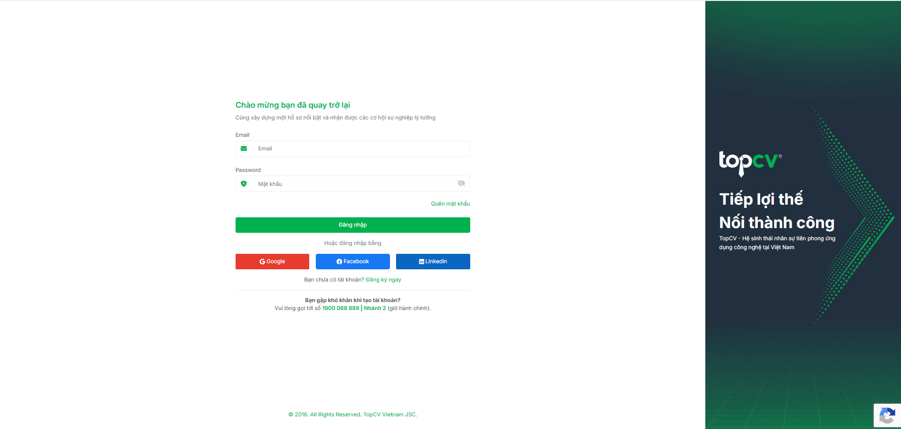
**Description:**
- The login page uses a two-column layout:
  - **Left column**: The login form, with a welcoming headline (*Welcome back*) and a brief tagline encouraging users to build a standout profile.
  - **Right column**: A branded panel with the TopCV logo, the tagline *"Tiếp lợi thế – Nối thành công"* (*Leverage advantage – Connect to success*), and a short platform description, displayed against a dark green gradient background with geometric accents.
- The login form includes:
  - An **Email** input field with an envelope icon.
  - A **Password** input field with a shield icon and a toggle to show/hide the password.
  - A **"Forgot password"** link aligned to the right.
  - A prominent green **"Login"** button spanning the full width of the form.
**Subsection Components:**
- Email input field
- Password input field with show/hide toggle
- Forgot password link
- Primary login (email/password) button
- Social login buttons (Google, Facebook, LinkedIn)
- Registration redirect link
- Support hotline information
- Branded right-panel with logo and tagline
**UI Enhancement Suggestions:**
- Add a "Remember me" checkbox to persist login sessions on trusted devices.
- Display inline validation errors (e.g., "Invalid email format", "Password too short") beneath each field without requiring form submission.
- Show a loading spinner on the login button during authentication to prevent duplicate submissions.
- Implement rate-limiting feedback (e.g., "Too many attempts - please try again in 30 seconds") to protect against brute-force attacks.
- Add a sticky header with the TopCV logo on the login page so users can navigate back to the homepage easily.
- Consider a unified login/register toggle tab so users can switch between the two flows without a page reload.
---
 
### 0.2 Social Login
 
**Description:**
- Below the primary login button, users can authenticate via third-party identity providers using OAuth 2.0.
- Three social login options are displayed as full-width buttons with brand colors and icons:
  - **Google** (red background, Google "G" icon)
  - **Facebook** (blue background, Facebook "f" icon)
  - **LinkedIn** (dark blue background, LinkedIn "in" icon)
- A separator label reads **"Or sign in with"** to visually separate social login from credential-based login.
**Subsection Components:**
- Google OAuth login button
- Facebook OAuth login button
- LinkedIn OAuth login button
- Section separator label
**UI Enhancement Suggestions:**
- Display the user's avatar and name from the social provider upon successful link, to reassure them their account is connected.
- Allow users to link or unlink multiple social providers from their account settings page.
- Show a tooltip explaining that TopCV will only access basic profile information (name, email) when using social login.
---
 
### 0.3 Registration
 
**Description:**
- A registration redirect is displayed beneath the social login buttons with the text: **"Don't have an account? Register now"**.
- The registration link is highlighted in green to draw attention.
- The registration flow collects the user's full name, email address, password, and role (candidate or employer).
**Subsection Components:**
- Registration redirect link
- New account creation form (full name, email, password, role selection)
- Email verification step after registration
- Terms of service and privacy policy acknowledgment checkbox
**UI Enhancement Suggestions:**
- Add a password strength indicator (Weak / Medium / Strong) while the user types.
- Offer a one-step social registration path (e.g., "Register with Google") so new users can onboard in a single click.
- Send a welcome email immediately after registration with a quick-start guide and profile completion tips.
- Display a progress indicator (e.g., Step 1 of 3) if registration is a multi-step flow.
---
 
### 0.4 Forgot Password
 
**Description:**
- The **"Forgot password"** link on the login form directs users to a password recovery flow.
- The recovery flow prompts users to enter their registered email address, after which a reset link or OTP is sent.
**Subsection Components:**
- Email input for password reset request
- Reset link or OTP delivery via email
- OTP verification screen
- New password creation form with confirmation field
- Success confirmation message after reset
**UI Enhancement Suggestions:**
- Clearly state the expiry time for the reset link or OTP (e.g., "This link expires in 15 minutes").
- Provide a "Resend code" option with a countdown timer (e.g., "Resend in 60s") in the OTP screen.
- Redirect the user automatically to the login page after a successful password reset, with a success toast notification.
- Mask the email address shown in the confirmation step (e.g., `u***r@gmail.com`) for privacy.
---

## 1. Jobs

The `Jobs` section is the core of the page, consisting of multiple subsections directly related to searching, filtering, and managing job listings.

### 1.1 Main Search Bar

**Illustration:**
- 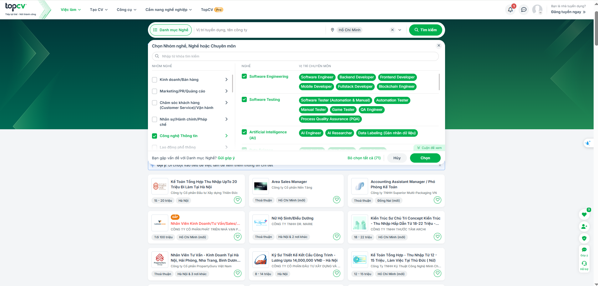

**Description:**
- The search bar sits at the top of the homepage and includes:
  - A `Job Categories` button to open a modal or dropdown for selecting industries.
  - A text input for `Job title, company name` to enter job keywords.
  - A `Location` selector with popular location options.
- A `Search` button on the right applies the selected filters.

**Subsection Components:**
- Industry group dropdown
- Position or company keyword search input
- Location dropdown/selector
- Quick suggestions below the search bar

**UI Enhancement Suggestions:**
- Display filter tags for each active filter directly on the search bar.
- Add a `Clear all` button for quick reset.
- Allow multiple industries and regions to be selected simultaneously.
- Add an internal search field within the industry dropdown.
- Show the number of results matching the current filters in real time.

### 1.2 Job Category Directory

**Illustration:**
- 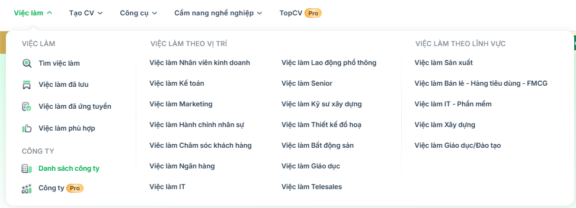

**Description:**
- The job category section displays multiple industry groups.
- Users can browse categories such as:
  - Sales/Business Development
  - Marketing/PR/Advertising
  - Customer Service
  - Human Resources/Administration/Legal
  - Information Technology
  - General Labor
  - Finance/Banking/Insurance
  - Real Estate
  - Construction
  - Accounting/Auditing/Tax
  - Manufacturing
  - Education/Training
  - Retail/Lifestyle Services
  - Film & TV/Journalism/Publishing
  - Electrical/Electronics/Telecommunications
  - Logistics/Procurement/Warehouse/Transport
  - Professional Consulting
  - Pharmaceutical/Healthcare/Biotech
  - Design
  - Restaurant/Hotel/Tourism
  - Energy/Environment/Agriculture
  - Driver
  - Translation/Interpretation
  - Law
  - Other Industries

**Subsection Components:**
- Industry list displayed in columns or cards
- Multi-select checkboxes
- Main industry groups and sub-specializations
- Quick keyword search within the category list

**UI Enhancement Suggestions:**
- Allow simultaneous multi-selection of industries via checkboxes.
- Show the number of available jobs within each industry.
- Add filters for salary, experience, and work type directly inside the industry modal.
- Add `Trending` or `Recommended Industries` labels based on market trends.

### 1.3 Advanced Filters and Job Results

**Illustration:**
- 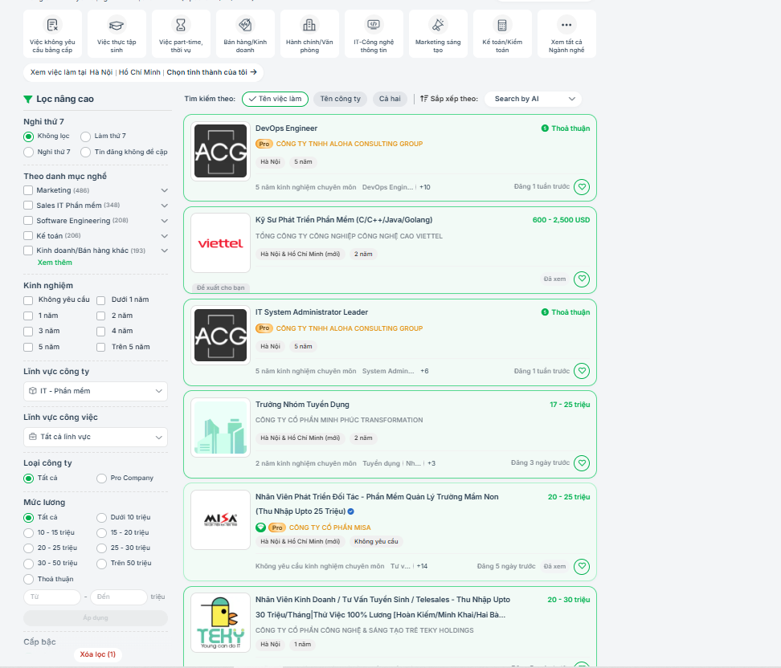

**Description:**
- This interface combines job filters and search results in the same area.
- Users can quickly select region, city, specialty, and other filter parameters before viewing job listing cards.
- Job results are displayed as cards with clear information on job title, company, salary, location, and hiring status.

**Subsection Components:**
- Advanced filter panel: region, city, industry, salary range, experience level, work type.
- Quick regional filters: Hanoi, Ho Chi Minh City, North, South.
- Filtered job listing displayed as cards.
- Card status tags: `Hot`, `Negotiable`, `New`.

**UI Enhancement Suggestions:**
- Display active filter tags with the ability to remove individual filters quickly.
- Add tooltips or hover preview for each job card.
- Provide grid or list view toggle for results.
- Add secondary filters for `Work type`, `Salary`, `Location`, `Experience` within the same panel.
- Show the live result count as users adjust filters.

### 1.5 Saved Jobs

**Illustration:**
- 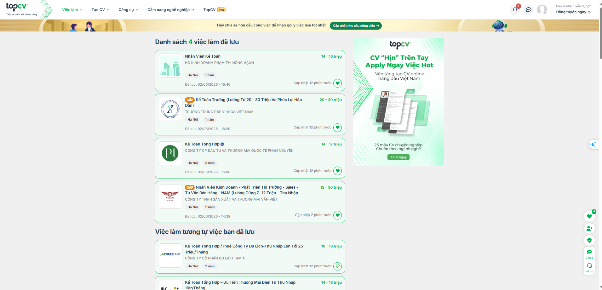

**Description:**
- Each job card has a heart icon to save the listing.
- Saved jobs are collected into a dedicated list.
- The `Saved Jobs` page displays the total number of saved jobs and details for each.

**Subsection Components:**
- Heart icon on each job card
- Saved jobs list view
- Save/unsave notification

**UI Enhancement Suggestions:**
- Add a `Saved only` filter when browsing results.
- Show a clear `Saved` status indicator on cards.
- Display similar jobs below the saved list.
- Add a popup notification when saving or unsaving a job.

### 1.6 Job Alert Interface

**Illustration:**
- 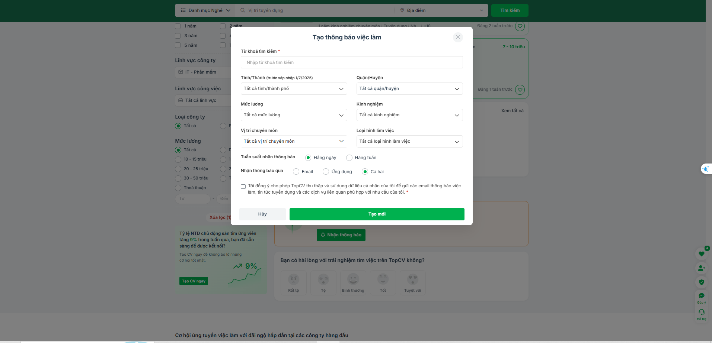

**Description:**
- Users can create job alerts based on keywords and filters.
- The alert form includes:
  - Search keywords
  - Province/City, District
  - Salary range, Experience level
  - Job title, Work type
  - Alert frequency: daily or weekly
  - Delivery channel: Email, App, or both
- Email verification is required before activating alerts to ensure accurate delivery.

**Subsection Components:**
- Alert creation form
- Data collection consent checkbox
- Email verification status
- `Create` button

**UI Enhancement Suggestions:**
- Add email verification via OTP code or confirmation link.
- Clearly display `Email verified` / `Not verified` status.
- Provide an alert management screen for toggling alerts on/off.
- Suggest relevant job categories when creating a new alert.

### 1.7 Applied Jobs

**Illustration:**
- 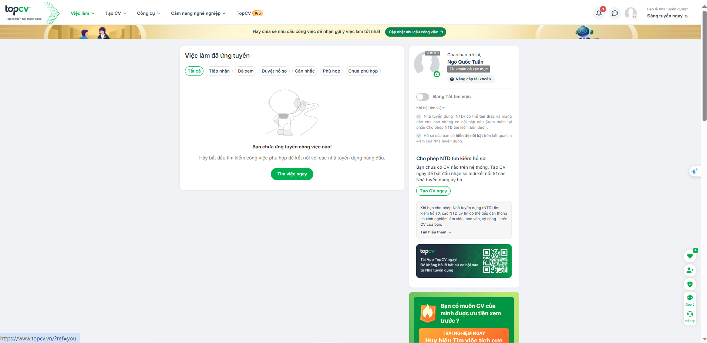

**Description:**
- The `Applied Jobs` page lets users track the progress of each application.
- Common status labels include: `All`, `Received`, `Viewed`, `Under Review`, `Considering`, `Suitable`, `Not Suitable`.
- Each job in the list can show the current status and last updated time.

**Subsection Components:**
- Application status filter
- Applied jobs list displayed as cards
- Progress notifications or next-action reminders

**UI Enhancement Suggestions:**
- Show a progress bar for each application.
- Add alerts when an application is newly viewed or status changes.
- Allow email/app notifications when application status changes.
- Add an `Activity History` section to log submission date, view date, and employer responses.

### 1.8 Matched Jobs and Candidate Profile

**Illustration:**
- 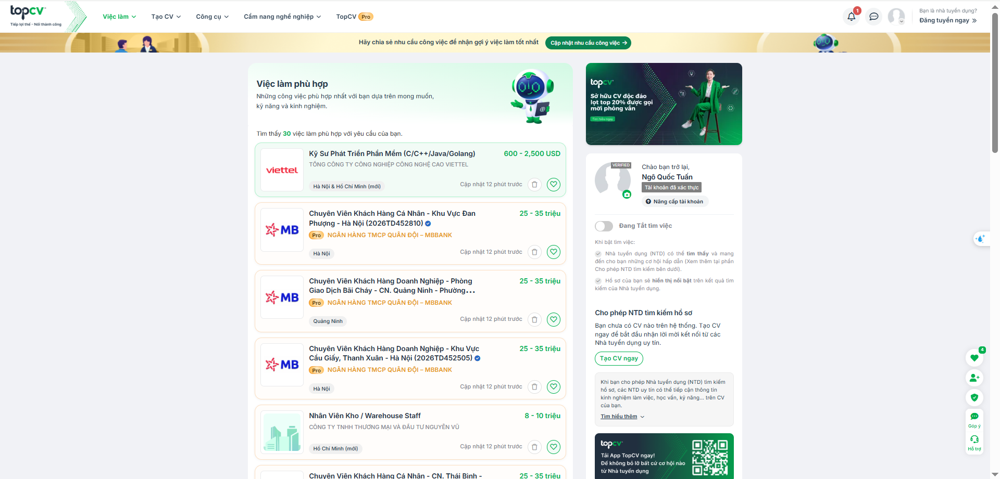
- 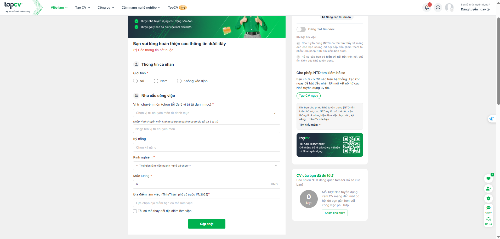

**Description:**
- The `Matched Jobs` section requires users to provide personal information and career preferences so the system can recommend suitable jobs using machine learning.
- The job search preferences form is where users enter their qualifications, skills, and current career goals.
- Required data includes:
  - Basic personal information
  - Desired job title
  - Current skills
  - Expected salary
  - Preferred work location
- Based on this data, the system filters and prioritizes compatible job listings.

**Subsection Components:**
- Personal profile and job preference form
- Input fields for skills, experience, salary, and location
- Auto-suggest for related industries or skills
- Job recommendations based on profile

**UI Enhancement Suggestions:**
- Add a sidebar showing a visual match score for the profile.
- Display `90% Match` or `75% Match` badges on each job card.
- Suggest skills to add in order to improve application chances.
- Add a `Quick Profile Update` feature when users edit their information.

### 1.9 Company List and Recruitment Tracking

**Illustration:**
- 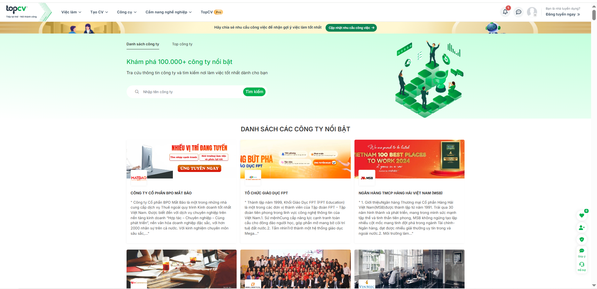

**Description:**
- This section displays featured companies, top employers, and companies with many open positions.
- Users can search for companies by name, industry, or hiring activity.
- Each company card shows a logo, short description, number of open roles, and hiring status.
- A `Follow` button lets users receive notifications when the company posts new jobs.

**Subsection Components:**
- Company search bar and filters by industry, region, and company size.
- Featured company cards with logo, brief rating, and number of job listings.
- Status labels: `Actively Hiring`, `New Post`, `Top Company`.
- `Follow` / `Unfollow` button directly on each card.

**UI Enhancement Suggestions:**
- Add a `Followed Companies` tab for quick access to priority employers.
- Show the number of new job postings or unread notifications per company.
- Allow company suggestions based on the candidate's profile and search history.
- Add an internal review section showing ratings from job seekers.

### 1.10 Company Detail Page and Map Location

**Illustration:**
- 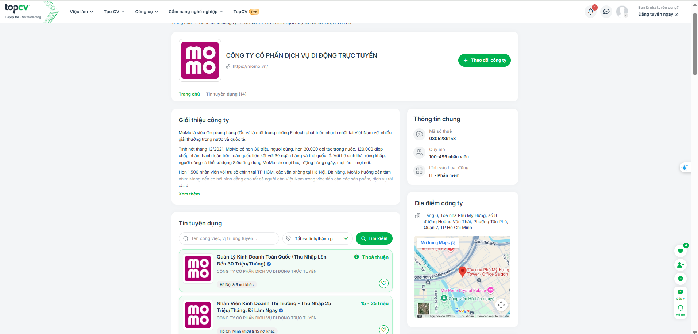

**Description:**
- The company detail page presents hiring information, company description, and geographic location.
- The interface combines company information with an embedded Google Maps view so users can visually check the workplace location.
- The map supports routing, neighborhood exploration, and multiple hiring locations if the company has multiple branches.

**Subsection Components:**
- Company info: introduction, hiring industries, company size, main location.
- List of currently open positions at the company.
- Embedded Google Maps with company location pin.
- `Follow Company`, `Apply Now`, and `Save Company` buttons.

**UI Enhancement Suggestions:**
- Show directions from the user's current location to the company.
- Add `Nearby Companies` or `Nearest Branch` markers on the map.
- Display surrounding area info such as transit, train stations, and shopping centers.
- Highlight company perks like internal reviews, work environment, and benefits.

---

## 2. CV Panel

The CV panel is the main area where users select CV templates, manage application profiles, and create cover letters.

### 2.1 CV Templates by Style

**Illustration:**
- 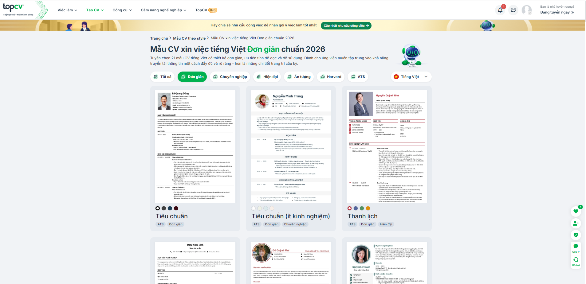
- 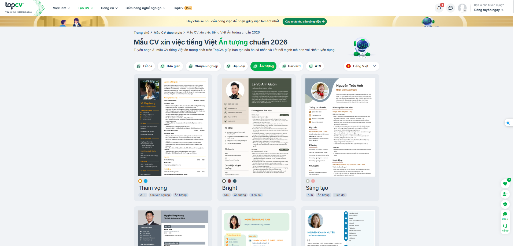
- 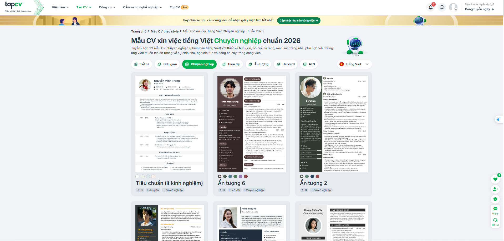
- 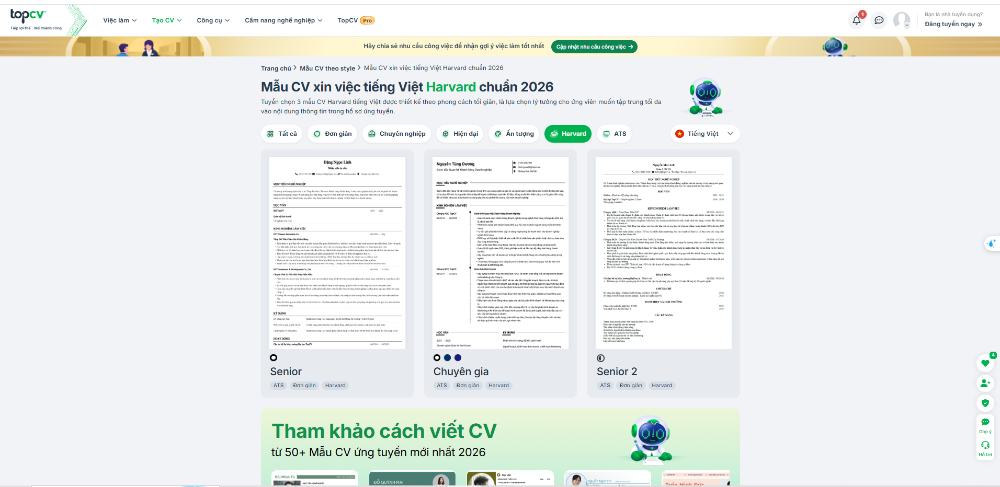

**Description:**
- The CV style area allows users to choose a template by style: Simple, Impressive, Professional, Harvard.
- Each style includes a preview and an instant CV creation button.
- Users can browse templates by criteria: entry-level, professional, creative, or ATS-friendly.

**Subsection Components:**
- CV style tabs: Simple, Impressive, Professional, Harvard.
- CV template preview cards with thumbnail images.
- `Select Template`, `View Details`, `Create CV Now` buttons.
- Style tags and suitability ratings.

**UI Enhancement Suggestions:**
- Allow previewing color or layout variants.
- Add filters by suitability level and target job position.
- Allow side-by-side comparison of multiple CV templates.

### 2.2 CV Templates by Job Position

**Illustration:**
- 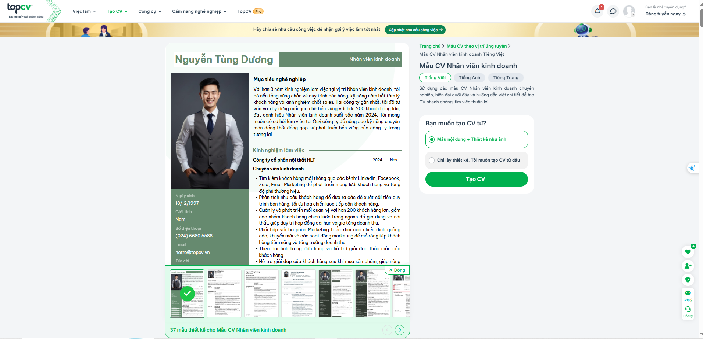
- 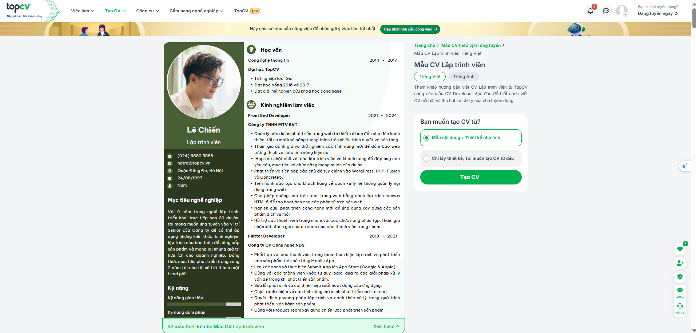
- 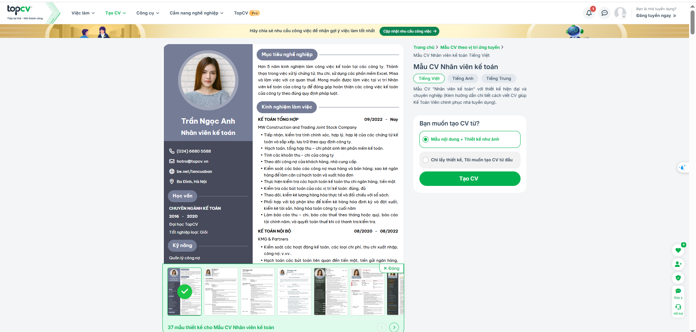
- 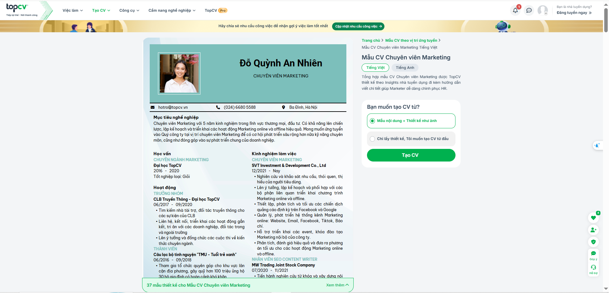

**Description:**
- This section displays recommended CV templates for specific job roles.
- Main templates include Sales Staff, Software Developer, Accountant, and Marketing Specialist.
- Users can select a template matching their target role and customize the content based on their skills.

**Subsection Components:**
- CV template list organized by industry/position.
- Role-specific CV suggestions.
- Filters for `Position`, `Experience`, `Industry`.
- `Use Template` and `Preview` buttons.

**UI Enhancement Suggestions:**
- Display templates grouped by candidate tier: `Student`, `Mid-level`, `Senior`.
- Add a `Similar Templates` section based on the target position.
- Allow users to save favorite CV templates.

### 2.3 CV Management and Custom CV

**Illustration:**
- 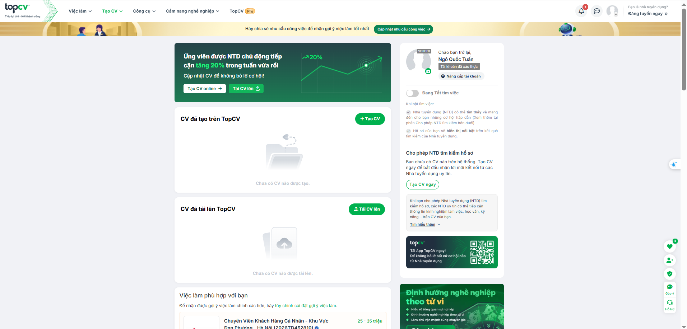
- 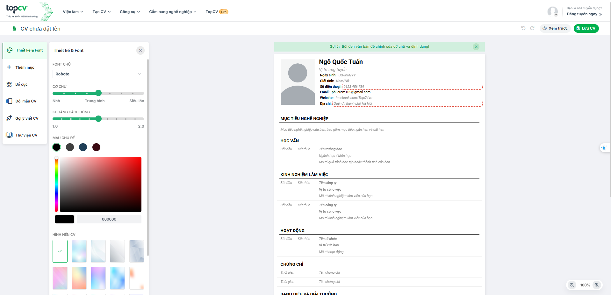

**Description:**
- The CV management and custom CV area is the hub for creating, viewing, and editing application profiles.
- Users can manage multiple CV versions, choose templates, customize content, and save different versions.
- This interface combines a CV management dashboard with a custom CV builder.

**Subsection Components:**
- CV management page listing created CVs, saved CVs, and version status.
- Custom CV tool for template-based layout and content editing.
- CV preview and save/publish options.
- Direct editing on the selected template.

**UI Enhancement Suggestions:**
- Add `Quick Template Switch` and `Duplicate CV` features.
- Show `CV Updated` or `CV Incomplete` status indicators.
- Support drag-and-drop to reorder sections within the CV.

### 2.4 CV Upload

**Illustration:**
- 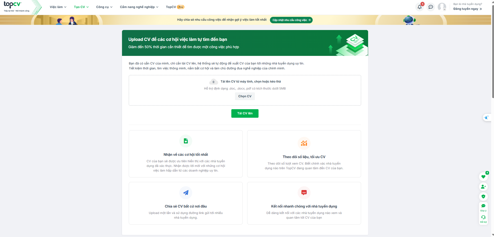

**Description:**
- The CV upload section allows users to upload an existing CV file to the system.
- The system stores uploaded CVs for use in job applications, job recommendations, and profile management.
- Users can upload multiple files and monitor processing status.

**Subsection Components:**
- CV upload widget supporting .doc, .docx, and .pdf formats.
- Table displaying uploaded CVs and processing status.
- `Upload` and `Choose File` buttons.
- File size and format guidelines.

**UI Enhancement Suggestions:**
- Add a quick preview after a successful upload.
- Allow automatic CV analysis with error and improvement suggestions.
- Display warnings when a file is too large or in an unsupported format.

### 2.5 CV Writing Guide

**Illustration:**
- 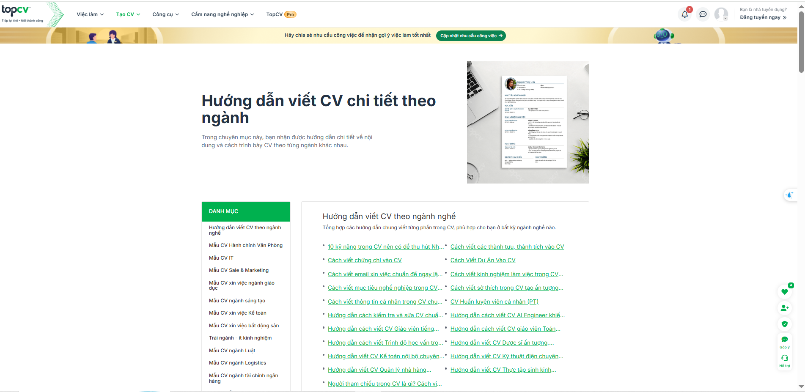

**Description:**
- The CV writing guide provides tips, structure advice, and real-world examples for creating a professional CV.
- Includes detailed articles and guidance for each CV section: headline, experience, skills, and education.
- Users can reference the guide directly within the interface and apply it to their CV.

**Subsection Components:**
- List of CV writing guides by topic.
- Sample content for each CV section.
- Writing tips tailored to different positions and experience levels.
- Links to the CV builder and relevant templates.

**UI Enhancement Suggestions:**
- Add a CV completion checklist.
- Show quick tips inline while the user is editing their CV.
- Provide an `Auto-improve CV` feature based on the guide.

### 2.6 Cover Letter

**Illustration:**
- 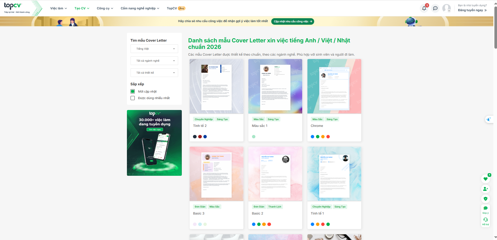
- 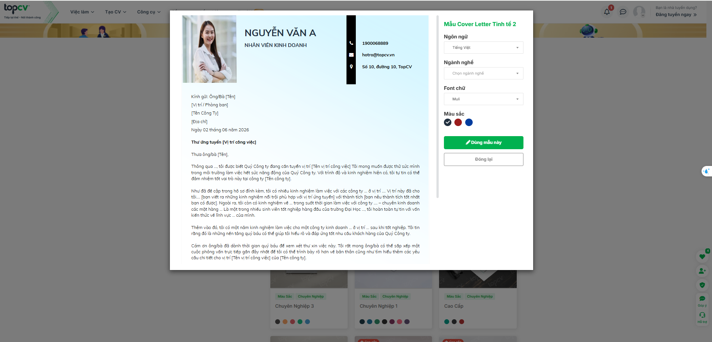

**Description:**
- The cover letter section includes two views: a reference cover letter template and a cover letter creation interface.
- Users can browse standard cover letter samples and create new letters based on templates.
- The interface supports saving multiple cover letters for different job applications.

**Subsection Components:**
- Cover letter template library.
- Cover letter creation tool using a structured form.
- `Use Template` and `Create New` buttons.
- Save and manage created cover letters.

**UI Enhancement Suggestions:**
- Add content suggestion based on the target job position.
- Allow personal information to be auto-imported from the CV into the cover letter.
- Highlight the highest-rated cover letter templates.

---

## 3. Tools and Courses

### 3.1 Application Toolkit

**Illustration:**
- 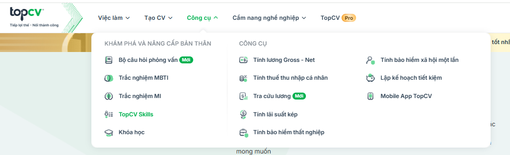

**Description:**
- The toolkit is the central hub for utilities that support job seekers.
- The interface provides quick access to tools such as the interview question bank, Top CV Skills, proficiency tests, and learning resources.
- Users can view result summaries, profile completion progress, and improvement recommendations.

**Subsection Components:**
- Tools dashboard with key feature panels.
- Quick links to the interview question bank, Top CV Skills, and skill courses.
- Test result reports and improvement suggestions.
- Shortcuts to CV creation, CV management, and cover letters.

**UI Enhancement Suggestions:**
- Add a tool filter by goal: interview preparation, CV completion, skill building.
- Display skill completion progress by area.
- Allow users to save favorite tools for quick access.

### 3.2 Interview Question Bank

**Illustration:**
- 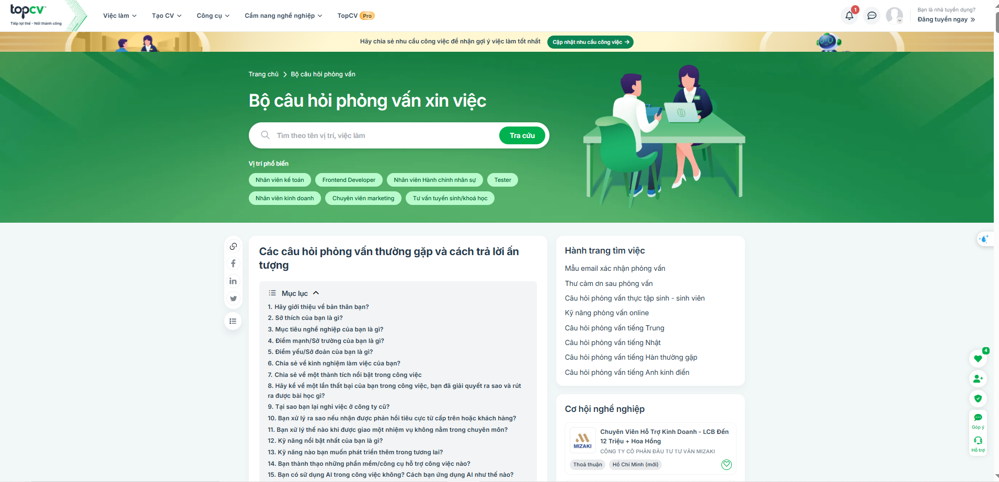

**Description:**
- The interview question bank provides challenging questions across various topics and difficulty levels.
- Users can practice with administrative, technical, business, marketing, and real-world scenario questions.
- Each question includes suggested answers, analysis, and scoring.

**Subsection Components:**
- Interview question list organized by industry and position.
- Situational exercises, behavioral questions, and technical questions.
- Automatic scoring tool with post-session feedback.
- Next practice recommendations based on results.

**UI Enhancement Suggestions:**
- Add a simulated audio/video interview mode.
- Show practice history and progress over time.
- Provide preparation tips for each question type.

### 3.3 Top CV Skills

**Illustration:**
- 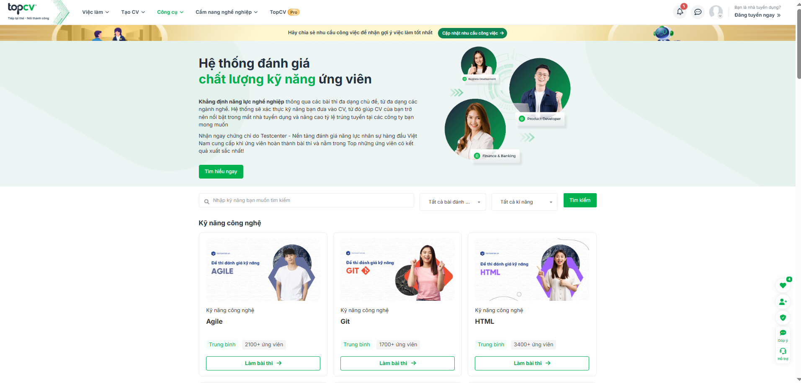

**Description:**
- The Top CV Skills section lists the key skills needed to strengthen a CV and stand out to employers.
- Skills include technical skills, soft skills, foreign languages, and tool proficiency.
- Users can learn how to present and prioritize the right skills on their CV.

**Subsection Components:**
- List of popular skills and position-specific skills.
- Guide on how to write skills into a CV effectively.
- Tips for tailoring skills to meet employer requirements.
- Suggested additional skills based on the target position.

**UI Enhancement Suggestions:**
- Add a skill comparison tool against job requirements.
- Show the importance level of each skill by industry.
- Allow users to save a preferred skill set for their CV.

### 3.4 Interview Skills Courses

**Illustration:**
- 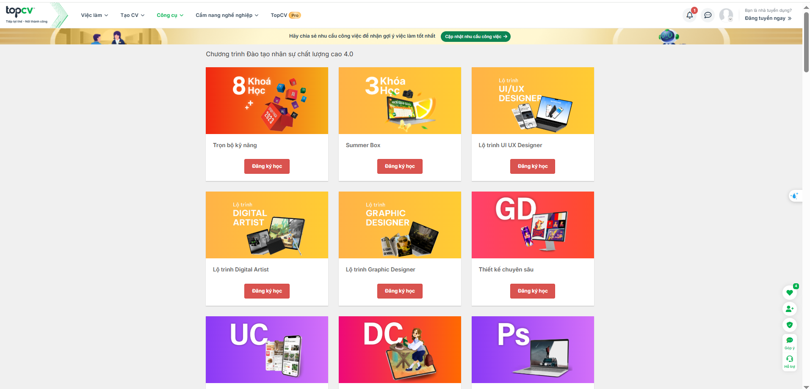

**Description:**
- The courses section offers training programs to improve interview skills and strengthen CVs.
- Content covers presentation skills, design, Photoshop, and other soft skills.
- Users can choose courses that match their development needs and job requirements.

**Subsection Components:**
- Course list by topic: presentation, design, Photoshop, communication skills, time management.
- Short course descriptions with learning objectives.
- `Enroll` or `View Details` buttons for each course.
- Course recommendations based on proficiency test results and target positions.

**UI Enhancement Suggestions:**
- Add course filters by price, duration, and difficulty level.
- Display ratings and feedback from previous learners.
- Link courses to candidate profiles for automatic recommendations when skills are missing.

---

## 4. For Employers

### 4.1 Recruitment Panel

**Illustration:**
- 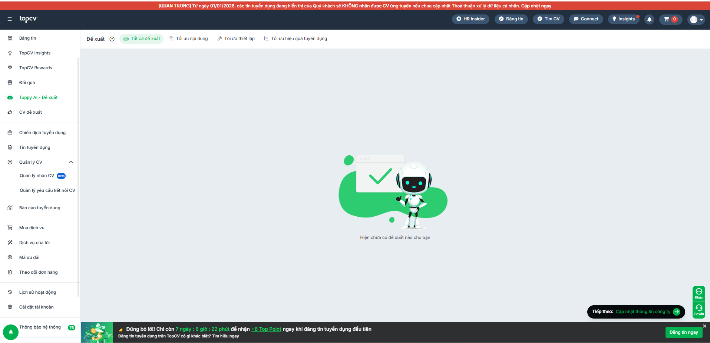

**Description:**
- The recruitment panel is the main dashboard for employers to manage their hiring activities.
- It displays quick-access actions, campaign overviews, and links to key features.
- The interface helps employers go directly to posting jobs, managing campaigns, and viewing performance reports.

**Subsection Components:**
- Quick-access toolbar for job posting, campaigns, and CV search.
- Activity metric overview: number of campaigns, CVs received, and hiring progress.
- Alerts, promotional notifications, and quick-start guidance.

### 4.2 Employer News Feed

**Illustration:**
- 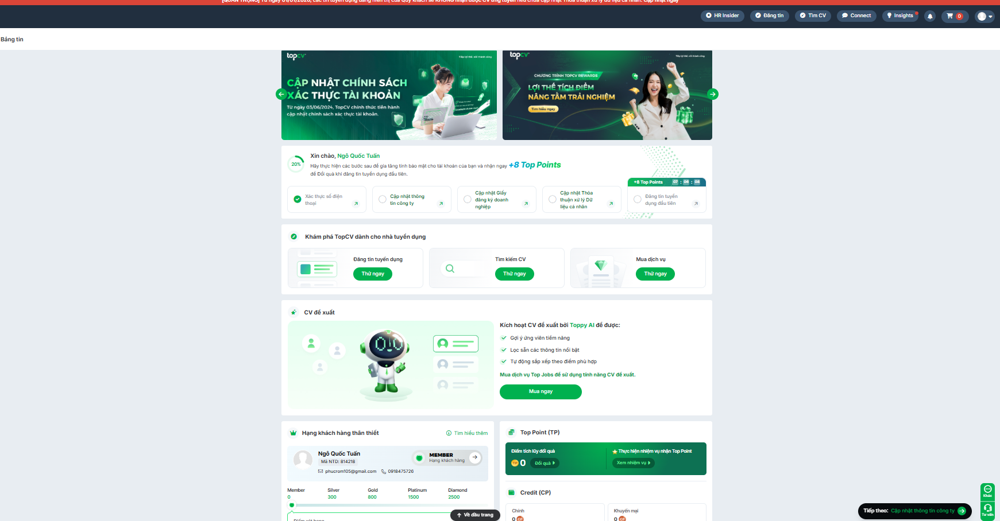

**Description:**
- The news feed is where employers track their Top Point score, membership tier, and available offers.
- Tiers include member, silver, gold, platinum, and diamond.
- Accumulated points can be redeemed for gifts, discount vouchers, or service upgrades.

**Subsection Components:**
- Display of current points, tier progress, and point-earning tasks.
- List of offers and promotional program notifications.
- Membership tier status bar with corresponding privileges.

### 4.3 Reward Redemption

**Illustration:**
- 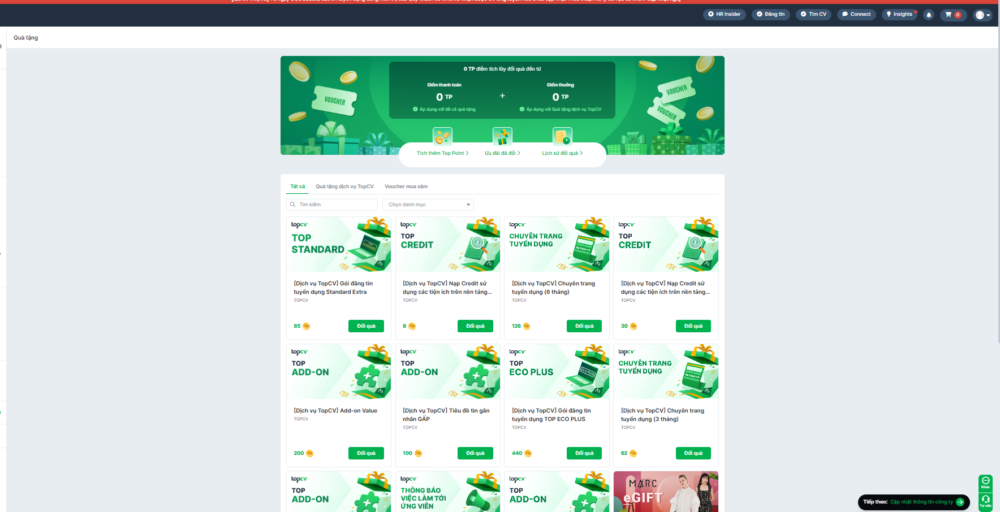

**Description:**
- The reward redemption section lets employers use accumulated points to receive vouchers or prizes.
- The interface presents gifts, discounts, and offers redeemable with Top Points.
- Users can easily select a reward, view the required point cost, and complete the redemption.

**Subsection Components:**
- List of gifts and discount vouchers by point tier.
- `Redeem` button with remaining point balance shown after redemption.
- Redemption history and order status.

### 4.4 Recruitment Campaigns

**Illustration:**
- 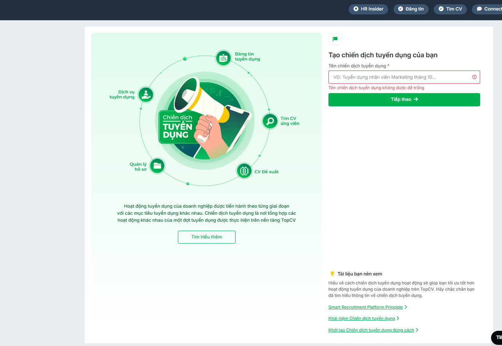

**Description:**
- Recruitment campaigns allow employers to create and manage hiring campaigns.
- The interface supports selecting objectives, departments, open positions, and promotion channels.
- The system tracks campaign performance including views, CVs submitted, and successful contacts.

**Subsection Components:**
- Campaign creation form with name, description, budget, and deadline.
- Quick performance report with adjustment recommendations.
- Campaign status tracking and candidate list management.

### 4.5 Candidate CV Management

**Illustration:**
- 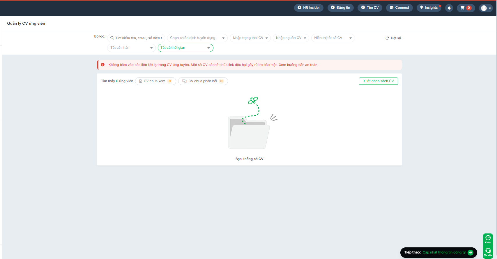

**Description:**
- Employers can manage all submitted CVs from a unified dashboard.
- Filter and search functions help categorize CVs by status, position, and application source.
- The system displays labels for unread CVs, replied CVs, and qualified CVs.

**Subsection Components:**
- CV list table showing candidate info, applied position, and processing status.
- Filters by CV status, application source, submission date, and match score.
- Quick-action buttons: `View CV`, `Reply`, `Save Candidate`.

### 4.6 Service Packages and Promo Codes

**Illustration:**
- 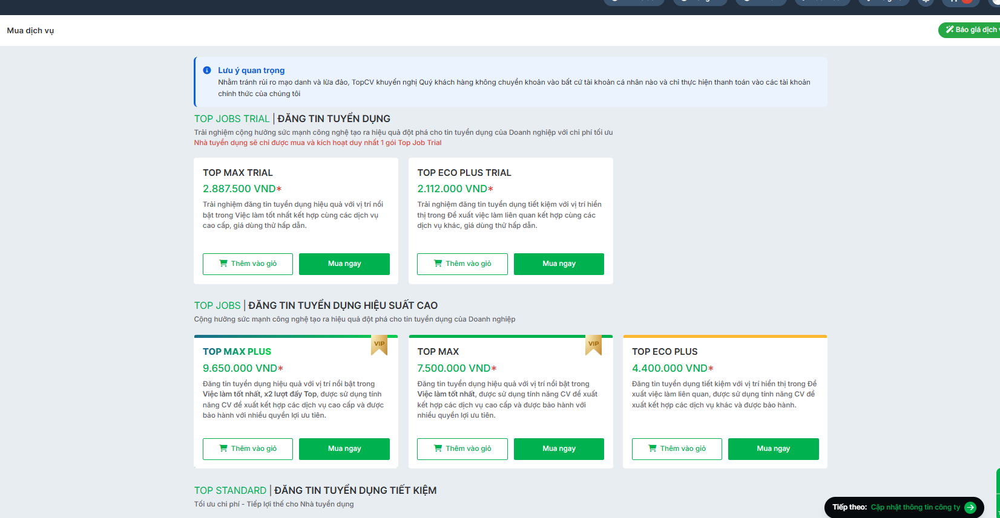
- 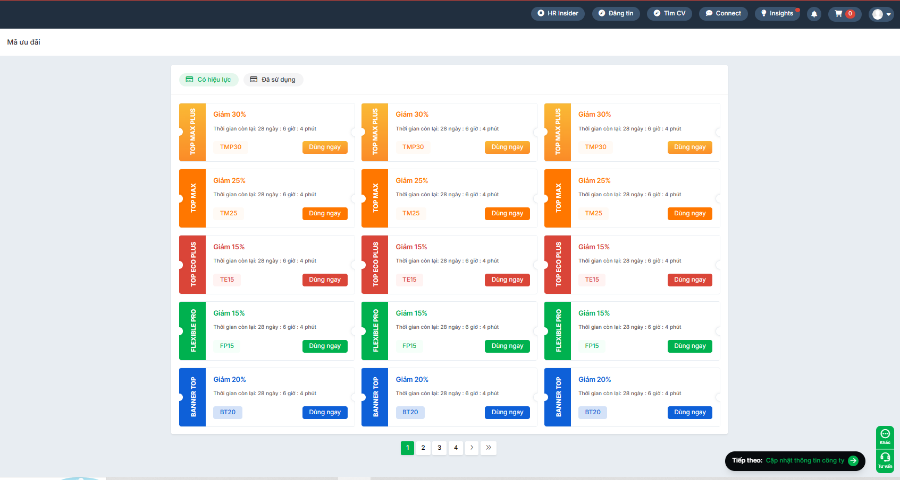

**Description:**
- Employers must purchase service packages to post job listings and increase visibility.
- The service packages page shows each package's name, features, price, duration, and action button.
- Promo codes (coupons/vouchers) provide discounts when purchasing services or posting jobs.

**Subsection Components:**
- List of recruitment service packages with standard, premium, and budget options.
- Promo code input field to apply discounts to a service package.
- Promo code status display: active, used, or expired.

---

## 5. General UI Development Suggestions

- Organize each subsection clearly with headings and illustrative images.
- Keep the search bar and filters fixed (sticky) as users scroll.
- Add brief inline guidance for each section to improve usability.
- Display dynamic data: job counts by industry, region, and personalized recommendations.
- Improve save and notification features so users can interact more quickly.