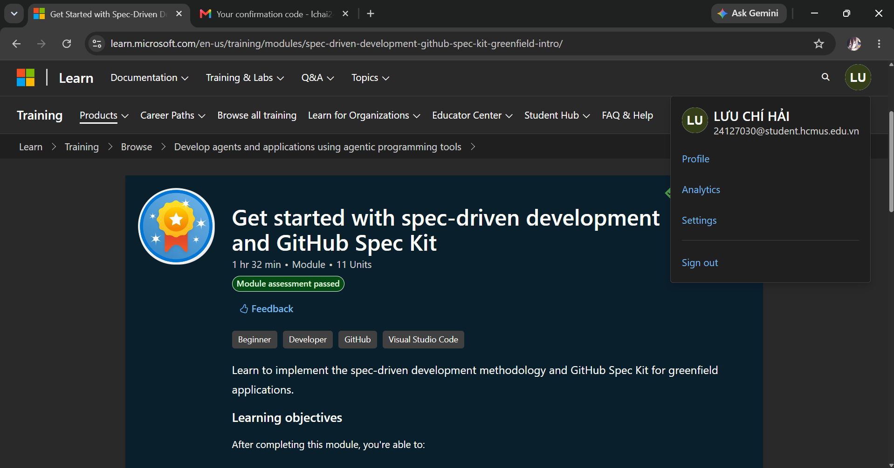

# Student Information

**Name:** Lưu Chí Hải  
**Student ID:** 24127030  

---

# Learning Journal: Spec-Driven Development and GitHub Spec Kit

## 1. Course Overview & Proof of Completion
- **Module Name:** Get started with spec-driven development and GitHub Spec Kit
- **Status:** Completed / Assessment Passed
- **Duration:** 1 hour 32 minutes (11 Units)

### Proof of Completion

## 2. Core Benefits of Spec-Driven Development (SDD)
Spec-Driven Development (SDD) completely changes how we build software by putting the design phase first. Based on the module, the biggest advantages for new projects (greenfield applications) are:
- **Executable Design:** SDD turns specifications into an executable design. This close the gap between our ideas and the actual project.
- **Living Documentation:** Instead of having outdated reference files, the spec becomes a "living document" that is always in sync with the real system.
- **No Design Drift:** It eliminates the mismatch between what we designed and what is actually implemented.

## 3. GitHub Spec Kit Features & The SDD Cycle
The most impressive feature of GitHub Spec Kit is its speed and automated code scaffolding. It can quickly turn core structural markdown files into a working project implementation. 

The standard SDD cycle I learned follows this clear structure:
1. **Constitution (`constitution.md`):** Sets the ground rules, coding standards, and core principles for the whole project.
2. **Specify (`spec.md`):** Defines *what* the feature is and *why* we need it from the user's perspective.
3. **Plan (`plan.md`):** Translates the spec into technical architecture, tech stacks, and database models.
4. **Tasks (`tasks.md`):** Generates a step-by-step executable checklist from the plan.
5. **Implement:** The AI uses the tasks to generate actual code safely.

*Note on Environment:* Integrating this toolkit directly into Visual Studio Code (VS Code) provides a smooth and familiar developer experience, making it easy to manage specifications right alongside the code.

## 4. Challenges & Reflection
- **Challenges during learning:** None. The 11 units were well-structured, straightforward, and the learning curve was smooth.

## 5. Future Application
- **Current Status:** I don't have a concrete plan yet on exactly when or how I will apply this methodology to upcoming projects.
- **Potential Use Case:** However, adopting this SDD framework—specifically defining clear `constitution.md` and `tasks.md` files—could significantly streamline our upcoming teamwork.