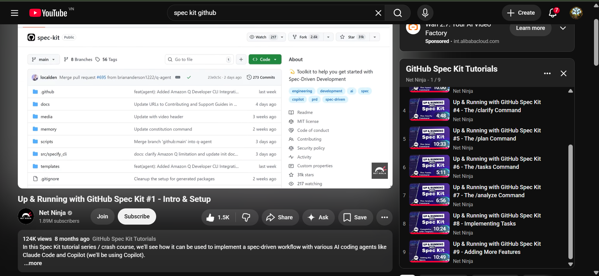

# GitHub Spec Kit - Complete Usage Guide

## 1. Introduction

**GitHub Spec Kit** is a comprehensive toolkit designed to help developers implement **Spec-Driven Development** workflows. It integrates with GitHub Copilot and AI coding agents to streamline the software development process from planning to implementation.

**Repository:** [spec-kit](https://github.com/spec-kit/spec-kit) (3.1k stars)
**Key Focus:** Engineering, Development, AI, Spec-Driven Development, Copilot

---

## 2. What is Spec-Driven Development?

Spec-Driven Development is a methodology where you:
- Define clear specifications before coding
- Use AI tools to understand and analyze requirements
- Generate structured development plans
- Break tasks into manageable components
- Implement features based on verified specs

This approach improves code quality, reduces bugs, and ensures alignment with project requirements.

---

## 3. Core Features & Commands

### 3.1 The `/constitution` Command 
**Purpose:** Establish the foundational principles and guidelines
- Defines the core values and principles of the project
- Sets coding standards, team guidelines, and best practices
- Establishes the "constitution" or rules the project must follow
- Creates the foundation for all subsequent specifications and implementation

**Use Case:** Project initialization, setting team standards, defining project identity

### 3.2 The `/specify` Command 
**Purpose:** Create detailed technical specifications
- Transforms requirements into precise technical specifications
- Defines exact behavior, inputs, outputs, and edge cases
- Documents API contracts, data structures, and workflows
- Ensures specifications are complete and unambiguous

**Use Case:** Turning features into detailed implementation specs

### 3.3 The `/clarify` Command
**Purpose:** Clarify and understand requirements
- Takes ambiguous or complex requirements as input
- Uses AI to ask clarifying questions
- Generates refined, clear specifications
- Ensures all stakeholders understand the requirement before development begins

**Use Case:** When you have a vague feature request or product requirement

### 3.4 The `/plan` Command
**Purpose:** Transform high-level feature specifications into detailed technical implementation plans

**Key Functions:**
- **Outlining Technical Details:** Defines specific implementation choices such as:
  - CSS frameworks (e.g., Tailwind)
  - UI component libraries (e.g., shadcn/ui)
  - State management solutions
  - Third-party APIs and integrations

- **AI-Driven Analysis:** Automatically performs several critical steps:
  - **Spec & Constitution Check:** Reviews your feature spec and project constitution to ensure all requirements are accounted for
  - **Resource Generation:** Creates important files including:
    - `research.md`: Documents best practices and architectural decisions
    - **Data Models:** Defines data structure and type definitions
    - **Contract Files:** Sets clear boundaries and interfaces for APIs and UI components

- **Self-Verification:** Uses a plan template to check its own work, ensuring constitutional constraints are applied and planned structure adheres to project rules

- **Establishes Documented Roadmap:** Prevents AI from "going freestyle" later, making subsequent task-generation and coding phases more efficient

**Use Case:** Transforming feature specifications into comprehensive technical plans with architectural decisions, data models, and API contracts before implementation

### 3.5 The `/task` Command
**Purpose:** Generate and manage atomic tasks
- Converts plans into specific, executable tasks
- Creates task lists with clear acceptance criteria
- Assigns complexity and priority levels
- Generates task descriptions for team members

**Use Case:** Creating backlog items or sprint cards

### 3.6 The `/analyze` Command
**Purpose:** Final quality assurance step before implementation - read-only scan of project artifacts
- **Identifies Inconsistencies:** Scans for conflicting information or ambiguities between documentation files (constitution, specs, task plans)
- **Validates Constitution:** Checks all artifacts against the rules established in your constitution to flag potential violations
- **Checks Coverage:** Evaluates whether implementation tasks adequately cover all functional requirements
- **Generates Comprehensive Reports:**
  - Executive Summary: High-level overview of artifact health and constitutional alignment
  - Issue Table: Detailed findings categorized by ID, severity (Low, Medium, High), location, and recommended remediations
  - Coverage Summary: Metrics comparing total requirements versus implementation tasks
  - Actionable Advice: Recommendation on whether to proceed with implementation or required improvements

**Use Case:** Validating artifacts before implementation, ensuring consistency and completeness

### 3.7 The `/implement` Command 
**Purpose:** Guide code implementation with AI assistance
- Uses specifications to guide actual code generation
- Generates code scaffolding and implementation patterns
- Ensures code follows the established constitution and specifications
- Integrates with GitHub Copilot for intelligent code suggestions
- Validates implementation against specs in real-time

**Use Case:** Writing code that strictly adheres to specifications

---

## 4. Complete Workflow: From Constitution to Implementation

### The Spec-Driven Development Pipeline

```
/constitution → /specify → /clarify → /plan → /task → /analyze → /implement
```

### Step 1: Establish Constitution (`/constitution`)
Define project principles, standards, and guidelines
```
Output: Core project values, coding standards, team conventions
```

### Step 2: Create Specifications (`/specify`)
Transform requirements into detailed technical specifications
```
Input: Features and requirements
Output: Complete technical specifications with exact behavior and contracts
```

### Step 3: Clarify Requirements (`/clarify`)
Refine specifications to ensure clarity
```
Input: Requirements or unclear specs
Output: Clear, detailed specifications with all questions answered
```

### Step 4: Create Development Plan (`/plan`)
Transform feature specification into detailed technical implementation plan
```
Input: Feature specification and constitution
Process: 
  - AI-driven analysis of spec and constitution
  - Define technical choices (frameworks, libraries, APIs)
  - Generate research.md, data models, contract files
  - Self-verify constitutional adherence
Output: Comprehensive plan with architectural decisions, data structures, API contracts, and research documentation
```

### Step 5: Generate Atomic Tasks (`/task`)
Convert plan into executable tasks
```
Output: Individual tasks with acceptance criteria and priorities
```

### Step 6: Analyze & Verify (`/analyze`)
Final quality assurance scan of all artifacts before implementation
```
Input: Constitution, specifications, task plans, and generated artifacts
Output: Comprehensive QA report with Executive Summary, Issue Table, Coverage Summary, and Actionable Advice
```

### Step 7: Implement (`/implement`)
Write code guided by specifications using AI assistance
```
Input: Task specification
Output: Implementation code that follows constitution and specs
```

---

## 5. Getting Started

### Installation
1. Clone or fork the [spec-kit repository](https://github.com/spec-kit/spec-kit)
2. Install dependencies
3. Configure with your GitHub environment
4. Set up Copilot integration

### Basic Setup
- Ensure GitHub Copilot is installed and authenticated
- Have the spec-kit toolkit available in your development environment
- Create a specification file for your project

### First Command
Start with `/constitution` on a new project, or `/specify` on requirements to see how Spec Kit transforms development

---

## 6. Best Practices

1. **Start with `/constitution`** - Always establish project principles first
2. **Use `/specify` for Requirements** - Turn vague requirements into precise specs
3. **Clarify Iteratively** - Use `/clarify` to refine specifications
4. **Plan Thoroughly with `/plan`** - Create detailed technical plans with frameworks, libraries, data models, and API contracts before coding
5. **Create Atomic Tasks** - Break into small, focused tasks with `/task`
6. **Analyze Before Implementation** - Use `/analyze` as a QA gate to validate artifacts for consistency and completeness
7. **Implement with `/implement`** - Let AI guide code generation based on validated specs
8. **Document Everything** - Keep all specs and plans in version control
9. **Involve Team Members** - Share constitution and specs with stakeholders

---

## 7. Advanced Features

- **Custom Properties:** Define project-specific metadata
- **Code of Conduct:** Maintain team standards
- **Contributing Guidelines:** Document collaboration rules
- **PRD Integration:** Integrate product requirements documents
- **Multiple Commands:** Chain commands for complex workflows

---

## 8. Common Use Cases

| Use Case | Command Pipeline | Output |
|----------|------------------|--------|
| **New Project Setup** | `/constitution` | Project principles & standards |
| **Feature Development** | `/constitution` → `/specify` → `/clarify` → `/plan` → `/task` | Complete task backlog ready for dev |
| **Pre-Implementation QA** | `/task` → `/analyze` | Artifact validation, consistency check, coverage report |
| **Implementation** | `/analyze` → `/implement` | Production-ready code following validated specs |
| **Team Onboarding** | `/constitution` → `/specify` → `/task` | Project standards and clear tasks |
| **Sprint Planning** | `/plan` → `/task` | Sprint-ready atomic tasks |
| **Requirement Refinement** | `/clarify` (iterative) | Progressive clarity |
| **End-to-End Project** | `/constitution` → `/specify` → `/clarify` → `/plan` → `/task` → `/analyze` → `/implement` | Complete project pipeline with QA gate |

---

## 9. Conclusion

GitHub Spec Kit revolutionizes development through a complete, structured pipeline: `/constitution` establishes project principles, `/specify` creates technical specifications, `/clarify` refines requirements, `/plan` transforms specifications into detailed technical implementation plans with architectural decisions and data models, `/task` creates atomic work items, `/analyze` performs quality assurance validation of all artifacts before implementation, and `/implement` generates specification-driven code.

The three pillars—**Constitution** (principles), **Specify** (clarity), and **Implement** (execution)—form the core of Spec-Driven Development. The `/plan` command is critical for establishing documented roadmaps that prevent AI from "going freestyle," while `/analyze` acts as a quality gate ensuring consistency and completeness. This enables teams to reduce miscommunication, catch issues early, and deliver higher-quality software faster through AI-assisted, specification-guided development.

**Proof of Completion:** Tutorial series "Up & Running with GitHub Spec Kit" completed, covering all major commands and the complete workflow pipeline (`/constitution` → `/specify` → `/clarify` → `/plan` → `/task` → `/analyze` → `/implement`).

### Tutorial Completion Certificate


---

**Last Updated:** June 17, 2026  
**Source:** [GitHub Spec Kit Official Repository](https://github.com/spec-kit/spec-kit)
