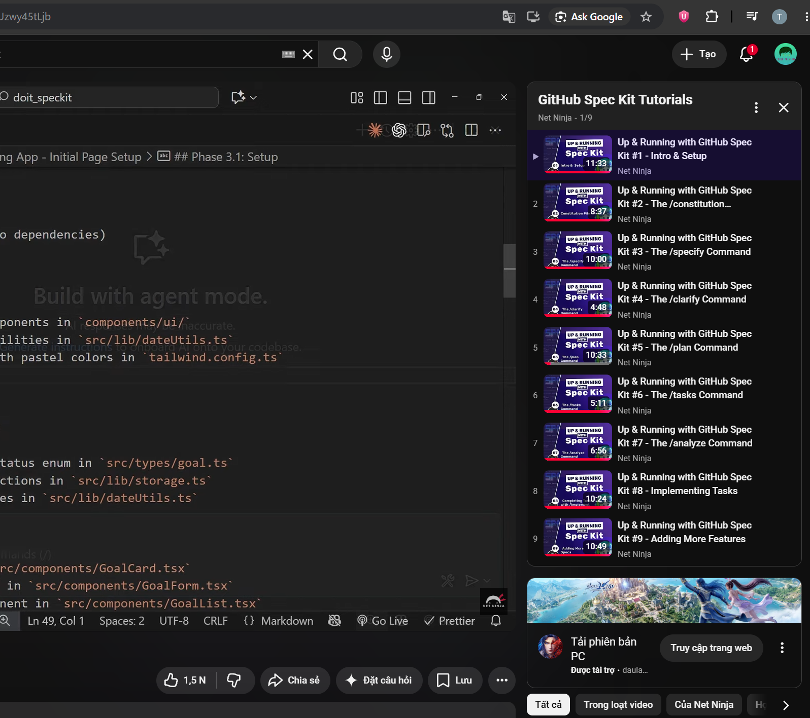

# About document

- Writer: Nguyễn Quốc Thành
- Student ID: 24127542
- Reviewer: Nguyễn Quốc Thành

# What is Spec-Kit?

- SpecKit is the tool open source of GitHub based on **Spec-Driven Development (SDD)**.
- The method to build application based on principles **Design before Implement**.
- AI reads the specification and generates code from it - not the other way around.

## Table contents

1. [Project structure](#project-structure)
2. [Core project - Constitution](#core-project)
3. [The cycle of feature](#the-cycle-for-a-feature)
   - [Specification](#in-specify---specification)
   - [Clarify](#in-clarify---clarification)
   - [Task](#in-tasks---execution-roadmap)
   - [Analyst (Optional)](#analyst)
   - [Implement](#in-implement---build)
4. [Quick Start](#quick-start)
5. [Proof training](#proof-training)

## Project structure

```
.specify/
    memory/
        constitution.md           ← Principles project
    templates/                    ← template for constitution/spec/plan/tasks/checklist
specs/
    001-feature-name/
        spec.md                    ← Specification context
        plan.md                    ← Plan technical
        tasks.md                   ← List tasks
        data-model.md
        api-spec.json
        research.md
    002-feature-name/
        spec.md                    ← Specification context
        plan.md                    ← Plan technical
        tasks.md                   ← List tasks
        data-model.md
        api-spec.json
        research.md
```

## Core project

### Constitution

- This is the constitution of project, **_Only a file constitution.md_** in project.
- Set all principles for AI agent must be followed.
- AI read it first then implement features.

#### It contains:

- Standard code.
- Unit Test (TDD, coverage, ...)
- Principles UX/accessibility
- Constraint performance, security

## The Cycle for a feature:

```
specify → clarify → plan → tasks → implement
```

- Each feature is built based on this cycle.
- Each feature runs this cycle independently.

### In Specify - Specification

- Pure business description from the **user's point of view**, written as **User Stories**.
- Describe **What** (what the user wants) and **Why** (why they need it).
- Define user roles and real-world use cases.
- Describe what the user **expects to receive** after each action.

#### Rules:

- ✅ Focus on user behavior and expectations.
- ❌ No technology stack (React, NextJS, API...).
- ❌ No description of how the system processes internally - that belongs to Plan.

#### Output: `spec.md`

### In Clarify - Clarification

- Validate the **completeness of the Spec** before moving to technical planning.
- AI asks questions back to the user about unclear or missing points in `spec.md`.
- Surface **edge cases** not yet covered.
- Ensure AI and user reach **agreement on scope** before investing in Plan and Tasks.

#### Why it matters:

- Any ambiguity left in Spec will be **amplified** across Plan → Tasks → Implementation.
- Skipping this step leads to rework and wasted effort.

### In Plan - Technical Architecture

- The **translation layer** from business language (Spec) into technical language (Code).
- This is where technology decisions are made.

#### It contains:

- `plan.md` - Tech stack, overall architecture, key technical decisions.
- `data-model.md` - Database schema, relationships between entities.
- `api-spec.json` - API endpoints, request/response contracts.
- `research.md` - Library evaluations, alternatives considered.

#### Output: `plan.md`, `data-model.md`, `api-spec.json`, `research.md`

### In Tasks - Execution Roadmap

- Detailed execution plan generated from Spec + Plan.
- Each task is linked to a specific **User Story** from `spec.md`.

#### It contains:

- Task dependency order (Task B must follow Task A).
- Parallel tasks marked with `[P]` - can run simultaneously.
- Specific file paths to be created or modified.
- Definition of done for each task.

#### Output: `tasks.md`

### Analyst

- An optional research phase that runs before Specify when the problem space is unclear.
- Used to explore the domain, research competitors, or validate ideas before writing a spec.
- Helps the user define what to build before committing to a User Story.

#### It contains:

- research.md - Market research, competitor analysis, feasibility notes.
- Key insights that inform the Spec (user needs, pain points, opportunities).

#### When to use:

- Starting a brand new project with no clear direction.
- Validating whether a feature is worth building.
- Exploring technical or business unknowns before specifying.

#### Rules:

- ✅ Output feeds directly into spec.mdthe Specify phase.
- ❌ No implementation decisions here — that belongs to Plan.

### In Implement - Build

- AI reads `tasks.md` and builds step by step in the correct order.
- AI always references `constitution.md` throughout the entire implementation.
- Follow TDD if required by constitution.

## Quick Start

```bash
# Install uv (Windows)
powershell -ExecutionPolicy ByPass -c "irm https://astral.sh/uv/install.ps1 | iex"

# Initialize project
uvx --from git+https://github.com/github/spec-kit.git specify init <project-name>

# Navigate and open in VS Code
cd <project-name>
code .
```

## Proof Training


