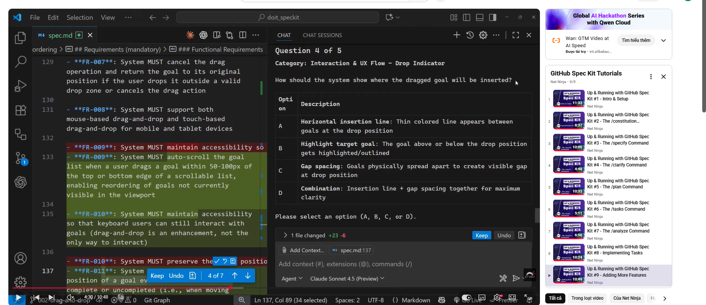

# Student Information

**Họ và tên:** Ngô Quốc Tuấn&nbsp;

**Mã số sinh viên:** 24127581&nbsp;

**Lớp:** 24C11&nbsp;

---

# Spec Kit Initialization
> **Source:** GitHub official documentation, GitHub Blog, DeepWiki, and community resources  
> **Repository:** [github/spec-kit](https://github.com/github/spec-kit)  
> **Docs:** [github.github.com/spec-kit](https://github.github.com/spec-kit/index.html)

---

## 1. What Is Spec Kit?

Spec Kit is an open-source toolkit by GitHub designed to support **Spec-Driven Development (SDD)** — a methodology where a written specification becomes the single source of truth that drives AI coding agents to generate, test, and validate code.

Instead of writing code first and documentation later, SDD flips the order:

```
Specification → Plan → Tasks → Implementation
```

Your role is to **steer**; the AI coding agent (Claude Code, GitHub Copilot, Gemini CLI, etc.) does the bulk of the writing.

---

## 2. Core Functions of Spec Kit (and Why a Project Needs It)

Spec Kit's value isn't really in its CLI — it's in the workflow it enforces. The toolkit exists to formalize Spec-Driven Development, and that process breaks down into four stages:

- **Specification** — captures *what* you're building and *why*: intent, requirements, constraints, and scope, written down before any code exists.
- **Plan** — translates that intent into a technical approach: architecture decisions, technology choices, and how the pieces fit together.
- **Tasks** — breaks the plan into concrete, actionable units of work that an AI agent (or a human) can pick up one at a time.
- **Implementation** — the actual code, written downstream of all the above rather than as the starting point.

### Why a project would adopt this

- **Keeps AI agents aligned with intent.** A vague prompt forces an AI agent to fill gaps with assumptions. A written spec removes that ambiguity, giving the agent a clear target to generate, test, and validate code against.
- **Separates "steering" from "doing."** The human's role shifts toward defining what should exist and why, while the bulk of implementation is delegated — useful for teams that want to stay in an architectural/review role.
- **Creates a durable artifact.** The spec, plan, and task breakdown aren't throwaway scaffolding — they persist as documentation of intent, useful for onboarding, audits, or revisiting past decisions (the availability of a "compliance" preset hints at use in regulated environments).
- **Supports branch-per-feature workflows.** Each feature gets its own spec/plan/tasks cycle, mapping cleanly onto a feature branch for teams working on multiple things in parallel.
- **Agent-agnostic.** Whether the team uses Claude Code, Copilot, Gemini, or another agent, the SDD structure stays the same — only the integration changes, so the methodology isn't tied to one vendor's tooling.

---

## 3. Prerequisites

Before initializing Spec Kit, make sure the following are installed:

| Requirement | Notes |
|---|---|
| **OS** | Linux, macOS, or Windows (PowerShell supported — no WSL required) |
| **Python** | 3.11 or higher |
| **Git** | Required for branch-per-feature workflow |
| **uv** (recommended) | Package manager — [install guide](https://docs.astral.sh/uv/) |
| **pipx** (alternative) | Persistent install alternative |
| **AI Coding Agent** | Claude Code, GitHub Copilot, Gemini CLI, Codebuddy, or Pi |

---

## 4. Installation Methods

### 4.1 Persistent Installation (Recommended)

Install once, use everywhere. Replace `vX.Y.Z` with a tag from the [Releases](https://github.com/github/spec-kit/releases) page:

```bash
uv tool install specify-cli --from git+https://github.com/github/spec-kit.git@vX.Y.Z
```

After installing, run `specify` directly:

```bash
specify init <PROJECT_NAME> --integration copilot
```

### 4.2 One-time Usage (uvx — No Install)

Run without permanently installing. Good for experiments or demos:

```bash
uvx --from git+https://github.com/github/spec-kit.git specify init <PROJECT_NAME>
```

### 4.3 Using pipx

```bash
pipx install git+https://github.com/github/spec-kit.git
```

Then use `specify` directly in the same way as the persistent install.

### 4.4 Verify Installation

```bash
specify version
# or
specify --version
specify -V
```

This confirms you are running the official Spec Kit build (not a third-party package).

---

## 5. The `specify init` Command — Core Initialization

`specify init` is the entry point for all Spec Kit projects. It scaffolds the project directory structure, installs templates and scripts, and wires in your chosen AI coding agent.

### 5.1 Basic Syntax

```bash
specify init [<project_name>] [OPTIONS]
```

### 5.2 Full Options Reference

| Option | Description |
|---|---|
| `--integration <key>` | AI agent to use: `copilot`, `claude`, `gemini`, `codebuddy`, `pi`, `cursor-agent`, etc. |
| `--integration-options` | Extra options for the integration (e.g., custom commands directory) |
| `--script sh\|ps` | Script type: `sh` (Bash/zsh) or `ps` (PowerShell). Auto-detected by OS |
| `--here` | Initialize in the current directory (instead of creating a new one) |
| `--force` | Force-merge into a non-empty/existing directory without confirmation prompt |
| `--no-git` | Skip git repository initialization |
| `--ignore-agent-tools` | Skip checks for AI agent CLI tools |
| `--preset <id>` | Install a workflow preset during initialization (e.g., `compliance`) |
| `--branch-numbering` | Branch numbering strategy: `sequential` (default) or `timestamp` |
| `--debug` | Enable debug output for troubleshooting |
| `--github-token` | Provide a GitHub token (useful in corporate/proxy environments) |

### 5.3 Common Init Examples

```bash
# Create a new project in a new folder
specify init my-project --integration copilot

# Initialize inside the current directory
specify init --here --integration claude
# or using . as the project name
specify init . --integration claude

# Force-merge into an existing (non-empty) directory
specify init --here --force --integration copilot

# Force PowerShell scripts (cross-platform / Windows)
specify init my-project --integration copilot --script ps

# Force Bash scripts explicitly
specify init my-project --integration claude --script sh

# Skip Git initialization
specify init my-project --integration gemini --no-git

# Install with a compliance preset
specify init my-project --integration copilot --preset compliance

# Timestamp-based branch numbering (useful for distributed teams)
specify init my-project --integration copilot --branch-numbering timestamp

# Skip agent tool checks (get templates without environment check)
specify init my-project --integration claude --ignore-agent-tools
```

### 5.4 Initializing on an Existing Project

To add Spec Kit to a project that already exists:

1. Navigate to the project root in your terminal.
2. Run one of:

```bash
specify init . --integration claude
# or
specify init --here --integration claude
# or (if the folder has existing files)
specify init --here --force --integration claude
```

> If Spec Kit content already exists in the directory, the CLI will prompt for confirmation before overriding.

---

## 6. Integration Options

When prompted (or via `--integration`), choose your AI coding agent:

| Key | Agent |
|---|---|
| `copilot` | GitHub Copilot |
| `claude` | Claude Code |
| `gemini` | Gemini CLI |
| `codebuddy` | Codebuddy CLI |
| `pi` | Pi Coding Agent |
| `cursor-agent` | Cursor |
| `windsurf` | Windsurf |
| `amp` | Amp |

> In non-interactive environments (CI/CD, piped runs), the default is `copilot` unless `--integration` is explicitly passed.

---

## 7. Additional CLI Commands

### Check Installed Tools

```bash
specify check
```

Verifies that `git` and any CLI-based AI coding agents are installed and available. IDE-based agents (like Copilot in VS Code) are skipped since they don't require a CLI tool. This command is **fully offline**.

### Version Information

```bash
specify version
specify --version
specify -V
```

### Self-Update Check

```bash
specify self check
```

Read-only check to see whether a newer Spec Kit release is available. Never modifies your installation.

---
## 8. Proof Training



## 9. Useful References

### Official Documentation
- 📖 [Quick Start Guide](https://github.github.com/spec-kit/quickstart.html)
- 📖 [Installation Guide](https://github.github.com/spec-kit/installation.html)
- 📖 [Core Commands Reference](https://github.github.com/spec-kit/reference/core.html)
- 📖 [GitHub Repository](https://github.com/github/spec-kit)

### YouTube Videos
- 🎬 [Up & Running with GitHub Spec Kit #1 — Intro & Setup](https://www.youtube.com/watch?v=61K-2VRaC6s)
- 🎬 [Up & Running with GitHub Spec Kit #3 — The /specify Command](https://www.youtube.com/watch?v=pijfhJ725hY)