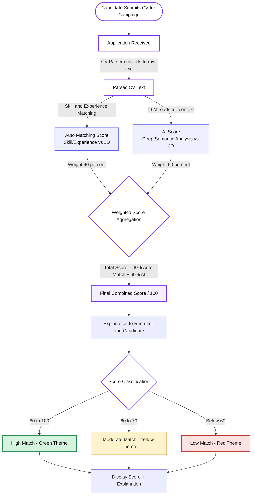
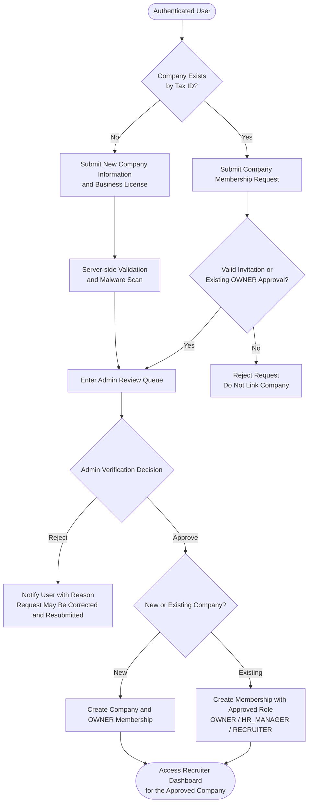

# SmartHire - Vision Document

| Document Metadata | Value |
|---|---|
| Group | 9 |
| Document Owner | Nguyễn Gia Quốc Uy (Student ID: 24127261) |
| Reviewers | Nguyễn Quốc Thành, Ngô Quốc Tuấn, Lưu Chí Hải, Nguyễn Minh Khôi |
| Version | 1.2 (Final PA5 Release Baseline) |
| Last Updated | 2026-08-26 |
| Status | Final Release Baseline |

### Revision History

| Version | Date | Author/Editor | Summary | Status |
|---|---|---|---|---|
| 1.1 | 2026-07-10 | Nguyễn Gia Quốc Uy and Group 9 | Reconciled the project scope, multi-tenant authorization model, feature priorities, measurable quality targets, company-membership workflow, references, and document presentation. | Draft for Team Review |
| 1.2 | 2026-08-26 | Nguyễn Minh Khôi (NFRs & Scope) & Lưu Chí Hải | PA5 Final Document Synchronization: Reconciled 26-feature baseline, NFRs (RBAC, CV privacy, AI advisory constraints, step-up 2FA), explicit out-of-scope boundaries (no DB restore UI, no group chat/attachments), and updated technology stack. | Final Release Baseline |

## Changes from PA1 Proposal & How this document was developed

This Vision Document reflects several deliberate refinements made since the initial 
PA1 proposal, based on deeper technical and product discussions within the team.

- **AI Job Description Generator: Removed.** 
    - Generating a quality JD requires inputting nearly as much detail as writing it manually, providing negligible automation benefit.
- **AI Resume Enhancement & Gap Analysis: Removed / merged.** 
    - Resume rewriting was dropped due to the risk of AI misrepresenting a candidate's actual qualifications.
    - Gap-analysis value is instead delivered through the score explanation already required for the scoring engine (Section 5.3.7), rather than as a separate feature.
- **Application status model: Expanded and clarified.** 
    - PA1's original 5-state model (Applied → Screened → Interviewing → Offered → Hired/Rejected) has been refined into a 9-state canonical pipeline (Applied, Viewed, Shortlisted, Interviewing, Offered, Hired, Offer Declined, Rejected, Waitlisted) to accurately reflect the recruiter decision points identified during workflow design.
- **Employer registration model: Redesigned.** 
    - PA1 assumed a separate employer registration flow. 
    - The current design instead uses a single base Candidate account that can request Recruiter/HR Manager permissions via a multi-tenant company membership model, allowing one user to manage recruitment for multiple companies.
- **Authentication token storage: Changed.** 
    - PA1 proposed storing JWTs in browser localStorage/sessionStorage. 
    - This was revised to HttpOnly, Secure, SameSite cookies to mitigate XSS-based token theft.
- **Job matching: Re-scoped from AI to rule-based.** 
    - What PA1 described as "AI-powered job recommendations" is implemented as tag- and location-based Smart Matching, not semantic AI analysis — the AI/LLM capacity is instead concentrated on CV scoring, where it delivers clearer value.

This Vision Document consolidates sections authored by members of Group 9 and reconciles the product scope, terminology, priorities, and architectural assumptions across the project documentation. Authorship and review credit for each section are recorded below. Open items requiring team confirmation are identified explicitly.

# 1. Introduction

**Author of this Part:** Ngô Quốc Tuấn   
**Student ID:** 24127581

## 1.1. Purpose

This document defines the product vision, positioning, target users, high-level capabilities, constraints, and quality objectives for SmartHire, an AI-assisted applicant tracking system built for small and medium-sized enterprises in Vietnam. It serves as the shared product baseline for requirements, design, implementation, testing, and stakeholder review.

The document is intended for internal use across product, design, development, and quality-assurance functions. It should be consulted during feature discussions, sprint planning, requirements refinement, and stakeholder presentations to maintain alignment between what is being built and why.

## 1.2. Scope and Out of Scope

*Performed by: Nguyễn Minh Khôi | Reviewed by: Lưu Chí Hải | Edited by: Nguyễn Minh Khôi*

### In Scope for the Current Project Release (Features 001–026 Baseline)

- **Identity, Access & Profile (Features 001–005):** Registration, email verification, session management, 2FA (TOTP/backup codes), password recovery, candidate profile, CV upload/parsing, purpose-specific OCR, and image-assisted job search.
- **Home & Engagement (Features 010, 011):** Landing/home page with live projections, professional connection proposals between candidates with privacy controls.
- **Recruiter Operations & ATS Pipeline (Features 007, 012, 015, 020–022):** Recruiter workspace, company-scoped job posting, candidate scoring/filtering with hybrid AI advisory evaluation, 9-stage visual Kanban pipeline, application tracking with private CV match, and recruitment analytics with Excel/CSV data export.
- **Company Governance & Platform Administration (Features 006, 009, 014, 017, 018, 023, 024, 026):** Platform administrator console, user management, company verification enrichment, job-post moderation/enforcement, company settings overview, company team member lifecycle management, and privileged database backup.
- **Messaging & Notifications (Features 008, 013, 016, 019, 025):** Realtime direct messaging (1:1 candidate-to-company / professional connections), message abuse reporting and admin review, in-app and email notifications with transactional outbox, notification deep linking, and application-scoped recruitment thread messaging with Owner read-only oversight.

### Out of Scope / Boundaries for the Final Release

- **No In-App Database Restore UI:** Database backup generates encrypted dumps (AES-256-GCM) and uploads to Google Drive/local store; database restoration is strictly an out-of-band disaster-recovery operation performed by system administrators/DBAs via CLI and scripts to protect data integrity.
- **No Group Chat or Arbitrary File Attachments in Messaging:** Messaging is strictly 1:1 text-based between authorized participants (candidate & recruiter/company or connected peers) with abuse reporting; group conversations and arbitrary media attachments are excluded.
- **No Autonomous AI Hiring/Rejection Decisions:** AI semantic evaluation is strictly advisory; automated rejections or hiring actions are prohibited; deterministic rule-based fallback and human recruiter override are always enforced.
- **No AI Job Description Generation or AI Resume Rewriting:** To prevent hallucinated requirements and qualification distortion.
- **No External Calendar Synchronization, Payroll, or Full HRMS:** SmartHire focuses strictly on talent acquisition and applicant tracking.
- **Late Feature 027 (Candidate Profile Discovery):** Recorded as Release Decision Pending; outside the 26-feature baseline.

## 1.3. References

| # | Source | Description |
|---|---|---|
| 1 | Geoffrey A. Moore, [*Crossing the Chasm*](https://geoffreyamoore.com/book/) | Basis for the product-positioning structure: target customer, unmet need, product category, primary benefit, alternatives, and differentiation. |
| 2 | Eric Ries, [*The Lean Startup*](https://www.penguinrandomhouse.com/books/210088/the-lean-startup-by-eric-ries/) (2011) | Supports the problem-first and hypothesis-validation approach used in the Problem Statement. |
| 3 | Vietnam Ministry of Planning and Investment, [*Voluntary National Review 2023 on the Implementation of the Sustainable Development Goals*](https://fileportalcms.mpi.gov.vn/TinBai/VanBan/2023-08/VNR_Full_Final%28EN%29.pdf) | Provides official context on the composition and importance of SMEs in Vietnam. |
| 4 | [TopCV](https://www.topcv.vn/) and [ITviec](https://itviec.com/) public product pages | Used as representative local job-platform alternatives in the positioning and competitor analysis. |
| 5 | National Assembly of Vietnam, [Law No. 91/2025/QH15 on Personal Data Protection](https://vanban.chinhphu.vn/?classid=1&docid=214590&pageid=27160&typegroup=) | Primary legal reference for personal-data processing and protection; effective from 2026-01-01. |
| 6 | Government of Vietnam, [Decree No. 13/2023/ND-CP on Personal Data Protection](https://vanban.chinhphu.vn/?classid=0&docid=207759&pageid=27160) | Supporting personal-data protection requirements applicable to the system. |

Web references were last accessed on **2026-07-10**.

## 1.4. Glossary

| Term | Definition |
|---|---|
| AI | Artificial Intelligence. In SmartHire, AI provides advisory semantic CV analysis and explanations; it does not make final hiring decisions. |
| ATS | Applicant Tracking System; software used to manage job postings, applications, candidates, and hiring workflows. |
| CV | Curriculum Vitae; a candidate document containing education, experience, skills, and other professional information. |
| JD | Job Description; the responsibilities, requirements, and employment details associated with a job posting. |
| LLM | Large Language Model used by the AI service for contextual CV-to-JD analysis. |
| Multi-tenant | An authorization model in which company data is isolated and access is granted through a company-specific membership. |
| P0 / Must | Capability required for the current project release to support the end-to-end core workflow. |
| P1 / Should | Important capability planned after P0 requirements are stable; it may be deferred without breaking the core workflow. |
| RBAC | Role-Based Access Control; authorization based on platform roles and company-scoped membership roles. |
| SME | Small or Medium Enterprise. SmartHire targets Vietnamese SMEs with relatively small recruitment teams. |

# 2. Positioning

**Author of this Part:** Ngô Quốc Tuấn   
**Student ID:** 24127581

This section uses a Problem Statement to define the need and a Product Position Statement to define SmartHire's target market, primary value, alternatives, and differentiation.

## 2.1. Problem Statement

| Field | Details |
|---|---|
| **The problem of** | Vietnamese SMEs managing recruitment manually via disconnected tools (email, spreadsheets) without a structured tracking, screening, or evaluation system. This leads to fragmented, duplicated candidate data and loss of institutional knowledge when recruiters leave. |
| **Affects** | - **Recruiters & HR staff** wasting time on repetitive administrative tasks instead of high-value sourcing/engagement.<br>- **Hiring managers** lacking visibility into candidate pipelines and evaluation contexts.<br>- **Job candidates** facing poor, delayed updates, which damages the employer's brand.<br>- **Business leadership** unable to make data-driven decisions due to a lack of structured recruitment analytics. |
| **The impact of which is** | - **Inefficient hiring:** Manual CV screening is slow and prone to bias or errors.<br>- **Candidate stagnation:** Strong early applicants are missed or forgotten due to the lack of objective scoring.<br>- **Low productivity:** Recruiters burn out from copy-pasting data, reformatting CVs, and manual email tasks.<br>- **Weakened talent brand:** Poor candidate communication hurts the company's reputation.<br>- **Zero optimization:** Without structured historical data, the business cannot track performance or improve its funnel. |
| **A successful solution would be** | A lightweight, user-friendly web platform that:<br>- Automates CV screening and scoring.<br>- Provides a visual recruitment pipeline (Kanban board).<br>- Automates candidate status communications.<br>- Adds P1 recruitment analytics and data export after the core workflow is stable.<br>- Connects candidates to jobs via Smart Matching.<br>Success is defined by cutting administrative tasks by 80%, ensuring no candidates are missed, and enabling zero-setup adoption for SMEs. |

## 2.2. Product Position Statement

| Field | Details |
|---|---|
| **For** | Vietnamese SMEs (10–500 employees) actively hiring but lacking a structured recruitment system, or the budget/IT capacity for complex enterprise HR software. |
| **Who** | Struggle with high volumes of unstructured job applications, manual CV screening, lack of candidate-ranking standards, and poor pipeline visibility (relying on scattered emails/spreadsheets). |
| **The SmartHire** | An AI-assisted, zero-install ATS and Smart Job Matching web platform, purpose-built for the Vietnamese SME market and candidate job discovery. |
| **That** | Provides recruiters with a visual Kanban pipeline, auto-scored CVs, and automated status emails, while matching job seekers with relevant roles based on profile tags and CV preferences. |
| **Unlike** | - **Enterprise ATS (Workday, Greenhouse):** Too complex, expensive, and oversized for SME recruitment teams.<br>- **Generic job boards (TopCV, ITviec):** Focus only on candidate sourcing without managing or tracking candidates after application.<br>- **Manual methods (Email + Excel):** Highly inefficient, prone to human error, and lacks auditable data/analytics. |
| **Our product** | Offers a unified workflow: recruiters post roles, auto-score applications, and manage candidates visually; candidates upload CVs and receive instant, tailored job matches. This ecosystem drives network effects: a larger database of matched candidates continuously improves hiring quality and speed. |

**Core differentiators:**
- Smart Job Matching Recommendation (rule-based tags/location)
- Structured ATS pipeline for recruiters
- Automated candidate communication
- Planned recruitment analytics and data export for administrators and recruiters

# 3. Stakeholder and User Descriptions

**Author of this Part:** Nguyễn Quốc Thành   
**Student ID:** 24127542

## 3.1. Stakeholder Summary

**Stakeholders** are individuals, groups, or organizations that influence the development of the recruitment platform or are affected by its operation. The main **stakeholders** include _the project owners, development team, candidates, recruiters, hiring companies, platform administrators, and external service providers._

| Stakeholder | Type | Role and interest | Influence |
| ----------- | ---- | ----------------- | ----------- |
| Project Owner / Product Owner | Internal | Defines the product vision, project scope, feature priorities, and expected business value. | High |
| Development Team | Internal | Designs, implements, tests, deploys, and maintains the system, including the AI-assisted candidate scoring module. | High |
| Recruiters / HR Managers | External | Create job postings, review applicants, manage recruitment pipelines, and communicate with candidates. | High |
| Hiring Companies | External | Use the platform to advertise vacancies and recruit suitable candidates efficiently. | High |
| Candidates / Job Seekers | External | Build professional profiles, search for jobs, submit applications, and monitor application progress. | Medium |
| Platform Administrators | Internal | Verify recruiters, moderate job postings, manage user accounts, and maintain platform safety. | Medium |
| Project Supervisor / Academic Reviewer | External | Reviews project quality, requirements, design decisions, implementation, and documentation. | Medium |
| Third-party Service Providers | External | Provide services such as email delivery, file storage, cloud infrastructure, and AI APIs. | Low to Medium |

### 3.1.1. Stakeholder Analysis

The **Product Owner, Development Team,** and **Recruiters** have the greatest influence because they directly determine the system requirements, technical implementation, and operational value of the platform.

Candidates have high interest because the system directly affects their job-search experience, although they normally have less influence over product decisions. Administrators ensure the platform remains trustworthy by preventing fraudulent recruiters, misleading job postings, and abusive behavior.

## 3.2. User Persona Summary

The platform has three primary user groups: Candidates, Recruiters/HR Managers, and Administrators. Each group has different goals, technical abilities, permissions, and usage patterns.

### 3.2.1. Candidate

| Attribute | Description |
| --- | --- |
| User profile | University students, recent graduates, unemployed users, and working professionals seeking new opportunities. |
| Primary goal | Find suitable jobs and complete applications efficiently. |
| Main problems | Repetitive application forms, irrelevant search results, unclear application status, and limited feedback from recruiters. |
| Technical ability | Basic to high familiarity with websites, mobile applications, job portals, and professional networking platforms. |
| Main activities | Register, build profile, upload CV, search for jobs, save jobs, apply, and track application status. |
| Expected outcome | Successfully obtain a suitable job and receive clear updates during the recruitment process. |

### 3.2.2. Recruiter / HR Manager

| Attribute | Description |
| --- | --- |
| User profile | HR employees, recruitment specialists, hiring managers, and authorized company representatives. |
| Primary goal | Find qualified candidates and manage recruitment activities efficiently. |
| Main problems | Large numbers of applications, manual CV screening, scattered candidate information, and slow communication. |
| Technical ability | Medium to high; normally familiar with office software, recruitment platforms, CRM systems, or ATS products. |
| Main activities | Request recruiter verification, create/link company account, create job posts, review applicants, evaluate candidates, update pipeline stages, and export reports. |
| Expected outcome | Hire suitable candidates while reducing screening time and recruitment workload. |

### 3.2.3. Platform Administrator

| Attribute | Description |
| --- | --- |
| User profile | Internal personnel responsible for system operation, content moderation, and account management. |
| Primary goal | Maintain platform quality, security, reliability, and trust. |
| Main problems | Fraudulent recruiters, misleading job posts, spam, policy violations, and manual moderation workload. |
| Technical ability | High; familiar with administrative dashboards and system management tools. |
| Main activities | Verify recruiters, approve job posts, process & export reports, suspend accounts, monitor platform statistics, and review audit logs. |
| Expected outcome | Maintain a safe recruitment environment with legitimate users and reliable job information. |

## 3.3. User Environment

The recruitment platform is a responsive web application. Its interface and technical design must support different devices, software platforms, and specific usage contexts for each user group.

### 3.3.1. Environmental Factors Summary

| Environment factor | User group | Description |
| :--- | :--- | :--- |
| **Device** | Candidates | Primarily smartphones (70% of search traffic) and laptops. The job-search and application interfaces must be mobile-friendly. |
| **Device** | Recruiters | Primarily desktop computers and laptops because recruitment dashboards, applicant tables, and Kanban boards require larger screens for data-dense viewing. |
| **Device** | Administrators | Primarily desktop computers for moderation queues, account management, and analytics. |
| **Operating system** | All users | Windows, macOS, Android, and iOS. |
| **Browser** | All users | Recent versions of Chrome, Edge, Firefox, and Safari. |
| **Network** | All users | The system should operate under normal home, university, office, and mobile network (3G/4G/5G) conditions. |
| **Usage location** | Candidates | Home, university, workplace, or transit/mobile environments. |
| **Usage location** | Recruiters | Company offices or quiet remote-working environments. |
| **Usage frequency** | Candidates | Periodic or frequent use during active job searching. |
| **Usage frequency** | Recruiters | Daily use during active recruitment campaigns. |
| **Usage frequency** | Administrators | Daily or scheduled operational use. |
| **File handling** | Candidates | CV upload in PDF or DOCX format, with a maximum size of 5 MB. |
| **Data sensitivity** | All users | Personal information, CVs, contact details, company documents, evaluation notes, and application records must be protected. |
| **Notifications** | All users | Notifications should be sent to users via email and in-app notifications to keep them updated on the latest information. |

### 3.3.2. Task Complexity and Team Size

*Note: figures in this subsection (team size, cycle duration, time allocation) are team estimates based on general SME hiring norms, not measured data from a specific survey or company.*

*   **Recruitment Team Size:** In a typical Small and Medium Enterprise (SME) target user environment, a single hiring task involves **2 to 5 people** (1-2 HR/Recruitment specialists sourcing candidates, and 1-3 Hiring Managers/Technical Leads reviewing profiles and conducting interviews). The application must support collaborative candidate evaluation and status updates without data override conflicts.
*   **Trend:** As SMEs grow, the number of collaborators increases, requiring role delegation (e.g., OWNER vs. RECRUITER) to manage access rights.

### 3.3.3. Task Cycle and Activity Time Allocation
*   **Recruitment Cycle:** A typical recruitment campaign task cycle lasts from **15 to 45 days** (from job posting creation to final hiring confirmation).
*   **Time Spent on Activities:**
    *   **Recruiters:** Spend **70%** of their daily recruitment time on manual CV screening and initial evaluation, and **30%** on interview coordination and feedback collection. The platform aims to reduce CV screening time to under 10% using the AI-assisted scoring system.
    *   **Candidates:** Spend an average of **5 to 10 minutes** to complete and submit a single job application. The interface must minimize friction to prevent application abandonment.

### 3.3.4. Unique Environmental Constraints
*   **On-the-go Candidates:** Candidates often browse jobs on public transport or under unstable mobile data networks (3G/4G). The frontend must be lightweight, support fast page loading (≤ 3s), and implement auto-save forms to prevent data loss on network drops.
*   **Data-Dense Recruiter Workspaces:** Recruiters work on multi-tab browsers and high-resolution monitors. The dashboard needs to display high-density tables and clear visual indicators (such as the Kanban board) to help them quickly scan candidate status amidst office distractions.

### 3.3.5. Platform Integration and Interoperability
To fit into the existing workflow of SMEs, the application must interact with other standard office tools:
*   **Email Systems:** Integration with standard mail protocols to deliver automated application status updates to Gmail and Outlook.
*   **Office Productivity Suites:** Capability to export candidate lists and analytics to CSV and Microsoft Excel (`.xlsx`) for internal company reporting.
*   **Calendars:** In future updates, the application should plan for integrations with external calendars (like Google Calendar) to sync interview schedules.

## 3.4. Summary of Key Stakeholder and User Needs

### 3.4.1. Key Problems and Desired Solutions

| Problem | Reasons for the Problem | Current Workaround (How it is solved now) | Desired Solution (What solution is wanted) | Relative Importance |
| :--- | :--- | :--- | :--- | :--- |
| **Recruiters spend too much time screening CVs manually.** | CVs are unstructured; comparing skills with job descriptions is subjective and slow. | Reading CVs one by one, using simple Ctrl+F keywords, or outsourcing initial screening. | An AI-powered hybrid scoring algorithm to automatically rank CVs based on skills/experience. | **Critical (P0 / Must)** |
| **Candidates face lack of transparency in application status.** | Recruiters rarely update candidates on progress, leading to anxiety and ghosting. | Keeping manual spreadsheets; sending follow-up emails that go unanswered. | A real-time status tracker tied to a Kanban board and automated notifications at each stage. | **Critical (P0 / Must)** |
| **High risk of fake recruiters and spam job postings.** | Anyone can register and post jobs without verification of business legitimacy. | Reactive reporting after candidates get scammed; manual post-moderation. | Mandatory recruiter business license verification (Tax ID) and Admin approval queues. | **Critical (P0 / Must)** |
| **Fragmented recruitment coordination within hiring teams.** | Recruiters, HR staff, and Hiring Managers communicate through separate chat applications or email. | Sharing Excel sheets, printing CVs, or holding lengthy synchronization meetings. | An interactive Kanban board serving as a shared pipeline for status updates and comments. | **Critical (P0 / Must)** |
| **Repetitive application process for candidates.** | Most job portals redirect to external sites, forcing candidates to re-enter data manually. | Copy-pasting data from resume text into custom application forms repeatedly. | Profile data reuse (1-click apply) and automated parsing of uploaded CVs. | **Critical (P0 / Must)** |

### 3.4.2. Detailed Stakeholder and User Needs List

The following requirements map the identified needs to user groups. **Must** corresponds to **P0** and is required for the core release; **Should** corresponds to **P1** and is implemented after P0 capabilities are stable.

| ID | User or stakeholder | Priority | Need | Description |
| :--- | :--- | :--- | :--- | :--- |
| NEED-01 | Candidate | Must | Secure account management | Register, log in, recover passwords, and manage accounts securely. |
| NEED-02 | Candidate | Must | Complete professional profile | Manage personal info, education, work experience, and skills. |
| NEED-03 | Candidate | Must | CV management | Upload, view, replace, and delete CV. |
| NEED-04 | Candidate | Must | Relevant job discovery | Search and filter jobs by keyword, location, salary, experience, and job type. |
| NEED-05 | Candidate | Must | Simple application process | Reuse existing profile/CV info to reduce repetitive data entry. |
| NEED-06 | Candidate | Must | Application transparency | See the real-time status of each submitted application. |
| NEED-07 | Candidate | Must | Timely notifications | Receive updates when recruiters change application status. |
| NEED-08 | Recruiter | Must | Job-post management | Create, save, edit, publish, close, and extend job postings. |
| NEED-09 | Recruiter | Must | Applicant management | View applicants and access their profiles, CVs, and cover letters. |
| NEED-10 | Recruiter | Must | Candidate ranking | Compare candidate qualifications with job requirements and sort applicants. |
| NEED-11 | Recruiter | Must | Recruitment pipeline | Recruiters must be able to move candidates through stages such as Applied, Viewed, Shortlisted, Interviewing, Offered, Hired, Offer Declined, Rejected, and Waitlisted. |
| NEED-12 | Recruiter | Should | Candidate evaluation | Write feedback notes and assign evaluation ratings. |
| NEED-13 | Recruiter | Must | Automated communication | Automatic email and in-app notifications triggered by pipeline status changes. |
| NEED-14 | Administrator | Must | Recruiter verification | Verify company registration documents before allowing job publication. |
| NEED-15 | Administrator | Must | Job moderation | Approve, reject, or request revision of job postings. |
| NEED-16 | Administrator | Must | User management | Search, suspend, and reactivate user accounts. |
| NEED-17 | Administrator | Must | Backend auditability | Record security-sensitive administrative and recruitment actions in system logs. |
| NEED-18 | Product Owner | Should | Business visibility | Dashboard showing platform growth, active postings, and conversion rates. |
| NEED-19 | Development Team | Must | Maintainable architecture | Modular components, consistent REST APIs, and decoupled state management. |
| NEED-20 | All users | Must | Privacy and security | Secure personal data and CV files against unauthorized access. |

## 3.5. Alternative and Competing Solutions

The platform competes with both job-search websites and Applicant Tracking Systems. It may also replace manual recruitment methods, in-house builds, and informal channels currently used by small organizations.

| Alternative or Competitor | Category | Main Strengths | Limitations or Opportunity for SmartHire |
|---|---|---|---|
| LinkedIn | Professional networking and recruitment platform | Established professional networks, company pages, a large talent pool, and strong brand recognition. | Paid recruiter services and sponsored posts may be costly for SMEs, while post-application tracking still requires a separate workflow. |
| Indeed | Job-search and job-advertising platform | Broad reach and a straightforward job-posting experience. | Primarily supports candidate acquisition; growing application volumes may still require export to email, spreadsheets, or an ATS. |
| TopCV / VietnamWorks / CareerViet / ITviec | Local job platforms | Familiar Vietnamese recruitment brands, local job coverage, and established candidate audiences. | Applications remain separated by platform, making it difficult for recruiters to maintain a unified cross-source pipeline. |
| Greenhouse / Lever | Applicant Tracking Systems | Structured pipelines, interview workflows, integrations, and mature recruitment operations. | Pricing, configuration, and operational complexity may be difficult to justify for SMEs with small recruitment teams. |
| Workday | Enterprise HR and ATS platform | Broad HR capabilities, compliance support, analytics, and enterprise reporting. | Implementation cost, setup effort, and required IT support are generally beyond the needs of the target SME segment. |
| In-house build | Custom internal solution | Can be tailored to an organization's current processes and data model. | Requires continuing development and maintenance capacity and creates knowledge-continuity risks when key developers leave. |
| Spreadsheets and email | Manual status quo | Familiar, flexible, and inexpensive to start. | Candidate records become duplicated or outdated, there is no reliable single source of truth, and follow-up remains manual. |
| Social media groups (Facebook, Zalo groups) | Informal recruitment alternative | Low-cost distribution and access to passive candidates. | Limited identity and job-post verification; screening through comments and direct messages does not scale reliably. |
| Company career pages | Direct recruitment channel | Full control over employer branding and the candidate-facing experience. | Limited organic reach and no replacement for the internal application-management workflow provided by an ATS. |

# 4. Product Overview

**Author of this Part:** Nguyễn Minh Khôi<br>
**Student ID:** 24127066 <br>
**Modify based on feedback PA2:** Nguyễn Quốc Thành<br>
**Student ID:** 24127542

<i>**Objective:** Revise the Product Overview by removing implementation-specific details and presenting SmartHire at a high level, focusing on its purpose, target users, core capabilities, product scope, and the advisory role of AI in recruitment decisions.</i>

SmartHire is a web-based recruitment platform designed to support Vietnamese small and medium-sized enterprises in managing recruitment activities through a centralized and structured workflow.

The platform connects candidates, recruiters, company representatives, and platform administrators throughout the recruitment lifecycle. Candidates can maintain professional profiles, upload CVs, discover suitable job opportunities, submit applications, and monitor their application progress. Recruiters can manage job postings, review applicants, organize candidates through recruitment stages, and use advisory scoring information to support candidate evaluation. Administrators maintain platform trust through company verification, job-post moderation, account management, and security oversight.

SmartHire aims to reduce the fragmented recruitment processes commonly handled through email, spreadsheets, separate job platforms, and manual communication. By combining job discovery, applicant tracking, recruitment coordination, notifications, and AI-assisted candidate evaluation within one platform, the product helps recruitment teams improve efficiency while providing candidates with a clearer and more transparent application experience.

AI-generated scores and explanations are used only as decision-support information. They do not automatically reject, progress, or hire candidates. Final recruitment decisions remain under the control of authorized recruiters and hiring representatives.

## 4.1. Product Perspective

SmartHire operates as a standalone, responsive recruitment platform that serves three primary user groups:

* **Candidates**, who create professional profiles, manage CVs, search for approved job opportunities, submit applications, and track recruitment progress.
* **Recruiters and company representatives**, who manage company job postings, review applications, evaluate candidates, and coordinate recruitment pipelines.
* **Platform administrators**, who verify companies and recruiter access, moderate job postings, manage accounts, and oversee platform security and reliability.

The product provides a shared recruitment environment in which candidate information, job postings, applications, evaluation results, and recruitment-stage updates are managed consistently. Access to company recruitment data is restricted to authorized members of the relevant company.

SmartHire also relies on external services for email delivery and AI-assisted candidate analysis. Temporary failure of an external service should not prevent users from accessing unaffected core recruitment functions.

## 4.2. High-Level Product Capabilities

SmartHire provides the following high-level capabilities:

### Candidate Experience

Candidates can create and maintain reusable professional profiles, upload supported CV files, search for approved jobs, submit applications, and monitor application statuses from a single account.

### Recruiter and Company Management

Authorized company members can create and manage job postings, review applicants, compare candidate information, and organize applications through a structured recruitment pipeline.

### Candidate Evaluation Support

The platform provides deterministic matching and AI-assisted analysis to generate advisory candidate-job compatibility scores and understandable explanations. These results support recruiter review but do not replace human judgment.

### Communication and Transparency

Email and in-app notifications inform users about important events such as account verification, application submission, recruitment-stage changes, moderation decisions, and system actions.

### Administration and Platform Trust

Administrators can verify companies and recruiter access, moderate job postings, manage user accounts, investigate violations, and review important audit records.

### Reporting and Analytics

Recruitment analytics and permitted data-export capabilities are planned as secondary capabilities after the core candidate, recruiter, and administrative workflows are stable.

## 4.3. Product Boundaries

The current SmartHire release focuses on the core recruitment workflow from candidate profile creation and job publication to application review and hiring-stage management.

The current release does not include:

* Fully automated candidate rejection or hiring decisions.
* AI-generated job descriptions.
* AI-based CV rewriting or qualification enhancement.
* Payroll, employee onboarding, or complete human-resource management.
* External calendar synchronization.
* Semantic AI job recommendations.

Job recommendations are based on structured information such as skills, preferences, tags, job type, and location. Recruitment analytics and data export may be deferred if the required core workflow has not reached sufficient stability.

## 4.4. Assumptions and Dependencies

The product is based on the following high-level assumptions:

* Users have access to an internet-connected device and a modern web browser.
* Candidates provide accurate profile information and upload CVs in supported formats.
* Recruiters provide legitimate company documents and accurate job-posting information.
* Administrators perform verification and moderation activities within a reasonable operational period.
* AI-generated results are treated as advisory information rather than final recruitment decisions.

The product depends on:

* An email-delivery service for verification, password recovery, and recruitment notifications.
* An AI service for semantic candidate-job analysis and score explanations.
* Secure document storage for CVs and company-verification files.
* Reliable application hosting and persistent data storage.
* Applicable Vietnamese personal-data protection requirements.

External-service interruptions may temporarily affect related features. However, failure of email delivery or AI processing should not corrupt recruitment data or block unrelated platform operations.

# 5. Product Features

**Author of this Part:** Nguyễn Gia Quốc Uy   
**Student ID:** 24127261

## 5.1. Feature Overview
The table below summarizes the high-level feature groups of the SmartHire system. Each group may include multiple sub-features, which are described in the following section.

**Priority scheme:**

- **P0 (Must):** required for the current project release and the end-to-end recruitment workflow.
- **P1 (Should):** important but implemented only after P0 capabilities are stable; it may be deferred without breaking the core workflow.

## 5.2. Detailed Feature List

**Modify based on feedback PA2:** Nguyễn Quốc Thành<br>
**Student ID:** 24127542 <br>
**Reviewer Name:** Nguyễn Gia Quốc Uy

| No. | Group Feature                                      | Short Description                                                                                                                                              | Business Rationale                                                                                                                        | Primary Beneficiaries                                       | Priority    |
| --: | -------------------------------------------------- | -------------------------------------------------------------------------------------------------------------------------------------------------------------- | ----------------------------------------------------------------------------------------------------------------------------------------- | ----------------------------------------------------------- | ----------- |
|   1 | **Authentication, Authorization & Access Control** | Allows users to register and log in securely, supports email verification and password recovery, and enforces platform-level and company-scoped authorization. | Protects personal and recruitment data while preventing unauthorized access and cross-company data exposure.                              | All users                                                   | P0 (Must)   |
|   2 | **Account Setup & Management**                     | Allows users to update non-critical account information, profile images, and preferences. Password changes remain part of P0 authentication security.          | Enables users to maintain accurate account information and communication preferences without requiring administrative support.            | Candidates and recruiters                                   | P1 (Should) |
|   3 | **Candidate Profile Management**                   | Allows candidates to build a professional profile through a form or CV upload, with a CV parser that standardizes data for applications and scoring.           | Reduces repetitive data entry and provides structured candidate information for more consistent application and evaluation processes.     | Candidates and recruiters                                   | P0 (Must)   |
|   4 | **Job Board & Advanced Search**                    | Allows candidates to search, filter, view, save, share, report, and apply to approved job postings.                                                            | Helps candidates discover more relevant opportunities and allows companies to receive applications from more suitable candidates.         | Candidates and hiring companies                             | P0 (Must)   |
|   5 | **Job Posting Management**                         | Allows company-authorized recruiters to create, preview, edit, and manage the lifecycle of job postings.                                                       | Centralizes vacancy management and provides structured job information for searching, matching, and candidate screening.                  | Recruiters and hiring companies                             | P0 (Must)   |
|   6 | **Application Tracking (Candidate Side)**          | Allows candidates to track saved jobs, submitted applications, scoring progress, and recommended jobs.                                                         | Improves application transparency and reduces uncertainty and manual follow-up for candidates.                                            | Candidates                                                  | P0 (Must)   |
|   7 | **Candidate Screening & Hybrid Scoring System**    | Combines deterministic skills/experience matching with AI-assisted semantic analysis to score and rank applicants for a job posting.                           | Helps recruiters prioritize applications and apply more consistent initial screening criteria while retaining human decision-making.      | Recruiters and hiring managers                              | P0 (Must)   |
|   8 | **Recruitment Pipeline Kanban Board**              | Provides a drag-and-drop interface for authorized company members to track and update application stages.                                                      | Replaces fragmented spreadsheet tracking and improves recruitment coordination, visibility, and collaboration.                            | Recruiters and hiring managers                              | P0 (Must)   |
|   9 | **Automated Notifications & In-App Alerts**        | Sends email and in-app notifications when relevant application or moderation events occur.                                                                     | Reduces repetitive communication work and ensures users receive timely information about important events.                                | Candidates, recruiters, and administrators                  | P0 (Must)   |
|  10 | **Job Posting Moderation & Quality Assurance**     | Allows administrators to approve or reject job postings and handle spam or violation reports.                                                                  | Reduces fraudulent, misleading, and low-quality job content and improves trust in the platform.                                           | Candidates, administrators, and legitimate hiring companies | P0 (Must)   |
|  11 | **User Management & Employer Verification**        | Allows administrators to find user accounts, verify company documents, approve memberships, and handle violations.                                             | Prevents fake recruiter accounts, company impersonation, unauthorized company access, and recruitment fraud.                              | Candidates, administrators, and hiring companies            | P0 (Must)   |
|  12 | **Recruitment Analytics & Data Export**            | Provides dashboards, recruitment statistics, and CSV/Excel exports for authorized users.                                                                       | Helps organizations evaluate recruitment performance, identify pipeline bottlenecks, and make decisions using structured historical data. | Recruiters, company owners, and administrators              | P1 (Should) |


## 5.3. Feature Descriptions

### 5.3.1. Authentication, Authorization & Access Control
This feature group covers registration, authentication, session security, and authorization. A standard user retains candidate capabilities and may also receive `OWNER`, `HR_MANAGER`, or `RECRUITER` permissions through an approved membership in one or more companies. Recruitment permissions are therefore scoped to a company rather than stored as a replacement for the user's candidate identity. Platform Administrators hold a separate platform-level role for verification, moderation, account management, and audited support operations. The backend validates both the user's platform role and active company membership before granting access to company data.

### 5.3.2. Account Setup & Management
This feature allows users to manage contact details, profile images, preferences, and other non-critical account information. Company information is managed separately and only by members with the required company-scoped permission. Password and session-security operations remain part of the P0 authentication feature group.

### 5.3.3. Candidate Profile Management
This feature allows candidates to create a structured professional profile through a form or by uploading a PDF or DOCX CV. The CV parser extracts profile data for candidate review and reuse in applications and provides normalized text to the matching and scoring service.

### 5.3.4. Job Board & Advanced Search
This feature provides a public catalogue of approved job postings. Candidates can search and filter by criteria such as salary, experience, location, job type, and relevant tags, then view, save, share, report, or apply to a posting.

### 5.3.5. Job Posting Management
This feature allows company-authorized recruiters to create, preview, edit, submit, publish, close, and extend job postings according to the approved lifecycle. Structured requirements such as skills, experience, salary range, location, and job type provide input to search, matching, and candidate screening.

### 5.3.6. Application Tracking (Candidate Side)
This feature provides candidates with a consolidated view of saved jobs, submitted applications, scoring progress, and rule-based job recommendations. The canonical recruitment stages are **Applied**, **Viewed**, **Shortlisted**, **Interviewing**, **Offered**, **Hired**, **Offer Declined**, **Rejected**, and **Waitlisted**. AI-processing progress is displayed separately through `scoring_status` and does not alter the recruitment stage.

### 5.3.7. Candidate Screening & Hybrid Scoring System
This feature evaluates candidate applications for a specific job posting through a hybrid approach that combines rule-based skills and experience matching with AI-assisted semantic CV analysis. It produces a compatibility score and explanation to support recruiter review, while leaving all progression and hiring decisions under human control.

### 5.3.8. Recruitment Pipeline Kanban Board
This feature provides authorized company members with a visual representation of applications by recruitment stage. Dragging a candidate card to an allowed stage updates the application transactionally, records the actor and time, and triggers any configured notifications.

### 5.3.9. Automated Notifications & In-App Alerts
This feature communicates application and moderation events without requiring users to poll the system manually. When an authorized recruiter changes an application stage, the system records the event and sends the configured email and in-app notification while preventing duplicate delivery.

### 5.3.10. Job Posting Moderation & Quality Assurance
This feature allows Administrators to review job postings for legitimacy, completeness, spam, and policy violations. A new posting remains unavailable on the public job board until an Administrator approves it; rejection and revision requests include a recorded reason.

### 5.3.11. User Management & Employer Verification
This feature allows Administrators to search user accounts, perform audited support or enforcement actions, verify company documents, and review company-membership requests. A tax-ID match never grants access automatically: joining an existing company also requires a valid invitation or approval from an existing `OWNER` before final administrative verification.

### 5.3.12. Recruitment Analytics & Data Export
This P1 feature provides authorized recruiters with company-scoped metrics such as posting views, application counts, stage conversion, and successful hires. Administrators receive platform-level aggregate metrics. Authorized users may export permitted data to CSV or Excel without gaining access to records outside their tenant or platform role.

## 5.4. Key User Workflows

### 5.4.1. Hybrid CV Scoring System

**Author:** Ngô Quốc Tuấn   
**Student ID:** 24127581  

---

#### Description

The scoring system uses a hybrid algorithm that combines automatic skill/experience matching (Auto Matching) with AI-based CV analysis (LLM) to evaluate how well a candidate fits the JD.

**Scoring formula:**

```
Final Score = 40% × Auto Matching Score + 60% × AI Score
```

**Score classification (out of 100):**

| Score Range | Match Level | Color Theme |
|---|---|---|
| 80 - 100 | High Match | 🟢 Green |
| 60 - 79 | Moderate Match | 🟡 Yellow |
| 0 - 59 | Low Match | 🔴 Red |

#### Flowchart



#### Step-by-Step Explanation

1. **Application Received**: The candidate submits a CV and cover letter for a specific recruitment campaign.
2. **Parsed CV Text**: The CV Parser converts the original CV into normalized raw text.
3. **Auto Matching Score**: An algorithm directly compares the skills/experience in the CV against the JD requirements.
4. **AI Score**: An LLM reads the entire text, understands deep context (handling abbreviations and mixed languages), and compares it against the JD to score each criterion in detail.
5. **Weighted Score Aggregation**: The two scores are combined using a weighted formula: 40% (Auto) / 60% (AI).
6. **Final Combined Score**: The final aggregated score on a scale of 100.
7. **Score Explanation Generation**: The LLM generates a human-readable explanation describing why the candidate received that score, identifying strengths and gaps
8. **Score Classification**: The score is classified and assigned a color theme (green/yellow/red) based on thresholds for visual display.
9. **Display Score**: The score and explanation are displayed to the recruiter and candidate


### 5.4.2. Recruiter Verification & Company Role Assignment

This workflow governs how a standard user receives company-scoped recruitment permissions under the multi-tenant model described in Section 5.3.1. Approval creates a company membership; it does not replace the user's candidate identity. A tax-ID match is used only to identify an existing company and never grants membership automatically.



**Authorization safeguards:** joining an existing company requires a valid invitation or explicit approval from an existing `OWNER`, followed by Admin verification. New-company requests require validated company information and a malware-scanned business document. All approval, rejection, role-change, and revocation events are written to the backend audit log.

**Post-approval lifecycle:** a membership may later change when an Administrator revokes access, a user leaves a company, an `OWNER` transfers ownership, or the company is deactivated. Company deactivation unpublishes its job postings and disables its memberships. The user's candidate profile remains unaffected because only company-scoped permissions change.

**Design rationale:** recruitment permissions remain outside the user's core identity because one person may recruit for multiple companies simultaneously. Storing a single recruiter role directly on the user record would not represent that relationship or enforce tenant isolation correctly.


# 6. Non-Functional Requirements

*Performed by: Nguyễn Minh Khôi | Reviewed by: Lưu Chí Hải | Edited by: Nguyễn Minh Khôi*

## 6.1. Overview

*Performed by: Nguyễn Minh Khôi | Reviewed by: Lưu Chí Hải | Edited by: Nguyễn Minh Khôi*

The following non-functional requirements define the quality attributes, operational constraints, and engineering standards of the SmartHire Recruitment Platform. Unlike functional requirements, these requirements describe how well the system performs rather than what it does.

These requirements apply across all major functional modules, including authentication, candidate profile management, AI-powered CV analysis, job posting management, recruitment pipelines, realtime messaging, notifications, analytics/export, and administrative functions.

## 6.2. Performance Requirements

*Performed by: Nguyễn Minh Khôi | Reviewed by: Lưu Chí Hải | Edited by: Nguyễn Minh Khôi*

The platform shall provide responsive interactions under the following acceptance-test baseline unless a test case states otherwise:

- production build deployed in the staging environment;
- 100 concurrent active users;
- seeded data containing at least 10,000 users, 20,000 job postings, and 100,000 applications;
- simulated client network of at least 10 Mbps download, 2 Mbps upload, and 100 ms round-trip latency;
- response-time targets evaluated at the 95th percentile (P95) over a 15-minute test; and
- HTTP error rate below 1%, excluding intentionally rejected validation and authorization requests.

| ID | Requirement | Acceptance Target |
|---|---|---|
| PERF-01 | Public page loading | The primary content becomes usable within 3 seconds under the baseline client network. |
| PERF-02 | Dashboard navigation | P95 ≤ 2 seconds. |
| PERF-03 | Job search and filtering | P95 ≤ 2 seconds. |
| PERF-04 | Login and registration | P95 ≤ 3 seconds, excluding email-delivery time. |
| PERF-05 | Candidate profile update | P95 ≤ 2 seconds. |
| PERF-06 | Kanban drag-and-drop update | Visual feedback ≤ 500 ms and server persistence P95 ≤ 2 seconds. |
| PERF-07 | In-app notification & messaging delivery | P95 ≤ 2 seconds over WebSocket (Socket.IO) and ≤ 5 seconds for transactional outbox persistence. |
| PERF-08 | CSV/Excel export | Completed within 10 seconds for up to 10,000 records using background export worker (ExcelJS). |
| PERF-09 | AI semantic scoring | P95 ≤ 30 seconds for a supported CV of up to 5 MB; processing remains asynchronous and never blocks the user interface. |

If an asynchronous AI request exceeds the target, the system shall keep the scoring status visible, allow other application activities to continue, and notify the user when processing completes or fails.

AI processing shall use a separate `scoring_status` (`Pending`, `Processing`, `Completed`, or `Failed`) rather than adding a temporary value to the canonical recruitment pipeline status.

## 6.3. Scalability Requirements

*Performed by: Nguyễn Minh Khôi | Reviewed by: Lưu Chí Hải | Edited by: Nguyễn Minh Khôi*

The architecture shall meet the following capacity baseline without a major redesign:

The system shall:

- store at least 10,000 registered users, 20,000 job postings, and 100,000 applications.
- support at least 200 simultaneous active users with an HTTP error rate below 1% and P95 response times no more than 20% above the 100-user performance baseline.
- support at least 20 active recruiters within one company without lost updates or cross-company data exposure.
- allow stateless frontend and API instances to be horizontally scaled without changing business logic.
- support database growth through documented indexes, query plans, pagination, and archival procedures.
- support migration to a cloud deployment through environment-based configuration rather than source-code changes.

The AI integration shall be isolated behind a provider interface so that a supported provider or local model can be replaced without changing recruitment-domain logic.

## 6.4. Availability and Reliability

*Performed by: Nguyễn Minh Khôi | Reviewed by: Lưu Chí Hải | Edited by: Nguyễn Minh Khôi*

The SmartHire platform shall provide reliable operation for both recruiters and candidates.

### Availability

- Monthly uptime target: **99.5%**, excluding planned maintenance announced at least 24 hours in advance.
- Recovery Time Objective (RTO): **≤ 60 minutes** after a failed deployment or recoverable infrastructure incident.
- Recovery Point Objective (RPO): **≤ 24 hours** for persistent application data.
- Every production deployment shall have a documented rollback procedure that is tested before final release.

### Reliability

The system shall:

- prevent data corruption during unexpected failures.
- preserve uploaded CV files and verification artifacts with cryptographic integrity checks.
- ensure recruitment pipeline states remain consistent via ACID database transactions.
- prevent duplicate applications by enforcing a unique candidate/job-application constraint and idempotent submission handling.
- use transactional database operations for critical updates and transactional outbox for background emails and notifications.

## 6.5. Security Requirements

*Performed by: Nguyễn Minh Khôi | Reviewed by: Lưu Chí Hải | Edited by: Nguyễn Minh Khôi*

Security is one of the highest priorities because the platform stores sensitive personal and business information.

### Authentication & Step-Up 2FA

The system shall:

- require authenticated login before accessing protected resources.
- issue secure session identifiers and cookies managed via Better Auth.
- securely invalidate user sessions across all active devices upon logout or password reset.
- enforce password reset through cryptographic email verification tokens.
- store authentication tokens using HttpOnly, Secure, SameSite cookies, never in localStorage or sessionStorage, to mitigate client-side script injection (XSS).
- enforce **Step-Up Authentication (Recent 2FA)**: Sensitive administrator actions (including triggering database backup, modifying global security settings, or privileged role assignments) require recent two-factor re-verification within 10 minutes.

### Authorization & Multi-Tenant Isolation

Authorization combines platform-level roles with company-scoped memberships:

- Every standard user account retains access to its own candidate profile and candidate functions.
- Recruitment permissions are granted through an active `CompanyMembership` for a specific company; granting membership does not replace the user's candidate identity.
- A user may hold memberships in multiple companies, and every recruiter request must include or resolve an active company context.
- Membership roles (`OWNER`, `HR_MANAGER`, `RECRUITER`) receive only permissions defined for that company role:
  - `OWNER`: Full company settings, member invite/role assignment/removal, ownership transfer, job postings, candidate evaluations, pipeline, and recruitment analytics.
  - `HR_MANAGER`: Job posting creation/editing, candidate evaluations, pipeline stage transitions, analytics, and team view.
  - `RECRUITER`: Job posting creation/editing, candidate evaluations, and pipeline stage transitions.
- Company members may access job posts, applications, candidate documents, evaluations, and analytics only when those records belong to their active company context.
- Platform `ADMIN` users perform verification, moderation, account management, audit logs, and database backup across the platform without becoming company members.
- Backend services and Route Handlers verify authentication, platform role, membership status, company scope, and resource ownership on every protected request; frontend route guards are never treated as sufficient security controls.

Unauthenticated requests shall return HTTP `401`; authenticated requests lacking permission return HTTP `403` without exposing cross-tenant data.

### Password Security

Passwords shall:

- never be stored in plain text.
- be hashed using modern industry-standard algorithms (Argon2 / bcrypt).
- satisfy minimum complexity: at least 8 characters, with upper/lower case letters and numbers.

### Data Protection & Candidate CV Privacy

The system shall:

- encrypt sensitive communication in transit using HTTPS / TLS 1.3.
- protect candidate CV files: access is granted strictly to authorized recruiters of companies where the candidate applied, served via authenticated private streams or signed time-limited tokens.
- protect against common web vulnerabilities: SQL Injection (parameterized queries via Prisma), XSS (sanitized outputs and React auto-escaping), CSRF (SameSite cookies and custom headers), and Broken Object-Level Authorization (BOLA).
- sanitize uploaded file names and validate MIME types against magic bytes.
- perform fail-closed malware scanning with ClamAV on all uploads before storage or downstream processing.

## 6.6. File Storage Requirements

*Performed by: Nguyễn Minh Khôi | Reviewed by: Lưu Chí Hải | Edited by: Nguyễn Minh Khôi*

The system shall support secure document management.

Resume uploads shall satisfy the following constraints:

| Item | Requirement |
|------|-------------|
| Supported formats | PDF (.pdf), Microsoft Word (.docx) |
| Maximum file size | 5 MB |
| Duplicate protection | Cryptographic checksum (SHA-256) duplicate detection |
| Malware scanning | Fail-closed scan via ClamAV before document ingestion or downstream worker processing |
| Storage Encryption | Application-level AES-256-GCM encryption for stored private artifacts on filesystem |
| Ephemeral Cleanup | Search images and ephemeral artifacts are automatically purged upon processing or expiration deadline |

Deleted files shall no longer be accessible to any user.

## 6.7. AI Service Requirements

*Performed by: Nguyễn Minh Khôi | Reviewed by: Lưu Chí Hải | Edited by: Nguyễn Minh Khôi*

The AI components shall function strictly as decision-support tools rather than autonomous decision makers.

The platform shall:

- generate AI recommendations without automatically rejecting or hiring candidates.
- allow recruiters to override AI recommendations, scores, and stage proposals at any time.
- display generated AI scores together with transparent, human-readable explanations and criterion breakdown.
- continue operating seamlessly when AI services are disabled or temporarily unavailable by falling back to deterministic rule-based matching.
- record explicit candidate consent prior to AI CV parsing or automated evaluation.

## 6.8. Usability Requirements

*Performed by: Nguyễn Minh Khôi | Reviewed by: Lưu Chí Hải | Edited by: Nguyễn Minh Khôi*

The platform shall meet the following usability acceptance targets:

- at least 90% of representative participants shall complete the primary task for their role without facilitator assistance after no more than 30 minutes of onboarding;
- primary tasks: candidate application submission, recruiter pipeline stage transition, and administrator verification decision;
- usability testing shall include at least five representative participants for each primary user group before final acceptance; and
- the System Usability Scale (SUS) target shall be at least 75.

The interface shall:

- follow consistent navigation patterns.
- provide responsive layouts for desktop, tablet, and mobile devices.
- clearly indicate loading, success, and error states with toast notifications and inline feedback.
- support drag-and-drop interactions for Kanban recruitment management using accessible `@dnd-kit/core`.
- provide searchable and filterable tables with pagination.

The primary authentication, application, pipeline, and moderation workflows target WCAG 2.1 Level AA (readable typography, color contrast ≥ 4.5:1, keyboard navigation, descriptive ARIA labels).

## 6.9. Compatibility Requirements

*Performed by: Nguyễn Minh Khôi | Reviewed by: Lưu Chí Hải | Edited by: Nguyễn Minh Khôi*

At release time, the platform shall operate correctly on the latest two stable major versions of:

- Google Chrome
- Microsoft Edge
- Mozilla Firefox
- Safari

The frontend shall support:

- mobile viewports from 360 px wide;
- tablet viewports from 768 px wide; and
- desktop viewports up to at least 1440 px wide.

Supported resume formats: PDF (.pdf), Microsoft Word (.docx).  
Supported export formats: CSV (.csv), Microsoft Excel (.xlsx).

## 6.10. Maintainability Requirements

*Performed by: Nguyễn Minh Khôi | Reviewed by: Lưu Chí Hải | Edited by: Nguyễn Minh Khôi*

The software is designed for long-term maintainability:

- modular layered architecture separating UI, server actions/route handlers, business services, repository layer, and background workers.
- reusable UI components using Tailwind CSS and Radix UI primitives (Shadcn UI).
- strict TypeScript compilation with zero implicit `any`.
- Git version control with feature-branch workflow.
- pass TypeScript compilation, ESLint, and automated test suites in continuous integration prior to merge.
- maintain at least 70% automated line coverage for security-sensitive and recruitment-domain service modules.

## 6.11. Database and Backup Requirements

*Performed by: Nguyễn Minh Khôi | Reviewed by: Lưu Chí Hải | Edited by: Nguyễn Minh Khôi*

The database shall:

- maintain ACID transactional consistency via PostgreSQL and Prisma ORM.
- enforce referential integrity with foreign-key constraints and cascading rules.
- automatically generate unique identifiers (UUIDs / CUIDs).
- prevent duplicate critical records using unique constraints.
- support B-tree and full-text indexing for high-frequency search and filter operations.
- maintain structured audit logs for administrative, moderation, and authentication actions.

### Backup Policy & Procedures

- Automated scheduled backups (daily/weekly) and manual on-demand backups triggered by Platform Administrators with recent 2FA.
- Full database dumps generated via `pg_dump`, compressed, and encrypted with AES-256-GCM before storage.
- Storage: Local backup directory and optional encrypted upload to Google Drive via OAuth2.
- Backup run history, status, duration, file size, and error diagnostics recorded in `BackupRun` model.
- **Database Restore Boundary:** To guarantee data safety and prevent accidental destructive overwrites, database restore is strictly an out-of-band administrative operation executed by authorized DBAs via CLI/scripts; no in-app restore UI is provided.

## 6.12. Notification Requirements

*Performed by: Nguyễn Minh Khôi | Reviewed by: Lưu Chí Hải | Edited by: Nguyễn Minh Khôi*

The notification subsystem shall:

- automatically trigger in-app alerts and transactional emails based on recruitment and security events.
- enqueue interview invitations and status notifications within 5 seconds after transaction commit.
- notify candidates when application status changes.
- support transactional email templates rendered via React Email / Nodemailer.
- prevent duplicate notification delivery using idempotent event keys.

Temporary email provider outages shall not block core platform transactions; failed email deliveries are enqueued in `EmailOutbox` and retried with exponential backoff.

## 6.13. Logging and Monitoring

*Performed by: Nguyễn Minh Khôi | Reviewed by: Lưu Chí Hải | Edited by: Nguyễn Minh Khôi*

The platform maintains system logs for:

- user authentication and session revocation
- administrator verification, moderation, and enforcement actions
- job posting approvals, revisions, and status changes
- account suspension and role assignments
- AI processing errors and worker task failures
- export requests and database backup executions
- critical application errors and security violations

## 6.14. Legal and Compliance Requirements

*Performed by: Nguyễn Minh Khôi | Reviewed by: Lưu Chí Hải | Edited by: Nguyễn Minh Khôi*

The platform complies with applicable Vietnamese legal and ethical standards:

- Law No. 91/2025/QH15 on Personal Data Protection, effective from 2026-01-01;
- Decree No. 13/2023/ND-CP on Personal Data Protection;
- purpose limitation and data minimization for candidate, company, and recruitment data;
- explicit user consent recorded for CV storage and AI advisory analysis;
- user rights to access, rectify, or delete personal data;
- recruiter and company verification with business license access restricted to authorized Platform Administrators;
- AI recommendations remain strictly advisory with mandatory human recruiter oversight.

## 6.15. Environmental and Platform Constraints

*Performed by: Nguyễn Minh Khôi | Reviewed by: Lưu Chí Hải | Edited by: Nguyễn Minh Khôi*

The system is implemented using the following technology stack:

| Layer | Technology |
|---|---|
| Frontend Framework | Next.js 16.3 (App Router), React 19, TypeScript 5.9 |
| Styling & UI Components | Tailwind CSS 4, Radix UI (Shadcn UI), React Admin |
| State Management | Zustand |
| Drag & Drop | @dnd-kit/core, @dnd-kit/sortable |
| Realtime Communication | Socket.IO (custom server in `web/server.ts`) |
| Backend & API Layer | Next.js Route Handlers, TypeScript modular domain services |
| Database & ORM | PostgreSQL 16 with Prisma ORM 7.9 |
| Authentication | Better Auth with secure HttpOnly cookies, TOTP 2FA, session management |
| OCR Engine | Python 3.12, FastAPI, PaddleOCR, ONNX Runtime (private Unix socket) |
| Malware Scanner | ClamAV 1.4 daemon (private ClamD Unix socket) |
| Export Processing | ExcelJS, CSV generation in background export worker |
| Backup Storage | AES-256-GCM encryption, optional Google Drive OAuth2 adapter |
| External Adapters | Resend/SMTP email adapter (local capture default), optional OpenAI API, optional VietQR registry |
| Version Control | Git / GitHub |

## 6.16. Documentation Requirements

*Performed by: Nguyễn Minh Khôi | Reviewed by: Lưu Chí Hải | Edited by: Nguyễn Minh Khôi*

The project shall provide the following documentation:

- Vision Document (Business positioning, actors, 26-feature baseline, NFRs, traceability)
- Use-Case Model and Use-Case Specifications (Mermaid diagrams DGM-01–DGM-07, full specifications, UI prototypes)
- System Architecture and Diagrams (C4 Level 1 Context, Level 2 Container, Level 3 Frontend/Backend, Deployment Diagram, Technology Stack)
- Project Plan (Sprint 5 execution, task assignments, test results, risks, exit criteria)
- PA5 Changes Log (`docs/changes/changes_for_pa5/Changes.md`)
- Test Plan, Test Cases, Bug Reports, and Testing Summary Report
