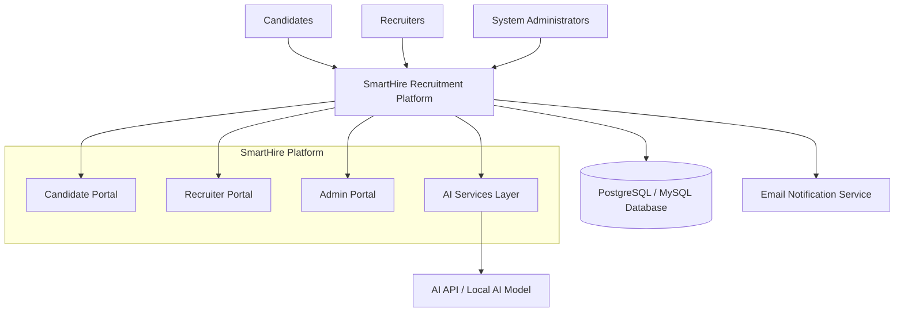
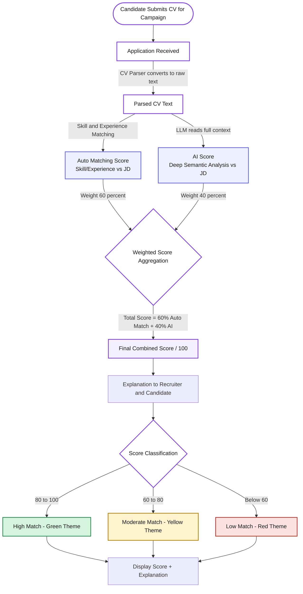
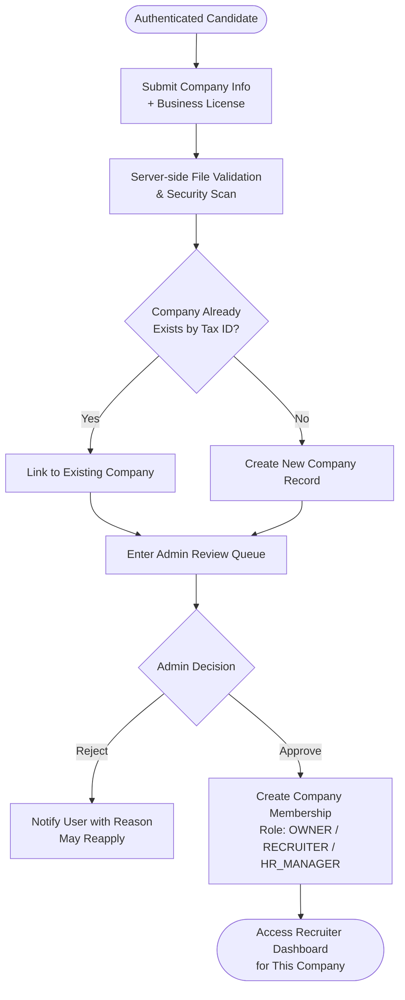

# Vision Document for Group 9

**Conclusion Author:** Nguyễn Gia Quốc Uy    
**Student ID:** 24127261   
**Reviewer:** Nguyễn Quốc Thành, Ngô Quốc Tuấn, Lưu Chí Hải, Nguyễn Minh Khôi   

## Changes from PA1 Proposal & How this document was developed

This Vision Document reflects several deliberate refinements made since the initial 
PA1 proposal, based on deeper technical and product discussions within the team.

- **AI Job Description Generator: Removed.** 
    - Generating a quality JD requires inputting nearly as much detail as writing it manually, providing negligible automation benefit.
- **AI Resume Enhancement & Gap Analysis: Removed / merged.** 
    - Resume rewriting was dropped due to the risk of A misrepresenting a candidate's actual qualifications.
    - Gap-analysis value is instead delivered through the score  explanation already required for the scoring engine (Section 5.3.7), rather than as a separate feature.
- **Application status model: Expanded and clarified.** 
    - PA1's original 5-state model (Applied → Screened → Interviewing → Offered → Hired/Rejected) has been refined into a 9-state canonical pipeline (Applied, Viewed, Shortlisted,Interviewing, Offered, Hired, Offer Declined, Rejected, Waitlisted) to accurately reflect the recruiter decision points identified during workflow design.
- **Employer registration model: Redesigned.** 
    - PA1 assumed a separate employer registration flow. 
    - The current design instead uses a single base Candidate account that can request Recruiter/HR Manager permissions via a multi-tenant company membership model, allowing one user to manage recruitment for multiple companies.
- **Authentication token storage: Changed.** 
    - PA1 proposed storing JWTs in browser localStorage/sessionStorage. 
    - This was revised to HttpOnly, Secure, SameSite cookies to mitigate XSS-based token theft.
- **Job matching: Re-scoped from AI to rule-based.** 
    - What PA1 described as "AI-powered job recommendations" is implemented as tag- and location-based Smart Matching, not semantic AI analysis — the AI/LLM capacity is instead concentrated on CV scoring, where it delivers clearer value.

This Vision Document is the consolidated result of individual sections authored by each member of Group 9 over the past three weeks, subsequently cross-checked and reconciled to resolve inconsistencies between documents. Authorship and review credit for each section are recorded below. Open items still requiring team confirmation are noted where applicable.

# 1. Introduction

**Author of this Part:** Ngô Quốc Tuấn   
**Student ID:** 24127581

## 1.1. Purpose

This document defines the product positioning for SmartHire, an AI-assisted applicant tracking system built for small and medium-sized enterprises in Vietnam. It serves as a foundational reference for the product team, ensuring all members share a consistent understanding of the problem being solved, the target audience, and the strategic rationale behind the product's design and direction.

The document is intended for internal use across product, design, and development functions. It should be consulted at the start of any feature discussion, sprint planning session, or stakeholder presentation to maintain alignment between what is being built and why.

## 1.2. References

| # | Source | Description |
|---|---|---|
| 1 | Moore, G. A. — *Crossing the Chasm* (1991) | Origin of the Product Position Statement framework used in this document. The template structures a product's market position across six dimensions: target customer, pain point, product category, core benefit, competitive alternatives, and key differentiator. |
| 2 | Ries, E. — *The Lean Startup* (2011) | Informs the problem-first approach taken in the Problem Statement section — defining validated pain points before solution design. |
| 3 | Vietnam Ministry of Planning and Investment — SME Report (2023) | Contextual data on the scale of SMEs in Vietnam and their operational constraints, used to validate the target market definition. |
| 4 | TopCV, ITviec — Public platform documentation | Referenced as competitive alternatives in the Product Position Statement. |

# 2. Positioning

### Document Structure

This document is organised into two core positioning frameworks, each presented as a structured table:

**1. Positioning**
 
| Section | Description |
|---|---|
| **Problem Statement** | Defines the specific problem this product exists to solve, who is affected, what the consequences of inaction are, and what a successful solution would look like. |
| **Product Position Statement** | Defines the product's strategic market position — who it is for, what pain it resolves, what category it belongs to, why users should choose it, how it differs from alternatives, and what makes it uniquely valuable. |
 
**2. Problem Statement** — presented in a structured table:
 
| Section | Description |
|---|---|
| **The problem of** | What is the specific problem or issue being addressed? |
| **Affects** | Who is affected, and what elements or factors are impacted? |
| **The impact of which is** | What is the negative impact or consequence of this problem? |
| **A successful solution would be** | What would a successful solution achieve? |
 
**3. Product Position Statement** — presented in a structured table:
 
| Section | Description |
|---|---|
| **For** | Target customers — who is the target audience? |
| **Who** | What pain points or difficulties do they need resolved? |
| **The SmartHire** | Product name and product category or type. |
| **That** | What is the core benefit? Why should they buy and use this product? |
| **Unlike** | How does it differ from current competitors or existing solutions? |
| **Our product** | In what way is your product superior or unique? |

## 2.1. Problem Statement

| Field | Details |
|---|---|
| **The problem of** | Vietnamese SMEs managing recruitment manually via disconnected tools (email, spreadsheets) without a structured tracking, screening, or evaluation system. This leads to fragmented, duplicated candidate data and loss of institutional knowledge when recruiters leave. |
| **Affects** | - **Recruiters & HR staff** wasting time on repetitive administrative tasks instead of high-value sourcing/engagement.<br>- **Hiring managers** lacking visibility into candidate pipelines and evaluation contexts.<br>- **Job candidates** facing poor, delayed updates, which damages the employer's brand.<br>- **Business leadership** unable to make data-driven decisions due to a lack of structured recruitment analytics. |
| **The impact of which is** | - **Inefficient hiring:** Manual CV screening is slow and prone to bias or errors.<br>- **Candidate stagnation:** Strong early applicants are missed or forgotten due to the lack of objective scoring.<br>- **Low productivity:** Recruiters burn out from copy-pasting data, reformatting CVs, and manual email tasks.<br>- **Weakened talent brand:** Poor candidate communication hurts the company's reputation.<br>- **Zero optimization:** Without structured historical data, the business cannot track performance or improve its funnel. |
| **A successful solution would be** | A lightweight, user-friendly web platform that:<br>- Automates CV screening and scoring.<br>- Provides a visual recruitment pipeline (Kanban board).<br>- Automates candidate status communications.<br>- Offers real-time analytics dashboards for leadership.<br>- Connects candidates to jobs via Smart Matching.<br>Success is defined by cutting administrative tasks by 80%, ensuring no candidates are missed, and enabling zero-setup adoption for SMEs. |

## 2.2. Product Position Statement

| Field | Details |
|---|---|
| **For** | Vietnamese SMEs (10–500 employees) actively hiring but lacking a structured recruitment system, or the budget/IT capacity for complex enterprise HR software. |
| **Who** | Struggle with high volumes of unstructured job applications, manual CV screening, lack of candidate-ranking standards, and poor pipeline visibility (relying on scattered emails/spreadsheets). |
| **The SmartHire** | An AI-assisted, zero-install ATS and Smart Job Matching web platform, purpose-built for the Vietnamese SME market and candidate job discovery. |
| **That** | Provides recruiters with a visual Kanban pipeline, auto-scored CVs, and automated status emails, while matching job seekers with relevant roles based on profile tags and CV preferences. |
| **Unlike** | - **Enterprise ATS (Workday, Greenhouse):** Too complex, expensive, and oversized for SME recruitment teams.<br>- **Generic job boards (TopCV, ITviec):** Focus only on candidate sourcing without managing or tracking candidates after application.<br>- **Manual methods (Email + Excel):** Highly inefficient, prone to human error, and lacks auditable data/analytics. |
| **Our product** | Offers a unified workflow: recruiters post roles, auto-score applications, and manage candidates visually; candidates upload CVs and receive instant, tailored job matches. This ecosystem drives network effects: a larger database of matched candidates continuously improves hiring quality and speed. |

**Core differentiators:**
- Smart Job Matching Recommendation (rule-based tags/location)
- Structured ATS pipeline for recruiters
- Automated candidate communication
- Real-time hiring dashboard for admins

# 3. Stakeholder and User Descriptions

**Author of this Part:** Nguyễn Quốc Thành   
**Student ID:** 24127542

## 3.1. Stakeholder Summary

**Stakeholders** are individuals, groups, or organizations that influence the development of the recruitment platform or are affected by its operation. The main **stakeholders** include _the project owners, development team, candidates, recruiters, hiring companies, platform administrators, and external service providers._

| Stakeholder | Type | Role and interest | Influence |
| ----------- | ---- | ----------------- | ----------- |
| Project Owner / Product Owner | Internal | Defines the product vision, project scope, feature priorities, and expected business value. | High |
| Development Team | Internal | Designs, implements, tests, deploys, and maintains the system, including the AI-assisted candidate scoring module. | High |
| Recruiters / HR Managers | External | Create job postings, review applicants, manage recruitment pipelines, and communicate with candidates. | High |
| Hiring Companies | External | Use the platform to advertise vacancies and recruit suitable candidates efficiently. | High |
| Candidates / Job Seekers | External | Build professional profiles, search for jobs, submit applications, and monitor application progress. | Medium |
| Platform Administrators | Internal | Verify recruiters, moderate job postings, manage user accounts, and maintain platform safety. | Medium |
| Project Supervisor / Academic Reviewer | External | Reviews project quality, requirements, design decisions, implementation, and documentation. | Medium |
| Third-party Service Providers | External | Provide services such as email delivery, file storage, cloud infrastructure, and AI APIs. | Low to Medium |

#### **Stakeholder analysis**

The **Product Owner, Development Team,** and **Recruiters** have the greatest influence because they directly determine the system requirements, technical implementation, and operational value of the platform.

Candidates have high interest because the system directly affects their job-search experience, although they normally have less influence over product decisions. Administrators ensure the platform remains trustworthy by preventing fraudulent recruiters, misleading job postings, and abusive behavior.

## 3.2. User Persona Summary

The platform has three primary user groups: Candidates, Recruiters, and Administrators. Each group has different goals, technical abilities, permissions, and usage patterns...

### 3.2.1. Candidate

| Attribute | Description |
| --- | --- |
| User profile | University students, recent graduates, unemployed users, and working professionals seeking new opportunities. |
| Primary goal | Find suitable jobs and complete applications efficiently. |
| Main problems | Repetitive application forms, irrelevant search results, unclear application status, and limited feedback from recruiters. |
| Technical ability | Basic to high familiarity with websites, mobile applications, job portals, and professional networking platforms. |
| Main activities | Register, build profile, upload CV, search for jobs, save jobs, apply, and track application status. |
| Expected outcome | Successfully obtain a suitable job and receive clear updates during the recruitment process. |

### 3.2.2. Recruiter / HR Manager

| Attribute | Description |
| --- | --- |
| User profile | HR employees, recruitment specialists, hiring managers, and authorized company representatives. |
| Primary goal | Find qualified candidates and manage recruitment activities efficiently. |
| Main problems | Large numbers of applications, manual CV screening, scattered candidate information, and slow communication. |
| Technical ability | Medium to high; normally familiar with office software, recruitment platforms, CRM systems, or ATS products. |
| Main activities | Request recruiter verification, create/link company account, create job posts, review applicants, evaluate candidates, update pipeline stages, and export reports. |
| Expected outcome | Hire suitable candidates while reducing screening time and recruitment workload. |

### 3.2.3. Platform Administrator

| Attribute | Description |
| --- | --- |
| User profile | Internal personnel responsible for system operation, content moderation, and account management. |
| Primary goal | Maintain platform quality, security, reliability, and trust. |
| Main problems | Fraudulent recruiters, misleading job posts, spam, policy violations, and manual moderation workload. |
| Technical ability | High; familiar with administrative dashboards and system management tools. |
| Main activities | Verify recruiters, approve job posts, process & export reports, suspend accounts, monitor platform statistics, and review audit logs. |
| Expected outcome | Maintain a safe recruitment environment with legitimate users and reliable job information. |

## 3.3. User Environment 

The recruitment platform is a responsive web application. Its interface and technical design must support different devices, software platforms, and specific usage contexts for each user group.

### 3.3.1. Environmental Factors Summary

| Environment factor | User group | Description |
| :--- | :--- | :--- |
| **Device** | Candidates | Primarily smartphones (70% of search traffic) and laptops. The job-search and application interfaces must be mobile-friendly. |
| **Device** | Recruiters | Primarily desktop computers and laptops because recruitment dashboards, applicant tables, and Kanban boards require larger screens for data-dense viewing. |
| **Device** | Administrators | Primarily desktop computers for moderation queues, account management, and analytics. |
| **Operating system** | All users | Windows, macOS, Android, and iOS. |
| **Browser** | All users | Recent versions of Chrome, Edge, Firefox, and Safari. |
| **Network** | All users | The system should operate under normal home, university, office, and mobile network (3G/4G/5G) conditions. |
| **Usage location** | Candidates | Home, university, workplace, or transit/mobile environments. |
| **Usage location** | Recruiters | Company offices or quiet remote-working environments. |
| **Usage frequency** | Candidates | Periodic or frequent use during active job searching. |
| **Usage frequency** | Recruiters | Daily use during active recruitment campaigns. |
| **Usage frequency** | Administrators | Daily or scheduled operational use. |
| **File handling** | Candidates | CV upload in PDF or DOCX format, with a maximum size of 5 MB. |
| **Data sensitivity** | All users | Personal information, CVs, contact details, company documents, evaluation notes, and application records must be protected. |
| **Notifications** | All users | Notifications should be sent to users via email and in-app notifications to keep them updated on the latest information. |

### 3.3.2. Task Complexity and Team Size

*Note: figures in this subsection (team size, cycle duration, time allocation) are team estimates based on general SME hiring norms, not measured data from a specific survey or company.*

*   **Recruitment Team Size:** In a typical Small and Medium Enterprise (SME) target user environment, a single hiring task involves **2 to 5 people** (1-2 HR/Recruitment specialists sourcing candidates, and 1-3 Hiring Managers/Technical Leads reviewing profiles and conducting interviews). The application must support collaborative candidate evaluation and status updates without data override conflicts.
*   **Trend:** As SMEs grow, the number of collaborators increases, requiring role delegation (e.g., OWNER vs. RECRUITER) to manage access rights.

### 3.3.3. Task Cycle and Activity Time Allocation
*   **Recruitment Cycle:** A typical recruitment campaign task cycle lasts from **15 to 45 days** (from job posting creation to final hiring confirmation).
*   **Time Spent on Activities:**
    *   **Recruiters:** Spend **70%** of their daily recruitment time on manual CV screening and initial evaluation, and **30%** on interview coordination and feedback collection. The platform aims to reduce CV screening time to under 10% using the AI-assisted scoring system.
    *   **Candidates:** Spend an average of **5 to 10 minutes** to complete and submit a single job application. The interface must minimize friction to prevent application abandonment.

### 3.3.4. Unique Environmental Constraints
*   **On-the-go Candidates:** Candidates often browse jobs on public transport or under unstable mobile data networks (3G/4G). The frontend must be lightweight, support fast page loading (≤ 3s), and implement auto-save forms to prevent data loss on network drops.
*   **Data-Dense Recruiter Workspaces:** Recruiters work on multi-tab browsers and high-resolution monitors. The dashboard needs to display high-density tables and clear visual indicators (such as the Kanban board) to help them quickly scan candidate status amidst office distractions.

### 3.3.5. Platform Integration and Interoperability
To fit into the existing workflow of SMEs, the application must interact with other standard office tools:
*   **Email Systems:** Integration with standard mail protocols to deliver automated application status updates to Gmail and Outlook.
*   **Office Productivity Suites:** Capability to export candidate lists and analytics to CSV and Microsoft Excel (`.xlsx`) for internal company reporting.
*   **Calendars:** In future updates, the application should plan for integrations with external calendars (like Google Calendar) to sync interview schedules.

## 3.4. Summary of Key Stakeholder and User Needs

### 3.4.1. Key Problems and Desired Solutions

| Problem | Reasons for the Problem | Current Workaround (How it is solved now) | Desired Solution (What solution is wanted) | Relative Importance |
| :--- | :--- | :--- | :--- | :--- |
| **Recruiters spend too much time screening CVs manually.** | CVs are unstructured; comparing skills with job descriptions is subjective and slow. | Reading CVs one by one, using simple Ctrl+F keywords, or outsourcing initial screening. | An AI-powered hybrid scoring algorithm to automatically rank CVs based on skills/experience. | **Critical (Must)** |
| **Candidates face lack of transparency in application status.** | Recruiters rarely update candidates on progress, leading to anxiety and ghosting. | Keeping manual spreadsheets; sending follow-up emails that go unanswered. | A real-time status tracker tied to a Kanban board and automated notifications at each stage. | **High (Should)** |
| **High risk of fake recruiters and spam job postings.** | Anyone can register and post jobs without verification of business legitimacy. | Reactive reporting after candidates get scammed; manual post-moderation. | Mandatory recruiter business license verification (Tax ID) and Admin approval queues. | **Critical (Must)** |
| **Fragmented recruitment coordination within hiring teams.** | Recruiter, HR department, and Hiring Managers communicate via separate chat apps or emails. | Sharing Excel sheets, printing CVs, or holding long synchronization meetings. | An interactive Kanban board serving as a shared pipeline for status updates and comments. | **Critical (Must)** |
| **Repetitive application process for candidates.** | Most job portals redirect to external sites, forcing candidates to re-enter data manually. | Copy-pasting data from resume text into custom application forms repeatedly. | Profile data reuse (1-click apply) and automated parser to extract data from uploaded CVs. | **High (Should)** |

### 3.4.2. Detailed Stakeholder and User Needs List

The following requirements summarize the mapping of the identified needs for each user group, along with their priorities:

| ID | User or stakeholder | Priority | Need | Description |
| :--- | :--- | :--- | :--- | :--- |
| NEED-01 | Candidate | Must | Secure account management | Register, log in, recover passwords, and manage accounts securely. |
| NEED-02 | Candidate | Must | Complete professional profile | Manage personal info, education, work experience, and skills. |
| NEED-03 | Candidate | Must | CV management | Upload, view, replace, and delete CV. |
| NEED-04 | Candidate | Must | Relevant job discovery | Search and filter jobs by keyword, location, salary, experience, and job type. |
| NEED-05 | Candidate | Must | Simple application process | Reuse existing profile/CV info to reduce repetitive data entry. |
| NEED-06 | Candidate | Must | Application transparency | See the real-time status of each submitted application. |
| NEED-07 | Candidate | Should | Timely notifications | Receive updates when recruiters change application status. |
| NEED-08 | Recruiter | Must | Job-post management | Create, save, edit, publish, close, and extend job postings. |
| NEED-09 | Recruiter | Must | Applicant management | View applicants and access their profiles, CVs, and cover letters. |
| NEED-10 | Recruiter | Must | Candidate ranking | Compare candidate qualifications with job requirements and sort applicants. |
| NEED-11 | Recruiter | Must | Recruitment pipeline | Recruiters must be able to move candidates through stages such as Applied, Viewed, Shortlisted, Interviewing, Offered, Hired, Offer Declined, Rejected, and Waitlisted. |
| NEED-12 | Recruiter | Should | Candidate evaluation | Write feedback notes and assign evaluation ratings. |
| NEED-13 | Recruiter | Should | Automated communication | Automatic email notifications triggered by pipeline status changes. |
| NEED-14 | Administrator | Must | Recruiter verification | Verify company registration documents before allowing job publication. |
| NEED-15 | Administrator | Must | Job moderation | Approve, reject, or request revision of job postings. |
| NEED-16 | Administrator | Must | User management | Search, suspend, and reactivate user accounts. |
| NEED-17 | Administrator | Should | Auditability | Record administrative and recruitment actions in system logs. |
| NEED-18 | Product Owner | Must | Business visibility | Dashboard showing platform growth, active postings, and conversion rates. |
| NEED-19 | Development Team | Must | Maintainable architecture | Modular components, consistent REST APIs, and decoupled state management. |
| NEED-20 | All users | Must | Privacy and security | Secure personal data and CV files against unauthorized access. |

## 3.5. Alternative and Competing Solutions 

The platform competes with both job-search websites and Applicant Tracking Systems. It may also replace manual recruitment methods, in-house builds, and informal channels currently used by small organizations.

| Alternative or Competitor | Category | Main Strengths | Limitations or Opportunity for the proposed platfom|
|---|---|---|---|
| LinkedIn | Professional networking and recruitment platform | HR teams already have company pages and personal networks there, so posting a job feels like zero extra setup; large talent pool with strong professional credibility. | Recruiter seat licenses and sponsored posts get expensive fast at SME hiring volumes; once applications come in, there's no structured way to compare or track them, LinkedIn stops being useful right after the "post" step. |
| Indeed | Job-search and job-advertising platfor | Huge reach, so job ads get seen quickly without much effort; simple to post. | Built for getting applicants in the door, not managing them afterward,HR ends up exporting CVs to email or spreadsheets the moment volume grows, right back to the manual problem.
| TopCV / VietnamWorks / CareerViet / ITviec | Local job platforms | Vietnamese candidates already look there first; CV templates and services feel familiar to local HR staff; strong local job coverage. | Recruiters juggle applicants across several of these platforms separately, each with its own inbox and no shared pipeline, nothing to unify candidates from different sources into one view. |
| Greenhouse / Lever | Applicant Tracking Systems | Real pipeline management, structured hiring, interview workflows, and integrations. | Priced and packaged for companies with dedicated recruitment operations and hundreds of open roles; an SME with 1-3 HR staff finds the setup and cost hard to justify for their scale. | 
| Workday | Enterprise HR and ATS platform | Comprehensive, "does everything" reputation, strong compliance and reporting that larger competitors use as a benchmark. | Implementation alone can take months and require IT support SMEs don't have and completely out of reach for a 10-500 employee company without a dedicated ops team. |
| In-house build | Homegrown solution | Feels cheaper upfront than a subscription; can be shaped exactly to how the company already works, no vendor lock-in. | Requires ongoing developer time to maintain and extend; when the person who built it leaves, the tool becomes a black box, the same "institutional knowledge walks out the door" risk the platform is meant to solve, just relocated to the tool itself. |
| Spreadsheets and email | Manual status quo | Already familiar, no new tool to learn, zero cost to start, flexible to adapt on the fly. | Candidate data gets duplicated and outdated across team members' inboxes; there's no single source of truth, and following up with candidates becomes a manual, easy-to-forget task.|
| Social media groups (Facebook, Zalo groups) | Informal recruitment alternative | Fast to post, free, and reaches passive candidates who aren't actively browsing job boards. | No way to verify candidate authenticity or job posting legitimacy; screening happens ad hoc in comments and DMs, which doesn't scale past a handful of applicants. |
| Company career pages | Direct recruitment channel | Full control over branding and how the company presents itself to candidates. | Reach is limited to people who already know to look for it; behind that page, the company still needs some way to manage applications, this doesn't replace an ATS, it just adds a landing page in front of one. |

# 4. Product Overview

**Author of this Part:** Nguyễn Minh Khôi   
**Student ID:** 24127066

---

The SmartHire Platform is a recruitment system designed to automate the hiring lifecycle for Small and Medium Enterprises (SMEs) by integrating job management, candidate tracking, and AI-assisted hiring features into a centralized web-based solution.

The platform utilizes a modern technical stack and a decoupled architecture:

### Architecture & Security
- Follows a **Decoupled Client-Server Architecture**.
- Uses **JSON Web Tokens (JWT)** for stateless authentication and session management.
- Implements **Role-Based Access Control (RBAC)** combined with a **Multi-tenant model**, where a base user account acts as a Candidate, but can simultaneously hold Recruiter or HR Manager permissions for one or multiple companies via company membership records.

### Frontend Stack
- Built with:
  - **Next.js (React)**
  - **TypeScript**
  - **Tailwind CSS**
  - **Shadcn UI**
- Uses **Zustand** for lightweight state management.
- Integrates **hello-pangea/dnd** to support drag-and-drop functionality in the Kanban board interface.

### Backend & Database
- Backend follows a **Layered Architecture** implemented within **Next.js API Routes**.
- Uses a relational database management system:
  - **PostgreSQL**, or
  - **MySQL**
- Provides transactional integrity and reliable data management.

### Operating Environments
- Configured as a **responsive web application**.
- Supports:
  - **Desktop View**: Optimized for administrative and management tasks with data-dense interfaces.
  - **Mobile/Tablet View**: Optimized for candidates and users who need access while on the go.

## 4.1. Product Perspective

SmartHire is a standalone, AI-assisted Recruitment Management Platform that operates as a responsive web application. It serves as a centralized hub connecting job candidates, recruiters, and system administrators throughout the recruitment lifecycle.

The system is designed using a client-server architecture where the frontend application communicates with backend services through secure RESTful APIs. SmartHire integrates with external services such as AI API for resume analysis and content generation, email services for notifications, and database systems for persistent data storage.

SmartHire replaces traditional recruitment methods that rely on spreadsheets, emails, and manual tracking with an automated and structured recruitment workflow. The platform supports the complete hiring process, from job creation and candidate application submission to screening, interviewing, and final hiring decisions.

The major system components include:

### Candidate Portal
- Profile management
- Resume builder and CV management
- Job searching and application submission
- AI-generated feedback and recommendations

### Recruiter Portal
- Job posting management
- Applicant screening and evaluation
- Kanban-based recruitment pipeline

### Administration Portal
- User and recruiter verification
- Job post moderation
- Platform monitoring and analytics
- System audit management

### AI Services Layer
- Hybrid candidate scoring (rule-based matching + AI semantic analysis)
- Human-readable score explanations (shared with both recruiter and candidate)

### External Systems
- AI API or custom AI model
- Email notification service
- Relational database system (PostgreSQL/MySQL)

The overall product ecosystem can be represented as:



## 4.2. Assumptions and Dependencies

The successful operation of SmartHire depends on several assumptions and external dependencies. 

### Assumptions

- Users have access to a stable internet connection to interact with the platform.
- Candidates possess resumes in supported formats (`.pdf` or `.docx`) for upload and processing.
- Recruiters provide accurate job information and valid business verification documents.
- Users access the platform through modern web browsers such as Google Chrome, Microsoft Edge, Mozilla Firefox, or Safari.
- AI-generated recommendations and scoring results are used as decision-support tools rather than fully automated hiring decisions.
- System administrators actively review recruiter registrations and job postings to maintain platform quality, security, and compliance.

### Dependencies

#### AI Service Dependency
- The platform depends on AI API to provide semantic CV scoring and human-readable score explanations. 
- AI-powered features may become unavailable or limited if these services experience downtime or API restrictions.

#### Email Service Dependency
- Password recovery, application status updates, interview invitations, offer letters, and other notifications require a reliable email delivery service.
- Service interruptions may delay communication between recruiters and candidates.

#### Authentication Dependency
- The platform relies on JSON Web Token (JWT) technology to provide secure authentication, session management, and role-based access control.
- Security mechanisms must remain operational to prevent unauthorized access.

#### Database Dependency
- SmartHire requires a relational database management system such as PostgreSQL or MySQL to store user accounts, job postings, applications, recruiter verification records, and system logs.
- Database failures may affect system availability and data integrity.

#### Hosting and Infrastructure Dependency
- The application requires cloud or server infrastructure capable of hosting the frontend, backend services, database, and AI integrations.
- Continuous availability depends on server uptime, network connectivity, and infrastructure maintenance.

#### Legal and Regulatory Dependency
- SmartHire must comply with Vietnamese regulations regarding personal data protection, particularly Decree 13/2023/ND-CP.
- Future regulatory changes may require modifications to data storage, privacy policies, and user consent mechanisms.

These assumptions and dependencies form the foundation upon which SmartHire's functionality, security, scalability, and user experience are built.

# 5. Product Features

**Author of this Part:** Nguyễn Gia Quốc Uy   
**Student ID:** 24127261

## 5.1. Feature Overview
The table below summarizes the high-level feature groups of the SmartHire system. Each feature group represents a broader capability that may include multiple sub-features, which are described in more detail in the following section.

## 5.2. Detailed Feature List
| No | Group Feature | Short Description | Priority |
|---|---|---|---|
|1| **Authentication, Authorization & Access Control**| Allows candidates and employers to register and log in securely (with email verification and password recovery), and applies role-based access control RBAC to protect personal and business data.| High (P0) |
|2| **Account Setup & Management** | Allows users to update basic personal/company account information and change their password. | Medium (P1) | 
|3| **Candidate Profile Management** | Allows candidates to build their professional profile via a provided form or by uploading a CV, with a CV Parser that automatically standardizes the data for job applications and scoring. | High (P0) |
|4| **Job Board & Advanced Search** | Allows candidates to search, filter, view details of, and apply to approved job postings, along with saving, sharing, and reporting listings. | High (P0) | 
|5| **Job Posting Management** | Allows employers to create, preview, edit, and manage the lifecycle of job postings.| High (P0) |    
|6| **Application Tracking (Candidate Side)** | Allow candidates to track saved jobs, applied jobs (with a processing status) and recommended matching jobs| High (P0) | 
|7| **Candidate Screening & Hybrid Scoring System** | Automatically matches skills and analyzes CVs using AI-powered matching algorithm to score and rank candidates for each job posting | High (P0) | 
|8| **Recruitment Pipeline Kanban Board** | A drag-and-drop interface that lets employers track and update candidate status across recruitment stages. | High (P0) | 
|9| **Automated Notifications & In-App Alerts** | System will send email and real-time notifications to candidates/employers when application status changes.| High (P0) | 
|10| **Job Posting Moderation & Quality Assurance** | Allows admins to approve or reject new job postings and handle spam/violation reports. | High (P0) | 
|11| **User Management & Employer Verification** | Allows admins to look up user accounts, verify business licenses and handle violations| High (P0) | 
|12| **Recruitment Analytics & Data Export** | Provide dashboards, statistical reports on recruitment activity and exports candidate data to Excel/CSV| Medium (P1) | 

## 5.3. Feature Descriptions

### 5.3.1 Authentication, Authorization & Access Control
This feature group handles the entire process of registration, login, and role-based access control across the system. The platform employs a hybrid RBAC and multi-tenant authorization model. By default, all registered users hold a base Candidate role, allowing them to manage profiles and apply for jobs. To become an employer (Recruiter or HR Manager), users must create or join a company profile and undergo Admin verification. This multi-tenant design allows a single user account to manage recruitment for multiple companies simultaneously, while Admins supervise platform quality and verify business licenses. By enforcing strict access control across these organizational boundaries, the system helps protect both candidates' personal data and sensitive internal information belonging to hiring companies.

### 5.3.2 Account Setup & Management
This feature allows candidates and employers to manage their basic account information, such as contact details, profile image, company information, and password settings. Although some profile fields may be optional, keeping account information updated helps both sides communicate more reliably and build trust during the recruitment process. Candidates benefit by presenting themselves more professionally, while employers benefit by making their company identity clearer to potential applicants.

### 5.3.3 Candidate Profile Management
This feature lets candidates build and digitize their profile directly on the platform, either by filling out a built-in form or by uploading their own CV file. Having this information stored in a structured format means candidates can apply to multiple jobs quickly, without retyping the same details over and over. On top of that, the system includes a CV Parser that automatically extracts text from uploaded PDF or DOCX files, which then feeds into the matching and scoring system later on.

### 5.3.4 Job Board & Advanced Search
This feature provides a public space where candidates can freely browse and search for job opportunities posted on the platform. With flexible advanced filters, candidates can quickly narrow down results by salary, years of experience, location, or job type to match what they're actually looking for. Overall, this feature bridges the gap between candidates and employers faster, saving job seekers time and improving their chances of finding the right job.

### 5.3.5 Job Posting Management
This feature gives employers the tools to create, preview, edit, and manage the entire lifecycle of their job postings. While drafting a job description, employers define structured data such as required skills, experience, salary range, and other key details. This not only gives employers full control over what they post, but also lays the groundwork the system later relies on to automatically filter and screen incoming applications.

### 5.3.6 Application Tracking (Candidate Side)
This feature lets candidates keep track of jobs they've saved, jobs they've applied to, and jobs the system recommends as a good match for them. For each application, candidates can see exactly where things stand, across every stage of the pipeline: **Applied**, **Viewed**, **Shortlisted**, **Interviewing**, **Offered**, through to a final outcome of **Hired**, **Offer Declined**, **Rejected**, and **Waitlisted**, without needing to contact the company directly to ask. Altogether, this gives candidates a single place to follow up on opportunities they care about, making it easier to stay organized while job hunting.

### 5.3.7 Candidate Screening & Hybrid Scoring System
This is essentially the recruitment "control center" that automatically classifies and evaluates candidate applications for each job posting. It works through a hybrid approach that combines rule-based skill/experience matching with AI-powered CV analysis. The biggest benefit here is freeing employers from manually screening hundreds of CVs a day, instead, they can focus their attention on the most promising candidates, ranked by a clear, visual compatibility score out of 100.

### 5.3.8 Recruitment Pipeline Kanban Board
This feature provides a visual board that lets employers track a candidate's entire journey through the different stages of the hiring process. By simply dragging and dropping a candidate's card between columns, employers can instantly update that candidate's status in the database. This gives the hiring team a clear, at-a-glance view of how a recruitment campaign is progressing and makes it much easier for team members to coordinate with one another.

### 5.3.9 Automated Notifications & In-App Alerts
This feature keeps candidates and employers in sync throughout the hiring process, without either side having to manually check for updates. Whenever an employer changes a candidate's status (via the Kanban board or other means), the candidate automatically receives a detailed email along with a real-time in-app alert. This keeps everyone informed right away and makes the overall experience feel a lot smoother.

### 5.3.10 Job Posting Moderation & Quality Assurance
This feature is built specifically for Admins to maintain content quality and prevent fraudulent or spammy job postings from flooding the platform. Every new job posting goes into a review queue first, and only becomes visible on the public job board once an Admin approves it. This keeps the recruitment environment trustworthy and protects candidates from scam job listings.

### 5.3.11 User Management & Employer Verification
This feature gives Admins the tools to keep the platform's user community healthy and trustworthy. Admins can search through the full list of candidate and employer accounts to provide support or take action against violations whenever necessary. A key part of this is verifying each employer's business license, which ensures that only legitimate companies are allowed to post jobs on the platform.

### 5.3.12 Recruitment Analytics & Data Export
This feature group provides statistical reports and data export tools that help both Admins and employers work more efficiently. Employers can gauge how appealing their job postings are by looking at view counts and successful hire rates, while Admins get a broader picture of the platform's overall growth through visual charts and dashboards. On top of that, users can export structured data to CSV or Excel files, making it easy to keep offline records or put together internal company reports.

## 5.4. Key User Workflows

### 5.4.1. Hybrid CV Scoring System

**Author:** Ngô Quốc Tuấn   
**Student ID:** 24127581  

---

#### Description

The scoring system uses a hybrid algorithm that combines automatic skill/experience matching (Auto Matching) with AI-based CV analysis (LLM) to evaluate how well a candidate fits the JD.

**Scoring formula:**

```
Final Score = 60% × Auto Matching Score + 40% × AI Score
```

**Score classification (out of 100):**

| Score Range | Match Level | Color Theme |
|---|---|---|
| 80 - 100 | High Match | 🟢 Green |
| 60 - 80 | Moderate Match | 🟡 Yellow |
| < 60 | Low Match | 🔴 Red |

#### Flowchart



#### Step-by-Step Explanation

1. **Application Received**: The candidate submits a CV and cover letter for a specific recruitment campaign.
2. **Parsed CV Text**: The CV Parser converts the original CV into normalized raw text.
3. **Auto Matching Score**: An algorithm directly compares the skills/experience in the CV against the JD requirements.
4. **AI Score**: An LLM reads the entire text, understands deep context (handling abbreviations and mixed languages), and compares it against the JD to score each criterion in detail.
5. **Weighted Score Aggregation**: The two scores are combined using a weighted formula: 60% (Auto) / 40% (AI).
6. **Final Combined Score**: The final aggregated score on a scale of 100.
7. **Score Explanation Generation**: The LLM generates a human-readable explanation describing why the candidate received that score, identifying strengths and gaps
8. **Score Classification**: The score is classified and assigned a color theme (green/yellow/red) based on thresholds for visual display.
9. **Display Score**: The score and explanation are displayed to the recruiter and candidate


### 5.4.2. Recruiter Verification & Company Role Assignment

This workflow governs how a base Candidate account is upgraded to Recruiter/HR 
Manager permissions for a specific company, supporting the multi-tenant model 
described in Section 5.3.1. A candidate submits company information and a 
business license for Admin review; once approved, recruiter permissions are 
granted through a company membership record rather than by changing the user's 
core role — allowing one person to recruit for multiple companies.



**Post-approval lifecycle:** company membership can later change through four 
events — an Admin revoking access, a user voluntarily leaving a company, 
ownership transfer between members, or the company itself being deactivated 
(which unpublishes all its job postings). In every case, the user's underlying 
Candidate identity remains unaffected — only their company-scoped permissions 
change.

**Design rationale:** recruiter permissions are deliberately kept outside the 
user's core role (`user.role` stays `CANDIDATE`) because one person may recruit 
for multiple companies simultaneously — baking the role into the user record 
would incorrectly constrain this to one company per user.


# 6. Non-Functional Requirements

**Author of this Part:** Nguyễn Minh Khôi   
**Student ID:** 24127066

## 6.1. Overview

The following non-functional requirements define the quality attributes, operational constraints, and engineering standards of the SmartHire Recruitment Platform. Unlike functional requirements, these requirements describe how well the system performs rather than what it does.

These requirements apply across all major functional modules, including authentication, candidate profile management, AI-powered CV analysis, job posting management, recruitment pipelines, notifications, analytics, and administrative functions.

## 6.2. Performance Requirements

The platform shall provide responsive interactions for all supported users while maintaining stable performance under normal operating conditions.

| Requirement | Target |
|------------|--------|
| Page loading time | ≤ 3 seconds under normal network conditions |
| Dashboard navigation | ≤ 2 seconds |
| Search response | ≤ 2 seconds for job searching and filtering |
| Authentication | Login/Register completed within 3 seconds |
| Candidate profile update | Saved within 2 seconds |
| Kanban drag-and-drop update | Visual response within 500 ms |
| Notification delivery | In-app notification appears within 5 seconds after triggering event |
| Export CSV/Excel | Complete within 10 seconds for datasets up to 10,000 records |
| AI semantic scoring | Complete within 20 seconds depending on CV size and AI provider |

The system shall support concurrent access from multiple users without significant degradation in response time. 

AI processing must be handled asynchronously. The system shall update the application status to 'Sifting/Processing' and notify the user via real-time alert or email once completed, rather than blocking the user interface.

## 6.3. Scalability Requirements

The architecture shall support future growth without requiring major redesign.

The system shall:

- support thousands of registered users.
- support hundreds of simultaneous active users.
- support multiple recruiters managing independent recruitment campaigns simultaneously.
- allow horizontal scaling of frontend and backend services.
- allow database scaling through indexing and optimization.
- support migration to cloud deployment if required.

The AI service shall be modular so that it can be upgraded without changing the business logic. 
For future upgrade, we will use API model like Gemini, Claude, OpenAI,...

## 6.4. Availability and Reliability

The SmartHire platform shall provide reliable operation for both recruiters and candidates.

### Availability

- Target uptime: **99.5%**
- Planned maintenance shall be announced beforehand.
- System recovery after deployment failure shall be possible using rollback procedures.

### Reliability

The system shall:

- prevent data corruption during unexpected failures.
- preserve uploaded CV files.
- ensure recruitment pipeline states remain consistent.
- prevent duplicate applications caused by accidental refreshes.
- use transactional database operations for critical updates.

## 6.5. Security Requirements

Security is one of the highest priorities because the platform stores sensitive personal and business information.

### Authentication

The system shall:

- require authenticated login before accessing protected resources.
- issue stateless JSON Web Tokens (JWT).
- securely invalidate user sessions after logout.
- enforce password reset through email verification.
- store authentication tokens using HttpOnly, Secure, SameSite cookies, never in localStorage or sessionStorage, to prevent token theft via client-side script injection (XSS).

### Authorization

Role-Based Access Control (RBAC) shall ensure that:

- Candidates access only candidate functions.
- Recruiters access only recruitment management functions.
- Administrators access moderation and management features.

Unauthorized API requests shall return appropriate HTTP error responses.

### Password Security

Passwords shall:

- never be stored in plain text.
- be hashed using secure industry-standard hashing algorithms.
- satisfy minimum password complexity requirements.

### Data Protection

The system shall:

- encrypt sensitive communication using HTTPS.
- protect against common web vulnerabilities including:
  - SQL Injection
  - Cross-Site Scripting (XSS)
  - Cross-Site Request Forgery (CSRF)
  - Broken Authentication
- validate all user inputs before database processing.
- sanitize uploaded file names.


## 6.6. File Storage Requirements

The system shall support secure document management.

Resume uploads shall satisfy the following constraints:

| Item | Requirement |
|------|-------------|
| Supported formats | PDF, DOCX |
| Maximum file size | 5 MB |
| Duplicate protection | Supported |
| Virus Checking | Recommended before storage | 
| Secure storage | Required |

Deleted files shall no longer be publicly accessible.

## 6.7. AI Service Requirements

The AI components shall function as decision-support tools rather than autonomous decision makers.

The platform shall:

- generate AI recommendations without automatically rejecting candidates.
- allow recruiters to override AI recommendations at any time.
- display generated AI scores together with human-readable explanations.
- continue operating when AI services are temporarily unavailable by falling back to rule-based matching where applicable.


## 6.8. Usability Requirements

The platform shall provide an intuitive user experience for all user roles.

The interface shall:

- follow consistent navigation patterns.
- minimize the number of steps required to complete common tasks.
- provide responsive layouts for desktop, tablet, and mobile devices.
- clearly indicate loading, success, and error states.
- display meaningful validation messages.
- support drag-and-drop interactions for Kanban recruitment management.
- provide searchable and filterable tables.
- minimize recruiter training time.

The application shall support modern accessibility principles including:

- readable typography
- sufficient color contrast
- keyboard accessibility
- descriptive labels
- responsive layouts

## 6.9. Compatibility Requirements

The platform shall operate correctly on major modern browsers including:

- Google Chrome
- Microsoft Edge
- Mozilla Firefox
- Safari

The frontend shall support:

- Desktop computers
- Tablets
- Mobile devices

Supported resume formats include:

- PDF (.pdf)
- Microsoft Word (.docx)

Supported export formats include:

- CSV
- Microsoft Excel (.xlsx)

## 6.10. Maintainability Requirements

The software shall be designed for long-term maintenance.

The implementation shall:

- follow modular architecture.
- separate frontend and backend services.
- use layered backend architecture.
- maintain reusable UI components.
- follow TypeScript coding standards.
- use Git for version control.
- support continuous feature expansion.

Business logic, database access, and presentation logic shall remain loosely coupled.

## 6.11. Database Requirements

The database shall:

- maintain ACID transactional consistency.
- enforce referential integrity.
- automatically generate unique identifiers.
- prevent duplicate critical records.
- support indexing for high-frequency search operations.
- maintain audit information for important administrative actions.

Regular backup procedures shall be supported.

## 6.12. Notification Requirements

The notification subsystem shall:

- automatically trigger notifications based on recruitment events.
- send interview invitations promptly.
- notify candidates when application status changes.
- support configurable email templates.
- prevent duplicate notification delivery.

Temporary email service failures shall not interrupt other platform operations.

## 6.13. Logging and Monitoring

The logging requirements below describe back-end level audit logging required for security and debugging purposes. They are independent of the admin-facing "activity log" dashboard feature (Group 12 in 5_Product_Features), which remains optional per team's PA2 prioritization.

The platform shall maintain system logs for:

- user authentication
- administrator actions
- recruiter moderation actions
- job posting approvals
- account suspension
- AI processing failures
- export activities
- critical system errors

Logs shall support troubleshooting and security auditing.

## 6.14. Legal and Compliance Requirements

The platform shall comply with applicable legal and ethical standards.

These include:

- Vietnamese Personal Data Protection Decree (Decree 13/2023/ND-CP)
- secure handling of personal information
- recruiter identity verification
- protection of uploaded resumes
- user consent for personal data processing

AI-generated recommendations shall remain advisory only and shall not replace human recruitment decisions.

## 6.15. Environmental and Platform Constraints

The system is designed as a modern web application using the following technology stack.

| Layer | Technology |
|---------|------------|
| Frontend | Next.js |
| Language | TypeScript |
| Styling | Tailwind CSS |
| UI Components | Shadcn UI |
| State Management | Zustand |
| Drag & Drop | hello-pangea/dnd |
| Backend | Next.js API Routes |
| Database | PostgreSQL / MySQL |
| Authentication | JWT |
| AI Integration | OpenAI API or Local AI Model |
| Version Control | GitHub |

The platform requires:

- Internet connectivity
- Modern web browser
- JavaScript enabled
- Email service for verification and notifications

## 6.16. Documentation Requirements

The project shall provide the following documentation:

- User Manual
- Recruiter User Guide
- Administrator Guide
- Installation Guide
- Deployment Guide
- API Documentation
- Database Schema Documentation
- System Architecture Documentation

Developer documentation shall be maintained alongside the source code.