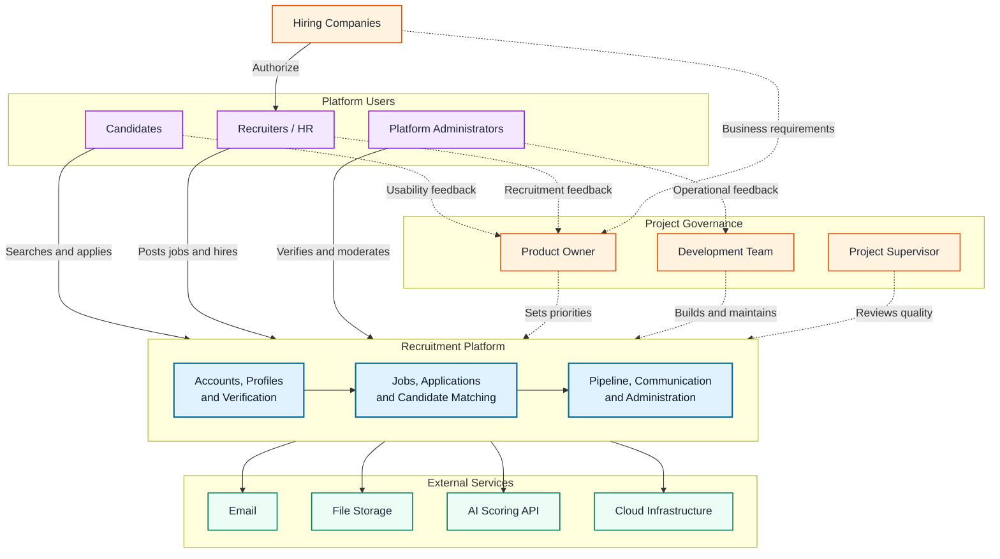
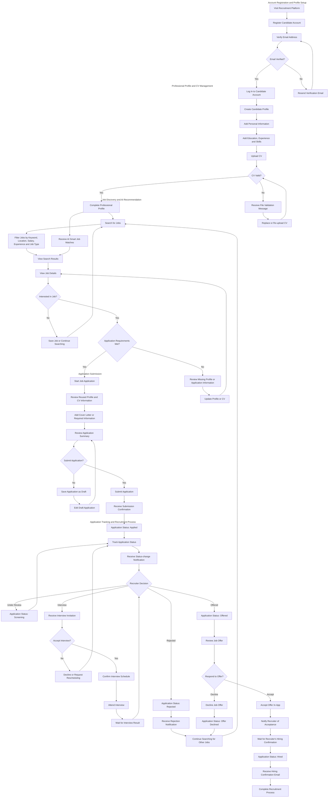
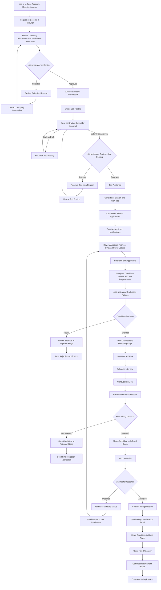
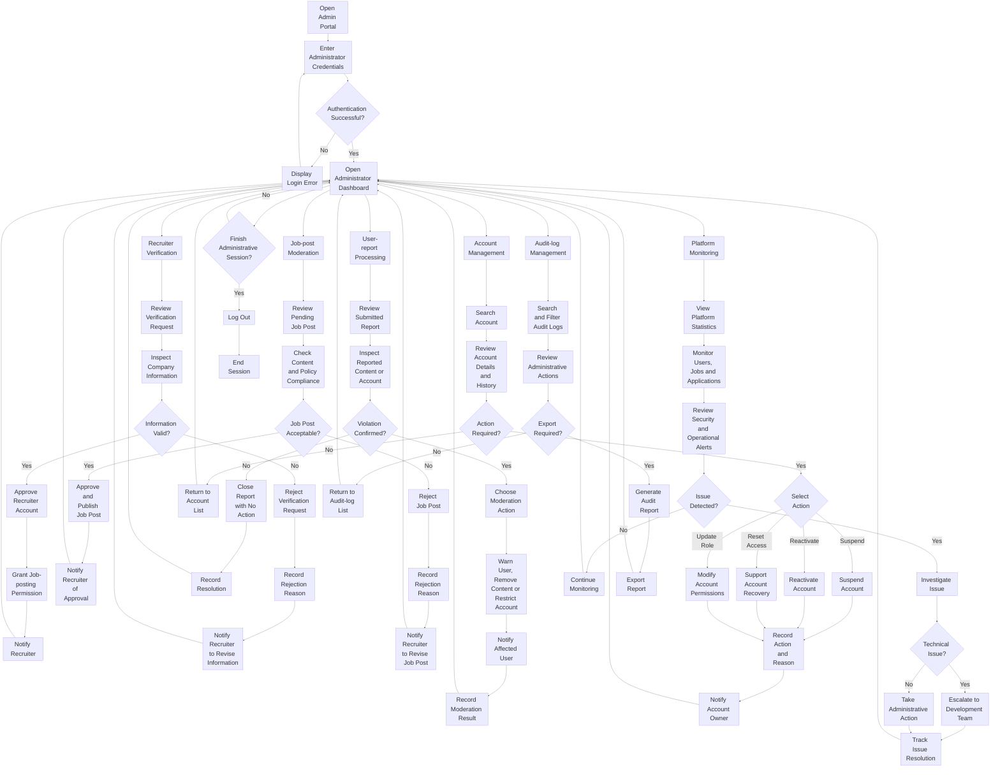

# 3. Stakeholder & User Description

**Author:** Nguyễn Quốc Thành   
**Student ID:** 24127542   
**Reviewer:** Nguyễn Gia Quốc Uy

---

## Table of Contents

1. [Overall Project Workflow and Stakeholder Interaction](#1-overall-project-workflow-and-stakeholder-interaction)
2. [Stakeholder Summary](#2-stakeholder-summary)
3. [User Summary](#3-user-summary)
4. [User Environment](#4-user-environment)
5. [Summary of Key Stakeholder and User Needs](#5-summary-of-key-stakeholder-and-user-needs)
6. [Alternative and Competing Solutions](#6-alternative-and-competing-solutions)

## 3.1. Overall Project Workflow and Stakeholder Interaction

### Diagram Legend

- **Solid arrows (`-->`)** represent platform usage, authorization, or service integration.
- **Dashed arrows (`-.->`)** represent governance, supervision, or feedback.
- **Orange nodes** represent project and business stakeholders.
- **Purple nodes** represent the platform's primary user groups.
- **Blue nodes** represent grouped platform capabilities.
- **Green nodes** represent third-party services.

Detailed Candidate, Recruiter, and Administrator workflows are presented separately in Section 3.

## 3.2. Stakeholder Summary

**Stakeholders** are individuals, groups, or organizations that influence the development of the recruitment platform or are affected by its operation. The main **stakeholders** include _the project owners, development team, candidates, recruiters, hiring companies, platform administrators, and external service providers._

| Stakeholder                            | Type     | Role and interest                                                                                                  | Influence     |
| -------------------------------------- | -------- | ------------------------------------------------------------------------------------------------------------------ | ------------- |
| Project Owner / Product Owner          | Internal | Defines the product vision, project scope, feature priorities, and expected business value.                        | High          |
| Development Team                       | Internal | Designs, implements, tests, deploys, and maintains the system, including the AI-assisted candidate scoring module. | High          |
| Recruiters / HR Managers               | External | Create job postings, review applicants, manage recruitment pipelines, and communicate with candidates.             | High          |
| Hiring Companies                       | External | Use the platform to advertise vacancies and recruit suitable candidates efficiently.                               | High          |
| Candidates / Job Seekers               | External | Build professional profiles, search for jobs, submit applications, and monitor application progress.               | Medium        |
| Platform Administrators                | Internal | Verify recruiters, moderate job postings, manage user accounts, and maintain platform safety.                      | Medium        |
| Project Supervisor / Academic Reviewer | External | Reviews project quality, requirements, design decisions, implementation, and documentation.                        | Medium        |
| Third-party Service Providers          | External | Provide services such as email delivery, file storage, cloud infrastructure, and AI APIs.                          | Low to Medium |

#### **Stakeholder analysis**

The **Product Owner, Development Team,** and **Recruiters** have the greatest influence because they directly determine the system requirements, technical implementation, and operational value of the platform.

Candidates have high interest because the system directly affects their job-search experience, although they normally have less influence over product decisions. Administrators ensure the platform remains trustworthy by preventing fraudulent recruiters, misleading job postings, and abusive behavior.

## 3.3. User Summary

The platform has three primary user groups: Candidates, Recruiters, and Administrators. Each group has different goals, technical abilities, permissions, and usage patterns.

### 3.3.1 Candidate

| Attribute         | Description                                                                                                                |
| ----------------- | -------------------------------------------------------------------------------------------------------------------------- |
| User profile      | University students, recent graduates, unemployed users, and working professionals seeking new opportunities.              |
| Primary goal      | Find suitable jobs and complete applications efficiently.                                                                  |
| Main problems     | Repetitive application forms, irrelevant search results, unclear application status, and limited feedback from recruiters. |
| Technical ability | Basic to high familiarity with websites, mobile applications, job portals, and professional networking platforms.          |
| Main activities   | Register, build profile, upload CV, search for jobs, save jobs, apply, and track application status.                       |
| Expected outcome  | Successfully obtain a suitable job and receive clear updates during the recruitment process.                               |

#### Candidate workflow

### 3.3.2 Recruiter / HR Manager

| Attribute         | Description                                                                                                                     |
| ----------------- | ------------------------------------------------------------------------------------------------------------------------------- |
| User profile      | HR employees, recruitment specialists, hiring managers, and authorized company representatives.                                 |
| Primary goal      | Find qualified candidates and manage recruitment activities efficiently.                                                        |
| Main problems     | Large numbers of applications, manual CV screening, scattered candidate information, and slow communication.                    |
| Technical ability | Medium to high; normally familiar with office software, recruitment platforms, CRM systems, or ATS products.                    |
| Main activities   | Request recruiter verification, create/link company account, create job posts, review applicants, evaluate candidates, update pipeline stages, and export reports. |
| Expected outcome  | Hire suitable candidates while reducing screening time and recruitment workload.                                                |

#### Recruiter workflow

### 3.3.3 Platform Administrator

| Attribute         | Description                                                                                                                  |
| ----------------- | ---------------------------------------------------------------------------------------------------------------------------- |
| User profile      | Internal personnel responsible for system operation, content moderation, and account management.                             |
| Primary goal      | Maintain platform quality, security, reliability, and trust.                                                                 |
| Main problems     | Fraudulent recruiters, misleading job posts, spam, policy violations, and manual moderation workload.                        |
| Technical ability | High; familiar with administrative dashboards and system management tools.                                                   |
| Main activities   | Verify recruiters, approve job posts, process reports, suspend accounts, monitor platform statistics, and review audit logs. |
| Expected outcome  | Maintain a safe recruitment environment with legitimate users and reliable job information.                                  |

#### Administrator workflow

## 3.4. User Environment

The recruitment platform is a responsive web application. Its interface and technical design must support different devices and usage contexts for each user group.

| Environment factor | User group                | Description                                                                                                                         |
| ------------------ | ------------------------- | ----------------------------------------------------------------------------------------------------------------------------------- |
| Device             | Candidates                | Primarily smartphones and laptops. The job-search and application interfaces must be mobile-friendly.                               |
| Device             | Recruiters                | Primarily desktop computers and laptops because recruitment dashboards, applicant tables, and Kanban boards require larger screens. |
| Device             | Administrators            | Primarily desktop computers for moderation queues, account management, and analytics.                                               |
| Operating system   | All users                 | Windows, macOS, Android, and iOS.                                                                                                   |
| Browser            | All users                 | Recent versions of Chrome, Edge, Firefox, and Safari.                                                                               |
| Network            | All users                 | The system should operate under normal home, university, office, and mobile network conditions.                                     |
| Usage location     | Candidates                | Home, university, workplace, or mobile environments.                                                                                |
| Usage location     | Recruiters                | Company offices or remote-working environments.                                                                                     |
| Usage frequency    | Candidates                | Periodic or frequent use during active job searching.                                                                               |
| Usage frequency    | Recruiters                | Daily use during active recruitment campaigns.                                                                                      |
| Usage frequency    | Administrators            | Daily or scheduled operational use.                                                                                                 |
| File handling      | Candidates                | CV upload in PDF or DOCX format, with a maximum size of 5 MB.                                                                       |
| Accessibility      | All users                 | Clear labels, keyboard navigation, readable text, sufficient contrast, and meaningful validation messages.                          |
| Data sensitivity   | All users                 | Personal information, CVs, contact details, company documents, evaluation notes, and application records must be protected.         |
| Notifications      | Candidates and Recruiters | Email and in-app notifications should be available for important recruitment events.                                                |

### Candidate environment

Candidates may use the platform in short sessions on mobile devices. Therefore, important processes such as registration, job search, CV upload, and job application should require as few steps as possible.

### Recruiter environment

Recruiters are likely to use the system for extended periods on desktop devices. Their interface should support applicant comparison, filtering, sorting, note-taking, and recruitment pipeline management.

### Administrator environment

Administrators require precise controls, searchable data tables, moderation histories, and clear confirmation dialogs because their actions may affect user accounts and public job postings.

## 3.5. Summary of Key Stakeholder and User Needs

The following requirements summarize the main needs identified for each stakeholder and user group.

| ID      | User or stakeholder | Priority | Need                          | Description                                                                                                              |
| ------- | ------------------- | -------- | ----------------------------- | ------------------------------------------------------------------------------------------------------------------------ |
| NEED-01 | Candidate           | Must     | Secure account management     | Candidates must be able to register, log in, recover passwords, and manage their accounts securely.                      |
| NEED-02 | Candidate           | Must     | Complete professional profile | Candidates must be able to manage personal information, education, work experience, and skills.                          |
| NEED-03 | Candidate           | Must     | CV management                 | Candidates must be able to upload, view, replace, and delete their CV.                                                   |
| NEED-04 | Candidate           | Must     | Relevant job discovery        | Candidates must be able to search and filter jobs by keyword, location, salary, experience, and job type.                |
| NEED-05 | Candidate           | Must     | Simple application process    | Existing profile and CV information should be reused to reduce repetitive data entry.                                    |
| NEED-06 | Candidate           | Must     | Application transparency      | Candidates must be able to see the current status of each submitted application.                                         |
| NEED-07 | Candidate           | Should   | Timely notifications          | Candidates should receive updates when recruiters change their application status.                                       |
| NEED-08 | Recruiter           | Must     | Job-post management           | Recruiters must be able to create, save, edit, publish, close, and extend job postings.                                  |
| NEED-09 | Recruiter           | Must     | Applicant management          | Recruiters must be able to view applicants and access their profiles, CVs, and cover letters.                            |
| NEED-10 | Recruiter           | Must     | Candidate ranking             | The platform should compare candidate qualifications with job requirements and support applicant sorting.                |
| NEED-11 | Recruiter           | Must     | Recruitment pipeline          | Recruiters must be able to move candidates through stages such as Applied, Screening, Interviewing, Offered, and Hired.  |
| NEED-12 | Recruiter           | Should   | Candidate evaluation          | Recruiters should be able to write notes and assign evaluation ratings.                                                  |
| NEED-13 | Recruiter           | Should   | Automated communication       | Status changes should support automatic or template-based candidate notifications.                                       |
| NEED-14 | Administrator       | Must     | Recruiter verification        | Administrators must verify company information before allowing recruiters to publish jobs.                               |
| NEED-15 | Administrator       | Must     | Job moderation                | Administrators must be able to approve, reject, or remove job postings.                                                  |
| NEED-16 | Administrator       | Must     | User management               | Administrators must be able to search, suspend, and reactivate accounts.                                                 |
| NEED-17 | Administrator       | Should   | Auditability                  | Important administrative and recruitment actions should be recorded in an audit log.                                     |
| NEED-18 | Product Owner       | Must     | Business visibility           | The platform should provide measurable information such as user growth, active jobs, applications, and successful hires. |
| NEED-19 | Development Team    | Must     | Maintainable architecture     | The system must use modular components, consistent APIs, secure authorization, and maintainable data models.             |
| NEED-20 | All users           | Must     | Privacy and security          | Personal, recruitment, and company data must be protected against unauthorized access.                                   |

### Priority interpretation

- **Must:** required for the system or MVP to operate correctly.
- **Should:** important but can be delivered after essential functionality.
- **Could:** beneficial enhancement when time and resources are available.
- **Won’t for now:** intentionally excluded from the current release.

## 3.6. Alternative and Competing Solutions

The platform competes with both job-search websites and Applicant Tracking Systems. It may also replace manual recruitment methods used by small organizations.

| Alternative or competitor         | Category                                         | Main strengths                                                                                 | Limitations or opportunity for the proposed platform                                                                                  |
| --------------------------------- | ------------------------------------------------ | ---------------------------------------------------------------------------------------------- | ------------------------------------------------------------------------------------------------------------------------------------- |
| LinkedIn                          | Professional networking and recruitment platform | Large professional network, company pages, personal profiles, job search, and recruiter tools. | Recruitment features may be costly, applicant pipeline transparency is limited, and the system is broader than a focused ATS.         |
| Indeed                            | Job-search and job-advertising platform          | Large number of job listings, simple search experience, and strong market reach.               | Primarily focused on job discovery rather than complete recruitment pipeline management.                                              |
| TopCV / VietnamWorks / CareerViet | Local job platforms                              | Familiar to Vietnamese candidates and recruiters, local job coverage, and CV-related services. | Different platforms may require recruiters to manage applicants separately and may provide limited integrated pipeline functionality. |
| Greenhouse / Lever                | Applicant Tracking Systems                       | Strong recruitment workflow, interview management, structured hiring, and integrations.        | Designed mainly for organizations with dedicated recruitment budgets and may be too complex for small businesses.                     |
| Workday                           | Enterprise HR and ATS platform                   | Comprehensive HR management, reporting, compliance, and enterprise integration.                | High implementation cost and complexity; unsuitable for many small and medium-sized organizations.                                    |
| Spreadsheets and email            | Manual alternative                               | Low initial cost, familiar tools, and flexible usage.                                          | Candidate information becomes fragmented, status tracking is difficult, and communication requires significant manual effort.         |
| Social media groups               | Informal recruitment alternative                 | Easy access, quick posting, and low cost.                                                      | Limited verification, weak candidate management, high fraud risk, and no structured application workflow.                             |
| Company career pages              | Direct recruitment channel                       | Strong company branding and direct control over vacancies.                                     | Limited audience reach and each company must build or integrate its own applicant-management system.                                  |
