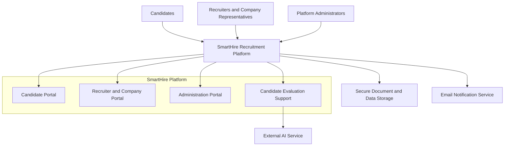

# 4. Product Overview

**Author:** Nguyễn Minh Khôi 
**Student ID:** 24127066 
**Reviewer:** Nguyễn Gia Quốc Uy 
**Modified based on PA2 feedback by:** Nguyễn Quốc Thành 
**Student ID:** 24127542 
**Reviewer:** Nguyễn Gia Quốc Uy

*Objective: Revise the Product Overview by reducing implementation-specific details and presenting SmartHire at a high level, focusing on its purpose, target users, core capabilities, product scope, external dependencies, and the advisory role of AI in recruitment decisions.*

The SmartHire Platform is a web-based recruitment system designed to support Vietnamese Small and Medium Enterprises (SMEs) in managing recruitment activities through a centralized, structured, and transparent workflow.

The platform connects candidates, recruiters, company representatives, and platform administrators throughout the recruitment lifecycle. Candidates can create professional profiles, manage CVs, discover suitable job opportunities, submit applications, and track application progress. Recruiters and authorized company members can manage job postings, review applicants, evaluate candidates, and organize applications through recruitment stages. Platform administrators maintain platform quality and trust through company verification, recruiter-access approval, job-post moderation, account management, and security oversight.

SmartHire aims to replace fragmented recruitment processes that rely on spreadsheets, email, separate job platforms, and manual communication. By combining job discovery, application tracking, recruitment pipeline management, notifications, and AI-assisted candidate evaluation in one platform, SmartHire helps recruitment teams improve efficiency while giving candidates a clearer and more transparent recruitment experience.

The platform is implemented as a responsive web application and supports secure platform-level and company-scoped access. Detailed information about frameworks, libraries, API architecture, authentication implementation, and database technologies is maintained in the relevant system-design and technical documentation rather than in this Product Overview.

AI-generated scores, explanations, and recommendations are used only as decision-support information. They do not automatically reject, shortlist, progress, or hire candidates. Final recruitment decisions remain under the control of authorized recruiters, hiring managers, and company representatives.

## 4.1. Product Perspective

SmartHire is a standalone, AI-assisted Recruitment Management Platform that operates as a responsive web application. It serves as a centralized hub connecting job candidates, recruiters, company representatives, and platform administrators throughout the recruitment lifecycle.

The platform provides a shared recruitment environment in which candidate profiles, CVs, job postings, applications, evaluation results, recruitment stages, and notifications are managed consistently.

Recruitment access is scoped to the relevant company. Authorized company members can only access job postings, candidate applications, evaluation information, and recruitment records associated with companies for which they hold an approved membership. A standard user may retain candidate capabilities while also receiving recruiter or HR-management permissions for one or more companies.

SmartHire supports the recruitment process from job creation and candidate application submission to screening, interviewing, offer management, and final hiring outcomes. It replaces disconnected recruitment activities with a centralized source of information for candidates, recruiters, and administrators.

The major product components include:

### Candidate Portal

* Professional profile management
* CV upload, review, and management
* Approved-job discovery and advanced search
* Job saving and application submission
* Application-status tracking
* Access to disclosed candidate-job score explanations

### Recruiter and Company Portal

* Company-scoped recruitment access
* Job-posting creation and lifecycle management
* Applicant review and candidate evaluation
* Advisory candidate-job compatibility scoring
* Kanban-based recruitment pipeline management
* Recruitment communication and notifications

### Administration Portal

* Company and recruiter verification
* Company-membership review
* Job-post moderation
* User-account management
* Platform monitoring
* Violation handling
* Security and audit-record review

### Candidate Evaluation Support

* Deterministic skills and experience matching
* AI-assisted semantic candidate-job analysis
* Advisory compatibility scores
* Human-readable explanations of relevant strengths and gaps

The candidate-evaluation capability supports recruiter review but does not replace human judgment or automatically determine recruitment outcomes.

### External Systems and Services

SmartHire depends on external capabilities for:

* AI-assisted candidate analysis
* Email verification and recruitment notifications
* Secure CV and company-document storage
* Persistent application data storage
* Application hosting and operational infrastructure

The overall product ecosystem can be represented as follows:

SmartHire acts as the central platform connecting candidates, recruiters, company representatives, and administrators while integrating external analysis, communication, document-storage, and data-storage services to support the recruitment lifecycle.

## 4.2. Product Scope and Boundaries

The current SmartHire release focuses on the core recruitment workflow from candidate-profile creation and job publication to applicant review, recruitment-stage management, and final hiring outcomes.

### 4.2.1. In-Scope Capabilities

The current product scope includes:

* User registration, login, email verification, and password recovery
* Platform-level and company-scoped access control
* Candidate profile and CV management
* Approved-job discovery, search, filtering, saving, and application submission
* Company registration and company-membership management
* Recruiter and company verification
* Job-post creation and lifecycle management
* Job-post moderation
* Candidate application tracking
* Deterministic matching and AI-assisted candidate evaluation
* Advisory candidate-job compatibility scores and explanations
* Recruitment pipeline management
* Email and in-app notifications
* User-account administration
* Essential security and audit records

Recruitment analytics and permitted data-export capabilities are secondary features. They may be implemented after the essential candidate, recruiter, and administrative workflows are stable.

### 4.2.2. Out-of-Scope Capabilities

The current release does not include:

* Fully automated candidate rejection or hiring decisions
* Automatic candidate progression based only on an AI-generated score
* AI-generated job descriptions
* AI-based CV rewriting or qualification enhancement
* Automatic modification of candidate qualifications
* Semantic AI job recommendations
* Payroll processing
* Employee onboarding
* Employee performance management
* Complete human-resource management
* External calendar synchronization
* Built-in video-interview services
* Background-check services
* Recruitment-agency billing

Job recommendations are based on structured information such as skills, preferences, tags, job type, and location rather than semantic AI recommendation.

## 4.3. Assumptions and Dependencies

The successful operation of SmartHire depends on several product assumptions and external dependencies.

### 4.3.1. Assumptions

* Users have access to an internet-connected device and a modern web browser.
* Candidates provide accurate profile information and upload CVs in supported formats such as PDF or DOCX.
* Candidates review and correct information extracted from uploaded CVs before confirming or reusing it.
* Recruiters provide accurate job information and legitimate company-verification documents.
* Authorized company representatives access candidate information only for legitimate recruitment purposes.
* Users provide valid email addresses for verification, password recovery, and recruitment notifications.
* Administrators actively review recruiter requests, company documents, job postings, user reports, and policy violations.
* AI-generated scores and explanations are treated as advisory information rather than final recruitment decisions.
* Recruiters independently review candidate qualifications instead of relying only on generated scores.
* External services provide sufficient availability for the current project scope.

### 4.3.2. Dependencies

#### AI Service Dependency

* SmartHire depends on an AI service to provide semantic candidate-job analysis and human-readable score explanations.
* AI-assisted features may become unavailable or limited if the service experiences downtime, usage restrictions, or processing failures.
* Temporary AI-service failure must not prevent access to unaffected recruitment functions.
* Deterministic matching should remain available where applicable.
* Failed or incomplete AI processing must be displayed through a clear processing status.

#### CV Parsing Dependency

* SmartHire depends on a CV-parsing capability to extract structured information from supported documents.
* Parsing results may be incomplete or inaccurate because candidate CV formats vary.
* Candidates must be able to review, correct, or manually enter profile information.
* CV-parser failure must not delete, damage, or make the original uploaded document unavailable.
* A candidate should still be able to complete a profile manually when automatic parsing fails.

#### Email Service Dependency

* Email verification, password recovery, application updates, interview invitations, offer-related communication, and moderation notifications require a reliable email-delivery service.
* Service interruptions may delay communication between candidates, recruiters, and administrators.
* Email-delivery failure must not reverse or invalidate a successfully completed recruitment action.
* Failed delivery attempts should be recorded so they can be retried or investigated.

#### Secure Document-Storage Dependency

* SmartHire requires secure storage for candidate CVs, company-verification documents, and other permitted recruitment attachments.
* Stored documents must not be publicly accessible without authorization.
* Access must be restricted according to user identity, company membership, administrative responsibility, and legitimate business purpose.
* Deleted or revoked documents must no longer remain accessible through previously issued public links.

#### Persistent Data-Storage Dependency

* SmartHire requires reliable persistent storage for user accounts, companies, memberships, job postings, applications, recruitment stages, notifications, verification records, and audit information.
* Database failures may affect system availability and data integrity.
* Database migrations must be reviewed and tested before being applied to important environments.
* Backup, restoration, rollback, and recovery procedures must be defined in the relevant project and technical documentation.

#### Authentication and Access-Control Dependency

* SmartHire depends on secure authentication, session management, platform roles, and company-scoped permissions.
* The system must validate user identity, company membership, assigned permissions, and resource ownership before providing access to protected recruitment information.
* Failure in access-control mechanisms may expose candidate or company data to unauthorized users.
* Frontend visibility controls alone must not be treated as sufficient protection for sensitive data.

#### Hosting and Infrastructure Dependency

* The application requires infrastructure capable of supporting the web platform, external integrations, persistent storage, document handling, and operational monitoring.
* Product availability depends on server uptime, network connectivity, configuration management, and infrastructure maintenance.
* Temporary infrastructure failure should be recoverable without corrupting persistent recruitment data.

#### Legal and Regulatory Dependency

* SmartHire processes personal information, CV content, employment history, contact details, company documents, evaluation information, and recruitment records.
* The platform must comply with applicable Vietnamese personal-data protection requirements, including relevant requirements under Decree 13/2023/ND-CP.
* Changes in legal or regulatory obligations may require revisions to user consent, privacy notices, data access, retention, deletion, storage, and processing practices.
* Access to personal data and company-verification documents must be limited to authorized users with a legitimate purpose.

These assumptions and dependencies form the product-level foundation for SmartHire’s functionality, security, reliability, and user experience. Detailed implementation decisions and technical acceptance criteria are maintained in the related requirements, project-planning, system-design, and testing documentation.
