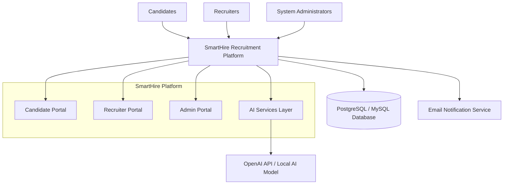

# 4. Product Overview

**Author:** Nguyễn Minh Khôi   
**Student ID:** 24127066   
**Reviewer:** Nguyễn Gia Quốc Uy

---

The SmartHire Platform is a recruitment system designed to automate the hiring lifecycle for Small and Medium Enterprises (SMEs) by integrating job management, candidate tracking, and AI-assisted hiring features into a centralized web-based solution.

The platform utilizes a modern technical stack and a decoupled architecture:

### Architecture & Security
- Follows a **Decoupled Client-Server Architecture**.
- Uses **JSON Web Tokens (JWT)** for stateless authentication and session management.
- Implements **Role-Based Access Control (RBAC)** combined with a **Multi-tenant model**, where a base user account acts as a Candidate, but can simultaneously hold Recruiter or HR Manager permissions for one or multiple companies via company membership records.

### Frontend Stack
- Built with:
  - **Next.js (React)**
  - **TypeScript**
  - **Tailwind CSS**
  - **Shadcn UI**
- Uses **Zustand** for lightweight state management.
- Integrates **hello-pangea/dnd** to support drag-and-drop functionality in the Kanban board interface.

### Backend & Database
- Backend follows a **Layered Architecture** implemented within **Next.js API Routes**.
- Uses a relational database management system:
  - **PostgreSQL**, or
  - **MySQL**
- Provides transactional integrity and reliable data management.

### Operating Environments
- Configured as a **responsive web application**.
- Supports:
  - **Desktop View**: Optimized for administrative and management tasks with data-dense interfaces.
  - **Mobile/Tablet View**: Optimized for candidates and users who need access while on the go.
  
## 4.1. Product Perspective

SmartHire is a standalone, AI-assisted Recruitment Management Platform that operates as a responsive web application. It serves as a centralized hub connecting job candidates, recruiters, and system administrators throughout the recruitment lifecycle.

The system is designed using a client-server architecture where the frontend application communicates with backend services through secure RESTful APIs. SmartHire integrates with external services such as OpenAI API for resume analysis and content generation, email services for notifications, and database systems for persistent data storage.

SmartHire replaces traditional recruitment methods that rely on spreadsheets, emails, and manual tracking with an automated and structured recruitment workflow. The platform supports the complete hiring process, from job creation and candidate application submission to screening, interviewing, and final hiring decisions.

The major system components include:

### Candidate Portal
- Profile management
- Resume builder and CV management
- Job searching and application submission
- AI-generated feedback and recommendations

### Recruiter Portal
- Job posting management
- Applicant screening and evaluation
- Kanban-based recruitment pipeline

### Administration Portal
- User and recruiter verification
- Job post moderation
- Platform monitoring and analytics
- System audit management

### AI Services Layer
- Hybrid candidate scoring (rule-based matching + AI semantic analysis)
- Human-readable score explanations (shared with both recruiter and candidate)

### External Systems
- OpenAI API or custom AI model
- Email notification service
- Relational database system (PostgreSQL/MySQL)

The overall product ecosystem can be represented as:

SmartHire acts as the central platform connecting candidates, recruiters, and administrators while integrating external AI, database, and communication services to support the recruitment lifecycle.

## 4.2. Assumptions and Dependencies

The successful operation of SmartHire depends on several assumptions and external dependencies. 

### Assumptions

- Users have access to a stable internet connection to interact with the platform.
- Candidates possess resumes in supported formats (`.pdf` or `.docx`) for upload and processing.
- Recruiters provide accurate job information and valid business verification documents.
- Users access the platform through modern web browsers such as Google Chrome, Microsoft Edge, Mozilla Firefox, or Safari.
- AI-generated recommendations and scoring results are used as decision-support tools rather than fully automated hiring decisions.
- System administrators actively review recruiter registrations and job postings to maintain platform quality, security, and compliance.

### Dependencies

#### AI Service Dependency
- The platform depends on AI API to provide semantic CV scoring and human-readable score explanations. 
- AI-powered features may become unavailable or limited if these services experience downtime or API restrictions.

#### Email Service Dependency
- Password recovery, application status updates, interview invitations, offer letters, and other notifications require a reliable email delivery service.
- Service interruptions may delay communication between recruiters and candidates.

#### Database Dependency
- SmartHire requires a relational database management system such as PostgreSQL or MySQL to store user accounts, job postings, applications, recruiter verification records, and system logs.
- Database failures may affect system availability and data integrity.

#### Authentication Dependency
- The platform relies on JSON Web Token (JWT) technology to provide secure authentication, session management, and role-based access control.
- Security mechanisms must remain operational to prevent unauthorized access.

#### Hosting and Infrastructure Dependency
- The application requires cloud or server infrastructure capable of hosting the frontend, backend services, database, and AI integrations.
- Continuous availability depends on server uptime, network connectivity, and infrastructure maintenance.

#### Legal and Regulatory Dependency
- SmartHire must comply with Vietnamese regulations regarding personal data protection, particularly Decree 13/2023/ND-CP.
- Future regulatory changes may require modifications to data storage, privacy policies, and user consent mechanisms.

These assumptions and dependencies form the foundation upon which SmartHire's functionality, security, scalability, and user experience are built.