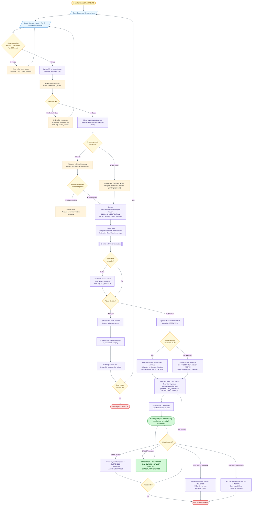

# Recruiter Verification and Company Role Assignment Flow

**Author:** Nguyễn Quốc Thành 
**Student ID:** 24127542 
**Reviewer:** Nguyễn Quốc Thành

---

## Table of Contents

1. [What this flow does](#what-this-flow-does)
2. [Phase 1 - User Submits Application](#phase-1---user-submits-application)
3. [Phase 2 - Server-Side File Processing](#phase-2---server-side-file-processing)
4. [Phase 3 - Company Lookup](#phase-3---company-lookup)
5. [Phase 4 - Admin Review Queue](#phase-4---admin-review-queue)
6. [Phase 5 - Admin Decision](#phase-5---admin-decision)
   - [❌ Reject path](#-reject-path)
   - [✅ Approve path](#-approve-path)
7. [Phase 6 - Membership Lifecycle](#phase-6---membership-lifecycle)
   - [Admin revokes access](#admin-revokes-access)
   - [User voluntarily leaves a company](#user-voluntarily-leaves-a-company)
   - [OWNER transfers ownership](#owner-transfers-ownership)
   - [Company is deactivated](#company-is-deactivated)
8. [Key Design Decisions Worth Noting](#key-design-decisions-worth-noting)

## What this flow does

This flow handles the process of a **regular user (CANDIDATE)** applying to become a **recruiter** on the platform. It covers everything from form submission to document verification, admin review, role assignment, and ongoing membership lifecycle management.

## Phase 1 - User Submits Application

**Entry point:** Any authenticated user with the `CANDIDATE` role can initiate this flow.

**What happens:**

1. The user opens the "Become a Recruiter" form and fills in their company name, tax ID, and uploads a business license file.
2. **Client-side validation** runs immediately in the browser - it checks file type (e.g. only PDF/JPG allowed), file size (e.g. max 5MB), and Tax ID format (e.g. 10-digit numeric for Vietnam MST).
3. If anything fails, the user sees an inline error and stays on the form - nothing is sent to the server yet.

**Example scenarios:**

| Scenario                            | Outcome                                                 |
| ----------------------------------- | ------------------------------------------------------- |
| User uploads a `.exe` file          | Blocked instantly in browser, shown "Invalid file type" |
| Tax ID entered as `"ABC123"`        | Blocked, shown "Tax ID must be 10 digits"               |
| File size is 20MB, the limit is 5MB | Blocked, shown "File too large"                         |
| All inputs valid                    | Form submits to server                                  |

## Phase 2 - Server-Side File Processing

**What happens:**

1. The file is uploaded to **temporary storage** first (not permanent yet).
2. An **async malware scan** runs on the file. The request status becomes `PENDING_SCAN` while waiting.
3. If the scan detects malware or fails: the file is deleted, the user is notified, and an audit log entry `SCAN_FAILED` is written.
4. If the scan passes: the file is moved to **permanent storage** with access control and a retention policy applied.

**Example scenarios:**

| Scenario                                 | Outcome                                                                              |
| ---------------------------------------- | ------------------------------------------------------------------------------------ |
| User uploads a PDF with embedded malware | File deleted, user gets "Your file was rejected for security reasons", must resubmit |
| Scan service times out / errors          | Treated as failure - same rejection path, prevents stuck requests                    |
| Clean PDF uploaded                       | Moved to permanent storage, flow continues                                           |

---

## Phase 3 - Company Lookup

**What happens:** The system checks whether a company with the submitted Tax ID already exists in the database.

**If the company exists:**

- The system checks whether the user is already an active `CompanyMember` of that company.
- If yes → error returned: _"You are already a recruiter for this company."_
- If no → the user is linked to the existing company and a verification request is created.

**If the company does NOT exist:**

- A new `Company` record is created.
- The submitter is tentatively assigned as `OWNER` (pending admin approval).

**Example scenarios:**

| Scenario                                                          | Outcome                                                               |
| ----------------------------------------------------------------- | --------------------------------------------------------------------- |
| FPT Software (Tax ID: 0101248141) already in system, user is new  | User attached to existing FPT Software record                         |
| FPT Software already in system, user is already a RECRUITER there | Error: "Already a member", flow stops                                 |
| Startup "TechNova" not in system                                  | New Company record created, submitter becomes pending OWNER           |
| Two employees from same company apply simultaneously              | First one creates the company, second one attaches to existing record |

## Phase 4 - Admin Review Queue

**What happens:**

1. A `RecruiterVerificationRequest` is created with status `PENDING_VERIFICATION`.
2. The user receives an email: _"Your request is received and under review. Expected response within N business days."_
3. The request enters the admin review queue.
4. A **SLA timer** runs in the background. If the admin does not act within the defined period, the request is **escalated** to a senior admin and flagged as `SLA_BREACH` in the audit log.

**Example scenarios:**

| Scenario                                            | Outcome                                                      |
| --------------------------------------------------- | ------------------------------------------------------------ |
| Admin reviews within SLA                            | Normal flow proceeds to decision                             |
| Admin on leave, no action for 5 days (SLA = 3 days) | Request escalated to senior admin, alert sent                |
| High volume of requests during peak hiring season   | Multiple requests escalate, senior admin gets batched alerts |

## Phase 5 - Admin Decision

### ❌ Reject path

The admin rejects the request with a reason (e.g. _"License document is expired"_).

- Request status → `REJECTED`
- User receives an email with the rejection reason and guidance on how to reapply
- Audit log records the decision
- The user can choose to fix their documents and start the flow again from the form

**Example scenarios:**

| Scenario                                          | Outcome                                                   |
| ------------------------------------------------- | --------------------------------------------------------- |
| Business license is blurry / unreadable           | Rejected, user told to upload a clearer scan              |
| Tax ID on document doesn't match submitted Tax ID | Rejected, user told to correct the information            |
| Company is blacklisted                            | Rejected, user notified without revealing internal reason |
| User fixes documents and reapplies                | Flow restarts from Phase 1                                |

### ✅ Approve path

The admin approves the request.

- Request status → `APPROVED`
- **If this was a new company:** the `Company` record is confirmed as `ACTIVE`, and the submitter becomes `CompanyMember` with `role = OWNER`
- **If this was an existing company:** a new `CompanyMember` record is created with `role = RECRUITER` (or `HR_MANAGER` if specified during review)
- Crucially: **`user.role` stays `CANDIDATE`** - recruiter permissions are granted exclusively through the `CompanyMember` record, not by changing the user's base role
- The user receives an approval email and gains access to the recruiter dashboard

**Example scenarios:**

| Scenario                                                 | Outcome                                              |
| -------------------------------------------------------- | ---------------------------------------------------- |
| First employee from Vingroup applies                     | Vingroup Company created, they become OWNER          |
| Second Vingroup employee applies later                   | They become RECRUITER under existing Vingroup record |
| HR manager applies and admin marks them HR_MANAGER       | CompanyMember created with role = HR_MANAGER         |
| Approved recruiter also has a personal candidate profile | Both coexist - same account, different contexts      |

## Phase 6 - Membership Lifecycle

Once approved, four lifecycle events can occur at any time:

### Admin revokes access

- `CompanyMember.status` → `SUSPENDED`
- User loses recruiter access immediately
- Admin can later re-activate, which restores them through the same approval state

<aside>
💡

**Example:** A recruiter is found to be posting fraudulent job listings → admin suspends them instantly without deleting their account.

</aside>

### User voluntarily leaves a company

- `CompanyMember.status` → `REMOVED`
- User confirms departure, audit log records `LEFT`
- Their `CANDIDATE` role and other company memberships are unaffected

<aside>
💡

**Example:** An employee resigns from Company A but remains a recruiter for Company B (multi-company membership).

</aside>

### OWNER transfers ownership

- Current OWNER's role → `RECRUITER`
- Designated member's role → `OWNER`
- Audit log records `OWNER_TRANSFERRED`

<aside>
💡

**Example:** Founding employee who set up the company account is leaving the organization and transfers ownership to the new HR lead.

</aside>

### Company is deactivated

- All `CompanyMember` records → `INACTIVE`
- All active job postings under that company are unpublished automatically
- All members are notified by email

<aside>
💡

**Example:** A company's business license is revoked → admin deactivates the company → all 12 recruiters lose access and all 30 open job posts are taken down simultaneously.

</aside>

## Key Design Decisions Worth Noting

**Why does `user.role` stay `CANDIDATE`?**

Because one person can be a recruiter at multiple companies. Baking the role into `user.role` would be a one-to-one constraint. The `CompanyMember` table is the correct place for company-scoped permissions.

**Why scan before creating the request?**

To avoid polluting the admin queue with malicious or corrupt files. Admins should only see clean, verified documents.

**Why check for existing Company by Tax ID?**

Tax ID is a legally unique identifier for a business. This prevents duplicate company records and ensures all recruiters from the same legal entity are grouped correctly.
