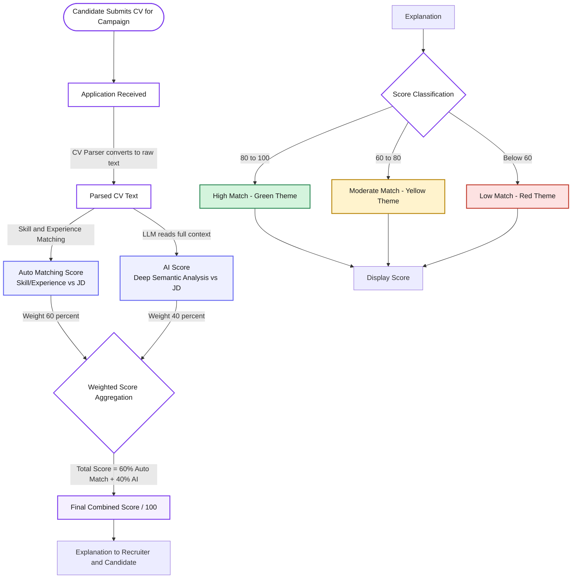

# 5.4.2. Hybrid CV Scoring System

**Author:** Ngô Quốc Tuấn   
**Student ID:** 24127581   
**Reviewer:** Nguyễn Gia Quốc Uy

---

## Description

The scoring system uses a hybrid algorithm that combines automatic skill/experience matching (Auto Matching) with AI-based CV analysis (LLM) to evaluate how well a candidate fits the JD.

**Scoring formula:**

```
Final Score = 60% × Auto Matching Score + 40% × AI Score
```

**Score classification (out of 100):**

| Score Range | Match Level | Color Theme |
|---|---|---|
| 80 - 100 | High Match | 🟢 Green |
| 60 - 80 | Moderate Match | 🟡 Yellow |
| < 60 | Low Match | 🔴 Red |

## Flowchart



## Step-by-Step Explanation

1. **Application Received**: The candidate submits a CV and cover letter for a specific recruitment campaign.
2. **Parsed CV Text**: The CV Parser converts the original CV into normalized raw text.
3. **Auto Matching Score**: An algorithm directly compares the skills/experience in the CV against the JD requirements.
4. **AI Score**: An LLM reads the entire text, understands deep context (handling abbreviations and mixed languages), and compares it against the JD to score each criterion in detail.
5. **Weighted Score Aggregation**: The two scores are combined using a weighted formula: 60% (Auto) / 40% (AI).
6. **Final Combined Score**: The final aggregated score on a scale of 100.
7. **Score Explaination Generation**: The LLM generates a human-readable explaination describing why the candidate received that score, identifying strengths and gaps
8. **Score Classification**: The score is classified and assigned a color theme (green/yellow/red) based on thresholds for visual display.
9. **Display Score**: The score and explanation are displayed to the recruiter and candidate